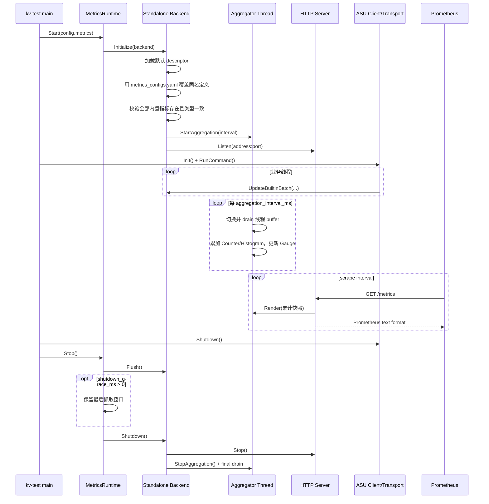
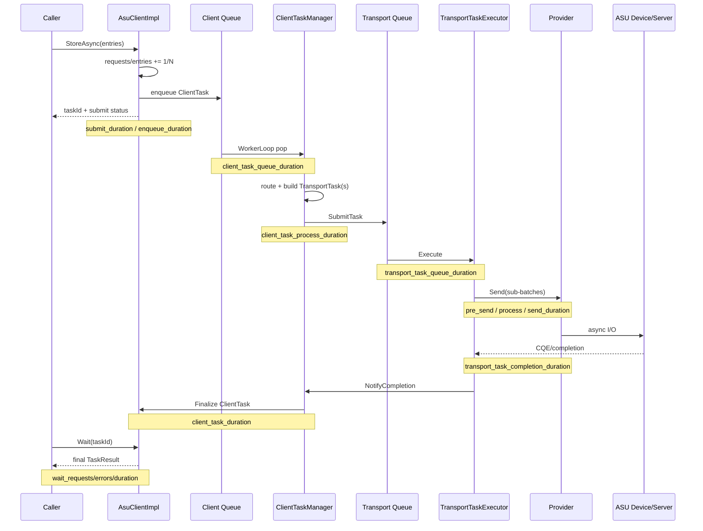
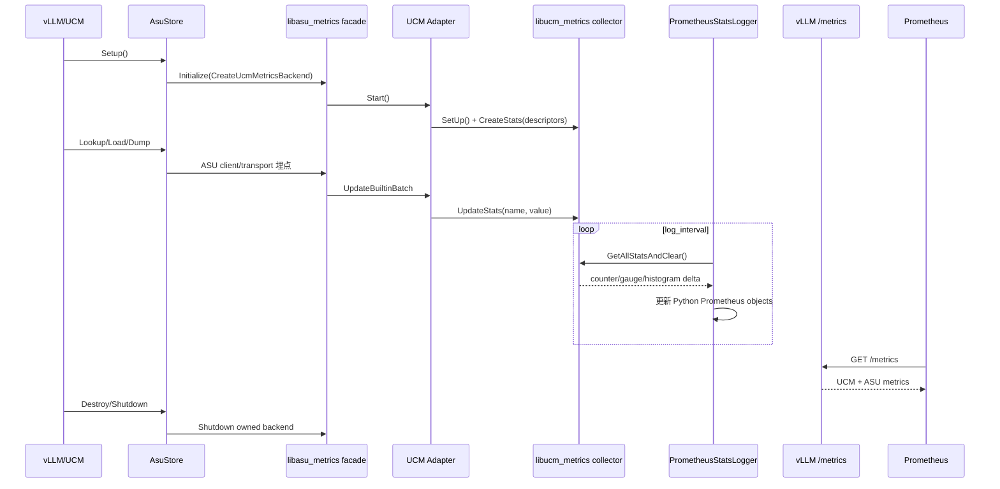

# ASU Metrics 设计：Standalone 与 UCM 统一兼容方案

## 1. 文档目的

本文统一说明以下内容：

- ASU metrics 的设计分层和运行时结构；
- `kv-test` standalone 模式的启动、采集、抓取和退出时序；
- ASU client/transport 一次异步任务的指标时序；
- ASU 接入 UCM/vLLM metrics 的数据链路；
- standalone 与 UCM 两种模式如何保持指标兼容。

本文以当前代码为准。核心结论是：**ASU 业务代码只依赖一套 metrics facade 和一套指标定义，运行宿主负责选择且只能选择一个 backend。**

## 2. 总体设计

### 2.1 四层结构

```text
┌────────────────────────────────────────────────────────────┐
│ Instrumentation                                            │
│ AsuClientImpl / ClientTaskManager / TransportTaskExecutor  │
│ 只记录 MetricId + value，不感知 Prometheus、HTTP 或 vLLM    │
└───────────────────────────┬────────────────────────────────┘
                            │
┌───────────────────────────▼────────────────────────────────┐
│ ASU Metrics Facade：libasu_metrics.so                       │
│ Initialize / Shutdown / Add / Set / Observe / BatchUpdate  │
│ 全进程共享一个当前 backend；未启用时是低成本 no-op           │
└───────────────────────────┬────────────────────────────────┘
                            │ 启动时二选一
              ┌─────────────┴─────────────┐
              │                           │
┌─────────────▼──────────────┐ ┌──────────▼──────────────────┐
│ Standalone backend          │ │ UCM adapter backend          │
│ C++ thread-buffer collector │ │ 转发到 UC::Metrics           │
│ 累积快照 + HTTP exporter     │ │ libucm_metrics.so            │
└─────────────┬──────────────┘ └──────────┬──────────────────┘
              │                           │
       kv-test /metrics          Python ucmmetrics drain
              │                  PrometheusStatsLogger
              └─────────────┬─────────────┘
                            ▼
                         Prometheus
                            ▼
                          Grafana
```

四层职责如下：

| 层 | 当前实现 | 职责 |
| --- | --- | --- |
| 指标定义 | `asu_metrics/metric_names.h` | 集中定义内置 `MetricId`、名称、类型和 HELP 文本 |
| facade | `asu_metrics/metrics.h`、`metrics.cpp` | 隔离业务埋点与具体采集/导出实现，管理唯一 backend |
| backend | `standalone_metrics_backend.cpp`、`ucm_metrics_backend.cpp` | standalone 自采集，或转发给 UCM collector |
| exporter | standalone HTTP server，或 UCM Python logger | 输出 Prometheus exposition format |

### 2.2 为什么需要 ASU 自己的 facade

ASU 可以作为独立 transport/client 交付，不应强制依赖 UCM、Python 或 vLLM。facade 让 ASU 埋点保持不变：

```cpp
Metrics::UpdateBuiltinBatch(updates, count);
```

宿主在启动时决定数据流向：

- `kv-test`：`CreateStandaloneMetricsBackend(...)`；
- UCM `AsuStore`：`CreateUcmMetricsBackend(...)`；
- metrics 未启用：不初始化 backend，所有埋点为 no-op。

这种方式避免在 client/transport 中出现 `if (standalone)` 或 `if (vllm)` 分支，也避免为两种模式维护两套埋点。

### 2.3 进程内单例和共享库约束

`asu_client`、`asu_transport` 和宿主必须解析到同一份 `libasu_metrics.so.1`，否则会出现“业务写入单例 A，exporter 读取单例 B”的问题。

UCM 路径还要求 `asu_metrics_ucm_adapter` 与 Python `ucmmetrics` 解析到同一份 `libucm_metrics.so.1`。当前 `ucm/shared/metrics/CMakeLists.txt` 已将 collector 构建为 `SHARED`，这是 ASU 指标能被 Python drain 到的前提。

可在安装包中验证：

```bash
ldd ./kv-test | grep asu_metrics
ldd ./libasu_client.so | grep asu_metrics
ldd ./libasu_transport.so | grep asu_metrics

ldd ./libasustore.so | grep ucm_metrics
ldd ./ucmmetrics*.so | grep ucm_metrics
```

验收标准不是“都链接了同名库”，而是同一进程实际只加载每个 SONAME 的一份实例。

## 3. Standalone 模式

### 3.1 数据链路

```text
kv-test
  ├─ 初始化 StandaloneMetricsBackend
  ├─ ASU client/transport 写线程本地双 buffer
  ├─ aggregation thread 定时合并为进程级累计快照
  └─ HTTP thread 从只读快照返回 /metrics

Prometheus --scrape--> kv-test:/metrics --query--> Grafana
```

standalone backend 完全位于 ASU metrics 模块内，不依赖 `UC::Metrics`、Python `prometheus_client` 或 vLLM。

### 3.2 启停与抓取时序



关键点：

- HTTP 请求只读累计快照，不触发 destructive drain；多个 curl/Prometheus 请求不会互相“抢数据”。
- Counter 保存进程生命周期累计值；Gauge 保存最新值；Histogram 直接累计 bucket、sum 和 count，不保存无限增长的原始样本。
- `kv-test` 先关闭 ASU 业务线程，再 flush 和关闭 exporter，确保 completion 指标不会落在最后一次 drain 之后。
- `config check` 只校验配置，不监听 metrics 端口。

### 3.3 Standalone 配置

`asu_kv_test.conf` 控制 exporter 生命周期和固定标签：

```ini
metrics.enabled=true
metrics.config_path=./examples/metrics/metrics_configs.yaml
metrics.listen_address=127.0.0.1
metrics.port=9108
metrics.path=/metrics
metrics.health_path=/health
metrics.source=kv-test
metrics.model_name=standalone
metrics.worker_id=asu-0
metrics.aggregation_interval_ms=500
metrics.shutdown_grace_ms=15000
```

`metrics_configs.yaml` 是公共 exporter 定义，提供 `metric_prefix`、指标类型、HELP 文本和 Histogram buckets。standalone 会先注册编译期内置指标，再用 YAML 中的同名项覆盖文档和 buckets；YAML 未列出的内置指标继续使用编译期默认值，但把同名内置指标改成另一种类型会启动失败。为了和 UCM exporter 保持完全一致，公共 YAML 仍应列出全部 ASU 内置指标。

### 3.4 短生命周期命令

Prometheus 是 pull 模型。`store`、`retrieve` 等单次命令可能在第一次 scrape 前退出，因此：

- 长时间 `bench` 场景可直接持续抓取；
- 单次命令应配置 `metrics.shutdown_grace_ms`，在 final flush 后保留一次抓取窗口；
- 如果要持续观察多轮命令，更适合使用长驻服务模式；
- Pushgateway 可作为批任务补充，但不应成为标准 ASU 服务链路。

## 4. ASU 业务任务与埋点时序

ASU API 是异步的。`StoreAsync/LoadAsync/...` 返回 OK 只表示 client 接受任务，不代表远端 I/O 已完成。提交时延、排队时延、发送时延和最终完成时延必须分开理解。



### 4.1 当前指标分组

所有名称最终加公共前缀，默认是 `ucm:`。

| 分组 | 指标模式 | 含义 |
| --- | --- | --- |
| Client API | `asu_client_<op>_requests_total` | query/load/store/batch-load/batch-store/delete 的提交次数 |
| Client API | `asu_client_<op>_entries_total` | 提交的 key/entry 数，不是 task 数 |
| Client API | `asu_client_<op>_errors_total` | API 提交失败次数 |
| Client API | `asu_client_<op>_submit_duration_seconds` | 同步 API 调用耗时，不包含异步完成 |
| Wait | `asu_client_wait_{requests,errors}_total`、`asu_client_wait_duration_seconds` | 调用者等待行为 |
| Client task | `asu_client_task_{enqueue,queue,process,pre_send,send,duration}_seconds` | client 内部各阶段及端到端耗时 |
| Transport task | `asu_transport_task_{queue,process,pre_send,send,completion}_duration_seconds` | transport 排队、提交和完成阶段耗时 |
| Exporter | `asu_metrics_exporter_up`、`asu_metrics_exporter_http_requests_total` | standalone exporter 自监控 |

其中 `asu_client_task_duration_seconds` 是从 client API 入口到最终完成；`asu_client_<op>_submit_duration_seconds` 只是提交 API 返回前的同步耗时，二者不能互相替代。

### 4.2 指标计数口径

- request、client task、transport task、sub-batch、entry 是不同层级，不能混用。
- 一个 client request 可能按路由拆成多个 transport task；因此 transport 样本数可大于 request 数。
- `Wait` 超时描述调用者等待失败，任务之后仍可能成功，不能直接等同于最终 I/O 失败。
- 所有 duration 使用 `steady_clock` 计算，Prometheus 单位统一为 seconds。
- 指标名不拼接 key、ASU ID、连接 ID 等动态值，避免高基数时序。

## 5. UCM/vLLM 模式

### 5.1 数据链路与时序



`AsuStore` 对 adapter 使用引用计数：第一个实例在 facade 尚未启用时初始化 backend，最后一个由它拥有的实例释放时关闭。它不会覆盖宿主已经初始化的 backend。

### 5.2 为什么 UCM 路径仍使用 `GetAllStatsAndClear`

UCM collector 返回本轮 delta/原始 Histogram samples，Python `PrometheusStatsLogger` 再把它们累积到 Prometheus Counter/Histogram。这个 destructive drain 只允许有一个消费者。

因此同一进程中不要同时启用：

- Python UCM exporter；
- 另一个直接 drain `UC::Metrics` 的 exporter。

ASU standalone backend 不读取 `UC::Metrics`，但 facade 本身也只允许一个 active backend，所以一个 ASU 进程仍应明确选择 standalone 或 UCM，而不是双写。

## 6. 两种模式的兼容契约

### 6.1 必须一致的内容

| 维度 | 兼容要求 | 当前来源 |
| --- | --- | --- |
| 指标基础名 | 完全一致 | `ASU_BUILTIN_METRIC_LIST` |
| 指标类型 | Counter/Gauge/Histogram 不可漂移 | 编译期 descriptor + YAML 启动校验 |
| 单位 | duration 使用 seconds；数量使用 count | 指标名与 HELP 文本 |
| Histogram buckets | 两种 exporter 使用相同 YAML buckets | `metrics_configs.yaml` |
| HELP 文本 | 含义和计数口径一致 | descriptor/YAML |
| 公共前缀 | 默认 `ucm:` | `metric_prefix` |
| 稳定标签 | 至少对齐 `model_name`、`worker_id` | 两种 exporter 启动配置 |

这样同一个查询可以覆盖两种运行方式，例如：

```promql
sum by (model_name, worker_id) (
  rate(ucm:asu_client_store_requests_total[5m])
)
```

### 6.2 当前标签差异

standalone 当前输出：

```text
source="kv-test", model_name="standalone", worker_id="asu-0"
```

UCM Python exporter 当前只统一添加：

```text
model_name="...", worker_id="..."
```

因此公共 dashboard 的基础面板不应强依赖 `source`。若需要用一个 dashboard 明确区分运行模式，推荐后续给 UCM exporter 增加稳定的 `source="ucm"` 或 `source="vllm"`，并保持 standalone 的 `source="kv-test"`；在此之前可用 Prometheus 的 `job` 标签区分抓取目标。

### 6.3 单一指标清单

`metric_names.h` 是业务埋点的编译期唯一来源，`metrics_configs.yaml` 是 exporter 配置的唯一来源。新增指标时必须同时修改两者：

1. 在 `ASU_BUILTIN_METRIC_LIST` 增加 ID、基础名、类型和说明；
2. 在 `metrics_configs.yaml` 增加同名配置和 Histogram buckets；
3. standalone 单测验证 YAML 类型校验和 exposition；
4. UCM 测试验证 `UC::Metrics` 可 drain 到该指标；
5. dashboard 查询只使用两种模式共有的名称、单位和标签。

## 7. 模式对比与选择

| 项目 | Standalone | UCM/vLLM |
| --- | --- | --- |
| 宿主 | `kv-test` 或纯 C++ ASU 进程 | UCM `AsuStore` / vLLM worker |
| backend | `StandaloneMetricsBackend` | `UcmMetricsBackend` adapter |
| collector | ASU 自带线程 buffer + 累计快照 | `libucm_metrics.so` 双 buffer |
| exporter | ASU 内置 HTTP server | Python `PrometheusStatsLogger` + vLLM endpoint |
| endpoint | 独立 `:<port>/metrics` | vLLM `:<port>/metrics` |
| Histogram | C++ 直接累计 bucket/sum/count | C++ 原始样本，Python Histogram 累计 |
| 标签 | `source/model_name/worker_id` | `model_name/worker_id` |
| 主要约束 | 短命令可能错过 scrape | 只能有一个 destructive drain 消费者 |

选择规则很简单：

- ASU 由 `kv-test` 或无 UCM 依赖的纯 C++ 进程拉起：选 standalone；
- ASU 作为 UCM `AsuStore` 的实现并由 vLLM 暴露 metrics：选 UCM adapter；
- 同一进程不要同时初始化两个 backend。

## 8. 验证建议

### 8.1 Standalone

```bash
./kv-test bench store --configpath ./ucm/transport/kv/kv-test/asu_kv_test.conf
curl -s http://127.0.0.1:9108/health
curl -s http://127.0.0.1:9108/metrics | grep '^ucm:asu_'
```

至少检查：Counter 单调递增、Histogram `_count/_sum/_bucket` 合法、并发 scrape 不改变数值、final flush 后仍能看到完成指标。

### 8.2 UCM/vLLM

```bash
curl -s http://127.0.0.1:8000/metrics | grep '^ucm:asu_'
```

如果 ASU 代码有埋点但 endpoint 为空，按顺序检查：

1. `AsuStore` 是否构建了 `BUILD_ASU_UCM_METRICS_ADAPTER`；
2. `libasustore.so` 与 `ucmmetrics.so` 是否加载同一份 `libucm_metrics.so.1`；
3. `metrics_configs.yaml` 是否存在完全同名且同类型的定义；
4. `PrometheusStatsLogger` 是否启动并已经过至少一个 `log_interval`；
5. ASU 执行和 Python logger 是否位于同一 worker 进程。

## 9. 代码索引

| 内容 | 文件 |
| --- | --- |
| facade 与 backend 接口 | `ucm/transport/kv/asu/metrics/include/asu_metrics/metrics.h` |
| 内置指标清单 | `ucm/transport/kv/asu/metrics/include/asu_metrics/metric_names.h` |
| facade 生命周期 | `ucm/transport/kv/asu/metrics/src/metrics.cpp` |
| standalone collector/exporter | `ucm/transport/kv/asu/metrics/src/standalone_metrics_backend.cpp` |
| UCM adapter | `ucm/transport/kv/asu/metrics/src/ucm_metrics_backend.cpp` |
| kv-test metrics 生命周期 | `ucm/transport/kv/kv-test/src/kv_test_app.cpp` |
| kv-test 配置解析 | `ucm/transport/kv/kv-test/src/kv_test_config_loader.cpp` |
| UCM adapter 所有权 | `ucm/store/asu/cc/asu_store.cc` |
| 公共 exporter 配置 | `examples/metrics/metrics_configs.yaml` |
| standalone dashboard | `examples/metrics/grafana_asu_client.json` |
