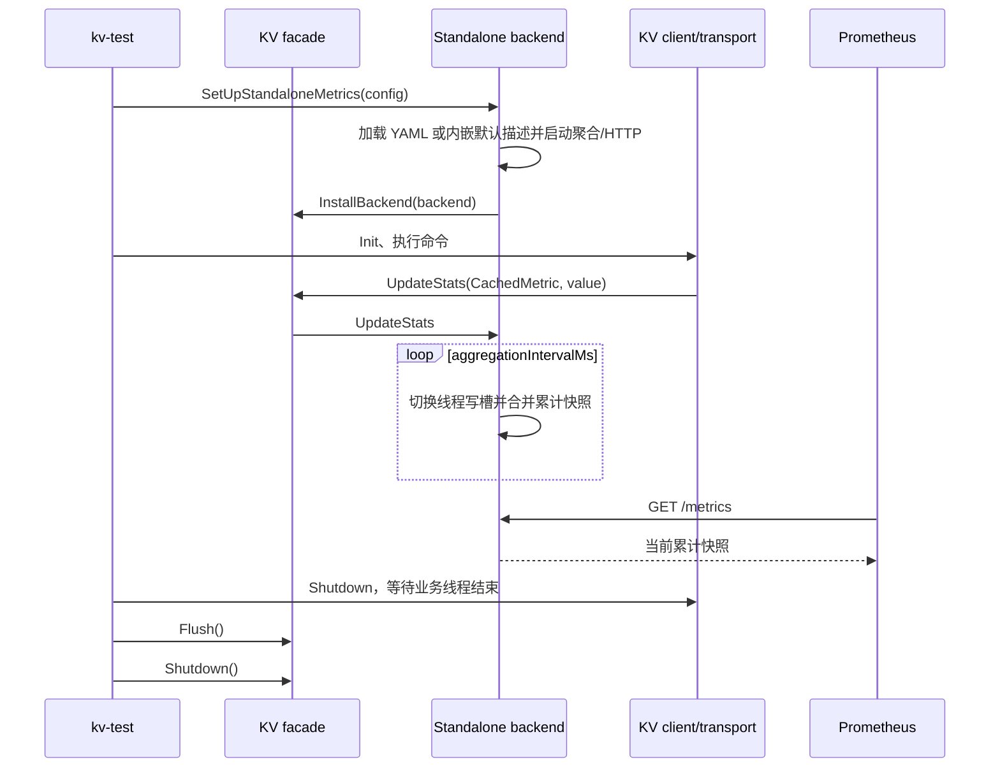
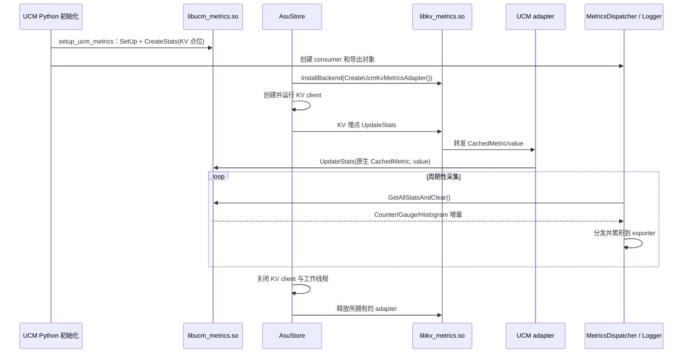

# KV Metrics Facade 适配 Standalone 与 UCM 的设计方案

> 本文是后续开发的目标设计，以当前工作区 `D:\a_storage\2_dev\unified-cache-management` 的接口、构建关系和运行链路为基础。另一工作区的 `kv_metrics_architecture_zh.md` 仅作为文档结构参考。文中的架构图和 UCM adapter 时序描述的是设计完成后的系统；“当前代码事实”用于说明方案所依托的接口和需要补齐的连接点。

## 1. 设计目标与代码基础

目标是在不修改 KV client/transport 埋点调用方式的前提下，让同一个 `libkv_metrics.so` facade 在进程启动时接受一种 backend：

- KV 独立进程或 `kv-test` 使用 standalone collector 和 HTTP exporter；
- UCM `AsuStore` 所在进程使用一个写入 adapter，将 KV 更新送入现有 `UC::Metrics` collector，再由 UCM 的 Python metrics 链路导出；
- 未安装 backend 时，KV 埋点保持 no-op。

本方案不把 Python、vLLM、HTTP 或 UCM 头文件引入 KV client/transport，也不要求 facade 自己读取 UCM 配置。一个进程只选择一个 KV backend；两种模式的业务点位名称、类型、单位及 Histogram bucket 契约应一致。

### 1.1 方案依托的现有接口与待建连接点

| 组件 | 当前状态 | 依据 |
| --- | --- | --- |
| KV facade | 已有 `CachedMetric`、单点/数组批量 `UpdateStats`、`InstallBackend`、`Flush`、`Shutdown` | `kv_semantics/metrics/include/kv_metrics/metrics.h`、`src/metrics.cc` |
| Standalone | 已有线程 buffer、聚合线程、HTTP exporter，`kv-test` 可安装 | `standalone_metrics_backend.cc`、`kv_test_app.cc` |
| KV 埋点 | client 与 transport 已通过 facade 调用，名称以 `kv_client_`、`kv_transport_` 开头 | `kv_semantics/src/client/`、`kv_semantics/src/trans/` |
| UCM collector | 已有共享库 `metrics`、`UC::Metrics::CachedMetric` 与 `GetAllStatsAndClear` | `ucm/shared/metrics/` |
| UCM adapter | 当前不存在，AsuStore 未安装 facade backend | `kv_semantics/metrics/CMakeLists.txt`、`ucm/store/asu/CMakeLists.txt` 与 `asu_store.cc` |
| UCM KV 定义 | 当前 `ucm/default_metrics_config.py` 和 `examples/metrics/metrics_configs.yaml` 未包含上述 KV 点位 | 两份配置文件 |
| 公共标签 | standalone 配置可接收 `constantLabels`，但当前 `kv-test` 未赋值；UCM Python logger 设置 `model_name/worker_id` | `standalone_metrics_backend.h`、`kv_test_app.cc`、`ucm/observability.py` |

完整方案需要同时接通 adapter、AsuStore 的安装入口、UCM 指标注册配置和 Python consumer。以下各节分别规定这些部件的目标行为与接口契约。

## 2. 总体架构与边界

```text
KV client / transport 埋点
          │ CachedMetric + value
          ▼
   libkv_metrics.so
  InstallBackend / UpdateStats / Shutdown
          │ 进程启动时选择一种
          ├───────────────────────────────┐
          ▼                               ▼
kv_metrics_standalone              kv_metrics_ucm_adapter（拟新增）
线程双 buffer + 累计快照           UC::Metrics::CachedMetric 写入
          │                               │
内置 HTTP /metrics                 libucm_metrics.so
          │                               │ GetAllStatsAndClear
          │                         Python MetricsDispatcher
          │                               │
          │                         PrometheusStatsLogger / vLLM connector
          └───────────────┬───────────────┘
                          ▼
                    Prometheus / Grafana
```

| 层 | 责任 | 明确不承担的责任 |
| --- | --- | --- |
| 埋点层 | 定义业务事件和数值；用 `KV_METRIC` 或长期存活的 `CachedMetric` 句柄 | 配置读取、exporter 生命周期 |
| facade | 进程内选择唯一 backend；提供低开销热路径和关闭入口 | 指标注册表、标签重写、跨进程传输 |
| standalone backend | 加载 KV 描述、合并线程缓冲、维护累计快照、响应 HTTP | 操作 UCM collector |
| UCM adapter | 把 KV 句柄按名称绑定到原生 UCM 句柄并转发更新 | `UC::Metrics::SetUp/CreateStats`、drain、Python exporter |
| UCM exporter | 注册 UCM 点位、唯一 drain、转成 Prometheus/vLLM 统计 | 选择 KV facade backend |

### 2.1 facade 接口与绑定语义

目前 facade 公共接口已经足够容纳两种 backend：

```cpp
auto& metric = KV_METRIC("kv_client_store_requests_total");
kv::metrics::UpdateStats(metric, 1.0);

const kv::metrics::MetricUpdate updates[] = {
    {KV_METRIC("kv_client_store_requests_total"), 1.0},
    {KV_METRIC("kv_client_store_entries_total"), 4.0},
};
kv::metrics::UpdateStats(updates, std::size(updates));
```

`CachedMetric` 保存基础名称和可选 `MetricLabels`，并用 `Resolve(factory)` 发布一个 backend 专属的 `Binding`。首次解析由 mutex 保护；成功发布后走 atomic 指针读取。业务中的函数局部 static 句柄在进程生命周期内稳定存在。`MetricUpdate` 中的裸指针必须在本次调用期间有效；不要构造指向临时 `CachedMetric` 的数组。

**绑定对象只适用于第一次使用它的 backend。** 当前 `CachedMetric` 没有 backend 身份或代次，也没有清空绑定接口；在同一进程中 `Shutdown()` 后再安装另一 backend，旧句柄可能被错误地 `static_cast` 为新 backend 的 binding。第一阶段应把“每进程只安装一次，所有 KV 工作线程停止后才关闭”写入宿主契约；如果必须支持测试中的重装或运行时切换，须先给 facade 增加 backend generation 与 binding 重建机制，并对切换期间的调用做同步保护，不能仅靠 `Shutdown/InstallBackend` 顺序。

`metrics.cc` 的 `gBackendFast` 是无所有权 raw pointer。它避免每次打点增减 `shared_ptr` 引用计数，但要求停止所有可能进入 `UpdateStats/RegisterMetricLabels` 的线程后再调用 `Shutdown()`。`Flush()` 通过 `shared_ptr` 获取 backend，可用于已停写之后的最后聚合；不能把它当作线程关闭屏障。

### 2.2 共享库约束

`kv_client`、transport 和宿主必须在同一进程解析到**同一实例** `libkv_metrics.so`；否则一个模块安装 backend、另一个模块仍看到 no-op。UCM 模式还要求 adapter 与 Python `ucmmetrics` 解析到同一实例 `libucm_metrics.so`。当前 `ucm/shared/metrics/CMakeLists.txt` 已将 UCM collector 构建为 `SHARED`，但安装路径和 RPATH 仍需做实际加载验证。

建议保持 `kv_metrics` 为只有 facade 的共享库；standalone 与 UCM adapter 分别作为独立静态 target，只被相应宿主链接。不要把两个 backend 一起并入 `libkv_metrics.so`，这样纯 KV 构建不需要 UCM 链接依赖。

## 3. Standalone 路径：保留并收敛现有实现

### 3.1 启动和数据时序



`kv_test_app.cc` 中 `MetricsRuntime::Start` 在创建 KV client 前调用 `SetUpStandaloneMetrics`；`clientRunner.Shutdown()` 后，`MetricsRuntime::Stop` 先 `Flush()`，可按 `shutdownGraceMs` 留出最后抓取时间，再调用 facade `Shutdown()`。短命令是否被 Prometheus 抓到取决于 scrape 时机；若要保证保存结果，应由调用端主动抓取或把运行时间设置得足够长。

### 3.2 collector 语义

standalone backend 将已注册名称/标签组合映射到 slot。业务线程独占 TLS `ThreadBuffer` 的两个 delta slot，单次数组批量更新只进入一个 `WriteGuard`；aggregation thread 切槽、等待旧槽 writer 退出后，把 Counter、Gauge 和 Histogram 的增量并入进程级累计快照。HTTP 只读取快照，因此重复 scrape 不清空 Counter/Histogram。Histogram 写入时即转换为区间 bucket、sum、count；导出时转成 Prometheus 累计 `_bucket`、`_sum`、`_count`。

standalone 启动配置在 `StandaloneMetricsConfig` 中：`definitionPath`、`metricPrefix`（默认 `kv:`）、`listenAddress`（默认 `127.0.0.1`）、`port`（默认 `9108`）、`metricsPath`、`aggregationIntervalMs` 和 `constantLabels`。`kv-test` 的配置字段在 `kv_test.conf`/`kv_test_config_loader.cc`；`metrics.enabled=false` 是当前示例默认值。显式 `definitionPath` 指向 YAML 时按该文件加载；空路径才使用构建时由 `generate_kv_metrics.py` 生成的内嵌默认描述。

### 3.3 标签与前缀的实施决定

当前 standalone 默认前缀为 `kv:`，UCM exporter 默认前缀为 `ucm:`。建议将**统一查询前缀选为 `ucm:`**，并在 `kv-test` 的 metrics 配置中提供 `metrics.metric_prefix`，传入 `StandaloneMetricsConfig.metricPrefix`；同时保留纯 standalone 用户显式选 `kv:` 的能力。该字段目前未从 `kv-test` 配置传入，属于待实现项。

UCM Python exporter 固定设置 `model_name/worker_id`；当前 `kv-test` 未填 `constantLabels`。若要共用按这两个标签聚合的 dashboard，给 standalone 宿主增加可配置的稳定值，例如 `metrics.model_name` 和 `metrics.worker_id`，由 `MetricsRuntime::Start` 填入 `constantLabels`。不要把 key、连接 ID、任务 ID、时间戳作为指标标签。两端目前没有统一的 `source` 标签约定，共用 dashboard 不应依赖它；需要区分模式时优先使用 Prometheus target 的 `job` 标签。

## 4. UCM adapter：拟新增实现

### 4.1 写入链路



UCM adapter 只做写入桥接。它不调用 `SetUp()`、`CreateStats()` 或 `GetAllStatsAndClear()`，也不负责关闭 UCM collector。`setup_ucm_metrics` 在 `ucm/metrics_config.py` 中按定义注册点位；`MetricsDispatcher` 在 `ucm/metrics_dispatcher.py` 中统一 drain 并分发给 multiproc/vLLM connector consumer；`PrometheusStatsLogger` 在 `ucm/observability.py` 中将增量更新到 Prometheus 对象。adapter 直接 drain 会与该链路争抢数据。

### 4.2 类与接口草案

建议新增 `kv_semantics/metrics/include/kv_metrics/ucm_metrics_backend.h` 和 `src/ucm_metrics_backend.cc`：

```cpp
namespace kv::metrics {
std::shared_ptr<KvMetricsBackend> CreateUcmKvMetricsAdapter();
}
```

实现类 `UcmKvMetricsAdapter final : KvMetricsBackend`。其内部 binding 可包含一个原生 `UC::Metrics::CachedMetric`，使用 `CachedMetric::Resolve` 首次按 KV 基础名称构造；热路径调用 `UC::Metrics::UpdateStats(nativeMetric, value)`。UCM 原生 `CachedMetric` 已维护 `id/seenEpoch`，未注册名称在当前注册 epoch 内跳过；之后注册表增加条目时会再次解析。因此 adapter 不需要自己生成和缓存原生 ID，也不应在构造时把“尚未注册”永久固定为无效状态。

数组批量接口按原数组顺序逐项调用原生单点 `UpdateStats`，跳过空 `MetricUpdate.metric`。这能保留同名多条更新及 Histogram 多样本语义；不能用 `unordered_map<string,double>` 代替，否则重复名称被覆盖，Gauge 的顺序也变化。此方案不承诺数组原子性；原生 UCM 每项调用分别进入自己的 `WriteGuard`，因此性能可能低于 standalone 的一次批量 guard。先以正确性落地，若性能数据证明需要，再给 UCM collector 增加原生缓存批量 API。

UCM collector 的 `UpdateStats` 热路径可能分配内存；adapter 的 override 标记为 `noexcept`，应在边界捕获异常，避免使 KV 请求因 metrics 失败而终止。建议只在低频路径记日志或累计内部错误数，避免故障时逐次打印。`RegisterMetricLabels` 在 UCM adapter 中应明确返回 `false`：当前 UCM collector 的 key 只有基础名称，没有 KV 动态 labels 的存储和导出协议。若未来需要带标签指标，应先设计原生 collector 到 Python exporter 的完整标签模型，不能在 adapter 中悄悄丢弃标签并声称成功。

`Flush()`/`Stop()` 对 UCM adapter 应为空操作；UCM collector 的 drain 和 Python logger 生命周期归 UCM 宿主。建议在 adapter 工厂或安装调用处写清注释，防止后续把 `GetAllStatsAndClear()` 放进 `Flush()` 导致 consumer 丢数据。

当前 `TransportTaskExecutor` 还有两项带 `node_id` 的 Histogram：`kv_transport_node_task_send_duration_seconds` 和 `kv_transport_node_task_completion_duration_seconds`。其 `Init()` 会调用 `RegisterMetricLabels`，standalone 可以注册并导出每个节点的序列。UCM collector 目前没有标签模型。第一阶段 adapter 对 `RegisterMetricLabels` 返回 `false`，带标签的 `CachedMetric` 仍按**基础名称**写入原生 collector，因此 UCM 出口得到两个指标的跨节点汇总，`node_id` 维度不可用。该降级行为必须写进指标说明和测试，不能让业务以为节点标签已经保留；如果节点级诊断是上线硬要求，需先扩展 UCM collector 的键、drain 结构、Python dispatcher 与 exporter，使标签完整穿透，再启用这两项指标的跨模式标签兼容验收。

### 4.3 AsuStore 的安装与所有权

在 `AsuStore::Setup` 的 KV client 初始化之前安装 adapter，使初始化过程的打点也能被采集。推荐实现一个 AsuStore 模块级协调器，持有 mutex、成功实例引用数与 `ownedBackend` 标志：

1. 第一个需要 UCM metrics 的实例调用 `InstallBackend(CreateUcmKvMetricsAdapter())`，成功才设 `ownedBackend=true`；失败时记录错误并继续按配置决定是否关闭 metrics，不能把已存在的其他 backend 当成自己拥有。
2. 实例只有在成功取得协调器引用后才设置自身的 `metricsAcquired_`；`Setup` 后续任何失败路径都释放这一引用。
3. 多个 AsuStore 实例共用同一 backend。最后一个实例销毁时，先完成 `client_->Shutdown()` 并保证相关 KV 工作线程不再写入，再释放引用。
4. 若无法证明进程内所有使用 KV facade 的线程已经停止，不应由某个 AsuStore 析构函数直接调用全局 `Shutdown()`；应由更上层的进程退出协调点执行。若 AsuStore 是唯一 KV 使用方且已验证全部实例线程退出，则最后一个实例可关闭其**自己安装**的 backend。

当前 `AsuStore` 析构函数只关闭 `client_`；`Setup` 可在 client 初始化、KV cache 注册等阶段返回错误。上述失败路径必须纳入同一套 RAII 释放逻辑。由于 `CachedMetric` 当前不支持换 backend，同一进程先关闭再由后续新 AsuStore 重新安装，也不在第一阶段支持范围内；若宿主会反复创建/销毁 AsuStore，应把 adapter 生命周期提升到 UCM worker 进程级，保持一次安装直至退出。

### 4.4 构建与运行时链接

拟在 `kv_semantics/metrics/CMakeLists.txt` 增加独立 `kv_metrics_ucm_adapter` 静态 target，源文件仅为 UCM adapter，链接 `kv_metrics` 和 UCM `metrics` 共享库。`ucm/store/asu/CMakeLists.txt` 在构建 AsuStore 时链接该 target；`kv-test` 继续只链接 `kv_metrics_standalone`。同时确认 AsuStore 的 `BUILD_RPATH/INSTALL_RPATH` 能找到实际安装的 `libkv_metrics.so` 和 `libucm_metrics.so`，不要依赖开发机偶然存在的 `LD_LIBRARY_PATH`。

验收需要在真实 Linux 构建产物上执行 `readelf -d`、`ldd` 和进程 `/proc/<pid>/maps` 检查：重点是每个 SONAME 在一个 worker 进程内只加载一份，而不只是文件名相同。`ucmmetrics` Python 扩展和 `asustore` 必须指向同一份 UCM collector。

## 5. 指标定义与兼容契约

### 5.1 单一规范和两端注册

KV 基础点位以 `kv_semantics/metrics/config/kv_metrics.yaml` 为规范清单；其 Counter 和 Histogram 已覆盖 client 请求/条目/错误、等待调用、transport 超时/连接错误以及各阶段 duration。构建脚本 `generate_kv_metrics.py` 当前只生成 standalone 内嵌默认 descriptor，**不会**修改 UCM Python 默认配置或示例 YAML。

实施时应把同一清单同步到 UCM 实际使用的注册配置：至少覆盖 `ucm/default_metrics_config.py` 和用户部署采用的 YAML 模板，并给生成脚本或校验脚本增加跨文件一致性检查。检查字段为基础名称、类型、单位、Histogram bucket、有意义的 HELP 文本及是否被目标 consumer 启用。若 UCM 用户自定义 YAML 完全覆盖默认配置，文档要要求用户同步加入 KV 点位；adapter 写入未注册名称将被 UCM collector 忽略。

| 维度 | 统一要求 | 当前待处理项 |
| --- | --- | --- |
| 基础名称 | 两端完全相同；facade 只传基础名称 | UCM 定义缺失 |
| 类型 | 同名必须同为 Counter/Gauge/Histogram | 增加自动比对 |
| 单位 | duration 使用 seconds；计数为件数/次数 | 配置与 HELP 逐项核对 |
| Histogram bucket | 两端边界及顺序相同，UCM collector 内部另含 `+Inf` | 增加自动比对 |
| 前缀 | 公共查询建议 `ucm:`；前缀在 exporter 加，不写入 C++ 句柄 | standalone 当前默认 `kv:` |
| 标签 | 公共查询至少可按 `model_name/worker_id` 聚合 | standalone 宿主尚未填 |

注意 Histogram 区间 bucket 在 collector 中累加，Prometheus 展示的是累计 bucket。UCM Python exporter 的 `_update_histogram` 要求收到的 bucket 数与 Prometheus 对象的 bucket 数一致；跨端 bucket 漂移会导致日志报错并跳过该次 Histogram 更新。

### 5.2 业务计数口径

- `kv_client_*_requests_total` 计一次 API 提交；`*_entries_total` 计本次请求包含的条目数量；`*_errors_total` 按对应调用的失败结果增加。业务请求与 transport task 并非一一对应。
- 一个 client request 可能拆成多个 transport task；transport duration 的样本数可以高于 client request 数。
- `wait_errors_total` 记录调用者等待失败，不能直接当作最终 I/O 失败数；异步任务随后仍可能完成。
- `*_duration_seconds` 使用 `steady_clock` 计算，并以秒传给 facade；不要在 adapter 再乘除单位。
- Counter 不应传负值；Gauge 表示当前值；Histogram 每条 `UpdateStats` 表示一个观测样本。批量数组不能把同名 Histogram 观测合并成一个总和。

## 6. 生命周期、并发与失败处理

| 场景 | 预期行为 | 关键约束 |
| --- | --- | --- |
| metrics 未启用 | facade backend 为空，埋点 no-op，`StartMetricTimer` 返回空 | 不产生 exporter 或 UCM 注册副作用 |
| standalone 初始化失败 | 返回错误并停止已启动的线程/HTTP；不安装 backend | `SetUpStandaloneMetrics` 已按此路径处理 |
| UCM 注册晚于 adapter 安装 | 已注册后下一次调用可由原生 `CachedMetric` 重新解析 | 仍建议 UCM 注册先于 KV 业务启动 |
| UCM 点位未注册 | 原生 collector 忽略更新 | 检查实际 YAML/default 与 consumer 选择 |
| 第二次安装 | `InstallBackend` 返回失败 | 不能覆盖或关闭他人 backend |
| 正常退出 | 停 KV 线程，最后 `Flush/Shutdown` 所拥有的 backend | raw pointer 热路径要求外部停写屏障 |
| 运行时切换 | 第一阶段不支持 | 需 facade binding 代次和生命周期同步设计 |

对 UCM 模式，`GetAllStatsAndClear()` 是破坏性读取。当前 `MetricsDispatcher` 将一次 drain 分发给 multiproc 和 vLLM connector 两类 consumer；不能再启动第二个直接 drain UCM collector 的 exporter。Python consumer 的配置和运行位置必须与 KV 写入所在 worker 进程对应，否则指标可能已经写入，却不出现在目标 `/metrics`。

## 7. 实施顺序

1. **指标契约**：从 KV YAML 列出全部名称、类型和 bucket；同步 UCM 默认配置与部署 YAML，加入自动一致性检查。
2. **UCM adapter**：增加接口、实现和最小单元测试，覆盖 Counter、同名多次更新、Histogram 多样本、未注册点位、`RegisterMetricLabels=false`。
3. **构建连接**：增加独立 CMake target，AsuStore 链接 adapter，保持 `kv-test` 只链接 standalone；检查安装布局与 RPATH。
4. **宿主生命周期**：在 AsuStore 引入进程级或模块级安装协调器，处理多个实例、初始化失败和退出停写；明确一次安装约束。
5. **standalone 查询兼容**：补 `kv-test` 的前缀和稳定标签配置，保证公共 dashboard 能使用同一查询。
6. **集成验收**：在 Linux worker 中用真实 AsuStore/KV 请求打点，检查 UCM collector delta、Python consumer 和最终 `/metrics`；再比对 standalone 输出。

## 8. 验证与验收标准

### 8.1 静态检查

- `python kv_semantics/metrics/tools/generate_kv_metrics.py --check` 通过；扩展后的跨端校验对故意改错的类型或 bucket 能报错。
- `kv-test` target 不链接 UCM `metrics`；AsuStore target 不包含 standalone HTTP exporter。
- `readelf/ldd/maps` 验证进程内 facade 和 UCM collector 各只有一份实例。

### 8.2 Standalone 行为

- 运行 `kv-test bench ...` 并启用 `metrics.enabled=true`；抓取 `http://127.0.0.1:9108/metrics`。
- 同一 Counter 多次抓取不会清零；并发写入与高频 `Flush()` 后的 Counter 总和、Histogram `_count` 精确等于业务事件数。
- 检查最终前缀、`model_name/worker_id`、HELP/TYPE、bucket、`_sum/_count`；短命令在 graceful 窗口内可抓取最终值。

### 8.3 UCM 行为

- 先运行 `setup_ucm_metrics` 注册 KV 点位，再创建 AsuStore、执行真实或 fake provider KV 请求；确认 `ucmmetrics.get_all_stats_and_clear()` 或统一 dispatcher 可看到相应增量。集成测试中只能安排一个 drain 消费者。
- 通过 `PrometheusStatsLogger` 或 vLLM connector 的实际路径确认最终 endpoint 含 `ucm:kv_...`，并比较请求/条目/失败数与业务结果。
- 多个 AsuStore 实例并行工作、其中一个 Setup 失败、依次销毁实例时均不提前关闭共享 backend；最后停写后退出无崩溃。
- 令 UCM 配置故意缺少一个 KV 点位，确认该点位被忽略且其他点位正常；恢复定义后原生 cached handle 能解析并采集。

### 8.4 两模式对照

给 standalone 和 UCM 路径输入同样的逻辑事件，逐项比较基础名称、类型、单位和 Histogram 计数。比较时应区分两个出口的采集时机：standalone `/metrics` 是累计快照，UCM C++ `GetAllStatsAndClear()` 返回增量，只有 Python Prometheus 出口累积后才适合与 standalone 的累计结果对照。以公共 PromQL 查询验证两端数据，例如：

```promql
sum by (model_name, worker_id) (
  rate(ucm:kv_client_store_requests_total[5m])
)
```

## 9. 代码改动索引

| 文件 | 操作 |
| --- | --- |
| `kv_semantics/metrics/include/kv_metrics/metrics.h`、`src/metrics.cc` | 保留现有 facade；若需要重装，再增加 generation/binding 同步机制 |
| `kv_semantics/metrics/include/kv_metrics/ucm_metrics_backend.h`、`src/ucm_metrics_backend.cc` | 新增 UCM 写入 adapter |
| `kv_semantics/metrics/CMakeLists.txt` | 新增独立 adapter target |
| `ucm/store/asu/CMakeLists.txt`、`cc/asu_store.cc` | 链接、安装与释放 backend |
| `kv_semantics/metrics/config/kv_metrics.yaml` | KV 指标规范清单 |
| `ucm/default_metrics_config.py`、`examples/metrics/metrics_configs.yaml` | 增加与 KV 清单一致的 UCM 注册定义 |
| `kv_semantics/metrics/tools/generate_kv_metrics.py` | 扩展跨端一致性校验或生成逻辑 |
| `kv_semantics/kv_test/include/kv_test_types.h`、`src/kv_test_app.cc`、`src/kv_test_config_loader.cc`、`kv_test.conf` | 可配置统一前缀与稳定标签 |
| `ucm/metrics_config.py`、`ucm/metrics_dispatcher.py`、`ucm/observability.py` | 现有注册、统一 drain 和导出链路；原则上无需为 adapter 改造 |

设计完成后，KV 业务埋点保持现有调用方式，由宿主安装 standalone 或 UCM backend 决定采集链路。实施时重点落实指标定义同步、进程内共享库唯一性和 backend 生命周期约束；第 8 节给出了对应验收标准。
