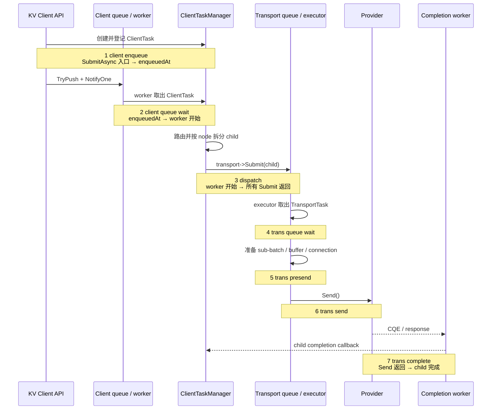
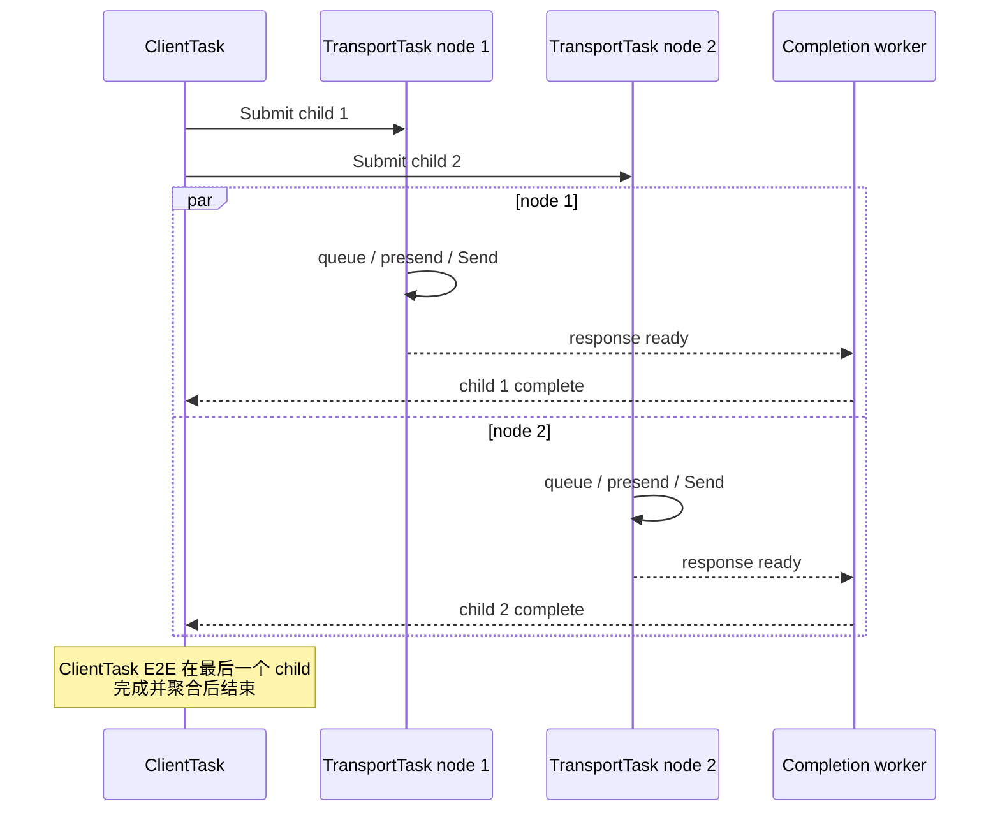

# KV Client Metrics 与 Grafana 指南

本文说明 KV Client 的异步请求、transport 和 completion 指标。配套 Dashboard：

```text
examples/metrics/grafana_kv_client.json
```

Prometheus 指标名前缀为 `kv:`，例如 `kv_client_task_e2e_duration_seconds` 实际暴露为 `kv:kv_client_task_e2e_duration_seconds`。

## 1. Dashboard 概览

`kv-client Metrics` 分为五个区域：

1. `① Throughput Overview`：请求、entry/key 吞吐与 ClientTask E2E P99。
2. `② Request Latency Breakdown`：client 到 transport completion 的七段时延。
3. `③ Transport Node Performance — Send / Complete`：按 `node_id` 比较 Send 和完成阶段。
4. `④ End-to-End`：ClientTask 与 TransportTask 的端到端时延。
5. `⑤ Error Rates`：client 错误率与 transport 具体错误事件数。

| 变量 | 用途 |
|---|---|
| `Source` | 筛选 `source` 标签 |
| `Model` | 筛选 `model_name` 标签 |
| `Worker` | 筛选 `worker_id` 标签 |
| `Node` | 只影响节点性能图；可选一个、多个或全部 `node_id` |

`Node=All` 时会按 `node 1`、`node 2` 等分线展示。无 `node_id` 的基础实例已在查询中排除，不代表额外节点。

## 2. 吞吐与错误

### 2.1 请求与 entry/key

每个 operation 都有以下 Counter：

```text
kv:kv_client_<operation>_requests_total
kv:kv_client_<operation>_entries_total
kv:kv_client_<operation>_errors_total
```

`<operation>` 是 `store`、`load`、`batch_store`、`batch_load`、`query`、`delete`。

- `requests_total`：异步 API 调用次数。
- `entries_total`：输入 entry 数；Query/Delete 表示 key 数。
- `errors_total`：API 当场返回失败次数。

`Total Request Rate` 与 `Entry / Key Throughput` 分别是六种 operation 的 request/entry 速率之和，单位为每秒，不是当前 dashboard 时间范围内的累计数。

### 2.2 Error Rate by Stage

`Error Rate by Stage` 是 client 视角的失败比例：

| 图例 | 公式 | 含义 |
|---|---|---|
| `<operation> submit` | `rate(errors_total) / rate(requests_total)` | `*Async()` 当场提交失败，例如参数错误、未初始化或队列满 |
| `wait/final result` | `rate(kv_client_wait_errors_total) / rate(kv_client_wait_requests_total)` | `Wait()` 失败，或读到 task 最终失败状态 |

`Final Error Rate` 是 `wait/final result` 的单值展示。它以 `Wait()` 调用为分母，不是所有 API 调用；同一 task 被 Wait 多次会多次计数。

`Transport Error Events` 是当前 dashboard 时间范围内的事件数，不是错误率：

| Counter | 事件 |
|---|---|
| `kv:kv_transport_task_completion_timeouts_total` | 已 Send 的 TransportTask 等待完成超过 deadline |
| `kv:kv_transport_task_io_timeouts_total` | completion poll 收到 `CQE_IO_TIMEOUT` |
| `kv:kv_transport_task_connection_errors_total` | transport 选择连接失败 |

## 3. 请求主流程时延

ClientTask 的时钟从进入内部 `KvClientImpl::SubmitAsync()` 开始；公开 API 到该入口之间的极小转发开销不计入。`Wait()` 的阻塞时间也不属于 ClientTask E2E。

### 3.1 时序



### 3.2 七段拆分

`Request Latency Breakdown - Average/P50/P99` 展示以下时延：

| 图例 | 指标 | 起点 → 终点 |
|---|---|---|
| `1 client enqueue` | `kv:kv_client_task_enqueue_duration_seconds` | `SubmitAsync()` 入口 → `enqueuedAt` |
| `2 client queue wait` | `kv:kv_client_task_queue_duration_seconds` | `enqueuedAt` → client worker 开始 |
| `3 dispatch` | `kv:kv_client_task_process_duration_seconds` | client worker 开始 → 所有 `transport->Submit()` 返回 |
| `4 trans queue wait` | `kv:kv_transport_task_queue_duration_seconds` | TransportTask 提交 → transport executor 开始 |
| `5 trans presend` | `kv:kv_transport_task_process_duration_seconds` | executor 开始 → 调用 `Send()` 前 |
| `6 trans send` | `kv:kv_transport_task_send_call_duration_seconds` | 进入 `TransProvider::Send()` → 返回 |
| `7 trans complete` | `kv:kv_transport_task_completion_duration_seconds` | `Send()` 返回 → TransportTask 完成 |

`1 client enqueue` 包含 task 创建、复制 entries/keys、MR 映射、登记 task 与 producer lock；它在写入 `enqueuedAt` 时结束。`TryPush()` 发生在这之后，因此其少量耗时属于 `2 client queue wait`。

`3 dispatch` 包含可能的 prerequisite event 等待、路由、按 node 拆分、创建 TransportTask，以及所有 `transport->Submit()` 返回前的工作。

前 3 段按 ClientTask 采样；后 4 段按单个 TransportTask child 采样。一个 ClientTask 可拆成多个 child 并行执行，所以各曲线的 Average、P50、P99 都不能直接相加。

## 4. 多 node 与端到端时延



| 指标 | 粒度 | 起点 → 终点 | Dashboard |
|---|---|---|---|
| `kv:kv_client_task_e2e_duration_seconds` | ClientTask | `SubmitAsync()` 入口 → 所有 child 完成并聚合 | `End-to-End`、顶部 P99 |
| `kv:kv_transport_task_e2e_duration_seconds` | TransportTask | transport submit → child 完成 | `End-to-End` |
| `kv:kv_transport_node_task_send_duration_seconds{node_id="…"}` | TransportTask | transport submit → `Send()` 返回 | `Node Send` |
| `kv:kv_transport_node_task_completion_duration_seconds{node_id="…"}` | TransportTask | `Send()` 返回 → child 完成 | `Node Complete` |

Node 专用指标是同一 node 下所有 TransportTask 样本的聚合；它们不改变全局 transport 指标。

另外保留但当前 dashboard 未单独展示的边界指标：

| 指标 | 含义 |
|---|---|
| `kv:kv_client_task_send_duration_seconds` | ClientTask：`SubmitAsync()` 入口 → 所有 child `Send()` 返回 |
| `kv:kv_transport_task_pre_send_duration_seconds` | TransportTask：submit → 调用 `Send()` 前 |
| `kv:kv_transport_task_send_duration_seconds` | TransportTask：submit → `Send()` 返回 |

## 5. Grafana 统计口径

每个折线点使用 `$__rate_interval` 计算。Average 采用 Histogram 的 `_sum / _count`：

```promql
sum(rate(<histogram>_sum[$__rate_interval]))
/
sum(rate(<histogram>_count[$__rate_interval]))
```

P50/P99 采用：

```promql
histogram_quantile(
  0.99,
  sum by (le) (rate(<histogram>_bucket[$__rate_interval]))
)
```

legend 的 `min`、`mean`、`max` 是当前 dashboard 可见时间范围内，各个**折线采样点**的统计；并非单个请求的 min/mean/max。P99 折线每一点也是其 `$__rate_interval` 窗口内估计的 P99。不同指标的 P50/P99 不应相加。

## 6. 推荐排障顺序

1. 看 `Total Request Rate` 与 `Entry / Key Throughput`，确认实际负载和 batch 规模。
2. 看 `Error Rate by Stage`：submit 高先查 API 参数、初始化与队列；final 高再结合 transport 错误事件排查。
3. 看七段拆分：`client queue wait` 高通常是 client worker 积压；`trans queue wait` 高通常是 transport executor 积压；`trans presend` 高说明发送准备慢；`trans send` 高说明 provider 同步调用慢；`trans complete` 高说明 Send 返回后的后端/CQE/completion 路径慢。
4. 看 Node 图确认慢是否集中于特定 `node_id`。
5. 用 `End-to-End` 确认延迟是否已经传导到完整 ClientTask 或 TransportTask。

## 7. 指标族清单

当前配置定义 23 个 Counter 和 14 个 Histogram 指标族。Histogram 的 `_bucket`、`_sum`、`_count` 是同一个指标族的不同序列，不是三次独立打点。

| 类别 | 指标 |
|---|---|
| 请求、entry、提交错误 | `kv_client_<operation>_{requests,entries,errors}_total`，共 6 类 operation |
| Wait | `kv_client_wait_requests_total`、`kv_client_wait_errors_total` |
| transport 错误事件 | `kv_transport_task_completion_timeouts_total`、`kv_transport_task_io_timeouts_total`、`kv_transport_task_connection_errors_total` |
| client 时延 | `kv_client_task_{enqueue,queue,process,send,e2e}_duration_seconds` |
| transport 时延 | `kv_transport_task_{pre_send,queue,process,send,send_call,completion,e2e}_duration_seconds` |
| node transport 时延 | `kv_transport_node_task_{send,completion}_duration_seconds{node_id="…"}` |
