# KV client I/O 性能指标 Story 设计

> 本文描述 KV client I/O 性能指标在 standalone 与 UCM 两种运行模式下的完整设计。指标清单与构建细节见 [KV Metrics Facade 双 backend 设计说明](../../../docs/source/user-guide/metrics/kv_metrics_facade_dual_backend_design_zh.md)。

## 1. Story 需求描述

本 Story 的核心需求是建立 KV client I/O 路径的性能统计能力。对于查询、加载、写入、删除等操作，系统应记录请求量、处理条目数、错误和超时次数，并统计请求从提交到完成的整体耗时及关键阶段耗时。使用者需要据此观察不同操作的执行情况，区分排队、处理、发送和等待完成等阶段的开销，定位性能瓶颈，并评估负载变化或代码调整对 I/O 性能的影响。

这套性能数据需要在独立 `kv-test` 和 UCM `AsuStore` 两种运行场景下都能被采集和查看。相同的 KV 操作在两种场景中应使用一致的指标名称、单位和统计含义，便于对比与持续监控。指标能力应由宿主按需启用；关闭时，KV 请求仍按原有语义执行，性能埋点不应影响正常 I/O 结果。

本 Story 覆盖现有 KV 埋点在两种运行场景中的采集接入、指标定义对齐、结果导出，以及 KV client Grafana 面板模板的查询适配。它不改变 KV 请求的执行语义；Prometheus 和 Grafana 服务的安装部署由使用方负责。

## 2. Story 背景描述

KV client 的 I/O 路径跨越请求提交、任务排队、处理、发送和完成等阶段。请求变慢时，仅凭最终成功状态或端到端耗时，无法判断时间消耗在客户端排队、任务处理、传输发送还是等待完成；错误和超时也需要与相应阶段的耗时、请求量结合分析。因此，KV 需要一套能够分阶段观察 I/O 路径的性能指标框架，让调用次数、处理条目数、错误与超时次数，以及各阶段耗时采用明确、稳定的统计口径。

这套性能指标框架由 I/O 埋点、统一写入接口、指标定义以及采集导出链路组成。KV client/transport 记录性能事件，metrics facade 接收埋点更新，指标定义约定 Counter 和 Histogram 的名称、类型及耗时分桶。独立 `kv-test` 运行时由 KV 自身完成聚合和 HTTP 导出；UCM 运行时由 UCM 的指标体系完成采集和导出。业务路径只负责记录性能事件，指标的聚合和对外提供由运行环境承担。

UCM 的 `AsuStore` 复用同一 KV client。要在该场景下获得同样的性能数据，需要把 KV 埋点接入 UCM 的指标采集与导出链路，并在 UCM 指标配置中注册相应点位。本 Story 在统一埋点接口的基础上完成两种运行环境的接入，使相同的 I/O 路径按一致口径输出性能指标。

本文使用以下术语：

| 术语 | 含义 |
| --- | --- |
| facade | KV 业务调用的统一 C++ 接口，负责转发更新和管理进程内唯一 backend |
| backend | facade 安装的具体写入实现；运行时选择 standalone 或 UCM adapter |
| collector | 接收并聚合指标值的组件；两种模式分别使用 KV collector 和 `UC::Metrics` collector |
| exporter | 向外提供指标的组件；两种模式分别使用 KV HTTP 服务和 UCM Python consumer |

## 3. Story 用户使用场景分析

### 3.1 Story 用户与协作者

| 角色 | 类型 | 目标 | 使用的主要能力 |
| --- | --- | --- | --- |
| `kv-test` 的 `MetricsRuntime` | standalone 生命周期用户 | 在 KV client 启动前开放指标端点，退出时完成最后聚合 | `SetUpStandaloneMetrics()`、`Flush()`、`Shutdown()` |
| `AsuStore` 生命周期协调器 | UCM 生命周期用户 | 每个 worker 进程安装一次 UCM adapter | `InstallBackend()`、`CreateUcmKvMetricsAdapter()` |
| KV client/transport | 埋点用户 | 对业务事件提交名称和值 | `UpdateStats(CachedMetric&, double)`、`UpdateStats(MetricUpdate*, size_t)` |
| UCM Python metrics 初始化与 consumer | 外部协作者 | 注册 KV 点位并消费 UCM collector 的增量 | `setup_ucm_metrics()`、`MetricsDispatcher.drain_to_consumers()` |
| Prometheus | 外部抓取者 | 抓取选定宿主的累计指标 | standalone HTTP `/metrics` 或 UCM/vLLM endpoint |

### 3.2 使用场景总览

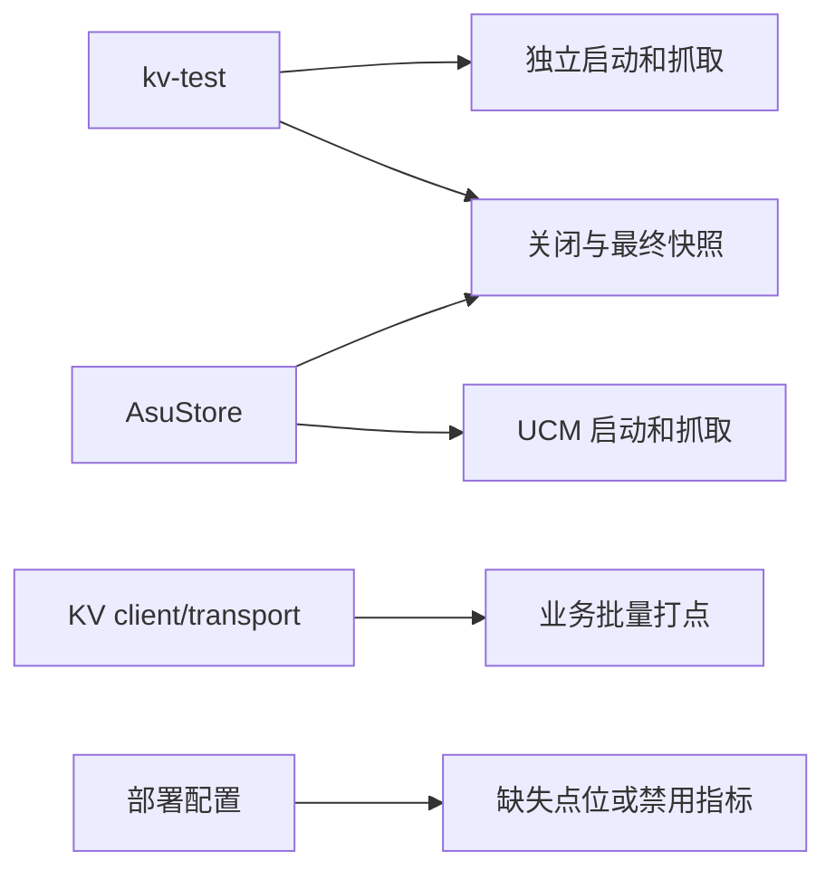

场景是外部使用方式。设计划分为第 5～8 章的四个 Shard，分别负责统一写入入口、Standalone 完整链路、UCM 完整链路，以及两种模式共同使用的指标定义和查询模板。

### 3.3 场景分析

| 场景 | 触发者与条件 | 前置条件 | 主成功结果 | 异常或替代结果 |
| --- | --- | --- | --- | --- |
| 独立启动和抓取 | `kv-test` 启用 metrics 后执行命令 | 地址/端口、定义文件有效 | KV 更新进入 standalone collector，HTTP 返回累计指标 | 端口占用或定义无效时启动报错且不安装半初始化 backend |
| UCM 启动和抓取 | UCM worker 加载并初始化 AsuStore | UCM 已注册 KV 点位且 consumer 可运行 | KV 更新进入原生 UCM collector，经 Python exporter 输出 | adapter 安装冲突时不得覆盖已有 backend；未注册点位被忽略并可诊断 |
| 业务批量打点 | client/transport 完成一次请求或异步任务阶段 | 进程已选择 backend；句柄在调用期间有效 | Counter 增量、Histogram 样本按数组顺序处理 | 未启用时 no-op；单个空句柄跳过；metrics 故障不改变 KV 请求结果 |
| 关闭与最终快照 | 宿主结束 KV 工作 | 所有相关业务线程完成 | standalone 最后聚合后关闭；UCM adapter 不自行 drain | 仍在写入时不得销毁 raw-pointer 热路径引用的 backend |
| 缺失点位或禁用指标 | 部署选择自定义 YAML、关闭 metrics | 配置可解析 | 已注册点位被正常采集；禁用时无附加输出 | 未注册名称不更新；配置检查指出 KV 点位缺口 |

### 3.4 场景与 Shard 映射

| 场景 | KV I/O 性能指标统一写入与 backend 生命周期管理 | Standalone 模式的 KV I/O 性能指标采集、聚合与导出 | UCM 模式的 KV I/O 性能指标适配、注册与导出 | 跨模式 KV 指标定义与 Grafana 查询模板管理 |
| --- | --- | --- | --- | --- |
| 独立启动和抓取 | 提供统一写入入口 | 主责：安装、聚合与 HTTP 导出 | 不参与 | 提供指标定义及公共查询口径 |
| UCM 启动和抓取 | 提供统一写入入口 | 不参与 | 主责：adapter、注册与 Python 导出 | 校验 UCM 注册定义及查询口径 |
| 业务批量打点 | 主责：句柄与单点/批量接口 | 解析 slot 并写入线程 buffer | 转发到原生 UCM 句柄 | 约定类型、单位和 bucket |
| 关闭与最终快照 | 约束停写后关闭 | 最终聚合并停止 HTTP 服务 | 停止 adapter，由 dispatcher 管理 drain | 约定累计结果的比较方式 |
| 缺失点位或禁用指标 | 禁用时保持 no-op | 报告 standalone 定义错误 | 报告 UCM 点位缺口 | 主责：配置一致性检查 |

## 4. Story 设计描述

### 4.1 Story 定义与总体思路

本 Story 以 KV metrics facade 作为 KV client/transport I/O 性能埋点的统一入口，业务代码只向 facade 提交请求次数、错误次数和阶段耗时等数据，由运行环境选择具体的采集方式。在独立 `kv-test` 进程中，宿主安装 standalone backend，将指标写入 KV 自身的 collector，聚合后通过 HTTP 接口提供抓取；在 UCM `AsuStore` 进程中，宿主安装 UCM adapter，把同一组埋点转发给 `UC::Metrics`，再由 UCM 的 dispatcher 和 Python exporter 对外提供指标。两种模式沿用相同的 KV 指标名称、类型、单位和耗时分桶，并由各自宿主管理启用与关闭，因此 KV I/O 代码无需区分运行环境，使用者也能按一致口径分析性能。

#### 两种模式的独立设计

| 设计环节 | Standalone：`kv-test` / 纯 KV 宿主 | UCM：AsuStore 所在 worker |
| --- | --- | --- |
| 构建依赖 | `kv-test` 链接 `kv_metrics_standalone` 和共享 facade，不链接 UCM collector | AsuStore 链接 `kv_metrics_ucm_adapter`、共享 facade 和 UCM collector，不链接 standalone HTTP exporter |
| 启用条件 | `metrics.enabled=true` 时由 `kv-test` 安装 backend | 由 UCM worker 将有效的 `enable_metrics` 决策传入 AsuStore；禁用时不安装 adapter |
| backend 选择 | 宿主调用 `SetUpStandaloneMetrics()`，内部完成 `InstallBackend()` | AsuStore 创建 UCM adapter，调用 `InstallBackend()` |
| 点位注册 | backend 加载 KV YAML；未指定文件时使用生成的内嵌描述，并建立名称/标签到 slot 的映射 | UCM Python `setup_ucm_metrics()` 从实际生效配置调用原生 `CreateStats()`；adapter 不注册点位 |
| KV 写入 | facade 转发到 standalone backend；`CachedMetric` 绑定 collector slot，数组批量进入一次线程本地写入区 | facade 转发到 UCM adapter；KV 句柄绑定原生 `UC::Metrics::CachedMetric`，数组逐项写入原生 collector |
| 数据聚合 | KV aggregation thread 把线程 buffer 的增量合入进程级累计快照 | `MetricsDispatcher` 统一调用原生 `GetAllStatsAndClear()` 取得本轮增量 |
| 对外导出 | KV 自带 HTTP server 直接返回累计 `/metrics` | UCM Python logger/consumer 累积增量，由 UCM/vLLM endpoint 导出 |
| 停止 | KV 工作线程结束后 `Flush()`，按配置保留抓取窗口，再 `Shutdown()` 停聚合线程和 HTTP server | worker 级协调器等待所有 AsuStore 的 KV 工作线程退出，再关闭其拥有的 facade backend；adapter 不 drain 或停止 UCM collector |
| 标签 | standalone 支持 `constantLabels` 和已注册的 `node_id` | Python exporter 提供 `model_name/worker_id`；现有 UCM collector 不保留 KV `node_id` |

两种模式共享 KV 业务埋点 API、facade 接口和指标基础名称、类型及单位约定；collector、注册过程、exporter 与关闭责任分别属于各自宿主。后续时序与 Shard 规则均遵循此边界。

#### KV client 如何接入 UCM metrics

`kv_client` 本身不调用 `UC::Metrics`。例如 `kv_client_impl.cc` 中的 `RecordSubmit()` 已经用 `KV_METRIC("kv_client_store_requests_total")` 构造 KV 句柄，并把 `{句柄, 值}` 数组交给 `kv::metrics::UpdateStats()`。兼容由宿主安装的 UCM adapter 在调用链中完成：

```text
KvClientImpl / transport
  → kv::metrics::UpdateStats(kv::metrics::CachedMetric, value)
  → libkv_metrics.so 中当前安装的 UcmKvMetricsAdapter
  → 将 KV CachedMetric 的基础名称绑定到 UC::Metrics::CachedMetric
  → UC::Metrics::UpdateStats(nativeMetric, value)
  → libucm_metrics.so 的线程 buffer
  → MetricsDispatcher 唯一 drain → UCM Python exporter
```

这里的两个 `CachedMetric` 是不同的 C++ 类型；adapter 的 `UcmMetricBinding` 是它们之间的桥。首次写入时，以 KV 句柄的 `Name()` 构造原生句柄并由 KV 句柄持有；之后复用原生句柄，原生 `id/seenEpoch` 负责查询 UCM 注册表。adapter 传递原始 value，不再次计算 Counter、Histogram 或 duration 单位，也不在 C++ 名称前加 `ucm:` 前缀。

UCM 路径产生可导出指标需要满足三项条件：AsuStore 在 `KvClient::Init()` 前把 adapter 安装到**与 kv_client 共用的** `libkv_metrics.so`；UCM 的 `setup_ucm_metrics()` 已在**与 adapter 共用的** `libucm_metrics.so` 中注册同名且同类型的 KV 点位；Python consumer 对该 collector 执行 drain 并导出。指标关闭时不安装 adapter，facade 没有 backend，KV 指标更新为 no-op。

### 4.2 逻辑模型

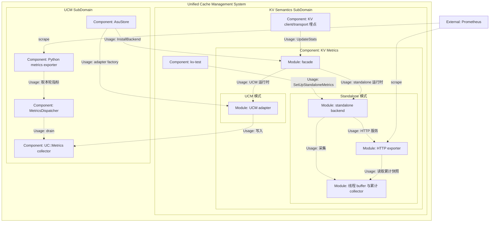

逻辑模型表明，KV client/transport 只面向统一的指标入口，不依赖具体的采集和导出组件。独立运行场景使用 KV 自身的采集与 HTTP 导出能力；UCM 场景则复用原生 collector、dispatcher 和 Python 导出能力。两条路径在各自宿主内完成指标的采集与对外提供，业务埋点保持一致。

### 4.3 实现结构模型

`KvMetricsBackend` 与 `kv::metrics::CachedMetric` 是两种模式共用的类型。下面分别画出它们在 standalone 和 UCM 模式下关联的具体类；同一进程只会选择其中一张图对应的 backend。

**Standalone 类图：**

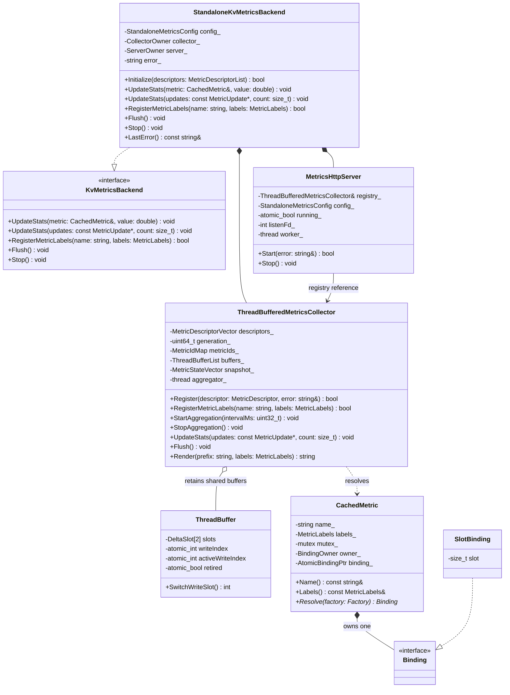

图中只列影响指标写入、聚合和导出的关键成员与接口。类型简写对应关系为：`MetricDescriptorList` 是 `const std::vector<MetricDescriptor>&`，`MetricDescriptorVector` 是 `std::vector<MetricDescriptor>`，`MetricIdMap` 是 `std::unordered_map<std::string, std::size_t>`，`ThreadBufferList` 是 `std::vector<std::shared_ptr<ThreadBuffer>>`，`MetricStateVector` 是 `std::vector<MetricState>`；`CollectorOwner`、`ServerOwner` 和 `BindingOwner` 分别是相应对象的 `std::unique_ptr`，`AtomicBindingPtr` 是 `std::atomic<Binding*>`。方法签名省略了成员函数自身的 `const` 和 `noexcept` 修饰。Standalone backend 独占 collector 和 HTTP server；collector 持有各业务线程共享的 `ThreadBuffer`，将增量聚合到 `snapshot_`。collector 在首次遇到 KV 句柄时创建 `SlotBinding`，由 `CachedMetric` 持有并缓存对应的 slot；HTTP server 通过 `registry_` 引用 collector，读取累计快照。这里的 `-->` 是 Mermaid 对关联（Association）的表示，箭头指出 server 持有指向 collector 的引用；它不是另一种 UML 关系。图中的 `Binding` 对应代码中的 `CachedMetric::Binding`。

**UCM 类图：**

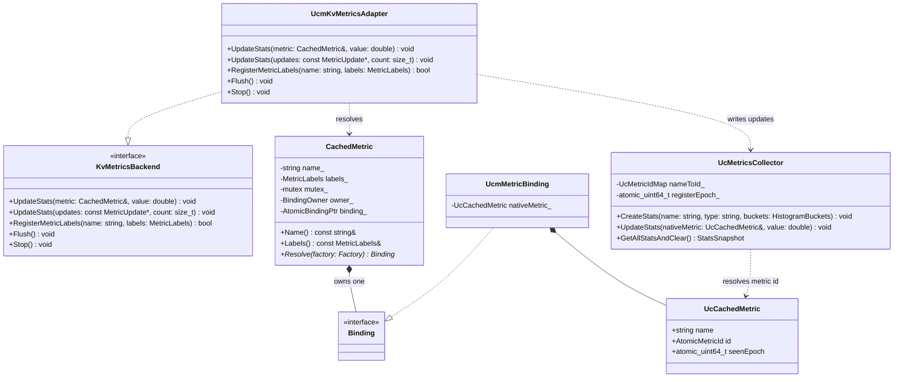

`BindingOwner` 对应 `std::unique_ptr<Binding>`，`AtomicBindingPtr` 对应 `std::atomic<Binding*>`，`UcMetricIdMap` 对应 `std::unordered_map<std::string, UC::Metrics::MetricId>`，`AtomicMetricId` 对应 `std::atomic<UC::Metrics::MetricId>`；`HistogramBuckets` 是 `const std::vector<double>&` 的排版简写，`StatsSnapshot` 表示 `UC::Metrics::Metrics::GetAllStatsAndClear()` 返回的 Counter、Gauge 与 Histogram 三元组。图中的方法签名省略了成员函数自身的 `const` 和 `noexcept` 修饰。KV `CachedMetric` 保存指标名称、标签和首次解析后缓存的 binding；其中 `owner_` 持有 binding，`binding_` 提供后续更新的快速访问。UCM adapter 本身不保存每个指标的状态，首次写入时创建 `UcmMetricBinding`，由它持有原生 `UC::Metrics::CachedMetric`（图中的 `UcCachedMetric`）。原生句柄保存名称、指标 ID 和注册 epoch；adapter 调用 `UC::Metrics::Metrics`（图中的 `UcMetricsCollector`）写入指标，不拥有该 collector。collector 与 Python exporter 的关系在 4.2 节逻辑模型中展示。

两张图的 `CachedMetric` 都指 `kv::metrics::CachedMetric`，但它在一个进程中只拥有一种具体 binding。facade 的全局 `shared_ptr<KvMetricsBackend>` 持有所选 backend，`gBackendFast` 是无所有权的热路径指针；宿主如何安装 backend 见 4.4 节上下文模型。当前设计不支持先用 standalone 解析句柄、再切换成 UCM adapter 复用该句柄。

### 4.4 Story 上下文模型

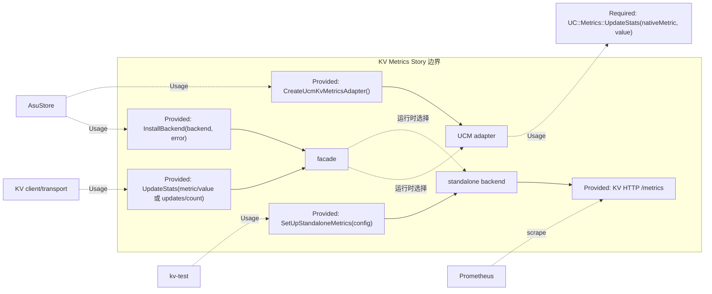

图中列出本 Story 对直接调用者提供的接口，以及 UCM adapter 所依赖的原生写入接口。`SetUpStandaloneMetrics()` 在 standalone backend 内启动 KV HTTP exporter；`setup_ucm_metrics()` 和 Python dispatcher 属于 UCM 侧的注册与导出链路，已在 4.2 节逻辑模型及 4.5.4 节时序中展示。两条 facade 连线仍表示互斥的运行时选择。

### 4.5 Story 运行时序

#### 4.5.1 总体运行时序

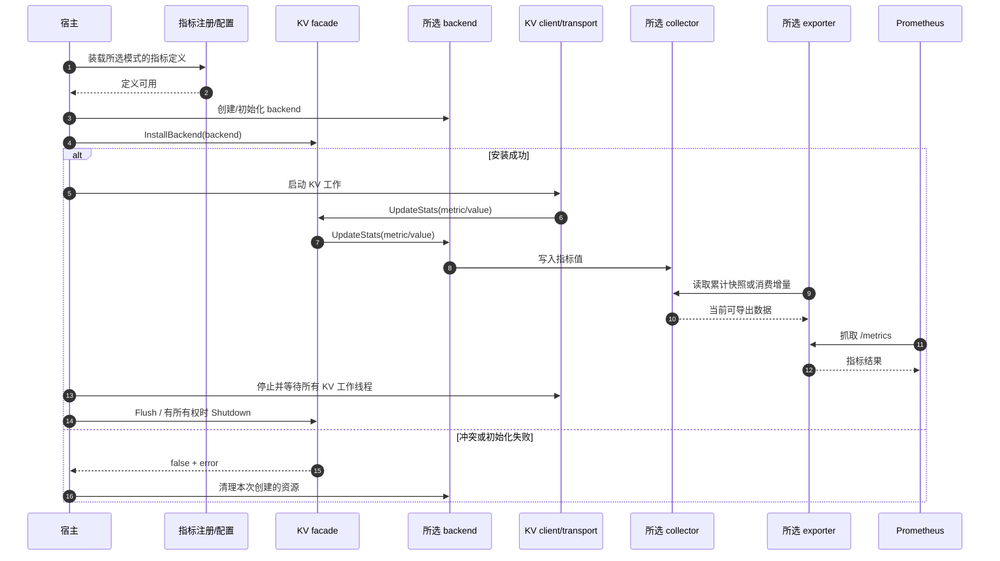

时序步骤：

1. 宿主选择模式，并准备该模式的注册描述；standalone 在 C++ backend 内完成描述加载，UCM 由 Python `setup_ucm_metrics` 注册。
2. 宿主安装唯一 backend，失败时只清理自己创建的对象，不关闭进程中已有 backend。
3. KV 业务只调用 facade，写入被选中的 collector；exporter 读取该 collector 的结果。
4. 退出时先停 KV 工作线程。standalone 最后 `Flush/Shutdown`；UCM adapter 不 drain，且关闭必须由拥有进程级生命周期的宿主协调。

#### 4.5.2 backend 安装与停止时序

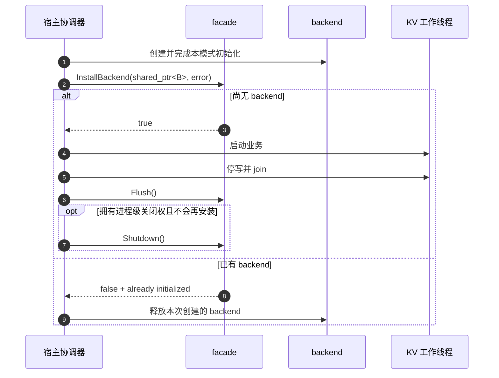

时序步骤：

1. standalone 初始化包含 HTTP/聚合线程；失败不安装。UCM adapter 创建不启动 exporter。
2. `InstallBackend` 在 facade 锁内拒绝第二个 backend；AsuStore 的多个实例经协调器共享第一次安装的 backend。
3. 所有可能调用 facade 的 KV 工作线程先停，再允许关闭。当前 `gBackendFast` 不持有引用，`Shutdown` 不能与业务更新并发。

#### 4.5.3 Standalone 注册、写入与抓取时序

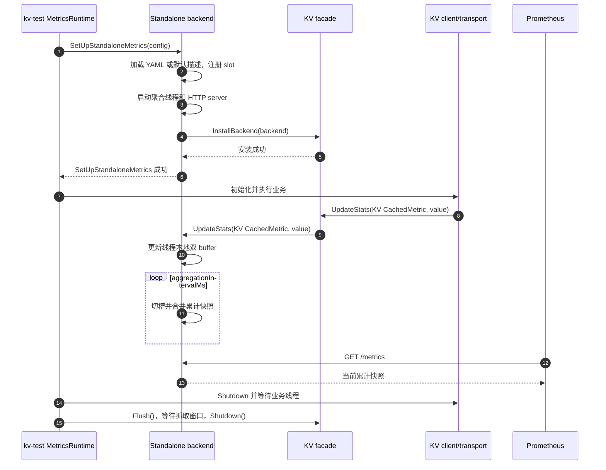

时序步骤：

1. `kv-test` 在 KV client 初始化前启动 standalone backend；它自己注册指标描述、聚合线程和 HTTP server，随后把 backend 安装到 facade。
2. KV 业务仍只调用 facade。standalone backend 将 KV 句柄解析为本 collector 的 slot，把 Counter/Histogram 更新写入线程本地 buffer；聚合线程生成累计快照。
3. HTTP 抓取读取累计快照，不调用 UCM collector，也不清空已导出的 Counter/Histogram。关闭前先停业务线程，再 `Flush()` 并按 `shutdownGraceMs` 保留最后抓取窗口。

#### 4.5.4 UCM 注册、安装与导出主时序

下图以启用 `multiproc` consumer 的 `PrometheusStatsLogger` 路径为例。vLLM connector consumer 使用同一 `MetricsDispatcher` 的独立消费缓冲，接入位置见本节后的说明。

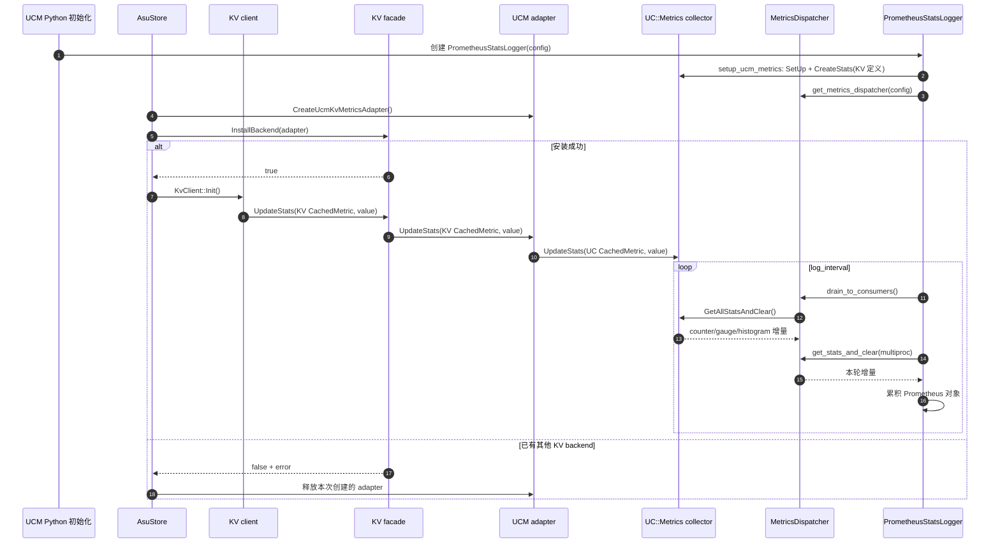

时序步骤：

1. UCM 初始化读取实际生效的 YAML 或默认配置，按基础名称、类型和 bucket 向 `UC::Metrics` **注册 KV 点位**，并准备 Python consumer。
2. AsuStore 在 `KvClient::Init()` 前创建 UCM adapter，调用 `kv::metrics::InstallBackend(adapter)` **向 KV facade 安装 backend**。这一步决定 `kv_client` 后续的 facade 调用是否能转到 UCM；`InstallBackend` 不负责注册指标定义。安装失败时只释放本次 adapter，不覆盖已有 backend。
3. `kv_client` 继续向 facade 写 `kv::metrics::CachedMetric`；facade 调用 adapter，adapter 按基础名称绑定原生 `UC::Metrics::CachedMetric`，把值写入与 Python consumer 共用的 `libucm_metrics.so`。adapter 不调用 `CreateStats` 或 `GetAllStatsAndClear`。
4. 在图示的 multiproc 路径中，logger 通过 dispatcher 统一 drain collector，并将本轮增量累积到 Prometheus 对象。vLLM connector 路径由 connector 调用同一个 dispatcher 的 `drain_to_consumers()`，再通过 `get_stats_and_clear(VLLM_CONNECTOR_CONSUMER)` 取得自身缓冲；两个 consumer 不分别直接 drain 原生 collector。应在各自最终对外出口上比较累计指标，而不是拿 UCM C++ 的单轮增量直接与 standalone 快照比较。

#### 4.5.5 UCM 单点与批量写入细节时序

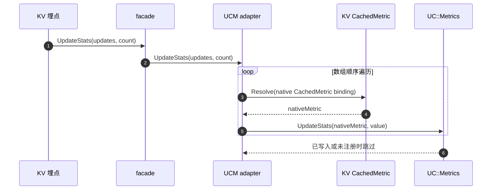

时序步骤：

1. facade 对空数组或零长度直接返回；adapter 对数组里的空 `metric` 跳过。
2. KV `CachedMetric::Resolve` 首次创建 UCM binding，后续复用；原生 `CachedMetric` 自己维护注册 ID 和 epoch，晚注册时可重新解析。
3. adapter 保留数组顺序与重复名称，每个 Histogram 条目仍是一个样本；不得先转为 `unordered_map`。原生接口可能抛出异常，adapter 的 `noexcept` 边界捕获并记录低频诊断，不影响 KV 请求。

## 5. KV I/O 性能指标统一写入与 backend 生命周期管理

### 5.1 设计描述

KV client/transport 通过 `KV_METRIC` 构造 `CachedMetric`，再经 `kv::metrics::UpdateStats` 的单点或批量入口提交 Counter 增量和 Histogram 样本。facade 只负责把更新交给进程内已安装的 backend；没有 backend 时更新为 no-op，不改变 KV 请求结果。`CachedMetric::Resolve()` 在首次写入时缓存 backend 专属 binding，后续更新复用该 binding。因此同一进程只安装一种 backend，不在句柄已经绑定后切换 standalone 与 UCM。

backend 的创建、安装和关闭由宿主负责。安装发生在 KV 工作开始前；所有可能打点的业务线程退出后，宿主才调用 facade `Shutdown()`。这个顺序保证无所有权的热路径指针 `gBackendFast` 在写入期间仍指向有效 backend。两种宿主的具体启动和停止步骤分别见第 6、7 章。

### 5.2 重点实现接口

backend 安装接口，用于发布进程内唯一的 KV metrics backend。

入参：待安装的 `backend`，以及可选的错误输出指针 `error`。

出参：安装成功返回 `true`；backend 为空或进程中已安装 backend 时返回 `false`，填写错误信息且保留原 backend。

```cpp
bool InstallBackend(std::shared_ptr<KvMetricsBackend> backend,
                    std::string* error = nullptr);
```

单点更新接口，用于把一个 KV 指标值转交当前 backend。

入参：指标句柄 `metric` 和更新值 `value`。

出参：无；未安装 backend 时直接返回，指标更新不改变 KV 请求结果。

```cpp
void UpdateStats(CachedMetric& metric, double value) noexcept;
```

批量更新接口，用于按数组顺序提交多条指标事件。

入参：更新数组 `updates` 和元素数量 `count`。

出参：无；数组为空、数量为零或元素中的句柄为空时跳过相应更新，同名事件分别计入结果。

```cpp
void UpdateStats(const MetricUpdate* updates, std::size_t count) noexcept;
```

标签注册接口，用于将名称和标签组合交给当前 backend 处理。

入参：指标基础名称 `name` 和标签集合 `labels`。

出参：注册成功返回 `true`；未安装 backend 或当前 backend 不支持该标签组合时返回 `false`。

```cpp
bool RegisterMetricLabels(const std::string& name,
                          const MetricLabels& labels) noexcept;
```

刷新接口，用于要求当前 backend 合并已完成的增量。

入参：无。

出参：无；未安装 backend 时直接返回。

```cpp
void Flush();
```

关闭接口，用于移除当前 backend，并依次调用其 `Flush()` 与 `Stop()`；宿主须先确保所有 KV 写入线程已退出。

入参：无。

出参：无；未安装 backend 时直接返回。

```cpp
void Shutdown();
```

### 5.3 重点依赖接口

| 依赖接口 | 用途 | 失败处理 |
| --- | --- | --- |
| `CachedMetric::Resolve(factory)` | 首次创建并发布 backend 专属 binding | 创建失败被 backend 的 `noexcept` 边界处理，跳过本次指标更新 |
| `KvClient::Init()` / `Shutdown()` | 让指标安装覆盖 KV 工作区间 | 初始化失败清理本次资源；关闭时先等待业务线程退出 |

### 5.4 关键约束与验收

| 约束 | 验收方式与预期结果 |
| --- | --- |
| 一个进程同时只有一个 backend | 连续安装两次，第二次返回 `false`，第一次仍可接收更新 |
| 禁用时保持 no-op | 不安装 backend；`IsEnabled()==false`，打点不影响 KV 请求结果 |
| 停写先于销毁 | 所有写入线程 join 后再 `Shutdown()`，不发生悬挂访问或丢失最后已完成的更新 |
| 句柄不跨 backend 复用 | 同一进程不关闭后重装另一模式；若将来支持切换，需先增加 binding generation |
| 批量更新保留每条事件 | 对同一 Counter 提交两条增量得到两值之和；对同一 Histogram 提交两条样本，`_count` 增加 2 |

## 6. Standalone 模式的 KV I/O 性能指标采集、聚合与导出

### 6.1 设计描述

`kv-test` 在 `metrics.enabled=true` 时，由 `MetricsRuntime::Start` 调用 `SetUpStandaloneMetrics()`。backend 加载 KV YAML 或内嵌默认描述，注册指标名称、类型、bucket 与可用标签，启动聚合线程及 HTTP 服务，最后安装到 facade；初始化失败时清理本次资源，不发布半初始化 backend。

业务更新经 facade 进入 `StandaloneKvMetricsBackend`。collector 在 `CachedMetric` 首次写入时解析名称和标签，创建 `SlotBinding` 并缓存 slot；批量更新在业务线程的双 buffer 中共用一次 `WriteGuard`。聚合线程把增量合入进程级累计快照，HTTP `/metrics` 读取该快照，重复抓取不会清零。`TransportTaskExecutor` 的节点级 Histogram 在该路径保留已注册的 `node_id` 标签。

退出时，`clientRunner.Shutdown()` 先等待 KV 工作完成，`MetricsRuntime::Stop` 再执行最终 `Flush()`，按配置保留抓取窗口后调用 facade `Shutdown()`，停止 HTTP 服务和聚合线程。

### 6.2 重点实现接口

Standalone 指标启动接口，用于加载定义、启动 collector 与 HTTP 服务，并将 backend 安装到 facade。

入参：监听地址、端口、定义文件和聚合周期等配置 `config`，以及可选的错误输出指针 `error`。

出参：全部组件初始化并安装成功时返回 `true`；定义无效、监听失败或安装冲突时返回 `false` 和错误信息，并清理本次创建的资源。

```cpp
bool SetUpStandaloneMetrics(StandaloneMetricsConfig config,
                            std::string* error = nullptr);
```

backend 初始化接口，用于按指标描述注册点位，并启动聚合线程和 HTTP 服务。

入参：已加载的指标描述集合 `descriptors`。

出参：成功返回 `true`；任一点位注册或服务启动失败时返回 `false`，错误可由 `LastError()` 获取，已启动资源由 backend 清理。

```cpp
bool StandaloneKvMetricsBackend::Initialize(
    const std::vector<MetricDescriptor>& descriptors);
```

Standalone 批量写入接口，用于将 facade 转发的事件写入业务线程的双 buffer；单点写入由同类重载构造一条 `MetricUpdate` 后复用该路径。

入参：更新数组 `updates` 和元素数量 `count`。

出参：无；空数组和空句柄被跳过，采集异常不向 KV 业务传播。

```cpp
void StandaloneKvMetricsBackend::UpdateStats(
    const MetricUpdate* updates, std::size_t count) noexcept;
```

Standalone 聚合与停止接口，用于在停写后合并最后一轮增量，再停止 HTTP 服务和聚合线程。

入参：无。

出参：无；重复停止不再释放已清理的资源。宿主通过第 5.2 节的 facade `Flush()`、`Shutdown()` 触发它们。

```cpp
void StandaloneKvMetricsBackend::Flush();
void StandaloneKvMetricsBackend::Stop();
```

### 6.3 重点依赖接口

| 依赖接口 | 用途 | 失败处理 |
| --- | --- | --- |
| `DefaultKvMetricDescriptors()` / KV YAML 加载 | 提供名称、类型、bucket 和标签定义 | 定义无效时启动失败并报告错误 |
| `ThreadBufferedMetricsCollector::UpdateStats(...)` | 将业务线程增量写入本地 buffer | 采集异常在 backend 内处理，不影响 KV 请求 |
| `MetricsHttpServer::Start()` / `Render()` | 提供累计 `/metrics` 快照 | 监听失败时撤销本次 backend 初始化 |

### 6.4 关键约束与验收

| 约束 | 验收方式与预期结果 |
| --- | --- |
| 注册和 HTTP 启动先于 facade 安装 | 用坏 YAML 或预占端口启动，返回错误且 facade 未启用、无残留线程 |
| 抓取是累计快照 | 固定次数更新后连续抓取，Counter 不清零，Histogram `_count` 与样本数一致 |
| 停止前执行最终聚合 | 工作线程退出后 `Flush()`，最后已完成的更新在抓取窗口可见 |
| 节点标签可用 | 注册两个 `node_id` 后写入节点级 Histogram，抓取结果按节点区分 |

## 7. UCM 模式的 KV I/O 性能指标适配、注册与导出

### 7.1 设计描述

UCM worker 将有效的 `enable_metrics` 决策传给 AsuStore。启用时，worker 级协调器在首个 `KvClient::Init()` 前创建并安装一次 UCM adapter；禁用时不安装。多个 AsuStore 实例共享该 backend，单个实例初始化失败或析构不关闭全局 backend。worker 停止全部 KV 工作线程后才调用一次 facade `Shutdown()`；如果允许卸载 AsuStore 动态库，还须在 `dlclose` 前完成停写和关闭。

adapter 在 KV `CachedMetric` 中缓存 `UcmMetricBinding`，其中持有原生 `UC::Metrics::CachedMetric`。单点和批量更新将原始值逐项转发到 UCM collector；原生句柄通过注册 epoch 在点位晚注册后重新解析。adapter 不创建第二套 exporter，也不调用 `CreateStats()` 或 `GetAllStatsAndClear()`。UCM Python `setup_ucm_metrics()` 从实际生效配置注册 KV 点位；`MetricsDispatcher` 是该 collector 的统一 drain 点，Python consumer 累积增量后对外提供可抓取指标。

现有 UCM collector 按基础名称索引，不能保留 KV 的动态 `node_id` 标签。adapter 将两项节点级 Histogram 汇总到基础名称下，`RegisterMetricLabels()` 返回 `false`；节点维度的扩展需要同时修改原生 collector、drain 数据结构和 Python exporter。

### 7.2 重点实现接口

UCM adapter 创建接口，用于提供只写入原生 `UC::Metrics` collector 的 backend；点位注册和 Python 导出由 UCM 侧完成。

入参：无。

出参：可交给 `InstallBackend()` 的 backend 对象；对象创建失败时宿主不得安装空 backend。

```cpp
std::shared_ptr<KvMetricsBackend> CreateUcmKvMetricsAdapter();
```

UCM 单点写入接口，用于将一个 KV 句柄绑定到原生 `UC::Metrics::CachedMetric`，并提交更新值。

入参：KV 指标句柄 `metric` 和更新值 `value`。

出参：无；未注册点位由原生 collector 跳过，adapter 内部处理写入异常，不改变 KV 请求结果。

```cpp
void UcmKvMetricsAdapter::UpdateStats(CachedMetric& metric,
                                      double value) noexcept;
```

UCM 批量写入接口，用于按输入顺序把多条 KV 更新逐项转发给原生 collector。

入参：更新数组 `updates` 和元素数量 `count`。

出参：无；空数组和空句柄不产生更新，同名多条事件分别提交，异常不越过 `noexcept` 边界。

```cpp
void UcmKvMetricsAdapter::UpdateStats(
    const MetricUpdate* updates, std::size_t count) noexcept;
```

UCM 指标注册接口，用于读取实际生效配置，将其中的 KV 点位注册到原生 collector。

入参：UCM 指标配置 `config`，允许为 `None`。

出参：实际注册的 `MetricDefinition` 列表；配置没有点位时返回空列表，配置解析或注册失败时向调用方报告错误。

```text
setup_ucm_metrics(config: dict[str, Any] | None) -> list[MetricDefinition]
```

UCM 指标分发接口，用于统一 drain 原生 collector，并将本轮增量合并到已启用 consumer 的缓冲区。

入参：无。

出参：无；本轮没有指标时直接返回，不启动第二个原生 drain 点。

```text
MetricsDispatcher.drain_to_consumers() -> None
```

### 7.3 重点依赖接口

| 依赖接口 | 用途 | 失败处理 |
| --- | --- | --- |
| `UC::Metrics::UpdateStats(UC::Metrics::CachedMetric&, double)` | 写入原生线程 buffer | 未注册名称被跳过；异常由 adapter 截断 |
| `UC::Metrics::CreateStats(name, type, buckets)` | 在实际生效配置中注册 KV 点位 | 配置缺失时由部署检查报告缺口 |
| `PrometheusStatsLogger.update_stats_loop()` | 将 dispatcher 分发的增量累积成 Prometheus 值 | consumer 未运行时检查启动配置和 worker 位置 |
| `libucm_metrics.so` 加载 | 保证 adapter 写入与 Python drain 使用同一 collector | 检查进程加载映射；重复实例视为部署失败 |

### 7.4 关键约束与验收

| 约束 | 验收方式与预期结果 |
| --- | --- |
| 多实例只安装一次 adapter | 并发初始化两个 AsuStore，一个失败或退出后另一个继续出数，最终仅关闭一次 |
| 晚注册后恢复写入 | 先更新未注册名称，再 `CreateStats()` 并更新，后一次在 UCM drain 中可见 |
| 原生 collector 只有 dispatcher drain | 不启动第二个 `GetAllStatsAndClear()` 消费者，多 consumer 收到同一轮增量 |
| Histogram 类型和 bucket 与 Python 对象匹配 | 注入样本后最终 `_bucket/_sum/_count` 一致，无 bucket mismatch 日志 |
| 节点标签降级明确 | 两个节点的样本按基础名汇总，UCM 输出不包含 `node_id` |
| 同一共享库实例 | 加载映射中 `libkv_metrics.so`、`libucm_metrics.so` 各只有一份实例 |

## 8. 跨模式 KV 指标定义与 Grafana 查询模板管理

### 8.1 设计描述

`kv_semantics/metrics/config/kv_metrics.yaml` 是 KV 点位基础名、类型、单位和 Histogram bucket 的规范清单；`generate_kv_metrics.py` 从该文件生成 standalone 内嵌默认描述。UCM 默认配置与部署 YAML 维护同一批 KV 定义；`generate_kv_metrics.py --check` 在 CI 中比较名称、类型、bucket 与 HELP 语义。自定义 UCM YAML 覆盖默认配置时也必须包含所需 KV 点位，否则原生 collector 会忽略对应更新。

standalone 默认前缀为 `kv:`，UCM multiproc exporter 默认前缀为 `ucm:`。公共查询采用 `ucm:`，`kv-test` 配置该前缀及稳定的 `model_name/worker_id` 标签；UCM Python logger 提供对应标签。前缀只在 exporter 添加，C++ 句柄仍使用 `kv_...` 基础名。两种出口的对照以最终累计 Prometheus 值为准：standalone `/metrics` 直接返回累计快照，UCM C++ drain 返回增量，由 Python consumer 累积。`source` 不属于公共契约。

`examples/metrics/grafana_kv_client.json` 是本 Story 的 KV 性能面板模板，查询需与公共名称和前缀一致。吞吐、耗时、错误等公共面板适用于两种出口；依赖 `node_id` 的节点面板只适用于 standalone，UCM 通过无节点标签的汇总指标展示。

### 8.2 关键交付物与校验入口

默认指标描述接口，用于向 standalone backend 提供由 KV YAML 生成的点位定义。

入参：无。

出参：`MetricDescriptor` 列表，包含指标基础名称、类型、文档说明和 Histogram bucket。

```cpp
std::vector<MetricDescriptor> DefaultKvMetricDescriptors();
```

定义一致性校验入口，用于检查生成的 standalone 描述、UCM 默认配置和部署模板是否遵循同一指标契约。

入参：仓库中的 KV YAML、生成头文件和 UCM 指标配置。

出参：定义一致时退出码为 `0`；基础名称、类型、bucket 或说明不一致时返回非零退出码并报告差异。

```text
python kv_semantics/metrics/tools/generate_kv_metrics.py --check
```

Grafana 模板交付物，用于提供 KV client 的吞吐、阶段耗时、错误、超时和节点性能视图。

入参：已配置的 Prometheus 数据源及两种出口遵循的公共指标名称。

出参：可导入的 KV client dashboard；公共面板适用于两种模式，依赖 `node_id` 的节点面板仅在 standalone 下有节点级数据。

```text
examples/metrics/grafana_kv_client.json
```

### 8.3 重点依赖接口

| 依赖接口 | 用途 | 失败处理 |
| --- | --- | --- |
| Standalone HTTP `/metrics` | 提供累计 Prometheus 快照 | 查询缺失时检查定义、前缀及标签配置 |
| UCM Python metrics endpoint | 提供由 dispatcher 增量累积后的指标 | 查询缺失时检查 UCM 注册配置和 consumer 状态 |
| Grafana Prometheus 数据源 | 执行 KV client 模板中的 PromQL 查询 | 面板无数据时核对实际出口的名称、前缀和标签 |

### 8.4 关键约束与验收

| 约束 | 验收方式与预期结果 |
| --- | --- |
| 两种模式的基础名称、类型、单位和 bucket 一致 | 更改任一端的类型或 bucket，配置检查报告明确差异 |
| 公共前缀只在 exporter 增加 | 两端抓取出现 `ucm:kv_...`，C++ 句柄仍使用 `kv_...` |
| 两端结果按累计值比较 | 注入相同事件后，Counter 和 Histogram 的最终 Prometheus 值可比较 |
| Grafana 模板覆盖两种出口 | 公共吞吐、耗时、错误面板在两种指标源下可查询；节点面板在 UCM 下不误示节点维度结果 |

## 9. Shard 协作关系与 Story 级约束

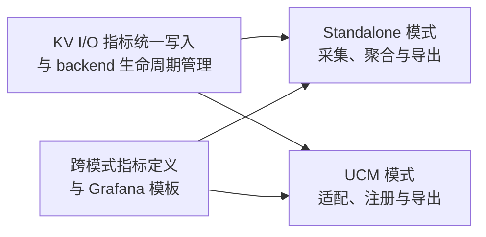

1. 每个进程只选择一条指标链路。安装先于打点，退出先停写再关闭；`gBackendFast` 不持有 backend 引用，`Shutdown()` 不得与业务更新并发。
2. KV client、transport 与宿主解析到同一份 `libkv_metrics.so`；UCM adapter 和 Python `ucmmetrics` 解析到同一份 `libucm_metrics.so`，并通过进程加载映射验证。
3. UCM adapter 只写原生 collector；具有清除语义的 `GetAllStatsAndClear()` 只由 dispatcher 调用。
4. 不在一个进程中关闭后重装另一模式；AsuStore 的安装协调覆盖 worker 内反复创建的实例。
5. `MetricUpdate` 中的 `CachedMetric*` 至少存活至调用结束；异步任务保存的节点级句柄不得早于任务完成而析构。

## 10. SFMEA 分析

| 故障模式 | 影响 | 设计措施 | 可执行注入方法 | 需验证的结果 |
| --- | --- | --- | --- | --- |
| standalone 定义无效或 HTTP 端口占用 | 指标端点无法启动 | 初始化失败不安装 facade；停止已创建资源 | 用坏 YAML 或预占端口启动 `kv-test` | 返回明确错误，无残留聚合/HTTP 线程，facade 未启用 |
| 第二宿主重复安装 backend | 数据写到错误 collector 或覆盖对象 | `InstallBackend` 拒绝第二次安装 | 两线程并发安装不同 backend | 恰有一次成功；已安装 backend 仍可收数 |
| KV 写入线程与 `Shutdown` 并发 | raw pointer 悬挂访问 | 宿主必须先停写并 join | 测试栅栏令 writer 停在调用边界，同时触发宿主退出 | 宿主遵守停写屏障，退出无非法访问；不声称 facade 可任意并发关闭 |
| UCM KV 点位未注册 | 原生更新被丢弃 | 配置一致性检查、部署诊断 | 从 UCM YAML 移除一个 KV 名称 | 对应点位缺失被检查发现，其他点位继续正常 |
| 两份 `libucm_metrics.so` 被加载 | C++ 写入与 Python drain 分离 | 安装 RPATH/SONAME 验证 | 构造错误库搜索路径的集成环境 | `/proc/<pid>/maps` 显示重复实例并判定部署失败 |
| Histogram bucket 不一致 | Python 跳过一轮更新 | 跨端 bucket 校验 | 在 UCM 配置中改变一个 bucket | CI 报错；运行时不允许静默通过 |
| 另一个消费者直接调用 `GetAllStatsAndClear` | dispatcher 丢本轮增量 | 统一由 dispatcher drain | 在集成测试中人为加入第二次 drain | 能复现丢数并由启动/代码检查拒绝该拓扑 |
| adapter 更新抛异常 | metrics 干扰 KV 请求或触发 terminate | adapter `noexcept` 边界捕获 | 注入 binding 分配/原生更新异常 | KV 请求结果不变，进程存活，低频诊断可见 |
| AsuStore 多实例中一个失败或销毁 | 其他实例过早失去指标 | worker 级安装协调，不由单实例关闭全局 backend | 并发创建两实例，使其中一例 Setup 失败 | 成功实例持续打点，最终关闭仅一次 |

## 11. 开发自验证用例

### 11.1 Standalone 启动、抓取与退出

测试点：backend 安装、累计输出和最终聚合。

测试手段：启用 `kv-test` metrics 并用 fake provider 执行固定次数的 store；在命令运行期间重复抓取 `/metrics`，完成后在 grace 窗口抓取一次。

预期行为：请求 Counter 单调不减，Histogram `_count` 等于实际样本数；多次抓取不清零；退出前最后一次 Flush 的结果可见。端口占用时启动返回失败且无后台线程残留。

### 11.2 Facade 单例与无 backend 路径

测试点：唯一 backend、禁用 no-op。

测试手段：先在没有安装 backend 时调用单点和批量接口，再安装一个测试 backend，并尝试安装第二个。

预期行为：未安装时 `IsEnabled()==false` 且调用无副作用；首次安装成功，第二次返回 `false` 并保留原 backend 的计数。

### 11.3 UCM adapter 单点和重复批量

测试点：名称绑定、Counter 累加和 Histogram 样本数。

测试手段：在单进程中先 `UC::Metrics::SetUp/CreateStats`，安装 adapter，传入单点 Counter 和包含两条同名 Histogram 的数组，再通过唯一 drain 读取。

预期行为：Counter 值准确，Histogram 两个样本分别进入 bucket、`sum` 和 `count`；数组内空句柄跳过，无异常传出。

### 11.4 UCM 晚注册与缺失定义

测试点：原生 cached handle 的 epoch 行为和配置诊断。

测试手段：先调用未注册名称，再 `CreateStats` 注册并再次打点；另用缺少一个 KV 名称的配置运行检查。

预期行为：注册前更新不出现，注册后的更新可被 drain；配置检查明确指出缺失名称。

### 11.5 AsuStore 多实例与库唯一性

测试点：worker 级安装协调及同一 collector 实例。

测试手段：并发创建两个 AsuStore，其中一例在 KV client 初始化后续阶段失败；成功实例继续产生 KV 事件；读取 `/proc/<pid>/maps` 并由 Python dispatcher drain。

预期行为：facade 只安装一次，成功实例持续出数，`libkv_metrics.so` 和 `libucm_metrics.so` 各仅一份加载实例；失败实例的释放不关闭全局 backend。

### 11.6 两模式指标口径对照

测试点：基础名称、类型、单位、bucket、公共查询及 Grafana 模板一致性。

测试手段：对 standalone 与 UCM 路径注入相同的逻辑事件，抓取两个最终 Prometheus endpoint；运行配置一致性脚本和 `grafana_kv_client.json` 使用的公共 PromQL 查询。

预期行为：非节点标签的 KV 指标按相同事件数输出，duration 均为 seconds，Histogram bucket 与 `_count/_sum` 一致；UCM 的两个 node Histogram 按基础名汇总且不出现 `node_id`，此差异明确列在设计契约中。

## 12. 一句话总结

> 本 Story 使 KV client I/O 路径的性能数据在独立运行和 UCM 集成场景下都可采集、可查看，并保持一致的指标口径。
