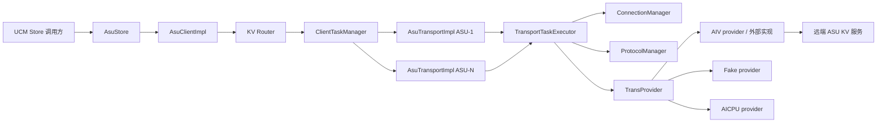
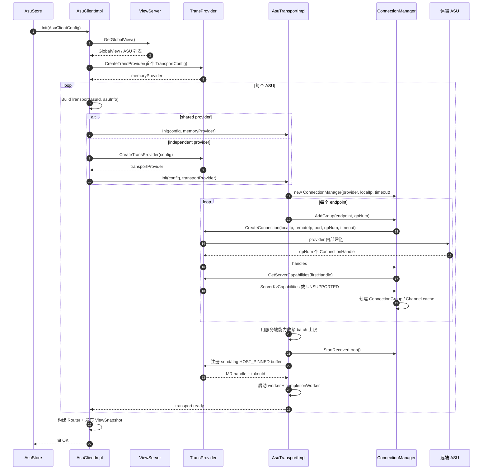
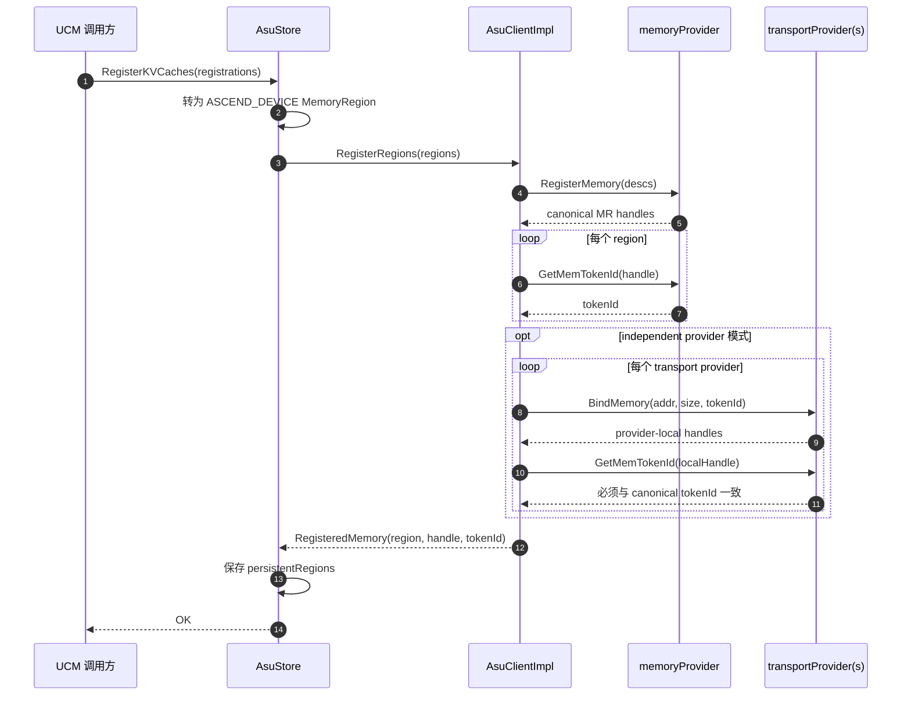
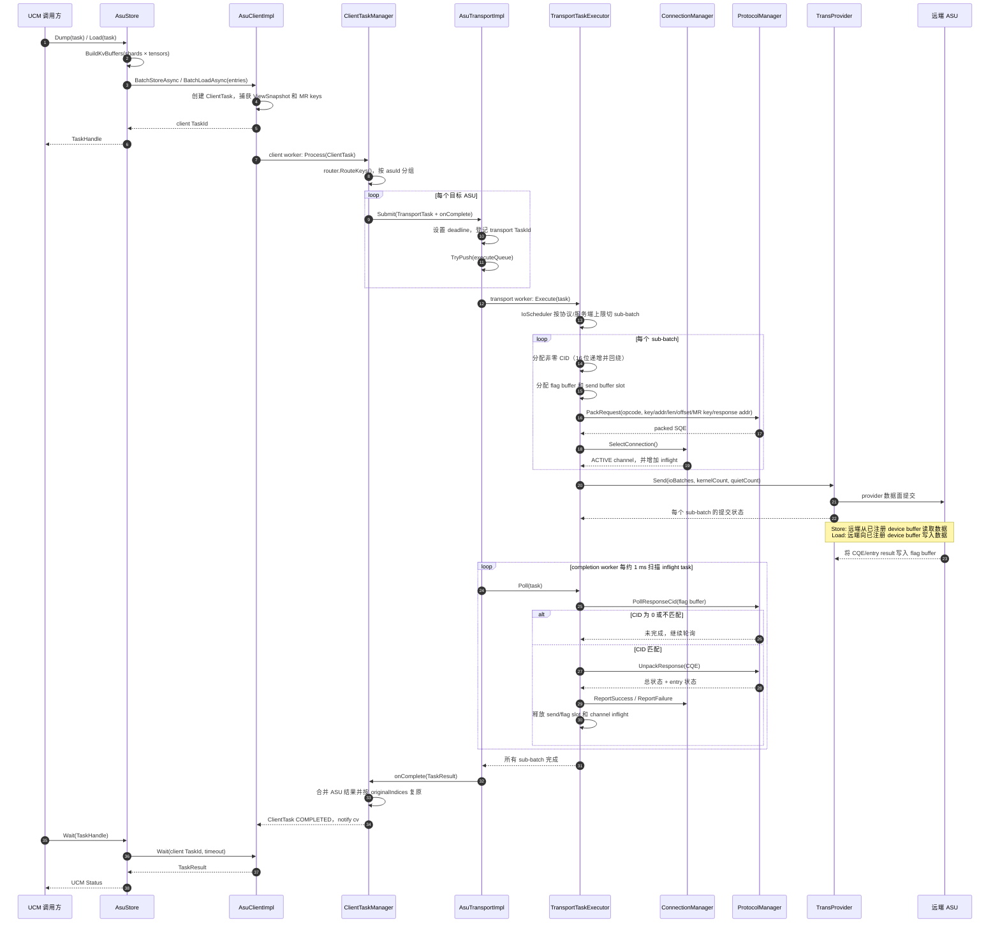
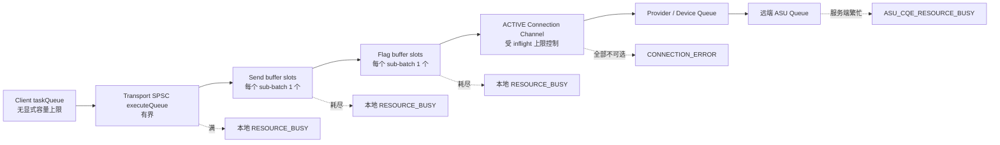
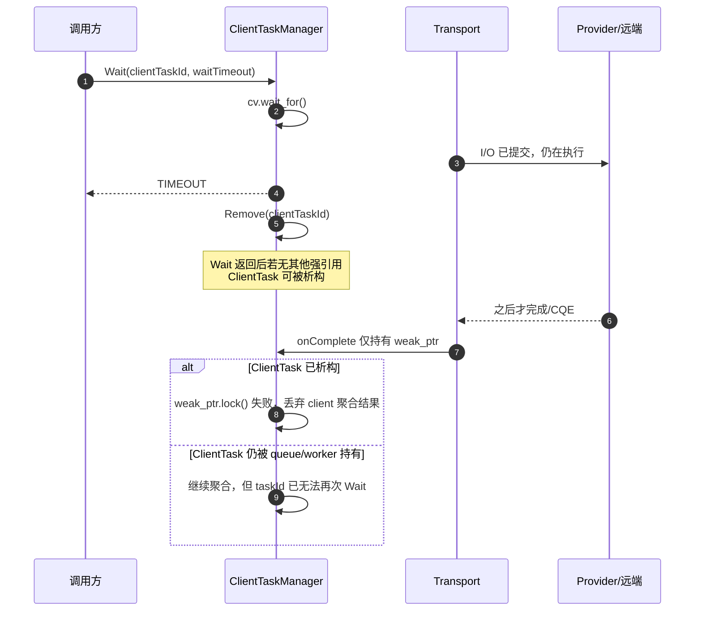
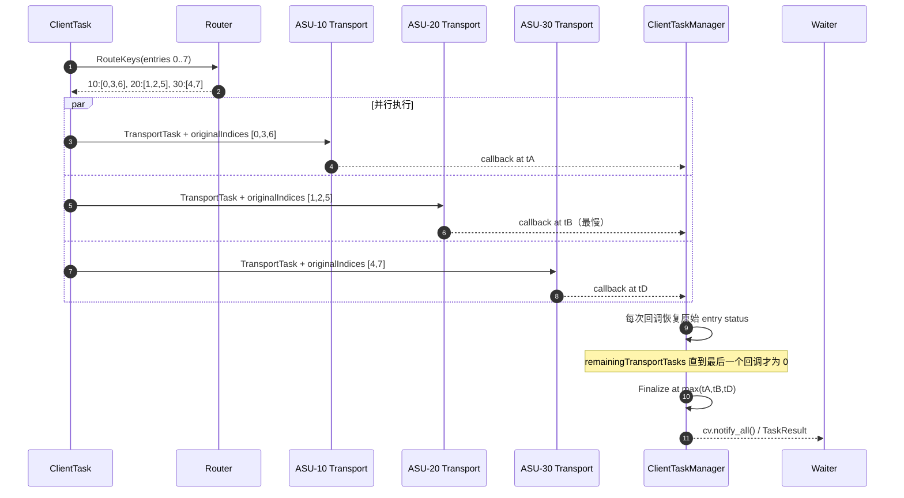

# ASU Store 到 ASU Transport：建链与 I/O 流程

> 本文基于当前仓库源码梳理，范围从 `ucm/store/asu/cc/asu_store.cc` 到
> `ucm/transport/kv/asu/client` 和 `ucm/transport/kv/asu/trans`，并下探到
> `TransProvider` 抽象边界。
> 文中的“建链”指当前 UCM 代码实际触发的连接创建流程；AIV provider 内部的
> RoCE/UB 握手实现不在本仓库中，因此只描述到其公开接口。

## 1. 一句话总览

`AsuStore` 负责把 UCM 的 block/shard/tensor 描述转换成带注册地址和 MR token 的
`KVBuffer`；`AsuClientImpl` 根据 key 路由到一个或多个 ASU；每个
`AsuTransportImpl` 再做子批切分、选择连接、组装 SQE 并调用 provider 发起 I/O；
完成线程通过轮询 response/flag buffer 中的 CQE CID 收割结果，最终沿回调链唤醒
`AsuStore::Wait()`。



## 2. 分层职责与关键对象

| 层级 | 核心对象 | 主要职责 |
| --- | --- | --- |
| Store 适配层 | `AsuStore` | 解析 UCM 配置；生成 ASU key；把 shard/tensor 地址转成 `KVBuffer`；注册持久 KV cache 内存；提供 `Dump/Load/Lookup/Check/Wait` |
| Client 聚合层 | `AsuClientImpl` | 获取全局 view；为每个 ASU 创建 transport；构建 router；管理客户端异步任务和 view 刷新 |
| Client 任务层 | `ClientTaskManager` | 按 key 路由，把一个 client task 拆成多个 ASU 级 `TransportTask`；聚合回调结果并恢复原始输入顺序 |
| Transport 层 | `AsuTransportImpl` | 管理提交队列、执行线程、完成线程、连接、send/flag buffer 池和任务超时 |
| Transport 执行层 | `TransportTaskExecutor` | 按协议上限切子批；分配 CID、buffer 和连接；构造 SQE；发送；轮询并解析 CQE |
| 连接层 | `ConnectionManager` | 创建连接组和 channel；轮询或最小负载选路；限流；失败摘除与后台重建 |
| Provider 抽象层 | `TransProvider` | 封装连接、发送、内存注册/绑定、token 查询和服务端能力查询 |

任务有三级粒度：

1. `ClientTask`：Store 一次 API 调用对应的聚合任务，持有提交时的不可变
   `ViewSnapshot`。
2. `TransportTask`：按 router 结果拆出的“单 ASU 任务”。
3. `TransportSubBatchContext`：按单条/批量协议上限再次切分后的实际 SQE/CQE 单元，
   每个单元有独立 CID、连接、send buffer 和 flag buffer。

关键定义见：

- `ucm/transport/kv/asu/common/task_context.h`
- `ucm/transport/kv/asu/client/src/asu_client_impl.h`
- `ucm/transport/kv/asu/trans/include/asu_transport/asu_transport.h`
- `ucm/transport/kv/asu/trans/include/asu_transport/trans_provider.h`

## 3. 初始化与建链

### 3.1 Store 生成 Client/Transport 配置

`AsuStore::Setup()` 的主要动作是：

1. `ParseConfig()` 读取 `asu_ids`、`asu_ips`、`asu_ports`、`device_id`、
   `asu_trans_provider_backend`、超时、并发限制及 tensor 布局等配置。
2. `NormalizeAsuShardConfig()` 对 tensor size 做 ASU 对齐，并同步修正 shard/block size。
3. `BuildAsuClientConfig()` 为每个 `asu_id` 生成一份 `TransportConfig`：endpoint、
   provider 类型、设备号、超时、错误阈值、`kv_ns_id` 等都在这里下沉。
4. `CreateAsuClient()` 创建 `AsuClientImpl`，然后调用 `client_->Init(...)`。

注意：当前 `asu_mode` 在 `AsuStore` 中只用于合法性检查、限制 transport 模式只能配置
一个 ASU，以及日志展示；`client` 和 `transport` 两种值最终都经由 `AsuClientImpl` 建立
transport，并不存在绕过 client 层的直接调用分支。

源码入口：`ucm/store/asu/cc/asu_store.cc:165`、`:212`、`:243`、`:461`。

### 3.2 Client 构建 view、provider 和 transport

`AsuClientImpl::Init()`：

1. 创建 `ViewServer`，并取得 `GlobalView`。
2. 用第一份 transport 配置创建 `memoryProvider_`。它是业务 KV cache 内存注册的
   owner provider。
3. `BuildSnapshot()` 遍历 view 中的 ASU ID；每个 ASU 调用 `BuildTransport()`。
4. 创建 KV router，生成不可变 `ViewSnapshot{view, router, transports}`。
5. 启动 client worker；发布 snapshot 后才把 client 标记为 initialized。

provider 有两种模式：

- `SHARED`：transport 和业务内存注册共用 `memoryProvider_`。
- `INDEPENDENT`：每个 transport 创建独立 provider。业务内存先由
  `memoryProvider_` 注册取得 token，再通过 `BindMemory()` 绑定到各 transport provider；
  新增 ASU/provider 时也会补绑既有 region。

源码入口：`ucm/transport/kv/asu/client/src/asu_client_impl.cpp:60`、`:503`、`:546`。

### 3.3 Transport 建链细节

每个 `BuildTransport()` 最终调用 `AsuTransportImpl::Init(config, provider)`：



连接数 `qpNum = queryQpNum + loadQpNum + storeQpNum`，默认是 `1 + 4 + 2 = 7`。
provider 成功时应返回恰好 `qpNum` 个 opaque `ConnectionHandle`；每个 handle 被包装为
一个 `ConnectionChannel`。若服务端返回 `ioQueueDepth`，它会收紧单 channel 的最大
inflight 数；batch store/load/delete/query 上限也会被服务端 capability 收紧。

Transport 初始化成功前还会：

- 建立 send buffer 池和 response/flag buffer 池；二者都是 `HOST_PINNED`，注册后保存
  provider token。
- 构造 `ProtocolManager` 和 `TransportTaskExecutor`。
- 建立有界 `executeQueue_`，深度基于 `maxInflightTasks`。
- 启动 transport 提交 worker、完成轮询 worker 和连接恢复 worker。

源码入口：

- `ucm/transport/kv/asu/trans/src/asu_transport_impl.cpp:63`
- `ucm/transport/kv/asu/trans/src/connection_manager.cpp:40`
- `ucm/transport/kv/asu/trans/src/buffer_manager.cpp:121`

### 3.4 AIV 建链的源码边界

当 backend 为 AIV 时，`CreateTransProvider()` 创建 `AIVTransProviderAdapter`。适配器只是把
`CreateConnection()`、`Send()`、内存注册/绑定等调用转发给 `AIVTransport`。真正的
`CreateAIVTransProvider()` 实现由外部 provider 库提供，本仓库没有继续展示 socket、
QP、UB/RoCE negotiation 的执行过程。

另外，`trans/src/link_protocol.{h,cpp}` 定义了 `NegotiateSqe`、`HandshakeSqe` 等报文，
但当前生产代码没有引用它们，只有 `link_protocol_test.cpp` 使用。因此不能据此声称
`ConnectionManager::AddGroup()` 当前显式执行了这些握手；实际握手应以外部 provider
实现为准。

相关边界：

- `ucm/transport/kv/asu/trans/src/trans_provider.cpp`
- `ucm/transport/kv/asu/trans/src/aiv_trans_provider.h`
- `ucm/transport/kv/asu/trans/include/aiv_transport/aiv_transport.h`

## 4. 业务内存注册流程

真实 load/store 前，Store 要求先调用 `RegisterKVCaches()`：



Store 构建每个 `KVBuffer` 时会检查其地址范围是否完全落在某个持久注册 region 中，
并把 canonical MR handle 写入 `KVBuffer.buffer.handle`。Client 提交时再把使用到的 handle
解析成 tokenId，形成 `registeredMrKeys`，transport 构造 SQE 时必须能由 handle 找到
对应 MR key，否则以 `BUFFER_NOT_REGISTERED` 失败。

源码入口：`ucm/store/asu/cc/asu_store.cc:298`、`:701`；
`ucm/transport/kv/asu/client/src/asu_client_impl.cpp:226`；
`ucm/transport/kv/asu/trans/src/sqe_request.cpp:45`。

## 5. Task 生命周期与性能观测点（重点）

本章专门回答两个问题：

1. `AsuStore` 下来的一次 task，在 client 和 transport 内部究竟变成了哪些 task，分别由
   谁持有、在哪个线程执行？
2. 调用方的 `Wait()` 为什么能等到结果，以及要拆分性能耗时应该在哪些位置打点？

### 5.1 先区分四种 ID/对象

Store 下来的 task 不是一路原样传到底层，而是在每层转换和拆分：

| 层次 | 对象/ID | 一次 Store 请求对应数量 | 用途 |
| --- | --- | ---: | --- |
| UCM Store | `Detail::TaskDesc` / `Detail::TaskHandle` | 1 | `TaskDesc` 描述 block shard 和 tensor 地址；返回的 `TaskHandle` 实际承载 client task ID |
| ASU Client | `ClientTask` / client `TaskId` | 1 | 一次 `BatchStoreAsync/BatchLoadAsync` 的聚合任务；跨 ASU 汇总最终结果 |
| ASU Transport | `TransportTask` / transport `TaskId` | 1..N | Router 每路由到一个 ASU，就产生一个该 ASU 专属任务 |
| SQE 子批 | `TransportSubBatchContext` / `cid` | 1..M/TransportTask | transport 按协议 batch 上限拆分；一个 sub-batch 对应一次 SQE/CQE |

因此 ID 关系是：

```text
一个 Store TaskHandle（即 client TaskId）
  └─ 多个 TransportTaskId（每个目标 ASU 一个）
       └─ 多个 CID（每个实际 SQE/CQE 一个）
```

这三个 ID 的命名空间彼此独立。做 metrics 聚合时一般不应把 ID 做 label；做单请求 trace
时则应把 `clientTaskId -> {asuId, transportTaskId} -> cid[]` 写入 trace/log，才能串起整条链路。

### 5.2 一次 Dump/Load Task 的逐步执行

下面以 `AsuStore::Dump()` 为例；`Load()` 除了没有 prerequisite event 等待、opcode 不同，
其余生命周期相同。

#### 阶段 A：Store 同步准备与 client 入队

1. `AsuStore::Dump()` 先执行 `WaitPrerequisiteEvent()`。如果上游计算 stream 尚未写完 KV
   cache，这段等待会直接计入 Store API 延迟，但它还没有进入 ASU client。
2. `AsuStore::Submit()` 调用 `BuildKvBuffers()`，把 `TaskDesc` 中每个 shard 的每个 tensor
   展开成一个 `KVBuffer`，解析 key、offset、device address、length 和 persistent MR handle。
3. Store 调用 `AsuClientImpl::BatchStoreAsync(entries, taskId)`。
4. `AsuClientImpl::SubmitAsync()` 获取当前 `ViewSnapshot`，创建一个 `ClientTask`，复制 entries，
   收集本次使用的 `MRHandle -> tokenId`，并初始化逐 entry status。
5. `ClientTaskManager::Submit()` 分配 client task ID，把 `shared_ptr<ClientTask>` 放入其
   `tasks_` map。这是调用方以后通过 `Check/Wait` 找回任务的索引。
6. Client 再从 map 取出同一个 `shared_ptr`，放进 `taskQueue_`，唤醒 client worker。
7. `BatchStoreAsync()` 返回后，Store 把 client task ID 强转成 `Detail::TaskHandle` 返回。

到第 7 步只代表 **client task 已成功入队**，不代表已经完成路由，更不代表 provider 已
发送。若要观察 API 提交开销，应把它和真正的 I/O 完成延迟分开统计。

#### 阶段 B：Client worker 路由并派发 transport task

1. `AsuClientImpl::WorkerLoop()` 从 `taskQueue_` 取出 `ClientTask`，调用
   `ClientTaskManager::Process()`，状态从 `PENDING` 改成 `INFLIGHT`。
2. `BuildTransportTasks()` 用 snapshot 中的 router 对每个 entry key 做路由，按 `asuId`
   分组。
3. 每个分组创建一个 `TransportTask`：只包含该 ASU 的 entries，并保存
   `originalIndices`。后者保证并发完成后能把 entry status 放回调用方原顺序。
4. `remainingTransportTasks` 初始化为 transport task 数量。
5. `DispatchTask()` 给每个 `TransportTask` 安装 `onComplete` 回调。回调只保存
   `weak_ptr<ClientTask>`，避免 client task 和 transport task 形成引用环。
6. 对每个目标 ASU 调用 `AsuTransportImpl::Submit(transportTask)`。

client worker 是单线程的。因此高并发下，即使底层连接和 provider 很空闲，仍可能先在
`taskQueue_` 排队；这一段需要独立的 `client_queue_latency` 才能识别。

#### 阶段 C：Transport 入队并发起 I/O

1. `AsuTransportImpl::Submit()` 初始化 transport task 的 entry status，并设置 transport
   执行 deadline。
2. `TransportTaskManager::Submit()` 分配 transport task ID并存入 transport 的 task map。
3. task 被 `TryPush()` 到有界 `executeQueue_`。队列满时立即返回 `RESOURCE_BUSY`；client
   会把当前及其后尚未 dispatch 的 transport task 标记失败。
4. Transport worker 取到 task 后执行 `TransportTaskExecutor::Execute()`，将状态从
   `PENDING` 改为 `INFLIGHT`。
5. `IoScheduler` 按 opcode 的 batch 上限把它拆成 sub-batch。
6. 每个 sub-batch 分配：
   - 一个非零 16 位 CID；分配器递增并跳过 0，但 16 位回绕时没有额外的在途冲突检测；
   - response/flag buffer slot；
   - packed SQE send buffer slot；
   - 一个 `ACTIVE` connection channel，并增加该 channel 的 inflight。
7. `ProtocolManager::PackRequest()` 把 key、业务 device address、length、offset、业务 MR
   key、response address 和 response MR key 打包进 SQE。
8. 所有 sub-batch 组成 `ioBatches`，一次调用 `TransProvider::Send()`。

`Send()` 返回成功表示 provider 接受了提交，并不表示远端操作已完成。对 Store 而言，
远端随后读取 SQE 描述的业务 device buffer；对 Load 而言，远端向该 buffer 写入数据。

#### 阶段 D：Completion worker 等 CQE

1. 每个 transport 的 `CompletionLoop()` 大约每 1 ms 扫描一次其 task map。
2. 对每个 `INFLIGHT` task 调用 `TransportTaskExecutor::Poll()`。
3. `Poll()` 先读取 sub-batch flag buffer 头部，通过 `PollResponseCid()` 判断完成：
   - CID 为 0：远端还没写完成标记；
   - CID 与请求 CID 不同：不是当前请求的有效完成；
   - CID 匹配：CQE 已可解析。
4. CID 匹配后，`UnpackResponse()` 解析 CQE 总状态和逐 entry result。
5. sub-batch 完成时释放 send/flag slot，递减 channel inflight 和
   `remainingSubBatchCount`。
6. 最后一个 sub-batch 完成后，`TransportTask::TryFinalizeFromSubBatches()` 将 transport
   task 置为 `COMPLETED`。
7. `TransportTaskManager::NotifyCompletion()` 构造 `TaskResult`、调用一次 `onComplete`，
   然后从 transport task map 移除该 task。

这里的 completion 是轮询模型，故 `CQE 实际写入 -> Poll 观察到 CQE` 会天然带来至多约一个
轮询周期的观测延迟。仅在 client 侧无法把“远端真实执行耗时”和这段 poll detection delay
完全分开。

#### 阶段 E：回调聚合并唤醒 Wait

1. `onComplete` 回到 `ClientTaskManager::CompleteTransportTask()`。
2. 回调持有 task 的 `waitMu`，将 transport 返回的 status 按 `originalIndices` 写回
   ClientTask，并递减 `remainingTransportTasks`。
3. 最后一个 transport task 回调时执行 `Finalize()`：
   - Query 计算 `prefixHitKeys`；
   - 聚合 transport task 总状态；
   - 把 ClientTask 状态置为 `COMPLETED`；
   - `task->cv.notify_all()`。
4. 正在 `WaitContext()` 中等待该条件变量的线程被唤醒，构造最终 `TaskResult`。
5. `ClientTaskManager::Wait()` 无论成功或 timeout，返回前都会从 client task map 移除该
   client task ID，所以一个 task ID 只能可靠地 Wait/取结果一次。

### 5.3 Wait 和 Check 到底在等什么

```mermaid
sequenceDiagram
    autonumber
    participant U as 调用线程
    participant S as AsuStore
    participant C as AsuClientImpl
    participant CTM as ClientTaskManager
    participant CW as Client worker
    participant TW as Transport worker
    participant PW as Completion worker
    participant P as Provider/远端 ASU

    U->>S: Dump/Load(TaskDesc)
    S->>C: BatchStoreAsync/BatchLoadAsync(entries)
    C->>CTM: Submit(ClientTask)
    CTM-->>C: clientTaskId
    C->>CW: enqueue shared_ptr ClientTask
    C-->>S: clientTaskId
    S-->>U: TaskHandle

    par 后台执行
        CW->>CW: 路由并创建 TransportTask(s)
        CW->>TW: transport Submit + enqueue
        TW->>P: Pack SQE + Send
        P-->>PW: 异步写业务 buffer 和 CQE flag
        PW->>PW: Poll CID + Unpack CQE
        PW->>CTM: onComplete(transport TaskResult)
        CTM->>CTM: 最后一个 transport 完成时 Finalize
        CTM-->>CTM: state=COMPLETED; cv.notify_all()
    and 调用方观察
        opt Check
            U->>S: Check(TaskHandle)
            S->>CTM: Get(clientTaskId), Done()
            CTM-->>U: false=仍在执行；true=完成或 ID 已不存在
        end
        U->>S: Wait(TaskHandle)
        S->>CTM: Wait(clientTaskId, timeout)
        CTM->>CTM: cv.wait_for(..., state==COMPLETED)
        CTM-->>S: TaskResult / TIMEOUT
        CTM->>CTM: Remove(clientTaskId)
        S-->>U: UCM Status
    end
```

几个容易影响观测口径的语义：

- `Wait()` 等的是 **ClientTask 的所有 TransportTask 回调完成**，而不是只等某个 CQE。
- `Wait()` 调用得晚时，task 可能早已完成，此时条件谓词立即成立。因此“进入 Wait 到
  Wait 返回”的耗时不是 task 执行延迟。
- `Check()` 的实现是 `!task || task->Done()`，ID 不存在也返回 `true`。因此 `true` 只表示
  “不用继续等”，不能作为成功计数；成功/失败必须看 `Wait()` 的 `TaskResult`。
- `Wait()` timeout 后 client task 会从 map 删除。如果底层 transport 之后才完成，回调中的
  `weak_ptr<ClientTask>` 可能已经失效，结果会被丢弃；底层 transport 仍会自行完成和释放
  资源。
- 当前 `Wait()` 没有显式调用 transport `Cancel()`；client wait timeout 和 transport 执行
  timeout 是两个不同事件，metrics 也应分开计数。

源码入口：

- client task 登记/移除：`ucm/transport/kv/asu/common/task_manager_base.h`
- client 入队：`ucm/transport/kv/asu/client/src/asu_client_impl.cpp:333`
- client worker：`ucm/transport/kv/asu/client/src/asu_client_impl.cpp:432`
- 路由/dispatch：`ucm/transport/kv/asu/client/src/client_task_manager.cpp:245`、`:291`
- 回调/Finalize/Wait：`ucm/transport/kv/asu/client/src/client_task_manager.cpp:148`、`:210`、`:335`
- transport worker/completion worker：`ucm/transport/kv/asu/trans/src/asu_transport_impl.cpp:286`、`:294`

### 5.4 推荐的时间戳模型

为了正确覆盖跨线程异步执行，建议把时间戳保存在 task/sub-batch context 中，而不是只在
调用 `Wait()` 的栈上计时。统一使用 `std::chrono::steady_clock`，避免系统时间调整。

```mermaid
flowchart LR
    T0[store_enter] --> T1[client_submit_enter]
    T1 --> T2[client_enqueued]
    T2 --> T3[client_worker_start]
    T3 --> T4[route_dispatch_done]
    T4 --> T5[transport_enqueued]
    T5 --> T6[transport_execute_start]
    T6 --> T7[provider_send_enter]
    T7 --> T8[provider_send_return]
    T8 --> T9[cqe_observed]
    T9 --> T10[transport_callback]
    T10 --> T11[client_finalized]
    T11 --> T12[wait_return]
```



推荐口径：

| 指标阶段 | 计算方式 | 适合打点的位置 | 能回答的问题 |
| --- | --- | --- | --- |
| Store prerequisite wait | `event_wait_done - store_enter` | `AsuStore::Dump()` 中 `WaitPrerequisiteEvent()` 前后 | 慢在上游计算依赖还是 ASU？ |
| Store request build | `client_submit_enter - event_wait_done` | `BuildKvBuffers()` 前后 | tensor 展开、handle 查找是否昂贵？ |
| Async submit API | `client_enqueued - client_submit_enter` | `AsuClientImpl::SubmitAsync()` 入口/成功入队后 | client task 创建、entry 复制和 MR key 收集成本 |
| Client queue | `client_worker_start - client_enqueued` | `SubmitAsync()` 入队；`WorkerLoop()` 出队 | client 单 worker 是否成为瓶颈？ |
| Route + dispatch | `route_dispatch_done - client_worker_start` | `Process()` 前后，或拆成 `BuildTransportTasks/DispatchTask` | router 或多 ASU dispatch 是否过慢？ |
| Transport queue | `transport_execute_start - transport_enqueued` | `TryPush()` 成功后；`Execute()` 开始 | 单 ASU transport worker 是否积压？ |
| Prepare/pack | `provider_send_enter - transport_execute_start` | `Execute()` 开头到 `SendSubBatchBuffers()` 前 | 子批切分、buffer 分配、SQE pack、选连接成本 |
| Provider submit call | `provider_send_return - provider_send_enter` | `TransProvider::Send()` 前后 | provider 提交本身是否阻塞？ |
| CQE wait（近似） | `cqe_observed - provider_send_return` | Send 返回；`Poll()` 首次 CID 匹配 | provider 队列 + 网络 + 远端执行 + CQE 回写 + poll delay |
| CQE decode/release | `transport_callback - cqe_observed` | CID 匹配；`NotifyCompletion()` 前 | CQE 解码和资源释放成本 |
| Client aggregate tail | `client_finalized - first/last transport_callback` | `CompleteTransportTask()`、`Finalize()` | 多 ASU fan-out 的尾部等待和聚合成本 |
| Task submit-to-complete | `client_finalized - client_enqueued` | ClientTask 上保存 | 排除调用方何时 Wait 的稳定异步任务延迟 |
| Store observed E2E | `wait_return - store_enter` | Store API 入口到 `AsuStore::Wait()` 返回，需要跨 API 保存起点 | 调用方实际观察到的总延迟 |

`cqe_observed - provider_send_return` 只能叫 **CQE wait** 或 **device/remote wait approximation**，
不能直接命名为“网络延迟”或“服务端执行延迟”。若要继续拆分，必须由 provider 或远端 ASU
提供硬件/服务端时间戳，并解决时钟域同步问题。

时间戳可以按对象粒度放置：

```cpp
// 示意字段，不是当前代码已有接口。
struct ClientTaskTiming {
    TimePoint enqueued;
    TimePoint workerStart;
    TimePoint routeDone;
    TimePoint firstTransportCallback;
    TimePoint lastTransportCallback;
    TimePoint finalized;
};

struct TransportTaskTiming {
    TimePoint enqueued;
    TimePoint executeStart;
    TimePoint sendEnter;
    TimePoint sendReturn;
    TimePoint completed;
};

struct SubBatchTiming {
    TimePoint created;
    TimePoint sendEnter;
    TimePoint sendReturn;
    TimePoint cqeObserved;
    TimePoint completed;
};
```

推荐在生命周期的“唯一完成点”统一上报：

- sub-batch 抽取统一 finalize helper；正常 `CompleteSubBatch()`、发送失败、发送前 abort 和
  Cancel 都调用它，保证 attempted/success/error 计数互斥且只加一次。
- transport task 指标在 `TransportTaskManager::NotifyCompletion()` 上报；
  `completionNotified.exchange(true)` 已提供一次性通知语义，可复用相同原则防止重复埋点。
- client task 抽取统一 finalize/report helper；`ClientTaskManager::Finalize()`、
  `CompleteWithError()`，以及 Wait timeout 后删除未完成 task 的 abandonment 路径都必须覆盖。
- `WaitContext()` 只上报 caller wait duration 和 wait timeout，不负责上报 task latency。
  否则从不调用 Wait 的异步任务会完全没有性能数据，晚调用 Wait 又会扭曲延迟。

时间点跨线程读写时，优先依托现有的 `task->mutex`、`waitMu` 和 state 的 release/acquire
边界；如果另加原子时间戳，应明确“只写一次、完成后读取”的内存序，避免为 metrics 在热
路径再引入一把全局锁。

#### 5.4.1 Task/Subtask 的统一耗时口径

为避免“task 到底指哪一层”的歧义，建议正式约定三层 duration，每层完成一个对象只产生
一个 histogram observation：

| 对象 | 指标 | 精确定义 | 开始点 | 结束点 | 每个父请求的样本数 |
| --- | --- | --- | --- | --- | ---: |
| ClientTask（逻辑 task） | `asu_client_task_seconds{op,status}` | Client 接受任务到全部 ASU 子任务聚合完成，或 client 放弃跟踪 | `ClientTaskManager::Submit()` 成功、task ID 已登记并准备进入 client queue | 正常走 `Finalize()`；前置失败走 `CompleteWithError()`；Wait/Drain timeout 删除未完成 task 时记为 abandonment | 固定 1 |
| TransportTask（ASU subtask） | `asu_transport_task_seconds{op,asu_id,status}` | 一个 ASU 子任务被 transport 接受到结果回调 client | `AsuTransportImpl::SubmitTask()` 的 `TryPush()` 成功后 | `TransportTaskManager::NotifyCompletion()` 调用回调前 | fan-out ASU 数 |
| SubBatch（SQE subtask） | `asu_subbatch_lifetime_seconds{op,asu_id,status}` | 一个已创建 SQE 单元从开始构建到进入任一终态 | `PrepareTaskSubBatches()` 中 `emplace_back()` 后、开始 build 前 | 正常 CQE、Send 失败、发送前 abort、timeout 或 Cancel 的统一 finalize 点 | 所有已创建 sub-batch 数 |
| SubBatch I/O | `asu_subbatch_io_seconds{op,asu_id,status}` | provider 接受发送到观察到 CQE | 对应 `Send()` 返回且该 sub-batch status 成功 | `Poll()` 首次观察到匹配 CID | 仅成功发出且收到 CQE 的 sub-batch |
| Store 调用方观察 | `asu_store_observed_e2e_seconds{op,status}` | Store 创建 task 到调用方取走结果 | `Load/Dump()` 入口，需要随 TaskHandle 保存 | `AsuStore::Wait()` 返回 | 固定 1，但包含调用方延迟 Wait 的时间 |

这里最推荐作为“一个 task 耗时多久”的主指标是：

```text
asu_client_task_seconds
```

它不依赖调用方什么时候执行 `Wait()`。如果从 Store 入口到 ClientTask 被接受之前的
prerequisite/build/submit 也需要算入，则另看 Store observed E2E 或把 `storeEnter` 随
TaskHandle 传播到 ClientTask；不要把两种口径混成同名指标。

“一个 subtask 耗时多久”分两层回答：

```text
asu_transport_task_seconds   # 一个目标 ASU 分支的完整时间
asu_subbatch_lifetime_seconds # 该 ASU 下一个 SQE/CQE 单元的完整时间
```

父子 task 是并行 fan-out，耗时不能相加：

```text
ClientTask duration
  ≈ client queue + route/dispatch + max(TransportTask completion time) + client aggregate

TransportTask duration
  ≈ transport queue + prepare/send + max(SubBatch completion time) + result callback
```

因此父 task 主要看 `max(child)`，不是 `sum(child)`；`sum(child duration)` 只能表达累计资源
占用，不能表达调用方延迟。

#### 5.4.2 成功、失败和拒绝路径如何保证“一次上报”

现有 sub-batch 并不都经过 `CompleteSubBatch()`：

- 正常 CQE、CQE decode error、transport timeout 会经过 `CompleteSubBatch()`；
- provider Send 失败走 `SetSubBatchSendFailed()` 后直接释放；
- 发送前失败走 `AbortSubBatchesBeforeSend()`；
- 显式 Cancel 在 `Cancel()` 中批量改状态并释放。

所以实现 metrics 时应抽出统一的 `FinalizeSubBatch(reason)`，内部用一次性标志保护：

```cpp
if (!subBatch.metricsReported.exchange(true)) {
    subBatch.timing.completed = Clock::now();
    recorder.ObserveSubBatch(subBatch);
}
```

四类出口全部调用它。否则只在正常 CQE路径统计会系统性漏掉慢 timeout 和失败请求，使 P99
看起来虚假地更好。

各层拒绝的统计规则建议固定为：

- ClientTask 在登记前失败：不产生 client task lifetime；记录
  `asu_client_submit_rejected_total` 和 submit API duration。
- Transport `TryPush()` 失败：不产生“accepted transport task lifetime”；记录
  `asu_transport_submit_rejected_total{reason="queue_full"}`。如果希望统计 attempted duration，
  必须另起 `*_attempt_seconds`，不能混入 accepted task histogram。
- sub-batch 在创建后 build/pack 失败：产生 sub-batch lifetime，status 为具体 build/pack
  错误。
- ClientTask 已接受后无论成功、partial failure、timeout/cancel/abandonment，都产生且只产生
  一个 client task lifetime 样本；需要在 context 中加一次性 `metricsReported` 标志，避免
  abandonment 后迟到回调再次上报。

#### 5.4.3 建议随每个样本携带的非 ID 属性

| 层级 | 建议属性 |
| --- | --- |
| ClientTask | `op`、最终 status、entry/key 数、payload bytes、fan-out width |
| TransportTask | `op`、`asu_id`、最终 status、entry 数、bytes、sub-batch count |
| SubBatch | `op`、`asu_id`、最终/root status、entry 数、bytes、是否成功 Send、是否收到 CQE |

`clientTaskId/transportTaskId/cid` 只进入 trace 或 exemplar，不进入普通 metrics label。
借助这三个 ID 的 trace 关联，可以从一个慢 ClientTask 定位到最慢 TransportTask，再定位到
最慢 CID；metrics 则负责回答这种慢请求在整体中占多少。

### 5.5 推荐的 metrics 清单

建议先做下面这组最小但可定位问题的指标。

#### 延迟 Histogram

```text
asu_store_prerequisite_wait_seconds{op}
asu_store_build_request_seconds{op}
asu_client_submit_seconds{op}
asu_client_queue_seconds{op}
asu_client_route_dispatch_seconds{op}
asu_transport_queue_seconds{op,asu_id}
asu_transport_prepare_seconds{op,asu_id}
asu_provider_send_seconds{op,asu_id,provider}
asu_cqe_wait_seconds{op,asu_id,provider}
asu_transport_task_seconds{op,asu_id,status}
asu_subbatch_lifetime_seconds{op,asu_id,status}
asu_subbatch_io_seconds{op,asu_id,status}
asu_client_task_seconds{op,status}
asu_store_observed_e2e_seconds{op,status}
```

#### Counter

```text
asu_client_tasks_total{op,status}
asu_transport_tasks_total{op,asu_id,status}
asu_subbatches_total{op,asu_id,status}
asu_entries_total{op,asu_id,status}
asu_bytes_total{op,asu_id,direction,status}
asu_client_wait_timeouts_total{op}
asu_transport_timeouts_total{op,asu_id}
asu_transport_queue_rejected_total{op,asu_id}
asu_connection_failures_total{asu_id,reason}
asu_connection_rebuild_total{asu_id,status}
```

#### Gauge

```text
asu_client_queue_depth
asu_client_tasks_inflight{op}
asu_transport_queue_depth{asu_id}
asu_transport_tasks_inflight{op,asu_id}
asu_subbatches_inflight{op,asu_id}
asu_connection_channels{asu_id,state}
asu_connection_inflight{asu_id,channel}
asu_send_buffer_slots_inuse{asu_id}
asu_flag_buffer_slots_inuse{asu_id}
```

吞吐量不要用“每个请求 latency 求和”计算。在并发场景应使用观测窗口：

```text
IOPS = 窗口内成功完成的逻辑 task 数 / 窗口墙钟时间
entry throughput = 窗口内成功 entry 数 / 窗口墙钟时间
bandwidth = 窗口内成功 payload bytes / 窗口墙钟时间
```

Store/Load bytes 可按 `sum(KVBuffer.buffer.region.size)` 统计；Query/Delete 没有 payload
bytes，宜统计 keys/entries 数。需要同时保留 logical task、transport task、sub-batch、entry
四种分母，避免 batch size 变化时 IOPS 看似不变但实际吞吐已经变化。

### 5.6 具体埋点位置建议

| 文件/函数 | 建议记录 |
| --- | --- |
| `asu_store.cc:342/347/687`，`Load/Dump/Submit` | Store API 起点、prerequisite wait、request build、提交结果、payload bytes |
| `asu_client_impl.cpp:333`，`SubmitAsync` | client task created/enqueued、client queue depth、submit reject reason |
| `asu_client_impl.cpp:432`，`WorkerLoop` | client worker dequeue 时间，用于 queue latency |
| `client_task_manager.cpp:122`，`Process` | route/dispatch 总耗时、fan-out ASU 数 |
| `client_task_manager.cpp:148/210` | 每个 ASU callback 到达时间、首个/最后一个 callback、client finalize 和结果状态 |
| `client_task_manager.cpp:335`，`WaitContext` | caller wait duration、wait timeout；不要把它当 task latency |
| `asu_transport_impl.cpp:260`，`SubmitTask` | transport enqueue、queue full、queue depth |
| `transport_task_executor.cpp:188`，`Execute` | transport dequeue、prepare/pack/connection-select 耗时、sub-batch 数 |
| `asu_submit_flow.cpp:131`，`SendSubBatchBuffers` | provider Send 前后、逐 sub-batch submit 状态 |
| `transport_task_executor.cpp:238`，`Poll` | 首次 CID 匹配、CQE status、transport timeout、资源释放完成 |
| `connection_manager.cpp:118/151/205` | channel 选择失败、错误阈值、DRAINING、重建成功/失败、channel inflight |
| `buffer_manager.cpp:197/223`，`Allocate/Free` | slot 使用量、高水位、无空闲 slot 次数 |

实现上最好让 task context 记录一次性时间点，让 metrics recorder 在 task 完成时计算并上报
histogram；高频的 queue depth/inflight 使用原子 gauge。不要在 completion 轮询的每次“CID
仍为 0”都打 counter 或日志，否则空轮询会制造巨大开销；只记录首次发送、首次观察到 CQE、
timeout 和最终状态。

### 5.7 Labels、采样和性能开销

推荐的低基数 labels：`op`、`asu_id`、`provider`、`status/status_code`、`direction`、
`channel_state`。需要谨慎评估 `asu_id` 数量。

不要作为 metrics label：`client_task_id`、`transport_task_id`、`cid`、cache key、buffer addr、
错误 message、client ID。它们基数过高，应放入抽样 trace、debug log 或 histogram exemplar。

建议：

- Counter/Gauge 全量记录；详细阶段 histogram 可配置采样率。
- 时间点写入使用 `steady_clock` 且每阶段只写一次。
- completion 热路径避免字符串拼接、动态 label 创建和同步导出。
- metrics 导出异步化；task 完成线程只更新预注册的指标句柄。
- 对失败任务仍记录 latency、entries、bytes，但 bytes 成功吞吐只累计成功 entry，另设
  attempted bytes 可观察浪费。

### 5.8 当前已有 E2E metrics 测试的能力与局限

`ucm/transport/kv/asu/test/client/asu_client_e2e_metrics_test.cpp` 已有一个测试级
`MetricsRecorder`：从 `StoreAsync/LoadAsync/QueryAsync/DeleteAsync` 调用前开始计时，到
`Wait()` 返回为止，并汇总平均值、P50/P95/P99、成功率、正确率、IOPS 和带宽。

它适合作为功能与单线程端到端基线，但不等价于生产 metrics：

- 看不到 Store request build、client queue、transport queue、provider Send、CQE wait 等
  分阶段耗时。
- 测试通常立即 Wait，因此没有暴露“调用方晚 Wait”对口径的影响。
- IOPS/带宽使用 `成功数或 bytes / 所有样本 latency 之和`，并发时不是墙钟吞吐。
- recorder 是测试局部对象，没有线程安全、采样、低开销导出和 label 基数治理。

建议保留这个测试验证 E2E 结果，再新增 production recorder/hook，并在单测中注入 fake
clock 或 fake recorder 验证每个生命周期事件只上报一次。

## 6. Dump/Load 的完整 I/O 流程

### 6.1 Store 层转换

- `Dump()` 先等待 `task.prerequisiteHandle` 对应的 ACL event，再调用
  `BatchStoreAsync()`。
- `Load()` 直接调用 `BatchLoadAsync()`。
- `BuildKvBuffers()` 把每个 shard 展开成多个 tensor entry：
  - key 由 block ID 哈希得到；
  - addr/size/deviceId 指向真实 Ascend device KV cache；
  - offset 根据 MLA/GQA/HMA 布局及 shard index 计算；
  - handle 来自前述 persistent region 注册结果。
- 异步提交成功后，Store 立即把 client `TaskId` 作为 `TaskHandle` 返回。

### 6.2 Client 路由和拆任务

`AsuClientImpl::SubmitAsync()` 把 entry、当前 `ViewSnapshot`、已注册 MR key 映射放进
`ClientTask`，交给 client worker。worker 中的 `ClientTaskManager::Process()`：

1. 根据 entry key 调用 router。
2. 每个目标 `asuId` 构造一个 `TransportTask`。
3. 保存 `originalIndices`，用于多 ASU 并发完成后恢复调用方原始顺序。
4. 给每个 transport task 安装 `onComplete` 回调并调用对应 transport 的 `Submit()`。

### 6.3 Transport 子批、SQE 与发送



具体协议映射：

| ASU 操作 | KV opcode | 单个 SQE 最大 entry 数来源 |
| --- | --- | --- |
| `STORE` | `Store` | 固定 1 |
| `LOAD` | `Retrieve` | 固定 1 |
| `BATCH_STORE` | `BatchStore` | `asuBatchStoreIoNum`，并受服务端 `batchStoreKeys` 收紧 |
| `BATCH_LOAD` | `BatchRetrieve` | `asuBatchLoadIoNum`，并受服务端 `batchLoadKeys` 收紧 |
| `DELETE` | `Delete` | `asuDeleteIoNum`，并受服务端 `deleteKeys` 收紧 |
| `QUERY` | `Exist` | `asuQueryIoNum`，并受服务端 `queryKeys` 收紧 |

批量 store/load 的 SQE 除 key、offset、data addr、length、data MR key 外，还携带
response flag buffer 的 device address 和 MR key。数据本体不拷贝到 SQE buffer；SQE
描述已注册业务 buffer，由远端通过 provider/RDMA 数据面直接读写。

源码入口：

- Store 转换与提交：`ucm/store/asu/cc/asu_store.cc:344`、`:687`、`:701`
- Client 入队：`ucm/transport/kv/asu/client/src/asu_client_impl.cpp:333`、`:432`
- 路由与回调：`ucm/transport/kv/asu/client/src/client_task_manager.cpp:245`、`:291`
- Transport 队列/线程：`ucm/transport/kv/asu/trans/src/asu_transport_impl.cpp:241`、`:286`、`:294`
- 子批/SQE/发送：`ucm/transport/kv/asu/trans/src/asu_submit_flow.cpp:52`、`:131`；
  `ucm/transport/kv/asu/trans/src/sqe_request.cpp:389`
- CQE 轮询：`ucm/transport/kv/asu/trans/src/transport_task_executor.cpp:238`

## 7. Query/Lookup 路径的差异

`Lookup()`/`LookupOnPrefix()` 不携带数据 buffer，只把 block 转成 `CacheKey`，调用
`QueryAsync()`，transport 使用 `Exist` opcode。CQE 中每个 key 的 bit result 被转换为
entry status，随后 `BuildQueryResultFromEntryStatus()` 生成 `exists`；client 聚合各 ASU
结果并按原始顺序还原。`prefixHitKeys` 是从结果开头开始连续命中的数量，遇到第一个
miss 即停止。

与 Dump/Load 不同，Store 的 Query 是“异步提交 + 立即同步 Wait”封装：

```text
Lookup -> QueryAsync(keys) -> client/transport 异步链路 -> Wait(queryTimeoutMs) -> exists
```

源码入口：`ucm/store/asu/cc/asu_store.cc:638`、`:655`；
`ucm/transport/kv/asu/trans/src/transport_task_manager.cpp:56`。

## 8. 完成、超时与状态聚合

完成路径由底向上逐级聚合：

1. **Sub-batch**：CID 匹配后解析 CQE，总状态和逐 entry 状态写入
   `TransportSubBatchContext`。
2. **TransportTask**：所有 sub-batch 完成后，任一 sub-batch 失败则 task 总状态为
   `PARTIAL_FAILED`；逐 entry 状态保留具体错误。
3. **ClientTask**：所有目标 ASU 回调后，任一 transport task 失败则 client 总状态为
   `PARTIAL_FAILED`；逐 entry 状态按 `originalIndices` 还原。
4. **AsuStore**：`Wait()` 把 ASU status 转换成 UCM `Status`。

超时有两层，语义不同：

- **Transport 执行超时**：`AsuTransportImpl::Submit()` 根据 `config.timeoutMs` 设置
  deadline；completion worker 超时后把未完成 sub-batch 标为 `TIMEOUT`、上报连接失败并
  释放本地资源。该取消是 best effort，不会中断已经发往底层的 UB/RoCE I/O。
- **Client Wait 超时**：`ClientTaskManager::WaitContext()` 只是在指定时间内没等到
  ClientTask 完成；`Wait()` 随后会从 client task manager 移除 task。已经派发的 transport
  task 仍会在 transport 层自然收尾；如果回调执行时 `weak_ptr<ClientTask>` 已失效，client
  聚合结果会直接丢弃，调用方也不能再通过该 client TaskId 取结果。

## 9. 连接选择、故障摘除和恢复

`ConnectionManager` 默认按 round-robin 选择 `ACTIVE` channel；也支持 least-loaded。
选择时会原子增加 channel inflight，完成或失败释放资源时递减。达到单 channel inflight
上限的连接暂时不可选；全部不可用时本次任务在发送前以 `CONNECTION_ERROR` 结束。

连接失败处理：

1. Send 直接失败、transport timeout、CQE internal error 或 CQE I/O timeout 会调用
   `ReportFailure()`。
2. 连续错误达到 `maxErrorCount` 后，channel 从 `ACTIVE` CAS 为 `DRAINING`，并从后续
   选路中排除。
3. recover worker 周期性对 endpoint 调用
   `provider.CreateConnection(..., qpNum=1, ...)`。
4. 重建成功后删除旧 channel、加入新 channel 并刷新 cache；失败则放回 drain list 重试。
5. 正常 CQE 会 `ReportSuccess()`，清零该 channel 的累计错误数。

源码入口：`ucm/transport/kv/asu/trans/src/connection_manager.cpp:118`、`:151`、`:184`、`:205`。

## 10. 背压与资源耗尽（重点）

ASU I/O 从 client 到远端经过多层队列和资源池。一次请求失败为 `RESOURCE_BUSY` 时，必须
先区分它来自本地 transport queue、本地 buffer pool，还是远端 CQE；三者的处理方式不同。



### 10.1 Client queue：无界排队与 task map 留存

`AsuClientImpl::taskQueue_` 是 `std::deque<ClientTaskPtr>`，没有容量检查。提交速度长期高于
单 client worker 的路由/dispatch 速度时：

- `SubmitAsync()` 仍会成功并很快返回；
- queue latency 和进程内存持续增长；
- `ClientTaskManager::tasks_` 同时保存这些 task，因此不仅是 deque 在增长；
- 当前没有 client queue full 错误可以直接暴露该问题。

另一个容易忽略的生命周期是：ClientTask 完成后不会在 `Finalize()` 自动从
`ClientTaskManager::tasks_` 删除，只有以下路径会回收：

- 调用方执行 `Wait()`：无论成功或 timeout，最后都会 `Remove(taskId)`；
- client shutdown 的 `Drain()`。

`Check()` 只查询状态，不删除 task。因此“只 Submit + Check，从不 Wait”会积累已经完成但
未 reap 的 ClientTask。建议增加：

```text
asu_client_queue_depth
asu_client_tasks_tracked
asu_client_tasks_inflight
asu_client_tasks_completed_unreaped
asu_client_task_reap_delay_seconds
```

其中 `completed_unreaped` 和 `reap_delay = Wait/Remove time - Finalize time` 能区分是 ASU
执行慢，还是调用方没有及时消费结果。

### 10.2 Transport execute queue：真正的有界拒绝点

每个 `AsuTransportImpl` 有一个 SPSC ring queue。初始化逻辑为：

```text
queueDepth = max(2, maxInflightTasks)
executeQueue.Setup(queueDepth + 1)
```

ring queue 内部保留一个空槽用于区分 full/empty，因此 `+1` 后的有效容量正好是
`queueDepth`。虽然数据结构名为 SPSC，但多个 client 调用可能成为 producer；代码通过
`producerMu_` 把 `SubmitTask()` 串行化，从而满足单 producer 访问要求。

提交顺序是“先放入 transport task map，再 `TryPush()`”。如果 queue 已满：

1. 从 task map 回滚删除该 transport task；
2. task ID 重置为 invalid；
3. 返回本地 `StatusCode::RESOURCE_BUSY`；
4. ClientTask 当前 ASU 分组记录该错误，后续尚未 dispatch 的 ASU 分组记为 `CANCELED`；
5. 此前已经成功 dispatch 的 ASU 任务继续执行，ClientTask 要等它们全部回调才 Finalize。

一个重要实现口径：当前 `maxInflightTasks` **只决定 execute queue 容量**。worker 把 task
发给 provider 后，task 会离开 execute queue，但仍留在 transport task map 等 CQE；因此它
不是“整个 transport 的硬性在途 task 上限”。真正的总在途规模还受到 buffer slot 和
connection inflight 的间接限制。

另外，`maxInflightBytes`、`maxQueryInflight`、`maxLoadInflight`、`maxStoreInflight` 当前只在
`TransportConfig` 中定义或被配置解析，生产执行路径没有引用它们做限流。监控或调参时
不能假设这些值已经生效。

### 10.3 Buffer slot：按 sub-batch 消耗，不是按 task 消耗

每个 sub-batch 需要：

- 1 个 send buffer slot，用于 packed SQE；默认池大小 128；
- 1 个 flag buffer slot，用于 CQE/entry result；默认池大小 4096。

所以一个拆成 10 个 sub-batch 的 TransportTask 会同时消耗 10 个 send slot 和 10 个 flag
slot。默认情况下 send pool 更可能先成为瓶颈。`BufferManager::Allocate()` 无空槽时立即返回
`RESOURCE_BUSY`，不会等待其他 task 释放。

`PrepareTaskSubBatches()` 是先逐个构建 sub-batch，再统一选连接和 Send。中途任何 buffer
分配或 pack 失败，`AbortSubBatchesBeforeSend()` 会释放此前已经分配的全部 slot，并将后续
entry 标为 canceled，因此不会发送“半个 TransportTask”。连接选择阶段中途失败也走同样
的全量回滚。

建议同时观察：

```text
asu_send_buffer_slots_inuse{asu_id}
asu_flag_buffer_slots_inuse{asu_id}
asu_send_buffer_slots_high_watermark{asu_id}
asu_buffer_allocate_failures_total{asu_id,pool}
asu_subbatches_per_transport_task{op,asu_id}
```

只看 task inflight 不足以判断 buffer 压力，因为不同 batch size 会产生完全不同的
sub-batch 数。

### 10.4 Connection inflight：资源暂不可用和连接失败要分开

`ConnectionManager` 默认每个 channel 最多 256 个 inflight sub-batch；如果服务端 capability
返回更小的 `ioQueueDepth`，则取更小值。选择 channel 时先检查：

```text
state == ACTIVE && inflight < maxInflightPerChannel
```

满足后立即增加 inflight；sub-batch 完成、发送失败、发送前回滚或 timeout 时释放。
所有 ACTIVE channel 都达到上限时，`SelectConnection()` 返回空，当前 TransportTask 在发送前
以 `CONNECTION_ERROR: no available connection channel` 失败。它并不等待 channel 腾空。

需要分别统计：

- `no_available_channel`：可能只是暂时达到 inflight 上限；
- `all_channels_draining`：连接错误累计达到阈值；
- `connection_create/rebuild_failed`：provider 建链失败；
- per-channel inflight utilization。

### 10.5 本地 busy 与远端 busy 的区别

| 现象 | 产生位置 | 是否已经 Send | 状态示例 | 推荐动作 |
| --- | --- | --- | --- | --- |
| Transport queue 满 | `SubmitTask::TryPush` | 否 | `RESOURCE_BUSY` | 上游限流/重试，观察 transport queue |
| Send/flag slot 耗尽 | `BufferManager::Allocate` | 否 | `RESOURCE_BUSY` | 调整 batch、slot 数或并发 |
| 无可用 channel | `AssignSubBatchConnections` | 否 | `CONNECTION_ERROR` | 区分 inflight 饱和和 DRAINING |
| Provider Send 拒绝 | `TransProvider::Send` | 尝试过 | provider status | 检查 provider/device queue |
| 远端服务繁忙 | CQE 解码 | 是 | `ASU_CQE_RESOURCE_BUSY` | 服务端容量/队列或客户端退避 |

这些错误不应全部汇总成一个 `busy_total`，否则无法区分扩大本地 queue、增加 buffer slot、
增加连接，还是对远端做退避。

源码入口：

- Client queue：`ucm/transport/kv/asu/client/src/asu_client_impl.cpp:333`、`:432`
- Client task 回收：`ucm/transport/kv/asu/client/src/client_task_manager.cpp:90`、`:96`
- SPSC queue：`ucm/shared/infra/template/spsc_ring_queue.h`
- Transport queue：`ucm/transport/kv/asu/trans/src/asu_transport_impl.cpp:174`、`:260`
- Buffer pool：`ucm/transport/kv/asu/trans/src/buffer_manager.cpp:197`
- Connection 限流：`ucm/transport/kv/asu/trans/src/connection_manager.cpp:265`、`:293`

## 11. Timeout、取消、迟到 CQE 与资源安全边界（重点）

### 11.1 代码中有多种不同的 timeout

| Timeout | 起点/终点 | 超时后的动作 | 是否停止底层 I/O |
| --- | --- | --- | --- |
| Store/Client Wait timeout | 调用 `Wait()` 到条件变量超时 | 返回 `TIMEOUT` 并从 client task map 删除 | 否 |
| Query wait timeout | `QueryAsync()` 后同步 `Wait(queryTimeoutMs)` | Lookup 通常按 miss/失败处理 | 否 |
| Transport execution timeout | `AsuTransportImpl::Submit()` 设置 deadline，到 Poll 检查 | 未完成 sub-batch 标为 timeout、释放本地资源、通知 client | 否，接口明确是 best effort |
| Connection create timeout | `CreateConnection(..., timeout)` | 建链/重建失败 | 不适用 |
| Shutdown grace wait | shutdown 发现 inflight 后 sleep `config.timeoutMs` | 然后停止 completion worker并 cancel 剩余 task | 否 |

Client Wait timeout 是“调用方不再等”，Transport timeout 是“transport 本地不再跟踪这次 I/O”。
两者起点不同、可能先后发生，必须用不同 counter。

### 11.2 Client Wait timeout 的实际对象生命期



因此：

- Wait timeout 后不能用同一个 ID 再 Wait；会得到 `TASK_NOT_FOUND`。
- transport 仍可能占用 channel、slot 和 provider 资源，直到正常 CQE或 transport timeout。
- ClientTask 是否还能收到迟到回调取决于当时是否仍存在其他强引用，调用方不应依赖它。
- `Check()` 在 ID 已被 Remove 后返回 true，不能证明后台 I/O 已经停止。

### 11.3 Transport timeout/Cancel 的释放顺序

Transport timeout 在 `Poll()` 中持有 `task->mutex`：

1. 给 task 和所有未完成 sub-batch 写入 `TIMEOUT`；
2. 对相关 channel 调用 `ReportFailure()`；
3. `CompleteSubBatch()` 立即释放 send slot、flag slot和 channel inflight；
4. transport task 置为 `COMPLETED`；
5. completion loop 调用 `NotifyCompletion()`，触发 client 回调并从 transport task map 删除。

显式 `Cancel()` 也会标记未完成 sub-batch、释放本地资源并通知 client。公共接口注释明确：

```text
Best-effort cancellation, does not interrupt underlying UB/RoCE IO
```

也就是说，本地“task 已完成/资源已释放”和底层“硬件不再访问这些地址”不是同一个事件。

### 11.4 迟到 CQE/迟到 DMA 的关键安全问题

当前代码在 transport timeout/cancel 后立即把 send/flag slot 放回 pool，而底层 I/O 不一定被
中断。由此需要 provider 明确保证以下契约之一：

1. timeout/cancel 返回前，provider 已 fence/drain 该 connection 上可能访问本地 buffer 的
   操作；或
2. 即使本地释放逻辑执行，底层也保证旧请求不再写 flag/data buffer；或
3. buffer slot 在 provider 确认 quiesced 前不会被复用。

本仓库的 `TransProvider` 接口和 AIV adapter 没有展示上述 fence/drain 契约，无法仅凭当前
源码证明迟到写入安全。如果 provider 没有额外保证，理论风险包括：

- 旧请求迟到 CQE 写入已被新请求复用的 flag slot；
- 新旧 CID 不同：新请求可能看到 mismatch 并继续等，甚至被旧完成覆盖后 timeout；
- 16 位 CID 回绕后恰好相同：存在把旧 CQE误认成新完成的 ABA 风险；
- 迟到 Store/Load 继续读取或写入调用方已复用的业务 KV buffer，引发数据竞争。

这是一项 **需要向 AIV/provider 实现确认的安全边界**，不是本文断言当前一定存在故障。
Fake provider 的 `Send()` 是同步执行并在返回前写完 CQE，因此不会复现真实异步 provider 的
迟到完成行为。

若 provider 无法提供 drain 保证，可考虑：

- 增加 provider-level cancel/fence API；
- timeout 后将 slot 放入 quarantine，确认 connection drain/重建后再复用；
- 为请求增加更宽的 generation，而不是只依赖 16 位 CID；
- connection 进入失败恢复时统一隔离其未确认完成的资源；
- 对业务 buffer 明确“transport 完成或 provider fence 前不得复用”的上层契约。

### 11.5 Timeout metrics 的正确口径

建议至少区分：

```text
asu_client_wait_timeouts_total{op}
asu_transport_execution_timeouts_total{op,asu_id}
asu_connection_create_timeouts_total{asu_id}
asu_shutdown_forced_cancels_total{asu_id}
asu_late_completion_total{asu_id}              # 需要保留 tombstone/generation 才能可靠检测
asu_timed_out_resources_quarantined{asu_id}    # 若实现 quarantine
```

同时记录 `client_wait_timeout - transport_submit_time` 和 transport deadline，才能判断 client
是否把等待时间设得比 transport timeout 更短。若 client timeout 总是先发生，调用方会先看到
TIMEOUT，而真正的 transport 错误原因随后被丢弃。

源码入口：

- Client Wait：`ucm/transport/kv/asu/client/src/client_task_manager.cpp:96`、`:335`
- Transport deadline：`ucm/transport/kv/asu/trans/src/asu_transport_impl.cpp:42`、`:241`
- Timeout/CQE poll：`ucm/transport/kv/asu/trans/src/transport_task_executor.cpp:238`
- Cancel：`ucm/transport/kv/asu/trans/src/transport_task_executor.cpp:140`
- Cancel 语义：`ucm/transport/kv/asu/trans/include/asu_transport/asu_transport.h:116`

## 12. 多 ASU fan-out、结果聚合与尾延迟（重点）

### 12.1 路由拆分示例

假设一个 ClientTask 有 8 个 entries，router 返回：

```text
ASU-10 -> originalIndices [0, 3, 6]
ASU-20 -> originalIndices [1, 2, 5]
ASU-30 -> originalIndices [4, 7]
```

ClientTaskManager 创建 3 个 TransportTask。每个 task 内 entries 是紧凑的新顺序，但同时保存
`originalIndices`：

```text
TransportTask(ASU-20).entries[0] 对应 ClientTask.entries[1]
TransportTask(ASU-20).entries[1] 对应 ClientTask.entries[2]
TransportTask(ASU-20).entries[2] 对应 ClientTask.entries[5]
```

回调时 `CompleteTransportTask()` 用该映射把逐 entry status 写回 ClientTask 的原始位置。
Query 的 `exists` 也按同样方式恢复后，才从 index 0 开始计算 `prefixHitKeys`。因此 ASU 回调
完成顺序不会改变调用方结果顺序。

router 返回类型是 `unordered_map<asuId, indices>`，所以不同 ASU 的 dispatch 遍历顺序不应
被视为稳定协议。性能观测也不应拿“第一个 dispatch 的 ASU”作为固定基准。



### 12.2 ClientTask 延迟由最慢分支决定

设 client dispatch 完成时刻为 `t0`，每个 ASU 回调时刻为 `t_i`：

```text
client fan-out completion latency = max(t_i) - t0
first response latency           = min(t_i) - t0
fan-out tail gap                 = max(t_i) - min(t_i)
```

即使 9 个 ASU 都很快，只要 1 个 ASU 排队、channel 饱和或 CQE 慢，整个 ClientTask 和 Store
`Wait()` 都会被它拖住。只看 `asu_client_task_seconds` 能发现尾延迟，但不能定位是哪一个 ASU；
必须同时观察 per-ASU `asu_transport_task_seconds`。

建议增加：

```text
asu_client_fanout_width{op}
asu_client_first_transport_response_seconds{op}
asu_client_last_transport_response_seconds{op}
asu_client_fanout_tail_gap_seconds{op}
asu_routed_entries_total{op,asu_id}
asu_routed_bytes_total{op,asu_id}
asu_transport_task_seconds{op,asu_id,status}
```

诊断时重点比较：

- 每个 ASU 的 routed entries/bytes 是否长期失衡；
- 慢 ASU 是 transport queue 慢、prepare 慢还是 CQE wait 慢；
- fan-out width 增长是否导致 client P99 增长；
- tail gap 是否集中发生在固定 ASU。

### 12.3 部分 dispatch 失败不是立即整体返回

若依次 dispatch 三个 TransportTask：

```text
ASU-A Submit 成功
ASU-B Submit 失败（例如 queue full）
ASU-C 尚未 Submit
```

ClientTaskManager 的处理是：

- ASU-A 继续执行，等待其真实回调；
- ASU-B 记录原始 dispatch 错误；
- ASU-C 标为 `CANCELED: not dispatched after a dispatch failure`；
- `remainingTransportTasks` 对 B、C 立即递减，但仍要等 A 完成；
- 最终 ClientTask 为 `PARTIAL_FAILED`。

所以 `BatchStoreAsync()` 成功返回 client task ID 后，后台 dispatch 仍可能部分失败；同时，
client task 不会在首次分支失败时 fail-fast，它会收集所有已派发分支结果。这一点会让失败请求
也出现较长延迟，是合理的资源收尾而不一定是额外故障。

### 12.4 聚合总状态会丢失根因粒度

TransportTask 任一 sub-batch 失败时，总状态统一为 `PARTIAL_FAILED`；ClientTask 任一
TransportTask 失败时，总状态也统一为 `PARTIAL_FAILED`。具体根因主要保存在：

- `TaskResult.entryStatus[]`；
- 各 TransportTask 的 `finalStatus.message` 日志；
- sub-batch 的 CQE/provider status。

因此 metrics 不应只在 client Finalize 按总状态计数，否则 queue full、buffer exhausted、远端
busy、timeout 都会坍缩成 `PARTIAL_FAILED`。推荐在错误最初产生的层级先计 root-cause counter，
client 层再计 aggregate outcome。

### 12.5 当前没有部分完成查询接口

`Check(clientTaskId)` 只返回整体是否完成；`Wait()` 只在全部 TransportTask 完成后返回最终
结果。当前公共 API 不支持查询“已经完成几个 ASU/entries”，也不支持先返回成功分支。因此：

- fan-out 进度只能通过内部 metrics/trace 观察；
- Store 调用方无法在慢分支完成前消费快分支；
- 如果以后要做 hedging、分支级 retry 或部分结果，需要扩展任务模型，而不只是增加 metrics。

源码入口：

- Router：`ucm/transport/kv/common/src/router.cpp:135`
- 拆分与 originalIndices：`ucm/transport/kv/asu/client/src/client_task_manager.cpp:245`
- 回调结果恢复：`ucm/transport/kv/asu/client/src/client_task_manager.cpp:148`
- 部分 dispatch 失败：`ucm/transport/kv/asu/client/src/client_task_manager.cpp:187`、`:291`
- Finalize：`ucm/transport/kv/asu/client/src/client_task_manager.cpp:210`

## 13. 线程模型

| 线程 | 数量 | 作用 |
| --- | ---: | --- |
| Client worker | 每个 `AsuClientImpl` 1 个 | 消费 ClientTask，执行路由、拆分和 transport dispatch |
| Transport worker | 每个 ASU transport 1 个 | 消费有界 execute queue，准备 SQE 并调用 provider `Send()` |
| Transport completion worker | 每个 ASU transport 1 个 | 每约 1 ms 扫描当前 transport 的全部任务并轮询 flag/CQE |
| Connection recover worker | 每个 ASU transport 1 个 | 重建达到错误阈值而进入 DRAINING 的 channel |
| View refresh worker | Client 按需至多 1 个 | 状态提示 view 过期时后台拉取并发布新 snapshot |

提交路径因此是非阻塞的：`Dump/Load` 通常在 ClientTask 成功入队后就返回 TaskHandle；
真正的路由和 provider 发送发生在后台线程。调用方通过 `Check()` 或 `Wait()` 观察完成。

## 14. View 刷新与在途任务一致性

`ClientTask` 在创建时捕获 `shared_ptr<ViewSnapshot>`。view 刷新会构建并原子替换一份新
snapshot；已有 task 仍使用旧 router 和旧 transport，不会在执行中改路由。新 view 增加
ASU 时创建新 transport，并在 independent provider 模式下绑定已有业务 region；移除的
transport 放入 `retiredTransports_`，留到 shutdown 再释放。

这保证了“每次提交使用一个一致的路由快照”，代价是旧 transport 可能比 active view
存活更久。

源码入口：`ucm/transport/kv/asu/client/src/asu_client_impl.cpp:693`。

## 15. 关闭流程

`AsuStore` 析构调用 client shutdown。Client 先停止接收/派发新任务并 join client worker，
再 drain client task，然后关闭 active/retired transports，最后逆序注销 provider 内存。

Transport shutdown 的顺序是：

1. 停止并 join 提交 worker。
2. 给在途 I/O 一个 transport timeout 窗口。
3. 停止并 join completion worker。
4. best-effort cancel 剩余任务并触发完成通知。
5. 注销 flag/send buffer。
6. 停止 recover worker，清理 group/channel；`ConnectionChannel` 析构调用
   `DeleteConnections()`。

## 16. 阅读代码时容易混淆的点

- `AsuStore::TaskHandle` 实际是 client task ID，不是 transport task ID，也不是 CID。
- CID 是 16 位、非零、每个 transport 内递增并自然回绕的 sub-batch 请求标识，只用于
  匹配 flag buffer 中的 CQE；当前分配器没有额外检查回绕后的在途 CID 冲突。
- `Send()` 成功只表示请求成功提交给 provider，不表示远端 KV 操作完成。
- send buffer 承载的是 SQE 描述；真实 KV 数据仍在已注册的 Ascend device buffer 中。
- `Check(taskId)` 在任务不存在时也返回 true；成功 `Wait()` 或超时 `Wait()` 都会移除
  client task，因此它表达“无需继续等待”，不严格等价于“成功完成”。
- `Cancel()` 不会中断底层 I/O，只清理 UCM transport 的本地跟踪状态。
- 当前 `link_protocol.*` 不是 `ConnectionManager` 生产建链路径的一部分。

## 17. 建议的调试观测点

排查“已提交但不完成”时，按以下顺序关联 ID：

1. Store 返回的 client `TaskId`。
2. `ClientTaskManager` 日志中的 `asuId` 和 transport `taskId`。
3. `TransportTaskExecutor` 日志中的 sub-batch `cid`。
4. `ConnectionManager` 日志中的 `group_id`、`ch_id`、`inflight`、`error_count`。
5. flag buffer 中是否出现与请求一致的非零 CID，以及 CQE status/entry result。

如果 `Send()` 已成功但 CID 一直为 0，问题通常已越过 UCM 的提交队列和 SQE 构造阶段，
应重点检查 provider、远端 ASU、MR token/response buffer 可写性及连接状态；如果在
`SelectConnection()` 前失败，则优先检查连接是否全部达到 inflight 上限或进入 DRAINING。
