# ASU Client → Transport 请求流程分析

本文档梳理一个 `Query` 和一个 `Load/Store` 命令从 `AsuClient` 到 `AsuTransport` 的完整处理流程，重点说明 Transport 侧的处理细节。

## 1. 核心组件与职责

| 层级            | 组件                             | 文件                                                                        | 职责                                                                    |
| ------------- | ------------------------------ | ------------------------------------------------------------------------- | --------------------------------------------------------------------- |
| Client 接口     | `AsuClient`                    | [asu\_client.h](../client/include/asu_client/asu_client.h)                | 对外异步 API：`QueryAsync/LoadAsync/StoreAsync/DeleteAsync` + `Check/Wait` |
| Client 实现     | `AsuClientImpl`                | [asu\_client\_impl.cpp](../client/src/asu_client_impl.cpp)                | 路由视图管理、提交 `ClientTask` 到 worker 队列、结果聚合                               |
| Client 任务管理   | `ClientTaskManager`            | [client\_task\_manager.cpp](../client/src/client_task_manager.cpp)        | 拆分 `ClientTask` 为多个 `TransportTask`、分发、回调聚合、等待                        |
| Transport 接口  | `AsuTransport`                 | [asu\_transport.h](../trans/include/asu_transport/asu_transport.h)        | 单个 ASU 的数据面：`Submit/Cancel/RegisterRegions`                           |
| Transport 实现  | `AsuTransportImpl`             | [asu\_transport\_impl.cpp](../trans/src/asu_transport_impl.cpp)           | 任务入队、worker/completion 双线程、资源管理                                       |
| Transport 执行器 | `TransportTaskExecutor`        | [transport\_task\_executor.cpp](../trans/src/transport_task_executor.cpp) | 子批次拆分、SQE 打包、连接分配、下发、轮询响应                                             |
| IO 调度         | `IoScheduler`                  | [io\_scheduler.cpp](../trans/src/io_scheduler.cpp)                        | 按操作类型把 key/entry 批切分为多个子批次                                            |
| KV 协议         | `ProtocolManager`/`KvProtocol` | [kv\_protocol.h](../trans/src/kv_protocol.h)                              | SQE 打包 / CQE 解包                                                       |
| SQE 构建        | `sqe_request.cpp`              | [sqe\_request.cpp](../trans/src/sqe_request.cpp)                          | 构造 `KvExist/KvBatchStore/KvBatchRetrieve/...` 请求并 pack                |
| 连接管理          | `ConnectionManager`            | [connection\_manager.h](../trans/src/connection_manager.h)                | 多 QP 连接选择（轮询/最少负载）、故障上报与恢复                                            |
| Buffer 管理     | `BufferManager`                | [buffer\_manager.h](../trans/src/buffer_manager.h)                        | send buffer / flag buffer 的 slot 分配与回收                                |
| Provider      | `TransProvider`                | [trans\_provider.h](../trans/src/trans_provider.h)                        | 底层硬件抽象：建链、`Send`、内存注册                                                 |

## 2. 关键数据结构

```
ClientTask (client 层聚合任务)
  ├── opType: ClientOpType (QUERY/LOAD/STORE/DELETE)
  ├── viewSnapshot: 路由 + transports 快照
  ├── keys / entries: 原始输入
  ├── transportTasks: vector<TransportTaskPtr>   # 按 ASU 拆分
  └── remainingTransportTasks: 原子计数

TransportTask (单个 ASU 的传输任务)
  ├── opType: TransportOpType (QUERY/BATCH_LOAD/BATCH_STORE/DELETE)
  ├── asuId, transport(weak_ptr)
  ├── keys / entries / originalIndices
  ├── subBatchContexts: shared_ptr<vector<TransportSubBatchContext>>  # 按 IO 数量拆分
  └── remainingSubBatchCount

TransportSubBatchContext (单次硬件下发的子批次)
  ├── cid: 16bit 请求标识
  ├── channel: ConnectionChannel
  ├── sendSge: 发送缓冲(SQE 已 pack)
  ├── flagBuffer: 响应缓冲(CQE)
  └── entryStatus: 逐条目状态
```

> 注意 ClientOpType→TransportOpType 的映射（见 [client\_task\_manager.cpp#L322](../client/src/client_task_manager.cpp#L322-L325)）：
>
> - `QUERY → QUERY`（KvOpcode::Exist）
> - `LOAD → BATCH_LOAD`（KvOpcode::BatchRetrieve）
> - `STORE → BATCH_STORE`（KvOpcode::BatchStore）
> - `DELETE → DELETE`（KvOpcode::Delete）

## 3. Query 流程时序图

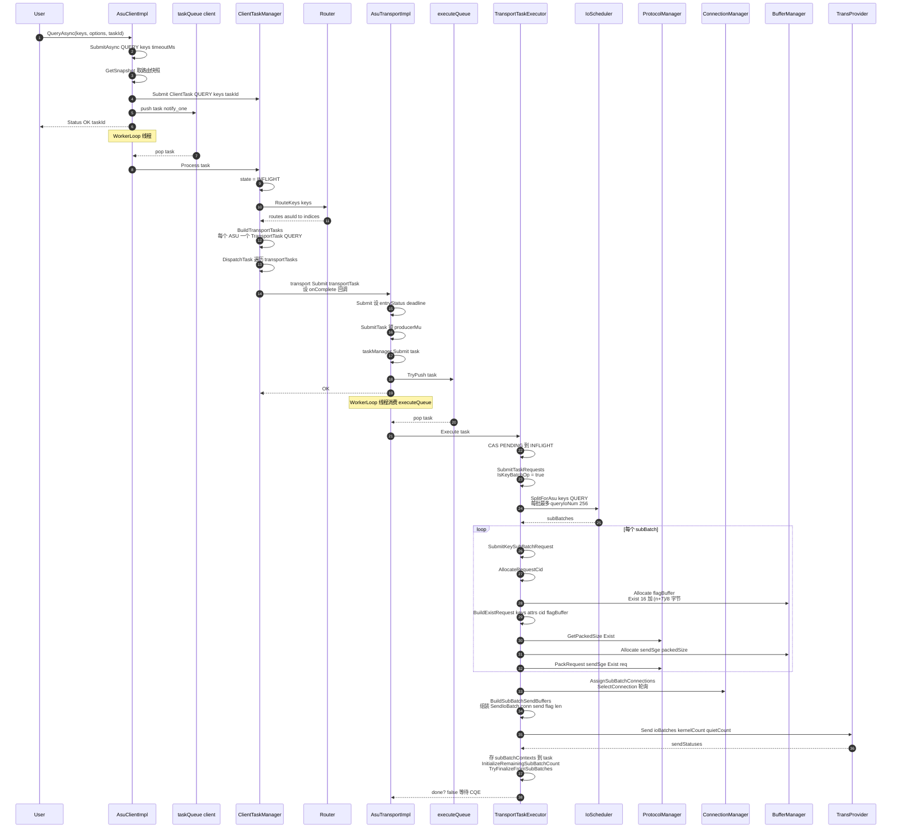

### 3.1 Query 响应轮询与回调

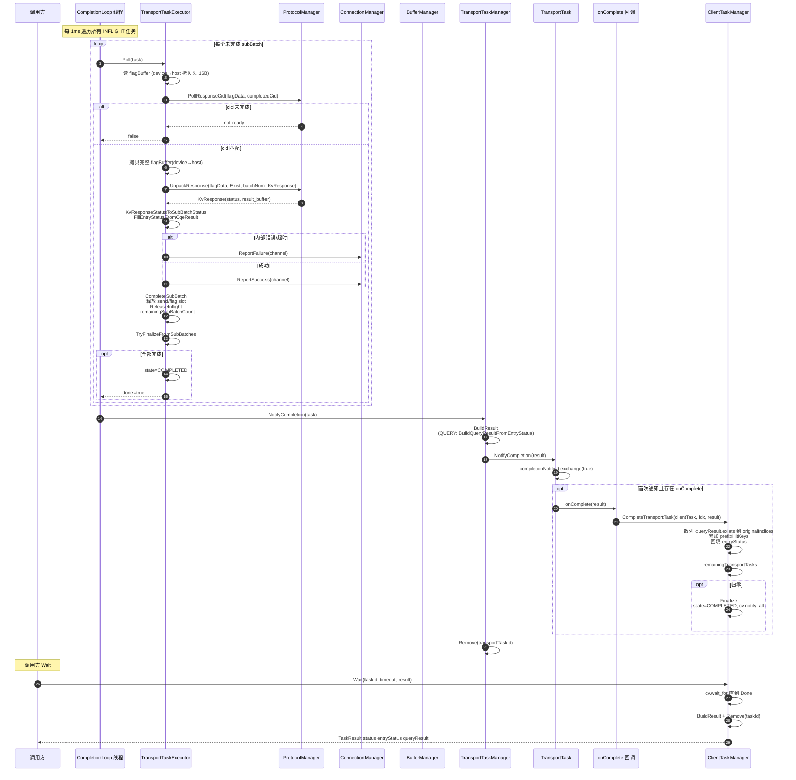

### 3.2 Transport 内部 Query 处理时序图

聚焦 Transport 层内部：从 `Submit` 入队到 `Execute` 下发再到 `Poll` 完成回调，不涉及 Client/Router。

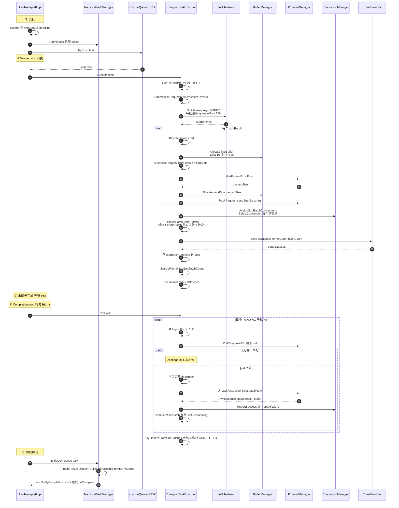

## 4. Load / Store 流程时序图

Load/Store 与 Query 的整体骨架一致，差异在于：

1. 入口是 `LoadAsync/StoreAsync` → `SubmitAsync(entries)`
2. 路由用 entry 的 key 做路由：`ExtractEntryKeys(entries)` → `RouteKeys`
3. Transport 侧走 **entry batch 分支**（`IsEntryBatchOp`），且 `LOAD→BATCH_LOAD`、`STORE→BATCH_STORE`
4. 子批次每批最多 `asuBatchLoadIoNum(110)` / `asuBatchStoreIoNum(110)` 个 entry
5. 需要解析每个 entry 的 MR key（`ResolveSqeMrKeys`）

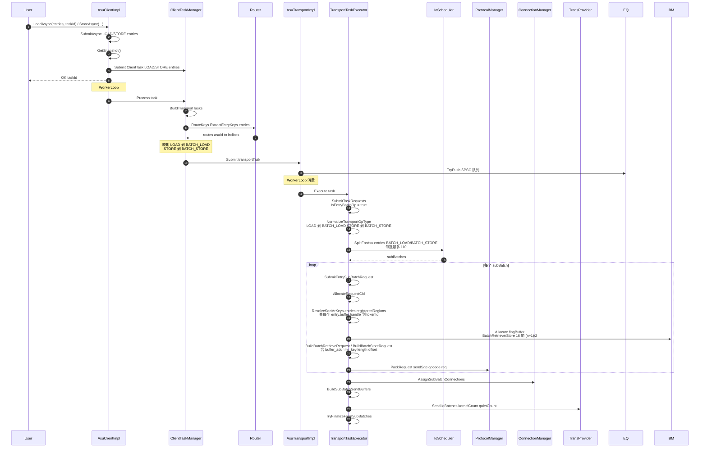

> Load/Store 的响应轮询与回调路径与 Query 完全相同（见 3.1），唯一区别是 `BuildResult` 中 `task.opType != QUERY` 时 `result.queryResult.reset()`，不返回 exists 列表，而是按 entry 回填 `entryStatus`。

### 4.1 Transport 内部 Load/Store 处理时序图

聚焦 Transport 层内部：与 3.2 结构一致，差异在 entry batch 分支——多一步 `ResolveSqeMrKeys`，子批次上限 110，请求对象为 `KvBatchRetrieveRequest` / `KvBatchStoreRequest`。

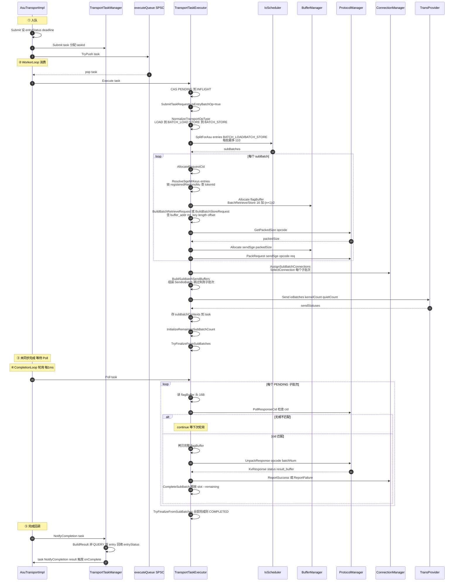

## 5. Transport 侧处理详解

### 5.1 双线程模型

`AsuTransportImpl` 采用生产者-消费者 + 轮询的双线程模型（见 [asu\_transport\_impl.h#L95](../trans/src/asu_transport_impl.h#L95-L98)）：

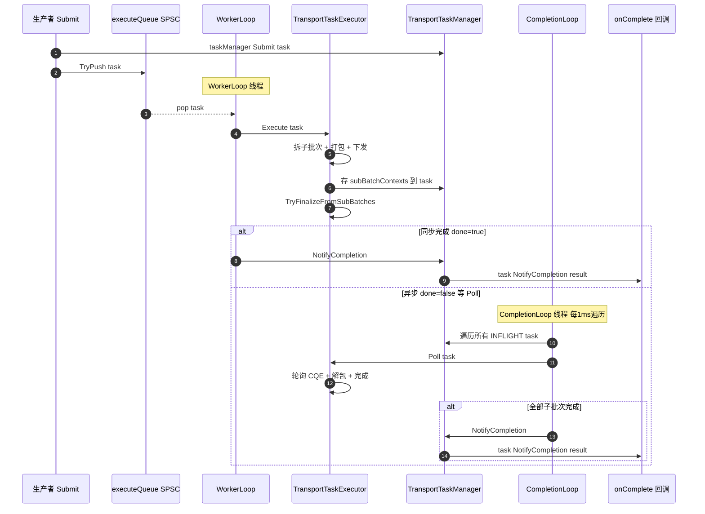

- **WorkerLoop**（[asu\_transport\_impl.cpp#L435](../trans/src/asu_transport_impl.cpp#L435-L441)）：从 SPSC 环形队列消费任务，调用 `Execute`。若 `Execute` 返回 true（例如全部子批次在 build 阶段就失败、无需下发），立即 `NotifyCompletion`。
- **CompletionLoop**（[asu\_transport\_impl.cpp#L443](../trans/src/asu_transport_impl.cpp#L443-L451)）：每 1ms 遍历 `taskManager_` 中所有任务，对 INFLIGHT 任务调用 `Poll` 轮询 flag buffer 中的 CQE，完成后 `NotifyCompletion`。

### 5.2 Execute 执行管线（重点）

`TransportTaskExecutor::Execute`（[transport\_task\_executor.cpp#L172](../trans/src/transport_task_executor.cpp#L172-L221)）是 Transport 侧的核心，分四个阶段：

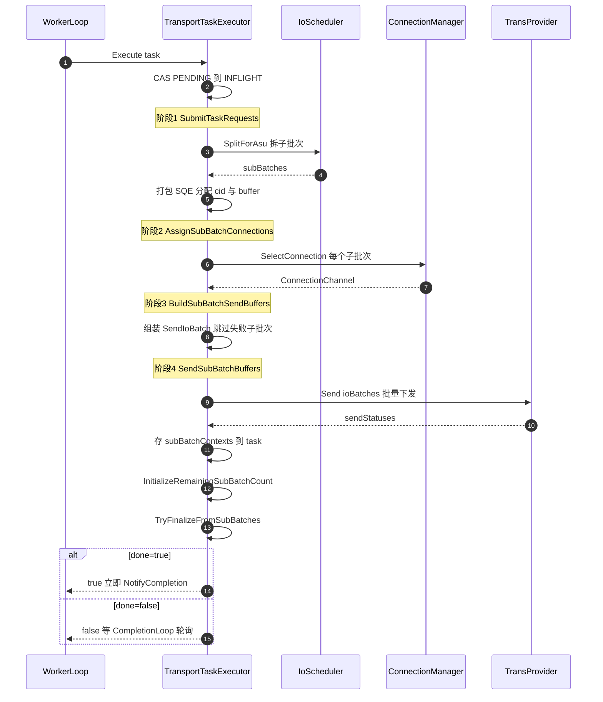

#### 阶段 1：SubmitTaskRequests（[asu\_submit\_flow.cpp#L52](../trans/src/asu_submit_flow.cpp#L52-L112)）

按操作类型分三支：

- **EntryBatch 分支**（LOAD/STORE/BATCH\_LOAD/BATCH\_STORE）：`NormalizeTransportOpType` → `ioScheduler_.SplitForAsu(entries, opType)` → 对每个子批次 `SubmitEntrySubBatchRequest`
- **KeyBatch 分支**（QUERY/DELETE）：`ioScheduler_.SplitForAsu(keys, opType)` → `SubmitKeySubBatchRequest`
- **KeepAlive 分支**：`SubmitKeepAliveRequest`

子批次大小（[io\_scheduler.cpp#L80](../trans/src/io_scheduler.cpp#L80-L90)）：

| opType       | 子批次上限                      |
| ------------ | -------------------------- |
| BATCH\_LOAD  | `asuBatchLoadIoNum` (110)  |
| BATCH\_STORE | `asuBatchStoreIoNum` (110) |
| DELETE       | `asuDeleteIoNum` (254)     |
| QUERY        | `asuQueryIoNum` (256)      |

#### 子批次请求构建（[sqe\_request.cpp](../trans/src/sqe_request.cpp)）

`SubmitKeySubBatchRequest`（Query）/`SubmitEntrySubBatchRequest`（Load/Store）的共同步骤：

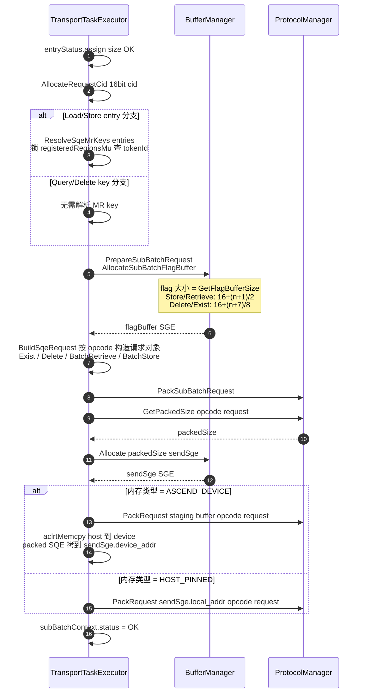

flag buffer 大小由 `GetFlagBufferSize`（[sqe\_request.cpp#L87](../trans/src/sqe_request.cpp#L87-L96)）决定：

- BatchStore/BatchRetrieve：`16 + (n+1)/2`（每 entry 半字节状态位）
- Delete/Exist：`16 + (n+7)/8`（每 entry 1 bit）
- 其他：`16 + 1`

SQE 请求对象对应关系：

| TransportOpType | KvOpcode            | 请求类                      | flag buffer 算法 |
| --------------- | ------------------- | ------------------------ | -------------- |
| QUERY           | Exist(0xC)          | `KvExistRequest`         | `(n+7)/8`      |
| BATCH\_LOAD     | BatchRetrieve(0x46) | `KvBatchRetrieveRequest` | `(n+1)/2`      |
| BATCH\_STORE    | BatchStore(0x45)    | `KvBatchStoreRequest`    | `(n+1)/2`      |
| DELETE          | Delete(0x8)         | `KvDeleteRequest`        | `(n+7)/8`      |

#### 阶段 2-3：连接分配与 buffer 组装

`AssignSubBatchConnections`（[transport\_task\_executor.cpp#L148](../trans/src/transport_task_executor.cpp#L148-L170)）：对每个未失败的子批次，`connManager_->SelectConnection()` 选一条 channel；选不到则该子批次直接 COMPLETED + 失败。

连接组、channel cache、路由选择、错误计数和后台恢复的内部设计参见 [`connection_manager_design.md`](connection_manager_design.md)。本节只描述它在端到端 IO 流程中的调用位置。

`BuildSubBatchSendBuffers`（[asu\_submit\_flow.cpp#L114](../trans/src/asu_submit_flow.cpp#L114-L165)）：遍历子批次，跳过已失败或 buffer 未就绪的，把就绪的组装成 `TransProvider::SendIoBatch{connectionHandle, sendBuffer, flagBuffer, len}`。

#### 阶段 4：Send（[asu\_submit\_flow.cpp#L167](../trans/src/asu_submit_flow.cpp#L167-L204)）

调用 `transProvider_->Send(ioBatches, kernelCount, quietCount)` 一次性批量下发所有子批次。底层 provider（AICPU/AIV/Fake）负责实际硬件下发，返回逐个 `Status`。失败的子批次置 COMPLETED 并 `ReportFailure(channel)`。

### 5.3 Poll 轮询与 CQE 解包（[transport\_task\_executor.cpp#L223](../trans/src/transport_task_executor.cpp#L223-L334)）

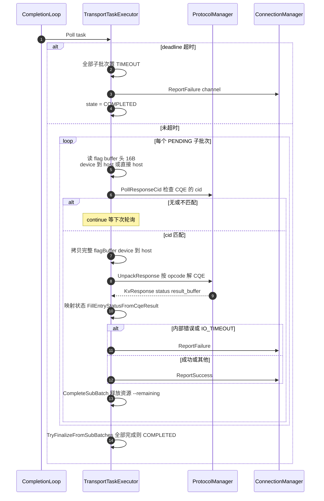

关键点：

- **cid 匹配机制**：每个子批次有唯一 16bit `cid`，下发后写进 SQE；ASU 硬件完成时把同一 `cid` 写进 flag buffer 头部 CQE。Poll 通过 `PollResponseCid` 比对 `completedCid == subBatchContext.cid` 判断该子批次是否完成。
- **设备内存处理**：flag buffer 若为 `ASCEND_DEVICE`，需先 `aclrtMemcpy` 拷 16B 头判断 cid，匹配后再拷完整 buffer 解包（避免每次全量拷贝）。
- **超时**：`task->deadline` 由 `Submit` 时按 `config_.timeoutMs` 计算，Poll 中检测到超时则把所有 PENDING 子批次置 `TIMEOUT`。
- **查询结果特殊处理**：`ASU_CQE_CHECK_RESULT_BUFFER` 对 Query 是"需检查 result buffer"的正常语义，会被转成 `Status::OK()` 而非错误（[transport\_task\_executor.cpp#L315](../trans/src/transport_task_executor.cpp#L315-L320)）。

### 5.4 完成与回调链

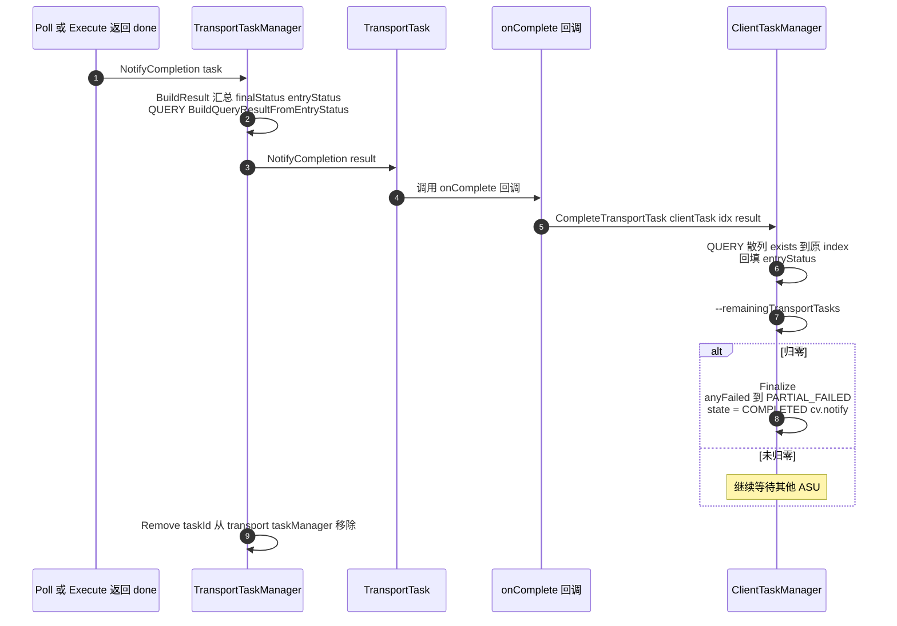

### 5.5 资源回收

- `ReleaseSubBatchContext`（[transport\_task\_executor.cpp#L78](../trans/src/transport_task_executor.cpp#L78-L104)）：归还 send buffer slot、flag buffer slot、`channel->ReleaseInflight()`。
- 在 `Execute`/`Poll`/`Cancel` 各路径都会对已完成或失败的子批次调用 `ReleaseSubBatchResources`，避免 slot 泄漏。
- `Cancel`（[transport\_task\_executor.cpp#L124](../trans/src/transport_task_executor.cpp#L124-L139)）：把所有 entry 置失败状态，释放全部子批次资源，置 COMPLETED。注意"Best-effort cancellation, does not interrupt underlying UB/RoCE IO"（[asu\_transport.h#L114](../trans/include/asu_transport/asu_transport.h#L114)）——只是放弃等待，不中断已下发的硬件 IO。

## 6. 两条流水线对比汇总

| 维度              | Query                       | Load / Store                           |
| --------------- | --------------------------- | -------------------------------------- |
| Client 入口       | `QueryAsync(keys, options)` | `LoadAsync/StoreAsync(entries)`        |
| ClientOpType    | QUERY                       | LOAD / STORE                           |
| 路由输入            | keys                        | `ExtractEntryKeys(entries)`            |
| TransportOpType | QUERY                       | BATCH\_LOAD / BATCH\_STORE             |
| KvOpcode        | Exist(0xC)                  | BatchRetrieve(0x46) / BatchStore(0x45) |
| 子批次上限           | 256 (queryIoNum)            | 110 (asuBatchLoad/StoreIoNum)          |
| flag buffer 算法  | `16+(n+7)/8`                | `16+(n+1)/2`                           |
| MR key 解析       | 不需要（无 entry buffer）         | `ResolveSqeMrKeys` 查 tokenId           |
| 结果              | `queryResult.exists`（0/1）   | `entryStatus`（按 entry）                 |
| 完成回填            | 散列 exists 到 originalIndices | 散列 entryStatus 到 originalIndices       |

## 7. 端到端数据流总览

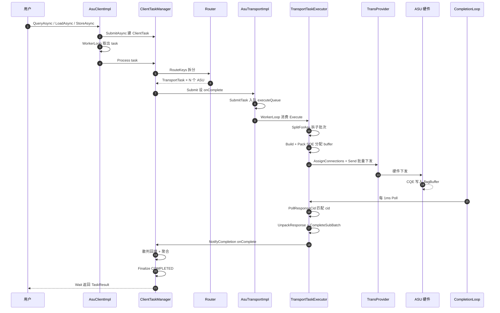
