# ASU Transport 内部架构与流程

本文档聚焦 Transport 层（`AsuTransportImpl`）的内部实现，涵盖初始化、TransportTask 管理、连接管理、IO 流程、Buffer 管理与 Provider 抽象。所有源码路径均相对于 `ucm/transport/kv/asu`。

## 1. 架构总览

`AsuTransportImpl` 是单个 ASU 的数据面实现，对外提供 `Submit/Cancel/RegisterRegions` 等接口，内部由以下组件协作：

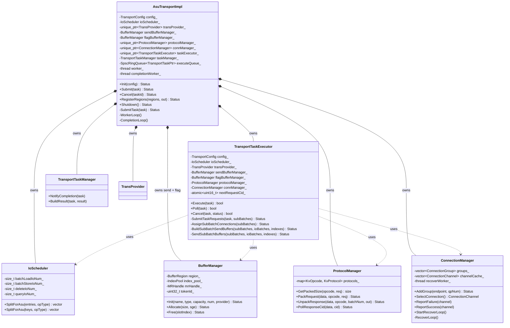
```mermaid
classDiagram
    class AsuTransportImpl {
        -TransportConfig config_
        -IoScheduler ioScheduler_
        -unique_ptr~TransProvider~ transProvider_
        -BufferManager sendBufferManager_
        -BufferManager flagBufferManager_
        -unique_ptr~ProtocolManager~ protocolManager_
        -unique_ptr~ConnectionManager~ connManager_
        -unique_ptr~TransportTaskExecutor~ taskExecutor_
        -TransportTaskManager taskManager_
        -SpscRingQueue~TransportTaskPtr~ executeQueue_
        -thread worker_
        -thread completionWorker_
        +Init(config) Status
        +Submit(task) Status
        +Cancel(taskId) Status
        +RegisterRegions(regions, out) Status
        +Shutdown() Status
        -SubmitTask(task) Status
        -WorkerLoop()
        -CompletionLoop()
    }

    class TransportTaskExecutor {
        -TransportConfig config_
        -IoScheduler ioScheduler_
        -TransProvider transProvider_
        -BufferManager sendBufferManager_
        -BufferManager flagBufferManager_
        -ProtocolManager protocolManager_
        -ConnectionManager connManager_
        -atomic~uint16_t~ nextRequestCid_
        +Execute(task) bool
        +Poll(task) bool
        +Cancel(task, status) bool
        -SubmitTaskRequests(task, subBatches) Status
        -AssignSubBatchConnections(subBatches) Status
        -BuildSubBatchSendBuffers(subBatches, ioBatches, indexes) Status
        -SendSubBatchBuffers(subBatches, ioBatches, indexes) Status
    }

    class TransportTaskManager {
        +NotifyCompletion(task)
        +BuildResult(task, result)
    }

    class ConnectionManager {
        -vector~ConnectionGroup~ groups_
        -vector~ConnectionChannel~ channelCache_
        -thread recoverWorker_
        +AddGroup(endpoint, qpNum) Status
        +SelectConnection() ConnectionChannel
        +ReportFailure(channel)
        +ReportSuccess(channel)
        +StartRecoverLoop()
        -RecoverLoop()
    }

    class BufferManager {
        -BufferRegion region_
        -IndexPool index_pool_
        -MRHandle mrHandle_
        -uint32_t tokenId_
        +Init(name, type, capacity, num, provider) Status
        +Allocate(size, sge) Status
        +Free(slotIndex) Status
    }

    class IoScheduler {
        -size_t batchLoadIoNum_
        -size_t batchStoreIoNum_
        -size_t deleteIoNum_
        -size_t queryIoNum_
        +SplitForAsu(entries, opType) vector
        +SplitForAsu(keys, opType) vector
    }

    class ProtocolManager {
        -map~KvOpcode, KvProtocol~ protocols_
        +GetPackedSize(opcode, req) size
        +PackRequest(data, opcode, req) Status
        +UnpackResponse(data, opcode, batchNum, out) Status
        +PollResponseCid(data, cid) Status
    }

    AsuTransportImpl *-- TransportTaskExecutor : owns
    AsuTransportImpl *-- ConnectionManager : owns
    AsuTransportImpl *-- BufferManager : owns send + flag
    AsuTransportImpl *-- ProtocolManager : owns
    AsuTransportImpl *-- IoScheduler : owns
    AsuTransportImpl *-- TransportTaskManager : owns
    AsuTransportImpl *-- TransProvider : owns
    TransportTaskExecutor ..> IoScheduler : uses
    TransportTaskExecutor ..> BufferManager : uses
    TransportTaskExecutor ..> ProtocolManager : uses
    TransportTaskExecutor ..> ConnectionManager : uses
```

## 2. Provider 继承体系

`TransProvider` 是底层硬件抽象，按 `providerType` 选择不同实现：

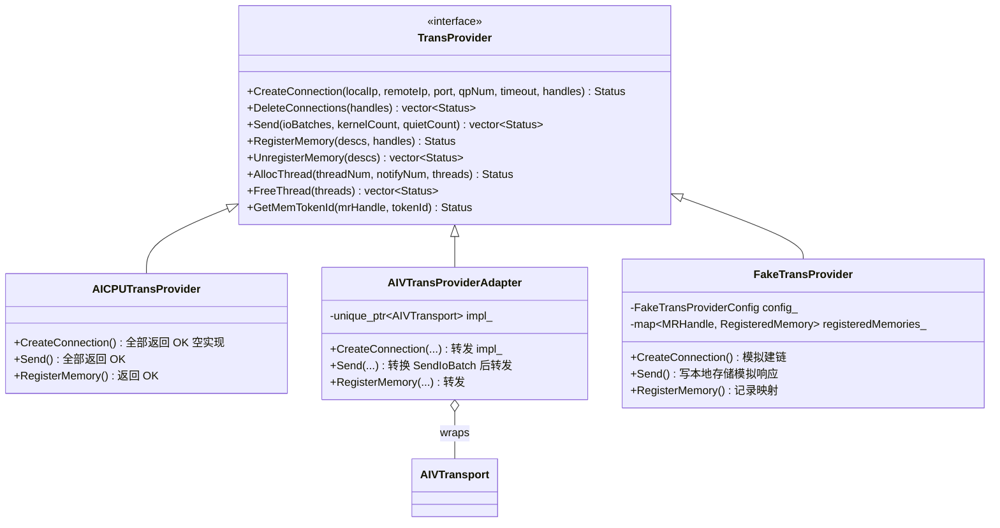
```mermaid
classDiagram
    class TransProvider {
        <<interface>>
        +CreateConnection(localIp, remoteIp, port, qpNum, timeout, handles) Status
        +DeleteConnections(handles) vector~Status~
        +Send(ioBatches, kernelCount, quietCount) vector~Status~
        +RegisterMemory(descs, handles) Status
        +UnregisterMemory(descs) vector~Status~
        +AllocThread(threadNum, notifyNum, threads) Status
        +FreeThread(threads) vector~Status~
        +GetMemTokenId(mrHandle, tokenId) Status
    }

    class AICPUTransProvider {
        +CreateConnection() 全部返回 OK 空实现
        +Send() 全部返回 OK
        +RegisterMemory() 返回 OK
    }

    class AIVTransProviderAdapter {
        -unique_ptr~AIVTransport~ impl_
        +CreateConnection(...) 转发 impl_
        +Send(...) 转换 SendIoBatch 后转发
        +RegisterMemory(...) 转发
    }

    class FakeTransProvider {
        -FakeTransProviderConfig config_
        -map~MRHandle, RegisteredMemory~ registeredMemories_
        +CreateConnection() 模拟建链
        +Send() 写本地存储模拟响应
        +RegisterMemory() 记录映射
    }

    TransProvider <|-- AICPUTransProvider
    TransProvider <|-- AIVTransProviderAdapter
    TransProvider <|-- FakeTransProvider
    AIVTransProviderAdapter o-- AIVTransport : wraps
```

> 三种 provider 的差异：
> - **AICPUTransProvider**（[aicpu\_trans\_provider.h](../trans/src/aicpu_trans_provider.h)）：纯 stub，所有接口返回 OK，用于 AICPU 模式（连接/发送均为 no-op）。
> - **AIVTransProviderAdapter**（[aiv\_trans\_provider.h](../trans/src/aiv_trans_provider.h)）：适配器，包装 `AIVTransport` 实现，把 ASU 的 `SendIoBatch` 转换成 `AIVTransport::SendIoBatch` 后转发。走 HCCP/UB 协议。
> - **FakeTransProvider**（[fake\_trans\_provider.h](../trans/src/fake_trans_provider.h)）：测试用，模拟建链与本地存储响应。

## 3. 初始化流程

### 3.1 初始化时序图

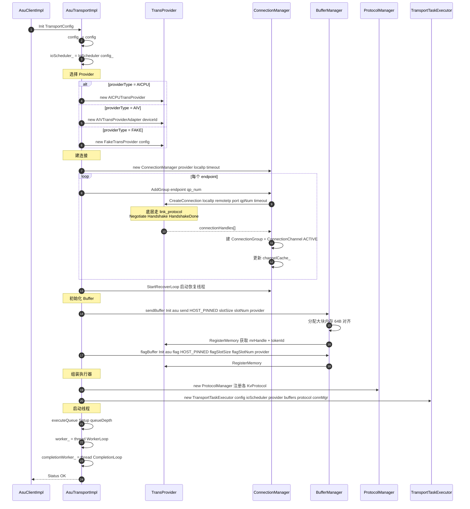
```mermaid
sequenceDiagram
    autonumber
    participant C as AsuClientImpl
    participant T as AsuTransportImpl
    participant TP as TransProvider
    participant CM as ConnectionManager
    participant BM as BufferManager
    participant PM as ProtocolManager
    participant TE as TransportTaskExecutor

    C->>T: Init TransportConfig
    T->>T: config_ = config
    T->>T: ioScheduler_ = IoScheduler config_

    Note over T: 选择 Provider
    alt providerType = AICPU
        T->>TP: new AICPUTransProvider
    else providerType = AIV
        T->>TP: new AIVTransProviderAdapter deviceId
    else providerType = FAKE
        T->>TP: new FakeTransProvider config
    end

    Note over T: 建连接
    T->>CM: new ConnectionManager provider localIp timeout
    loop 每个 endpoint
        T->>CM: AddGroup endpoint qp_num
        CM->>TP: CreateConnection localIp remoteIp port qpNum timeout
        Note over TP: 底层走 link_protocol<br/>Negotiate Handshake HandshakeDone
        TP-->>CM: connectionHandles[]
        CM->>CM: 建 ConnectionGroup + ConnectionChannel ACTIVE
        CM->>CM: 更新 channelCache_
    end
    T->>CM: StartRecoverLoop 启动恢复线程

    Note over T: 初始化 Buffer
    T->>BM: sendBuffer Init asu send HOST_PINNED slotSize slotNum provider
    BM->>BM: 分配大块内存 64B 对齐
    BM->>TP: RegisterMemory 获取 mrHandle + tokenId
    T->>BM: flagBuffer Init asu flag HOST_PINNED flagSlotSize flagSlotNum provider
    BM->>TP: RegisterMemory

    Note over T: 组装执行器
    T->>PM: new ProtocolManager 注册各 KvProtocol
    T->>TE: new TransportTaskExecutor config ioScheduler provider buffers protocol connMgr

    Note over T: 启动线程
    T->>T: executeQueue Setup queueDepth
    T->>T: worker_ = thread WorkerLoop
    T->>T: completionWorker_ = thread CompletionLoop
    T-->>C: Status OK
```

### 3.2 Init 阶段流程图

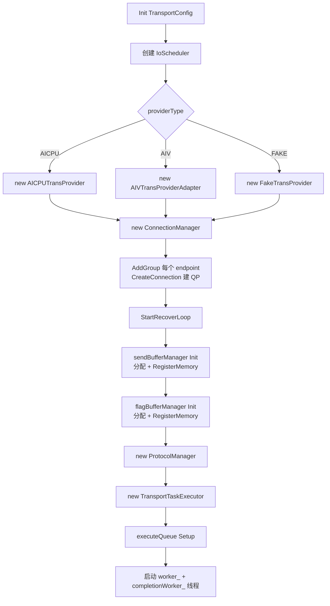
```mermaid
flowchart TD
    A[Init TransportConfig] --> B[创建 IoScheduler]
    B --> C{providerType}
    C -- AICPU --> D1[new AICPUTransProvider]
    C -- AIV --> D2[new AIVTransProviderAdapter]
    C -- FAKE --> D3[new FakeTransProvider]
    D1 --> E[new ConnectionManager]
    D2 --> E
    D3 --> E
    E --> F[AddGroup 每个 endpoint<br/>CreateConnection 建 QP]
    F --> G[StartRecoverLoop]
    G --> H[sendBufferManager Init<br/>分配 + RegisterMemory]
    H --> I[flagBufferManager Init<br/>分配 + RegisterMemory]
    I --> J[new ProtocolManager]
    J --> K[new TransportTaskExecutor]
    K --> L[executeQueue Setup]
    L --> M[启动 worker_ + completionWorker_ 线程]
```

## 4. TransportTask 管理

### 4.1 任务类关系与生命周期

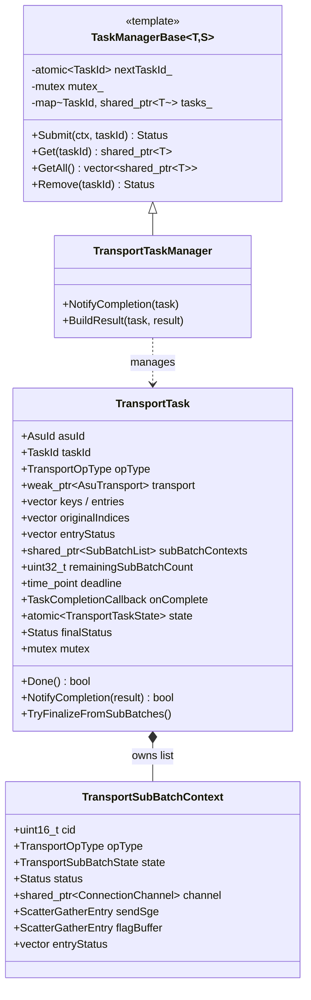
```mermaid
classDiagram
    class TaskManagerBase~T,S~ {
        <<template>>
        -atomic~TaskId~ nextTaskId_
        -mutex mutex_
        -map~TaskId, shared_ptr~T~~ tasks_
        +Submit(ctx, taskId) Status
        +Get(taskId) shared_ptr~T~
        +GetAll() vector~shared_ptr~T~~
        +Remove(taskId) Status
    }

    class TransportTaskManager {
        +NotifyCompletion(task)
        +BuildResult(task, result)
    }

    class TransportTask {
        +AsuId asuId
        +TaskId taskId
        +TransportOpType opType
        +weak_ptr~AsuTransport~ transport
        +vector keys / entries
        +vector originalIndices
        +vector entryStatus
        +shared_ptr~SubBatchList~ subBatchContexts
        +uint32_t remainingSubBatchCount
        +time_point deadline
        +TaskCompletionCallback onComplete
        +atomic~TransportTaskState~ state
        +Status finalStatus
        +mutex mutex
        +Done() bool
        +NotifyCompletion(result) bool
        +TryFinalizeFromSubBatches()
    }

    class TransportSubBatchContext {
        +uint16_t cid
        +TransportOpType opType
        +TransportSubBatchState state
        +Status status
        +shared_ptr~ConnectionChannel~ channel
        +ScatterGatherEntry sendSge
        +ScatterGatherEntry flagBuffer
        +vector entryStatus
    }

    TaskManagerBase <|-- TransportTaskManager
    TransportTaskManager ..> TransportTask : manages
    TransportTask *-- TransportSubBatchContext : owns list
```

### 4.2 任务状态机

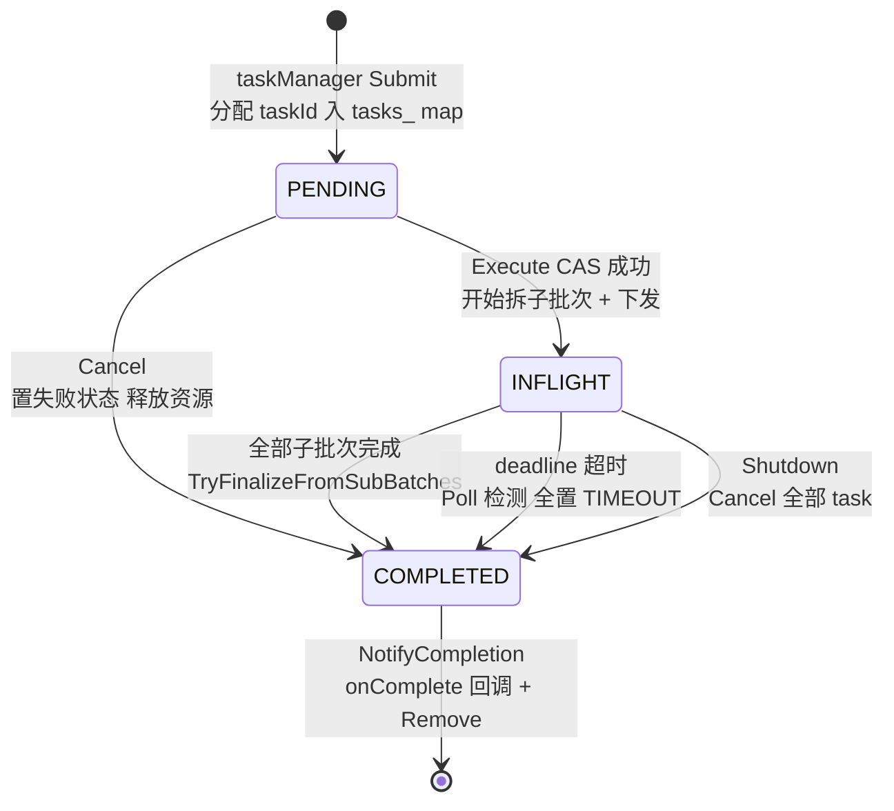
```mermaid
stateDiagram-v2
    [*] --> PENDING : taskManager Submit<br/>分配 taskId 入 tasks_ map
    PENDING --> INFLIGHT : Execute CAS 成功<br/>开始拆子批次 + 下发
    PENDING --> COMPLETED : Cancel<br/>置失败状态 释放资源
    INFLIGHT --> COMPLETED : 全部子批次完成<br/>TryFinalizeFromSubBatches
    INFLIGHT --> COMPLETED : deadline 超时<br/>Poll 检测 全置 TIMEOUT
    INFLIGHT --> COMPLETED : Shutdown<br/>Cancel 全部 task
    COMPLETED --> [*] : NotifyCompletion<br/>onComplete 回调 + Remove
```

### 4.3 子批次状态机

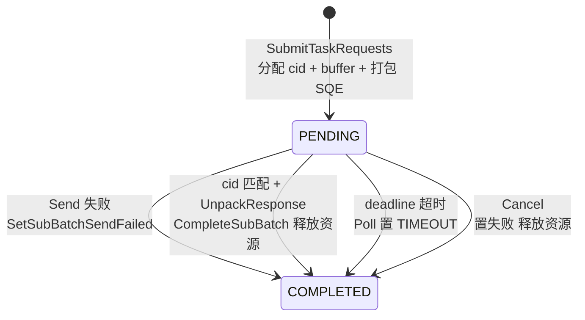
```mermaid
stateDiagram-v2
    [*] --> PENDING : SubmitTaskRequests<br/>分配 cid + buffer + 打包 SQE
    PENDING --> COMPLETED : Send 失败<br/>SetSubBatchSendFailed
    PENDING --> COMPLETED : cid 匹配 + UnpackResponse<br/>CompleteSubBatch 释放资源
    PENDING --> COMPLETED : deadline 超时<br/>Poll 置 TIMEOUT
    PENDING --> COMPLETED : Cancel<br/>置失败 释放资源
```

### 4.4 Task 管理操作时序图

`TaskManagerBase`（[task\_manager\_base.h](../common/task_manager_base.h)）是模板基类，`ClientTaskManager` 和 `TransportTaskManager` 都继承自它，提供线程安全的 `Submit/Get/GetAll/Remove`。

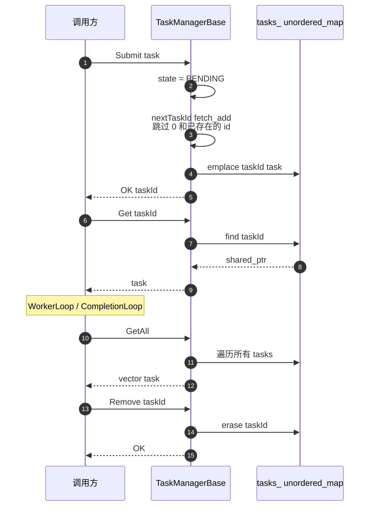
```mermaid
sequenceDiagram
    autonumber
    participant Caller as 调用方
    participant TM as TaskManagerBase
    participant Map as tasks_ unordered_map

    Caller->>TM: Submit task
    TM->>TM: state = PENDING
    TM->>TM: nextTaskId fetch_add<br/>跳过 0 和已存在的 id
    TM->>Map: emplace taskId task
    TM-->>Caller: OK taskId

    Caller->>TM: Get taskId
    TM->>Map: find taskId
    Map-->>TM: shared_ptr
    TM-->>Caller: task

    Note over Caller: WorkerLoop / CompletionLoop
    Caller->>TM: GetAll
    TM->>Map: 遍历所有 tasks
    TM-->>Caller: vector task

    Caller->>TM: Remove taskId
    TM->>Map: erase taskId
    TM-->>Caller: OK
```

### 4.5 完成回调时序图

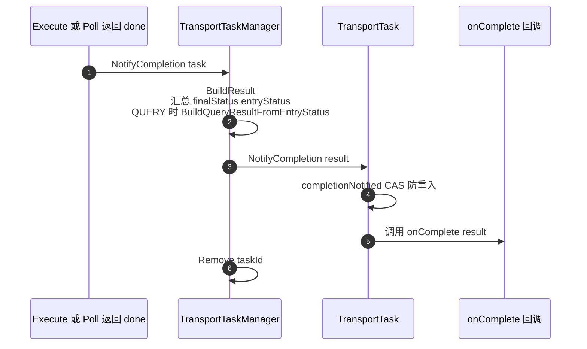
```mermaid
sequenceDiagram
    autonumber
    participant Src as Execute 或 Poll 返回 done
    participant TTM as TransportTaskManager
    participant Task as TransportTask
    participant CB as onComplete 回调

    Src->>TTM: NotifyCompletion task
    TTM->>TTM: BuildResult<br/>汇总 finalStatus entryStatus<br/>QUERY 时 BuildQueryResultFromEntryStatus
    TTM->>Task: NotifyCompletion result
    Task->>Task: completionNotified CAS 防重入
    Task->>CB: 调用 onComplete result
    TTM->>TTM: Remove taskId
```

> `BuildResult`（[transport\_task\_manager.cpp#L64](../trans/src/transport_task_manager.cpp#L64-L82)）：先取 `task.finalStatus` 和 `task.entryStatus`，再按子批次顺序覆盖 `entryStatus`；QUERY 时用 `BuildQueryResultFromEntryStatus` 构造 `queryResult.exists`。

## 5. 连接管理

### 5.1 连接类结构

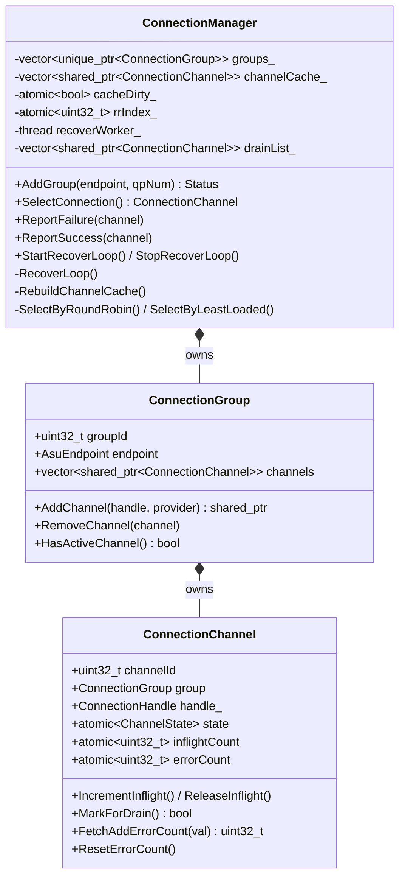
```mermaid
classDiagram
    class ConnectionManager {
        -vector~unique_ptr~ConnectionGroup~~ groups_
        -vector~shared_ptr~ConnectionChannel~~ channelCache_
        -atomic~bool~ cacheDirty_
        -atomic~uint32_t~ rrIndex_
        -thread recoverWorker_
        -vector~shared_ptr~ConnectionChannel~~ drainList_
        +AddGroup(endpoint, qpNum) Status
        +SelectConnection() ConnectionChannel
        +ReportFailure(channel)
        +ReportSuccess(channel)
        +StartRecoverLoop() / StopRecoverLoop()
        -RecoverLoop()
        -RebuildChannelCache()
        -SelectByRoundRobin() / SelectByLeastLoaded()
    }

    class ConnectionGroup {
        +uint32_t groupId
        +AsuEndpoint endpoint
        +vector~shared_ptr~ConnectionChannel~~ channels
        +AddChannel(handle, provider) shared_ptr
        +RemoveChannel(channel)
        +HasActiveChannel() bool
    }

    class ConnectionChannel {
        +uint32_t channelId
        +ConnectionGroup group
        +ConnectionHandle handle_
        +atomic~ChannelState~ state
        +atomic~uint32_t~ inflightCount
        +atomic~uint32_t~ errorCount
        +IncrementInflight() / ReleaseInflight()
        +MarkForDrain() bool
        +FetchAddErrorCount(val) uint32_t
        +ResetErrorCount()
    }

    ConnectionManager *-- ConnectionGroup : owns
    ConnectionGroup *-- ConnectionChannel : owns
```

### 5.2 连接建立时序图（Init 阶段）

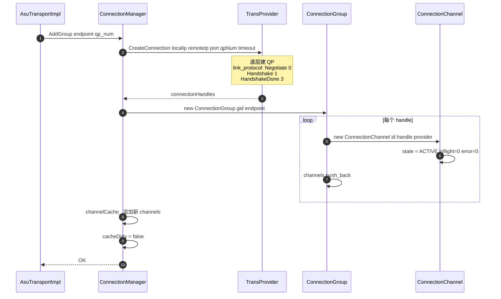
```mermaid
sequenceDiagram
    autonumber
    participant T as AsuTransportImpl
    participant CM as ConnectionManager
    participant TP as TransProvider
    participant G as ConnectionGroup
    participant CH as ConnectionChannel

    T->>CM: AddGroup endpoint qp_num
    CM->>TP: CreateConnection localIp remoteIp port qpNum timeout
    Note over TP: 底层建 QP<br/>link_protocol: Negotiate 0<br/>Handshake 1<br/>HandshakeDone 3
    TP-->>CM: connectionHandles
    CM->>G: new ConnectionGroup gid endpoint
    loop 每个 handle
        G->>CH: new ConnectionChannel id handle provider
        CH->>CH: state = ACTIVE inflight=0 error=0
        G->>G: channels push_back
    end
    CM->>CM: channelCache_ 追加新 channels
    CM->>CM: cacheDirty = false
    CM-->>T: OK
```

### 5.3 连接选择时序图

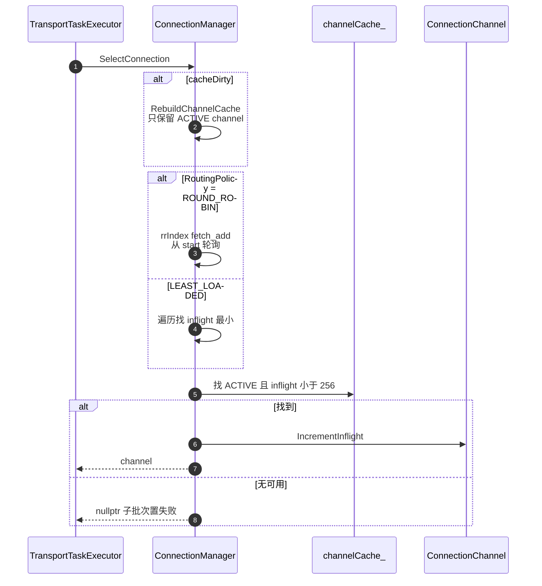
```mermaid
sequenceDiagram
    autonumber
    participant TE as TransportTaskExecutor
    participant CM as ConnectionManager
    participant Cache as channelCache_
    participant CH as ConnectionChannel

    TE->>CM: SelectConnection
    alt cacheDirty
        CM->>CM: RebuildChannelCache<br/>只保留 ACTIVE channel
    end
    alt RoutingPolicy = ROUND_ROBIN
        CM->>CM: rrIndex fetch_add<br/>从 start 轮询
    else LEAST_LOADED
        CM->>CM: 遍历找 inflight 最小
    end
    CM->>Cache: 找 ACTIVE 且 inflight 小于 256
    alt 找到
        CM->>CH: IncrementInflight
        CM-->>TE: channel
    else 无可用
        CM-->>TE: nullptr 子批次置失败
    end
```

### 5.4 故障上报与恢复时序图

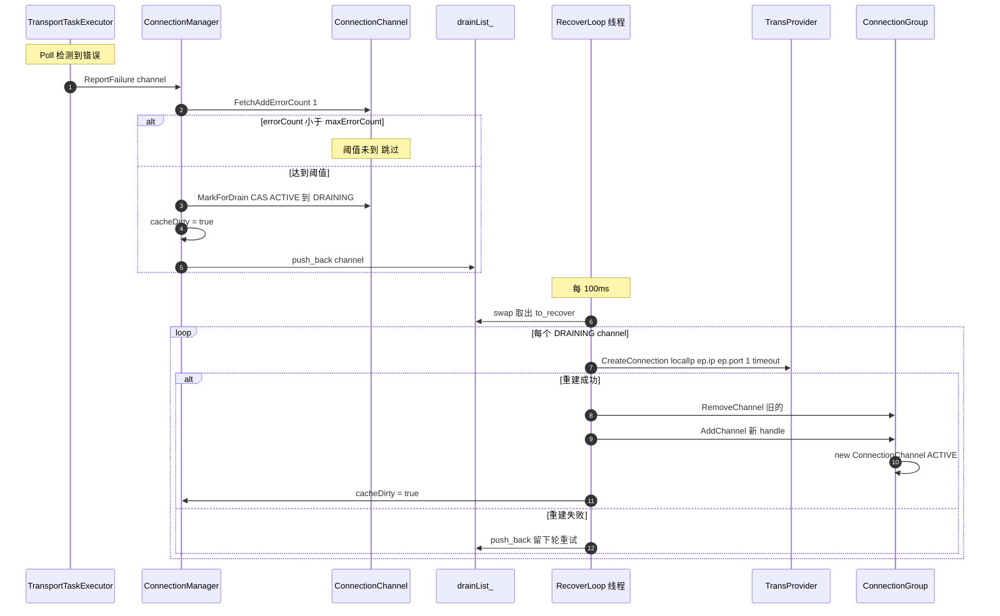
```mermaid
sequenceDiagram
    autonumber
    participant TE as TransportTaskExecutor
    participant CM as ConnectionManager
    participant CH as ConnectionChannel
    participant DL as drainList_
    participant RL as RecoverLoop 线程
    participant TP as TransProvider
    participant G as ConnectionGroup

    Note over TE: Poll 检测到错误
    TE->>CM: ReportFailure channel
    CM->>CH: FetchAddErrorCount 1
    alt errorCount 小于 maxErrorCount
        Note over CH: 阈值未到 跳过
    else 达到阈值
        CM->>CH: MarkForDrain CAS ACTIVE 到 DRAINING
        CM->>CM: cacheDirty = true
        CM->>DL: push_back channel
    end

    Note over RL: 每 100ms
    RL->>DL: swap 取出 to_recover
    loop 每个 DRAINING channel
        RL->>TP: CreateConnection localIp ep.ip ep.port 1 timeout
        alt 重建成功
            RL->>G: RemoveChannel 旧的
            RL->>G: AddChannel 新 handle
            G->>G: new ConnectionChannel ACTIVE
            RL->>CM: cacheDirty = true
        else 重建失败
            RL->>DL: push_back 留下轮重试
        end
    end
```

### 5.5 ConnectionChannel 状态机

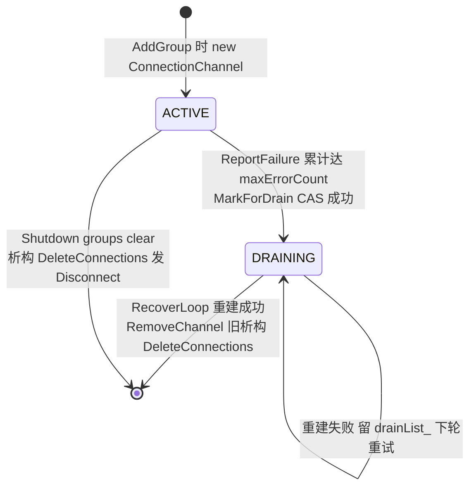
```mermaid
stateDiagram-v2
    [*] --> ACTIVE : AddGroup 时 new ConnectionChannel
    ACTIVE --> DRAINING : ReportFailure 累计达 maxErrorCount<br/>MarkForDrain CAS 成功
    DRAINING --> [*] : RecoverLoop 重建成功<br/>RemoveChannel 旧析构 DeleteConnections
    DRAINING --> DRAINING : 重建失败 留 drainList_ 下轮重试
    ACTIVE --> [*] : Shutdown groups clear<br/>析构 DeleteConnections 发 Disconnect
```

### 5.6 链路协议报文（link_protocol）

[link\_protocol.h](../trans/src/link_protocol.h) 定义了连接握手的报文格式，实际交换由 `TransProvider::CreateConnection` 在底层完成：

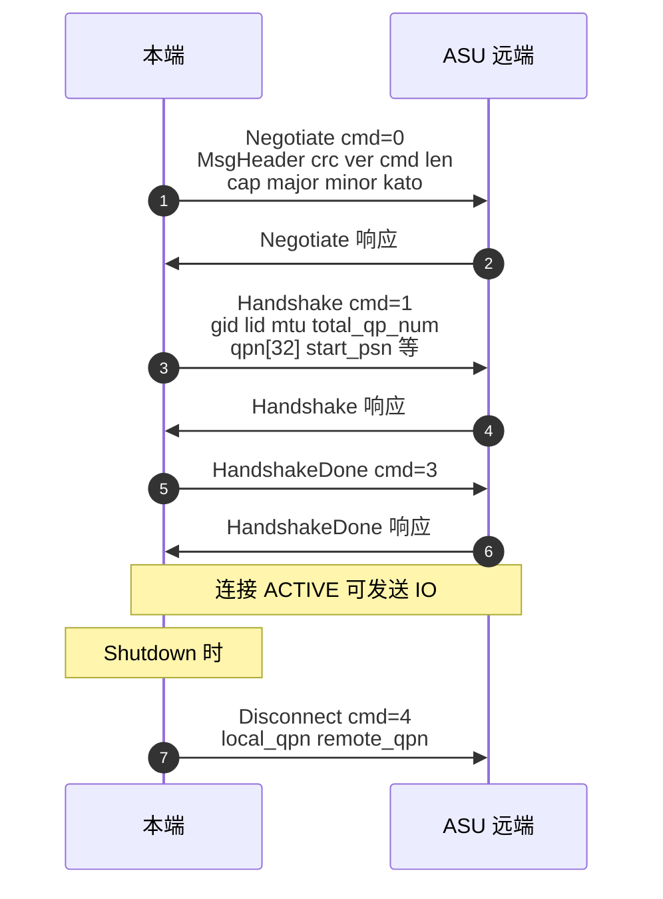
```mermaid
sequenceDiagram
    autonumber
    participant Local as 本端
    participant Remote as ASU 远端

    Local->>Remote: Negotiate cmd=0<br/>MsgHeader crc ver cmd len<br/>cap major minor kato
    Remote->>Local: Negotiate 响应

    Local->>Remote: Handshake cmd=1<br/>gid lid mtu total_qp_num<br/>qpn[32] start_psn 等
    Remote->>Local: Handshake 响应

    Local->>Remote: HandshakeDone cmd=3
    Remote->>Local: HandshakeDone 响应
    Note over Local,Remote: 连接 ACTIVE 可发送 IO

    Note over Local: Shutdown 时
    Local->>Remote: Disconnect cmd=4<br/>local_qpn remote_qpn
```

> `MsgHeader`（16B）：`crc(4) + ver(1) + cmd(1) + pad(6) + len(4)`。报文类型见 `LinkProtocolCmd`：Negotiate=0, Handshake=1, HandshakeDone=3, Disconnect=4。

## 6. IO 流程：Submit 到完成

### 6.1 双线程模型

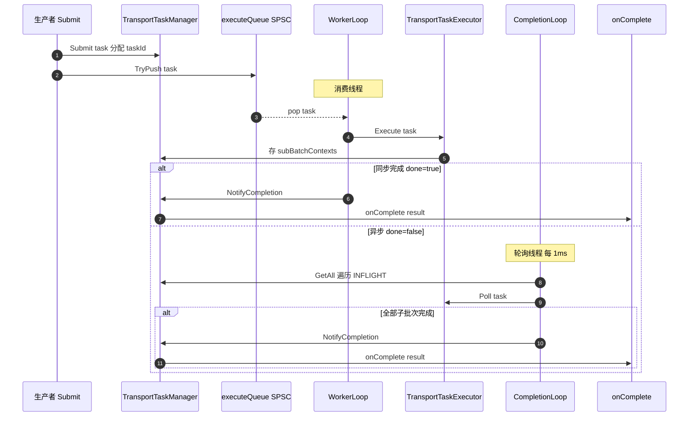
```mermaid
sequenceDiagram
    autonumber
    participant P as 生产者 Submit
    participant TM as TransportTaskManager
    participant EQ as executeQueue SPSC
    participant WL as WorkerLoop
    participant TE as TransportTaskExecutor
    participant CL as CompletionLoop
    participant CB as onComplete

    P->>TM: Submit task 分配 taskId
    P->>EQ: TryPush task
    Note over WL: 消费线程
    EQ-->>WL: pop task
    WL->>TE: Execute task
    TE->>TM: 存 subBatchContexts
    alt 同步完成 done=true
        WL->>TM: NotifyCompletion
        TM->>CB: onComplete result
    else 异步 done=false
        Note over CL: 轮询线程 每 1ms
        CL->>TM: GetAll 遍历 INFLIGHT
        CL->>TE: Poll task
        alt 全部子批次完成
            CL->>TM: NotifyCompletion
            TM->>CB: onComplete result
        end
    end
```

### 6.2 Submit 入队时序图

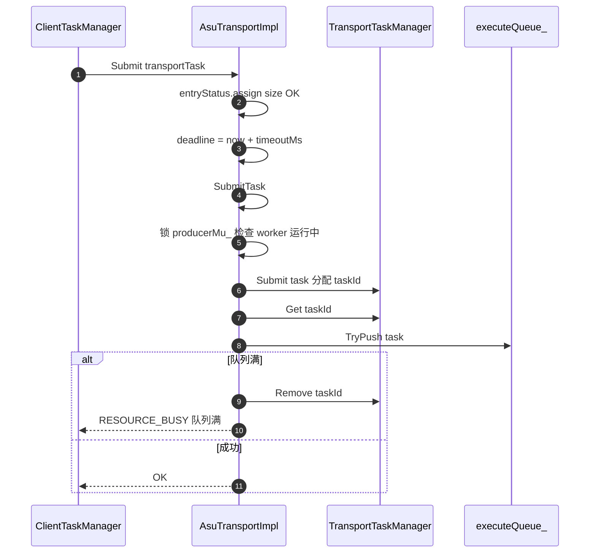
```mermaid
sequenceDiagram
    autonumber
    participant Caller as ClientTaskManager
    participant T as AsuTransportImpl
    participant TM as TransportTaskManager
    participant EQ as executeQueue_

    Caller->>T: Submit transportTask
    T->>T: entryStatus.assign size OK
    T->>T: deadline = now + timeoutMs
    T->>T: SubmitTask
    T->>T: 锁 producerMu_ 检查 worker 运行中
    T->>TM: Submit task 分配 taskId
    T->>TM: Get taskId
    T->>EQ: TryPush task
    alt 队列满
        T->>TM: Remove taskId
        T-->>Caller: RESOURCE_BUSY 队列满
    else 成功
        T-->>Caller: OK
    end
```

### 6.3 Execute 执行管线时序图

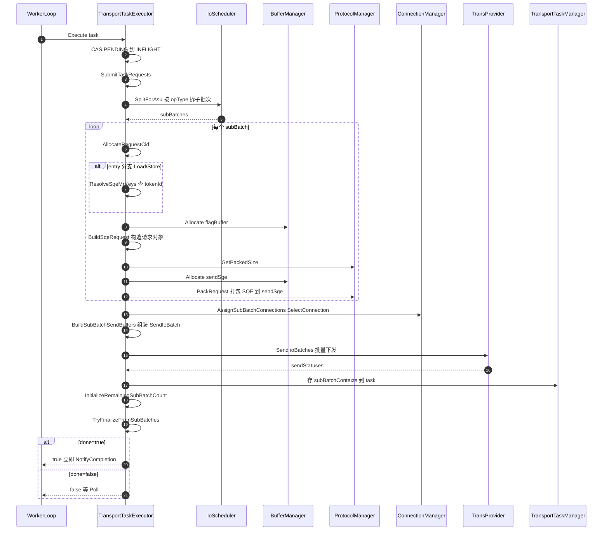
```mermaid
sequenceDiagram
    autonumber
    participant WL as WorkerLoop
    participant TE as TransportTaskExecutor
    participant IOS as IoScheduler
    participant BM as BufferManager
    participant PM as ProtocolManager
    participant CM as ConnectionManager
    participant TP as TransProvider
    participant TM as TransportTaskManager

    WL->>TE: Execute task
    TE->>TE: CAS PENDING 到 INFLIGHT
    TE->>TE: SubmitTaskRequests
    TE->>IOS: SplitForAsu 按 opType 拆子批次
    IOS-->>TE: subBatches
    loop 每个 subBatch
        TE->>TE: AllocateRequestCid
        alt entry 分支 Load/Store
            TE->>TE: ResolveSqeMrKeys 查 tokenId
        end
        TE->>BM: Allocate flagBuffer
        TE->>TE: BuildSqeRequest 构造请求对象
        TE->>PM: GetPackedSize
        TE->>BM: Allocate sendSge
        TE->>PM: PackRequest 打包 SQE 到 sendSge
    end
    TE->>CM: AssignSubBatchConnections SelectConnection
    TE->>TE: BuildSubBatchSendBuffers 组装 SendIoBatch
    TE->>TP: Send ioBatches 批量下发
    TP-->>TE: sendStatuses
    TE->>TM: 存 subBatchContexts 到 task
    TE->>TE: InitializeRemainingSubBatchCount
    TE->>TE: TryFinalizeFromSubBatches
    alt done=true
        TE-->>WL: true 立即 NotifyCompletion
    else done=false
        TE-->>WL: false 等 Poll
    end
```

### 6.4 子批次请求构建时序图

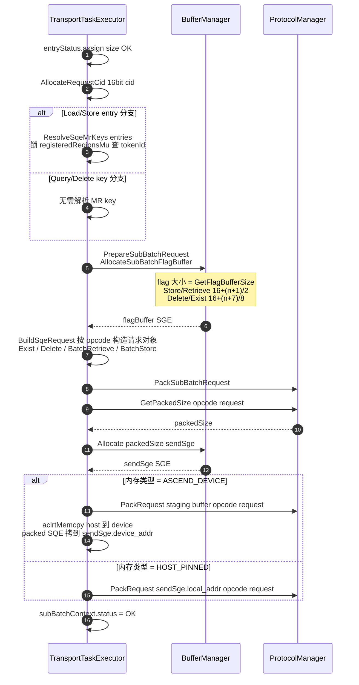
```mermaid
sequenceDiagram
    autonumber
    participant TE as TransportTaskExecutor
    participant BM as BufferManager
    participant PM as ProtocolManager

    TE->>TE: entryStatus.assign size OK
    TE->>TE: AllocateRequestCid 16bit cid

    alt Load/Store entry 分支
        TE->>TE: ResolveSqeMrKeys entries<br/>锁 registeredRegionsMu 查 tokenId
    else Query/Delete key 分支
        TE->>TE: 无需解析 MR key
    end

    TE->>BM: PrepareSubBatchRequest<br/>AllocateSubBatchFlagBuffer
    Note over BM: flag 大小 = GetFlagBufferSize<br/>Store/Retrieve 16+(n+1)/2<br/>Delete/Exist 16+(n+7)/8
    BM-->>TE: flagBuffer SGE

    TE->>TE: BuildSqeRequest 按 opcode 构造请求对象<br/>Exist / Delete / BatchRetrieve / BatchStore

    TE->>PM: PackSubBatchRequest
    TE->>PM: GetPackedSize opcode request
    PM-->>TE: packedSize
    TE->>BM: Allocate packedSize sendSge
    BM-->>TE: sendSge SGE

    alt 内存类型 = ASCEND_DEVICE
        TE->>PM: PackRequest staging buffer opcode request
        TE->>TE: aclrtMemcpy host 到 device<br/>packed SQE 拷到 sendSge.device_addr
    else 内存类型 = HOST_PINNED
        TE->>PM: PackRequest sendSge.local_addr opcode request
    end

    TE->>TE: subBatchContext.status = OK
```

### 6.5 Poll 轮询与 CQE 解包时序图

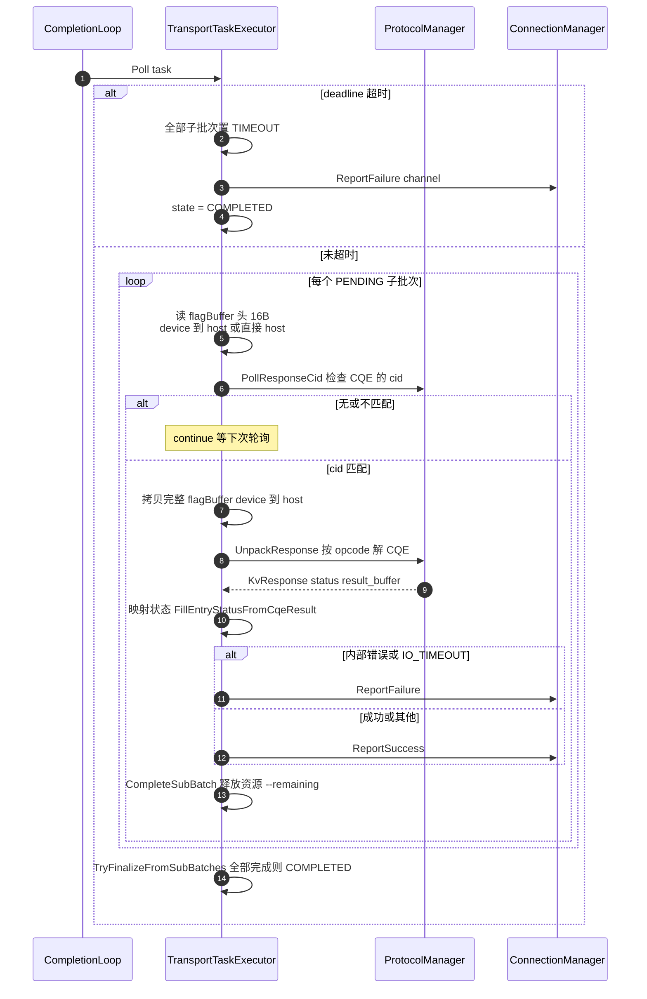
```mermaid
sequenceDiagram
    autonumber
    participant CL as CompletionLoop
    participant TE as TransportTaskExecutor
    participant PM as ProtocolManager
    participant CM as ConnectionManager

    CL->>TE: Poll task

    alt deadline 超时
        TE->>TE: 全部子批次置 TIMEOUT
        TE->>CM: ReportFailure channel
        TE->>TE: state = COMPLETED
    else 未超时
        loop 每个 PENDING 子批次
            TE->>TE: 读 flagBuffer 头 16B<br/>device 到 host 或直接 host
            TE->>PM: PollResponseCid 检查 CQE 的 cid
            alt 无或不匹配
                Note over TE: continue 等下次轮询
            else cid 匹配
                TE->>TE: 拷贝完整 flagBuffer device 到 host
                TE->>PM: UnpackResponse 按 opcode 解 CQE
                PM-->>TE: KvResponse status result_buffer
                TE->>TE: 映射状态 FillEntryStatusFromCqeResult
                alt 内部错误或 IO_TIMEOUT
                    TE->>CM: ReportFailure
                else 成功或其他
                    TE->>CM: ReportSuccess
                end
                TE->>TE: CompleteSubBatch 释放资源 --remaining
            end
        end
        TE->>TE: TryFinalizeFromSubBatches 全部完成则 COMPLETED
    end
```

### 6.6 Send 下发流程图

```mermaid
flowchart TD
    A[BuildSubBatchSendBuffers<br/>遍历子批次] --> B{子批次状态 OK?}
    B -- 否 --> C[跳过 释放资源 置 PARTIAL_FAILED]
    B -- 是 --> D{channel 与 buffer 就绪?}
    D -- 否 --> E[SetSubBatchSendFailed NOT_INITIALIZED]
    D -- 是 --> F[组装 SendIoBatch<br/>connectionHandle sendBuffer flagBuffer len]
    F --> G[记录 subBatchIndex]
    G --> H{还有子批次?}
    H -- 是 --> B
    H -- 否 --> I[transProvider Send ioBatches<br/>kernelCount quietCount]
    I --> J{返回数量匹配?}
    J -- 否 --> K[全部子批次置失败]
    J -- 是 --> L[遍历 sendStatuses]
    L --> M{该子批次 OK?}
    M -- 是 --> N[继续]
    M -- 否 --> O[SetSubBatchSendFailed<br/>ReportFailure channel]
    N --> P{还有?}
    O --> P
    P -- 是 --> L
    P -- 否 --> Q[完成]
```

## 7. Buffer 管理

### 7.1 BufferManager 类结构

```mermaid
classDiagram
    class BufferManager {
        -string name_
        -MemoryType memory_type_
        -size_t slot_capacity_
        -size_t slot_stride_
        -size_t slot_num_
        -BufferRegion region_
        -IndexPool index_pool_
        -TransProvider provider_
        -MRHandle mrHandle_
        -uint32_t tokenId_
        +Init(name, type, capacity, num, provider) Status
        +Allocate(size, sge) Status
        +Free(slotIndex) Status
        +GetTokenId() uint32_t
    }

    class BufferRegion {
        +shared_ptr~void~ owner
        +void* localAddr
        +void* deviceAddr
        +TransProvider.MemType providerMemType
        +Create(type, size, region) Status
        +Reset()
    }

    class ScatterGatherEntry {
        +uint64_t local_addr
        +uint64_t device_addr
        +uint32_t length
        +uint32_t tokenId
        +uint32_t slot_index
        +MemoryType memory_type
    }

    BufferManager *-- BufferRegion
    BufferManager ..> ScatterGatherEntry : produces
```

### 7.2 Buffer 初始化与分配时序图

```mermaid
sequenceDiagram
    autonumber
    participant T as AsuTransportImpl
    participant BM as BufferManager
    participant AB as AscendBuffer
    participant TP as TransProvider

    Note over T: Init 阶段
    T->>BM: Init name type slot_capacity slot_num provider
    BM->>BM: GetSlotStride 64B 对齐
    BM->>AB: MakeHostPinnedBuffer total stride * num
    AB-->>BM: owner + localAddr + deviceAddr
    BM->>BM: memset 清零
    BM->>BM: index_pool Setup slot_num
    BM->>TP: RegisterMemory providerMemType deviceAddr total
    TP-->>BM: mrHandle
    BM->>TP: GetMemTokenId mrHandle
    TP-->>BM: tokenId
    BM->>BM: mrHandle_ tokenId_ 记录

    Note over T: 运行时 Allocate
    T->>BM: Allocate size sge
    BM->>BM: index_pool Acquire 取空闲 slot
    BM->>BM: sge.local_addr = base + idx * stride
    BM->>BM: sge.device_addr = base + idx * stride
    BM->>BM: sge.tokenId = tokenId_
    BM-->>T: sge

    Note over T: 运行时 Free
    T->>BM: Free slot_index
    BM->>BM: memset 清零该 slot
    BM->>BM: index_pool Release slot_index
```

> 两个 BufferManager 实例：
> - **sendBufferManager**：`HOST_PINNED`，`slot_size=4160 slot_num=128`，存放打包好的 SQE。
> - **flagBufferManager**：`HOST_PINNED`，`slot_size=71 slot_num=4096`，存放 CQE 响应。

## 8. TransportConfig 关键字段

| 字段 | 默认值 | 说明 |
|------|--------|------|
| `providerType` | AICPU | 选择 TransProvider 实现 |
| `queryQpNum/loadQpNum/storeQpNum` | 1/4/2 | 各操作类型的 QP 数量 |
| `maxInflightTasks` | 1024 | executeQueue 深度 = max(2, maxInflightTasks)+1 |
| `maxQueryInflight` | 256 | 单 channel 最大 inflight |
| `sendBufferSlotSize/Num` | 4160/128 | send buffer slot 配置 |
| `flagBufferSlotSize/Num` | 71/4096 | flag buffer slot 配置 |
| `asuBatchLoadIoNum` | 110 | Load 每子批次最大 entry 数 |
| `asuBatchStoreIoNum` | 110 | Store 每子批次最大 entry 数 |
| `asuDeleteIoNum` | 254 | Delete 每子批次最大 key 数 |
| `asuQueryIoNum` | 256 | Query 每子批次最大 key 数 |
| `timeoutMs` | 100 | 任务超时，决定 deadline |
| `maxErrorCount` | 2 | channel 故障排干阈值 |

## 9. 线程模型总览

```mermaid
flowchart TD
    subgraph 调用线程
        S[Submit 调用方<br/>ClientTaskManager.DispatchTask]
    end
    subgraph Transport线程
        WL[WorkerLoop<br/>消费 executeQueue<br/>Execute 拆子批次+下发]
        CL[CompletionLoop<br/>每 1ms 遍历所有 task<br/>Poll 轮询 CQE]
    end
    subgraph 连接线程
        RL[RecoverLoop<br/>每 100ms 处理 drainList<br/>重建 DRAINING channel]
    end
    subgraph 底层
        TP[TransProvider<br/>AICPU/AIV/Fake]
        HW[ASU 硬件]
    end

    S -->|SubmitTask 入队| EQ[(executeQueue<br/>SPSC Ring)]
    EQ --> WL
    WL -->|Execute Send| TP
    TP --> HW
    HW -.CQE 写 flagBuffer.-> CL
    CL -->|Poll 读 flagBuffer| WL
    WL -.done.-> CB[NotifyCompletion<br/>onComplete 回调]
    CL -.done.-> CB
    RL -.重建.-> TP
```

| 线程 | 数量 | 职责 | 触发方式 |
|------|------|------|----------|
| WorkerLoop | 每 Transport 1 个 | 消费 executeQueue，Execute 拆子批次+打包+下发 | SPSC 队列唤醒 |
| CompletionLoop | 每 Transport 1 个 | 遍历所有 INFLIGHT task，Poll 轮询 CQE | 1ms 轮询 |
| RecoverLoop | 每 ConnectionManager 1 个 | 处理 drainList，重建故障 channel | 100ms 轮询 |
