# ASU Transport Story 设计

## 1. Story 需求描述

ASU Transport 需要向 ASU Client 提供统一的异步 KV 传输能力：将 `LOAD`、`STORE`、`BATCH_LOAD`、`BATCH_STORE`、`DELETE` 和 `QUERY` 任务排队、流控拆分、下发和完成回调。一个上层任务可以携带任意数量的 entries 或 keys，而单个 ASU SQE 能承载的 I/O 数量受操作类型和 ASU 流控配置限制；因此 Transport 必须先将大 I/O 请求整形为满足单 SQE 上限的受控子批次流，再将子批次编排为可独立传输与完成的 I/O。

本 Story 的核心是：以 `IoScheduler` 根据 ASU 流控配置将逻辑任务整形为有序的 `SubBatch`，再由 Transport 串联 buffer、协议、连接、Provider、CQE 和回调，保证每个子批次资源成对申请/释放、每个任务只完成一次。连接池生命周期、路由和恢复属于 [ConnectionManager Story](./connection_manager_story_design.md)，本文件只描述 Transport 与它的协作边界。

## 2. Story 背景描述

ASU Client 提交的任务面向业务语义，而 Provider 的 `Send()` 面向已打包的 `SendIoBatch`。二者之间存在四层转换：任务入队与生命周期管理、按 ASU 流控阈值整形大 I/O、子批次资源和连接绑定、CQE 驱动的完成与回收。若由各操作路径分别处理这些转换，会造成流控阈值不一致、buffer 泄漏、channel inflight 未归还或回调重复。

因此 Transport 采用“**I/O 流控与传输执行分离**”的方式：

1. `IoScheduler` 在 Init 时读取每种操作的 ASU 单 SQE 流控阈值，在 Execute 时按 `opType` 将连续输入整形为不超过阈值的 `BatchView`；
2. `TransportTaskExecutor` 将每个 view 转成拥有 CID、buffer、channel、状态的 `TransportSubBatchContext`；
3. `WorkerLoop` 专门执行准备和 Send，`CompletionLoop` 专门执行 Poll 和完成，二者通过 task 中保存的 contexts 衔接；
4. `TransportTaskManager` 汇聚所有子批次的 entry status，只向上层发出一次 `onComplete`。

## 3. Story 用户使用场景分析

### 3.1 Story 用户与协作者

| 角色 | 类型 | 目标 | 使用的主要能力 |
|---|---|---|---|
| `ClientTaskManager` | 业务调用者 | 提交 KV 请求并接收结果 | `Init()`、`Submit()`、`Cancel()`、`Shutdown()`、`onComplete` |
| `AsuTransportImpl` | 生命周期编排者 | 组装依赖、管理队列和工作线程 | 创建 `IoScheduler`、Provider、Manager、Executor |
| `WorkerLoop` | 下发执行者 | 把一个任务转成已发送的子批次 | `TransportTaskExecutor::Execute()` |
| `CompletionLoop` | 完成执行者 | 轮询并完成所有 in-flight 子批次 | `TransportTaskExecutor::Poll()` |
| `IoScheduler` | I/O 流控协作者 | 根据 ASU 单 SQE 流控阈值将大请求整形为受控子批次流 | `SplitForAsu()`、`GetSqeIoNum()` |
| `ConnectionManager` | 连接协作者 | 为子批次分配 channel 并接收健康反馈 | `SelectConnection()`、`ReportSuccess()`、`ReportFailure()` |
| `TransProvider` | 外部依赖 | 提供建链、内存注册和底层 Send | `CreateConnection()`、`Send()` |

### 3.2 使用场景总览

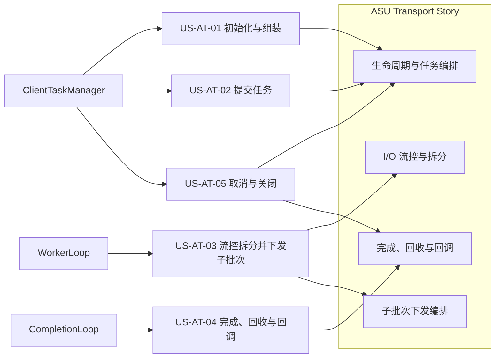

### 3.3 场景分析

| 场景 | 触发者与条件 | 前置条件 | 主成功结果 | 异常/替代结果 |
|---|---|---|---|---|
| US-AT-01 初始化 | Client 创建 Transport | 配置有效 | Scheduler、Provider、连接、buffer、executor 和线程按依赖顺序就绪 | 前置阶段失败则返回错误且不启动 worker |
| US-AT-02 提交任务 | Client 调用 `Submit` | Transport 正在运行 | task 分配 ID 与 deadline 后入执行队列 | 队列满时移除 task 并返回 `RESOURCE_BUSY` |
| US-AT-03 流控拆分并下发 | Worker 取到 `PENDING` task | Scheduler 与依赖已就绪 | 大请求按流控阈值整形为 sub-batch，随后打包、选路并批量 Send | 单个 sub-batch 可因资源/连接/发送失败进入终态，其余继续 |
| US-AT-04 完成与回调 | CompletionLoop 轮询 | task 为 `INFLIGHT` | CQE 解包、回收资源并在全部完成后回调一次 | 超时、取消或关闭使剩余子批次以相应终态收敛 |
| US-AT-05 关闭 | Client 调用 `Shutdown` | 可能存在在途 task | 停止线程、取消 task、释放依赖资源 | 重复关闭不重复释放 |

### 3.4 主场景与能力域映射

| 场景 | I/O 流控与拆分 | 生命周期与任务编排 | 子批次下发编排 | 完成、回收与回调 |
|---|---|---|---|---|
| US-AT-01 初始化 | 读取 batch 配置 | 主责 | 不参与 | 不参与 |
| US-AT-02 提交任务 | 不参与 | 主责 | 等待 worker 消费 | 不参与 |
| US-AT-03 流控拆分并下发 | 主责 | 提供 task/队列 | 主责 | 为后续完成保留 context |
| US-AT-04 完成与回调 | 提供既定计划 | 管理 task 表与回调 | 提供 CID/buffer/channel | 主责 |
| US-AT-05 关闭 | 无运行期动作 | 停止 worker、取消 task | 释放尚未完成的下发资源 | 主责完成剩余资源收敛 |

## 4. Story 设计描述

### 4.1 Story 定义

> 作为 ASU Transport，我希望依据 ASU 单 SQE 的流控阈值把一次大 KV 请求整形为有序、受控的子批次流，并编排其请求打包、连接选择、批量下发、CQE 完成和资源回收，使上层只观察到一次可靠的异步任务完成。

Transport 关注任务到子批次、子批次到 I/O、I/O 到任务结果的编排；不负责业务数据一致性、ASU ID 路由、Provider 的硬件实现或 ConnectionManager 的恢复策略。

### 4.2 总体设计思路

1. **配置驱动流控**：`IoScheduler` 在构造时固化各操作的 ASU 单 SQE 流控阈值；运行期将大请求确定性地整形为不超过阈值的 `BatchView` 序列。
2. **计划与执行解耦**：`ScheduledIoBatch`/`ScheduledKeyBatch` 是无资源的逻辑计划；`TransportSubBatchContext` 是绑定 CID、buffer 与 channel 的物理执行单元。
3. **单线程下发、单线程完成**：Worker 串行创建和 Send contexts，Completion 串行轮询和完成 contexts；task mutex 保护两条路径对同一 task 的交接。
4. **按子批次局部失败**：准备、选路或 Send 失败仅终结对应 sub-batch；task 在所有子批次终态后才汇聚为最终结果。
5. **资源与终态绑定**：send slot、flag slot、channel inflight 由同一 `ReleaseSubBatchResources()` 在 CQE、超时、取消、下发失败及关闭路径统一释放。

### 4.3 逻辑模型

逻辑模型把 Transport 放回 ASU Client、Provider 和 ASU Store 组成的整体结构中。下文按能力域组织设计内容，但能力域不等同于图中的模块；其中 `IoScheduler` 是 Task Execution 使用的调度模块，而不是独立执行线程。

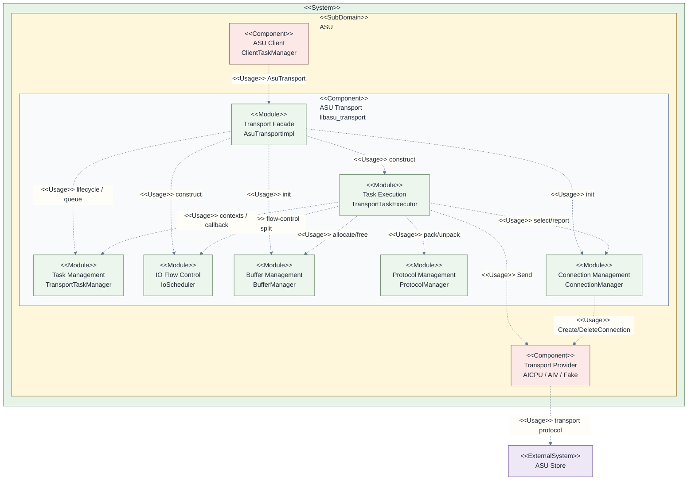

| 层级 | 逻辑元素 | 当前代码映射 | 在本 Story 中的作用 |
|---|---|---|---|
| Component | ASU Client | `client/`、`ClientTaskManager` | 提交任务并接收回调 |
| Component | ASU Transport | `trans/` | 本 Story 所属组件 |
| Module | IO Scheduling | `io_scheduler.*` | 依据配置生成有序 batch view |
| Module | Task Execution | `transport_task_executor.*` | 让计划成为真实 I/O 并处理完成 |
| Module | Task Management | `transport_task_manager.*` | task 表、状态、结果聚合和回调 |
| Module | Buffer / Protocol / Connection | `buffer_manager.*`、`protocol_manager.*`、`connection_manager.*` | 分别提供资源、编解码和连接协作 |
| Component | Transport Provider | `trans_provider.h` 及实现 | 向硬件发送 I/O |

### 4.4 实现结构模型

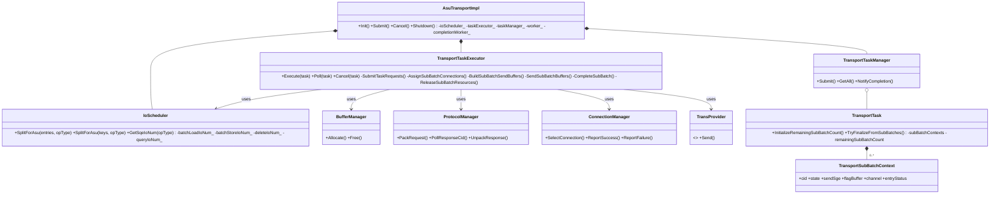

一个 `TransportTask` 在进入 Worker 前只保存逻辑输入；`IoScheduler` 产生的 view 由 Executor 转成多个 `TransportSubBatchContext`。context 持有资源与 channel，直到终态回收，因此它是 Worker 与 Completion 两条流水线之间的唯一执行交接对象。

### 4.5 ASU Transport 上下文模型

上下文模型只保留与本 Story 直接交互的协作者和真实 API。它展示“谁使用 Transport 提供的能力、Transport 又依赖谁”，而非内部实现顺序。

```mermaid
%%{init: {"theme":"base","themeVariables":{"background":"#F8FAFC","primaryTextColor":"#1F2937","lineColor":"#64748B","edgeLabelBackground":"#FFFDF7","fontFamily":"Arial, sans-serif"}}}%%
flowchart TB
  subgraph L1["协作者"]
    Client["&lt;&lt;Component&gt;&gt;<br/>ClientTaskManager"]
    CM["&lt;&lt;Module&gt;&gt;<br/>ConnectionManager"]
    Provider["&lt;&lt;Component&gt;&gt;<br/>TransProvider"]
  end
  subgraph L2["Provided Interface"]
    Lifecycle["&lt;&lt;Provided&gt;&gt;<br/>Init() / Shutdown()"]
    TaskApi["&lt;&lt;Provided&gt;&gt;<br/>Submit() / Cancel()"]
    Callback["&lt;&lt;Provided&gt;&gt;<br/>onComplete(result)"]
  end
  subgraph Boundary["&lt;&lt;Boundary&gt;&gt;<br/>ASU Transport Story"]
    Transport["&lt;&lt;Module&gt;&gt;<br/>AsuTransportImpl + TaskExecutor"]
    Scheduler["&lt;&lt;Internal Module&gt;&gt;<br/>IoScheduler"]
    Transport --- Scheduler
  end
  subgraph L3["Required Interface"]
    ConnApi["&lt;&lt;Required&gt;&gt;<br/>SelectConnection()<br/>ReportSuccess()/ReportFailure()"]
    ProviderApi["&lt;&lt;Required&gt;&gt;<br/>Send()<br/>CreateConnection()/RegisterMemory()"]
  end
  Client -. "&lt;&lt;Usage&gt;&gt;" .-> Lifecycle
  Client -. "&lt;&lt;Usage&gt;&gt;" .-> TaskApi
  Transport -. "&lt;&lt;Realization&gt;&gt;" .-> Lifecycle
  Transport -. "&lt;&lt;Realization&gt;&gt;" .-> TaskApi
  Transport -. "&lt;&lt;Call&gt;&gt;" .-> Callback
  Transport -. "&lt;&lt;Usage&gt;&gt;" .-> ConnApi
  Transport -. "&lt;&lt;Usage&gt;&gt;" .-> ProviderApi
  CM -. "&lt;&lt;Realization&gt;&gt;" .-> ConnApi
  Provider -. "&lt;&lt;Realization&gt;&gt;" .-> ProviderApi
  classDef collaborator fill:#FCE8E6,stroke:#8B5E57,color:#1F2937
  classDef interface fill:#EDE7F6,stroke:#6A4C93,color:#1F2937
  classDef system fill:#EDF6ED,stroke:#668568,color:#1F2937
  class Client,CM,Provider collaborator
  class Lifecycle,TaskApi,Callback,ConnApi,ProviderApi interface
  class Transport,Scheduler system
  style Boundary fill:#FFF7DC,stroke:#9A7B35,color:#1F2937
```

### 4.6 Story 运行时序

#### 4.6.1 Story 总体运行时序

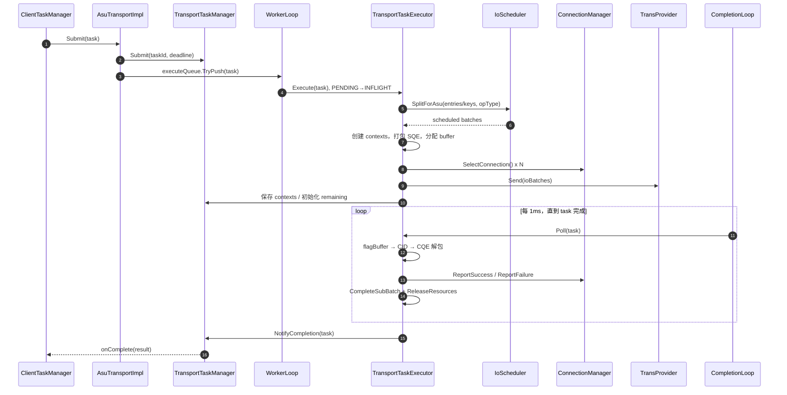

#### 4.6.2 I/O 流控与拆分时序

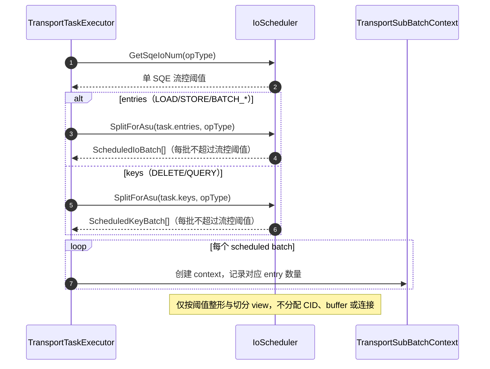

#### 4.6.3 生命周期与任务编排时序

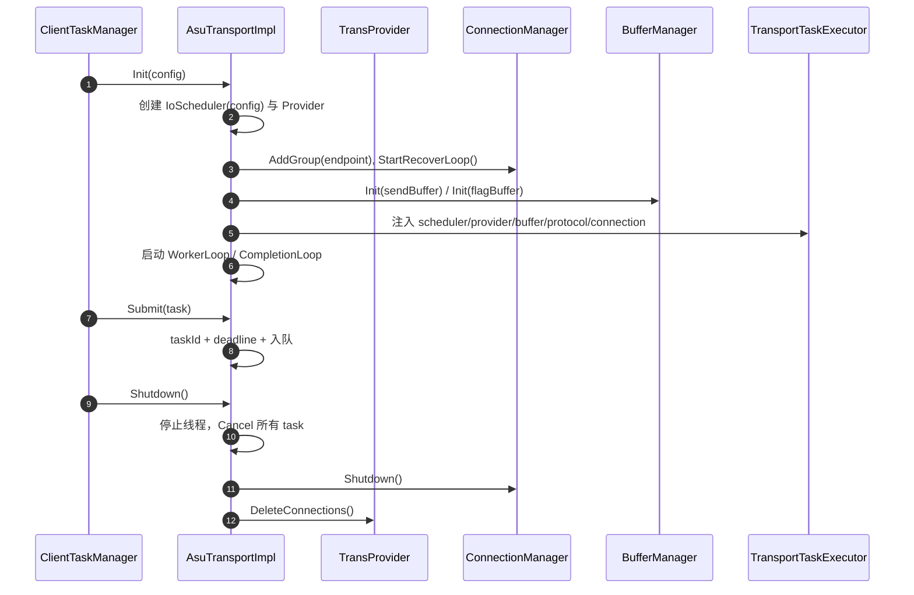

#### 4.6.4 子批次下发编排时序

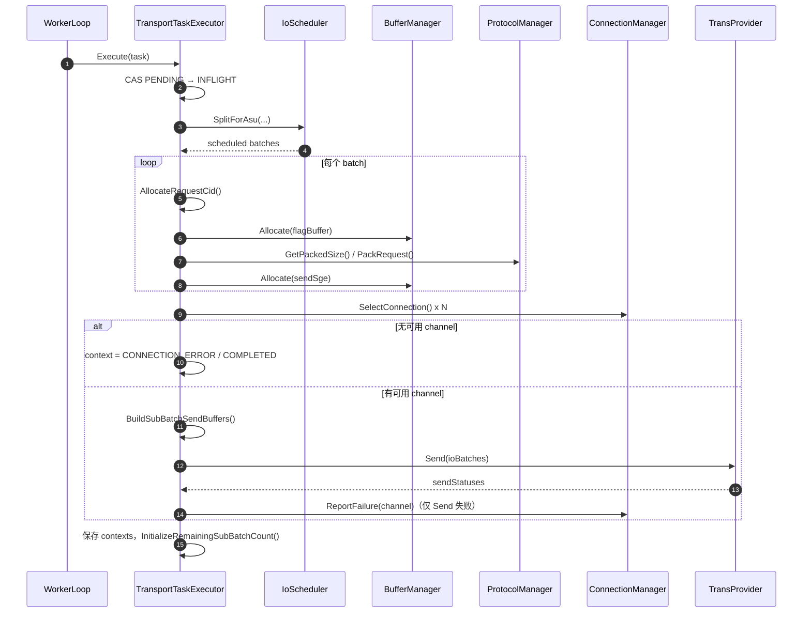

#### 4.6.5 完成、回收与回调时序

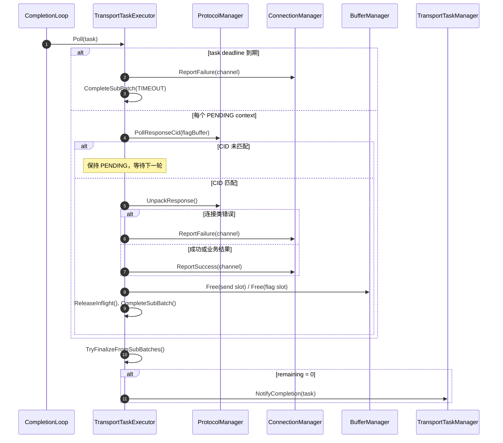

### 4.7 任务与子批次状态模型

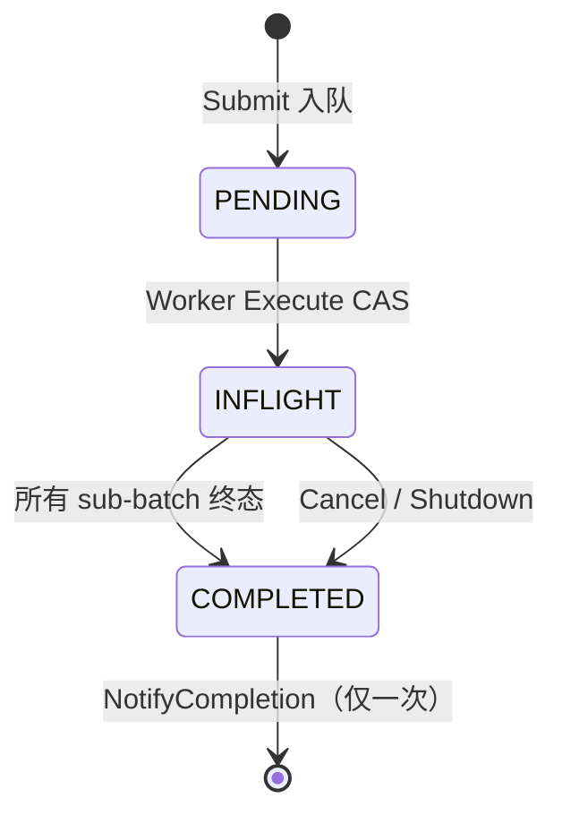

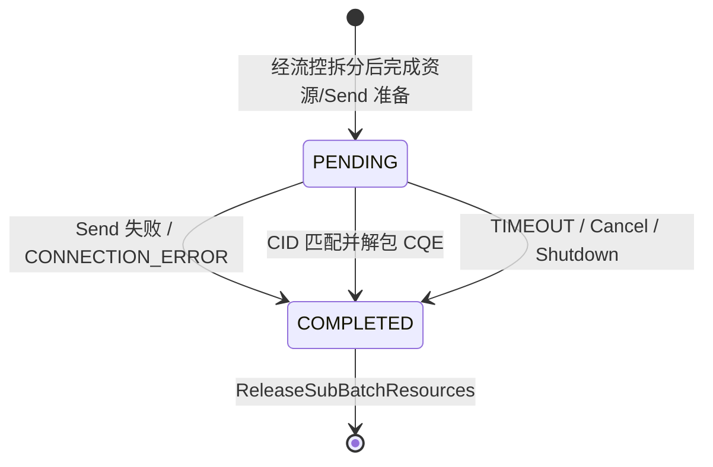

## 5. I/O 流控与拆分

### 5.1 设计描述

本能力是 Transport 的**入口流控**：它将上层可能很大的连续业务输入整形为 ASU 可以接受的 SQE I/O 流。`LOAD`/`STORE` 固定为每个 SQE 一条 I/O；`BATCH_LOAD`、`BATCH_STORE`、`DELETE`、`QUERY` 分别采用 `asuBatchLoadIoNum`、`asuBatchStoreIoNum`、`asuDeleteIoNum`、`asuQueryIoNum` 作为单 SQE 的最大 I/O 数。

例如，一个包含 230 个 entry 的 `BATCH_STORE` 请求、阈值为 110 时，会被整形为 110、110、10 三个子批次；任何一个子批次都不会超过 ASU 配置允许的单 SQE 负载。该组件不复制数据，也不分配任何 Transport 运行资源。

当前实现的流控范围是**单请求、单 SQE 的静态容量限制**：它不维护令牌、不依据运行时吞吐限速，也不直接限制全局并发。全局任务队列深度、buffer 可用 slot 和 channel inflight 则由 Transport、BufferManager 与 ConnectionManager 在后续编排阶段共同形成运行期背压。

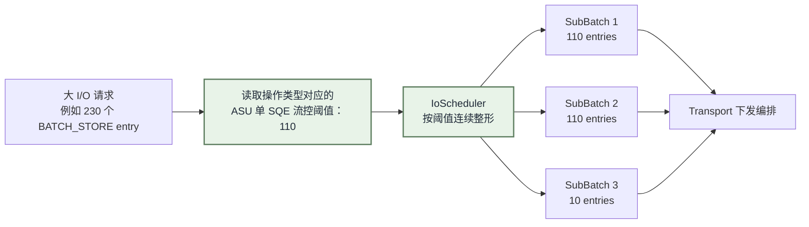

这里的“流控”约束的是**单个 ASU SQE 允许承载的 I/O 数量**，其结果是把一个过大的请求拆成符合 ASU 接收能力的一组请求；真正的发送时机、可同时发送多少子批次以及连接负载，仍由后续的 Transport 编排和 ConnectionManager 共同决定。

### 5.2 重点实现接口

```cpp
std::vector<IoScheduler::ScheduledIoBatch> SplitForAsu(
    const BatchView<KVBuffer>& entries, TransportOpType opType) const;
std::vector<IoScheduler::ScheduledKeyBatch> SplitForAsu(
    const BatchView<CacheKey>& keys, TransportOpType opType) const;
std::size_t GetSqeIoNum(TransportOpType opType) const;
```

### 5.3 关键约束与验收

| 约束 | 验收 |
|---|---|
| 每个 view 不超过 opType 流控阈值 | 230 个、阈值 110 的 batch 产生 110/110/10 |
| 输出覆盖输入且保持顺序 | 合并所有 view 后与原输入逐项相同 |
| Scheduler 无资源副作用 | 流控拆分前后不产生 CID、buffer slot 或 channel inflight |

## 6. Transport 生命周期与任务编排

### 6.1 设计描述

本能力负责以依赖顺序创建组件，并把调用线程的 `Submit` 转换为 Worker 的待执行任务。它不在 Submit 路径执行调度或 Send，避免调用线程与 Worker 并发修改子批次状态。

### 6.2 重点实现接口

```cpp
Status AsuTransportImpl::Init(const TransportConfig& config);
Status AsuTransportImpl::Submit(const TransportTaskPtr& task);
bool TransportTaskExecutor::Cancel(const TransportTaskPtr& task, const Status& status);
Status AsuTransportImpl::Shutdown();
```

### 6.3 关键约束与验收

Buffer 必须先于 Executor 初始化；线程只能在全部依赖成功后启动；队列压入失败需从 TaskManager 移除 task；Shutdown 必须先阻止新执行，再取消任务和回收依赖。

## 7. 子批次下发编排

### 7.1 设计描述

Worker 从任务中取得 `IoScheduler` 已按流控阈值整形好的子批次，并逐个准备下发。每个子批次都会分配 16 bit CID、flag buffer 和 send buffer，解析所需 MR 信息，再由 `ProtocolManager` 打包为 SQE；随后通过 `ConnectionManager` 选择并占用 channel，最终组成 `SendIoBatch` 调用 Provider。某个子批次发送失败只会终结该子批次，不影响其余可发送子批次。

### 7.2 重点依赖接口

```cpp
std::shared_ptr<ConnectionChannel> ConnectionManager::SelectConnection();
Status BufferManager::Allocate(std::size_t size, ScatterGatherEntry& sge);
Status ProtocolManager::PackRequest(void* data, KvOpcode opcode, const KvRequest& request);
std::vector<Status> TransProvider::Send(const std::vector<SendIoBatch>& ioBatches,
                                        std::uint32_t kernelCount, std::uint32_t quietCount);
```

### 7.3 关键约束与验收

每个可发送 context 必须在 Send 前绑定独立 CID、send/flag slot 和 channel；无可用 channel 的 context 标记 `CONNECTION_ERROR`；任何 Send 失败都要反馈连接健康并在终态释放资源。

## 8. 完成、回收与回调

### 8.1 设计描述

本能力按 task deadline 和 CQE CID 驱动终态。只有 CID 与 context 的 CID 匹配时才读取完整 flag buffer 并解包；未匹配表示该 sub-batch 尚未完成。完成时更新逐 entry status，通知连接健康，释放 context 的全部资源，并用 remaining count 判断是否回调。

### 8.2 重点实现接口

```cpp
bool TransportTaskExecutor::Poll(const TransportTaskPtr& task);
Status ProtocolManager::PollResponseCid(const void* data, std::uint16_t& cid);
Status ProtocolManager::UnpackResponse(const void* data, KvOpcode opcode,
                                       std::uint16_t batchNum, KvResponse& response);
void TransportTaskExecutor::ReleaseSubBatchResources(TransportSubBatchContext& context);
void TransportTaskManager::NotifyCompletion(const TransportTaskPtr& task);
```

### 8.3 关键约束与验收

`CompleteSubBatch` 对非 `PENDING` context 无副作用，防止重复完成；每条终态路径都回收 send slot、flag slot 和 channel inflight；`completionNotified` CAS 保证同一 task 只回调一次。

## 9. 能力域协作关系

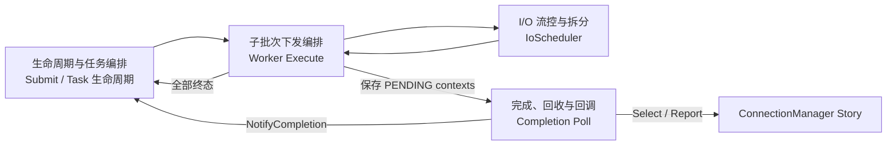

## 10. Story 级关键约束

| 约束 | 说明 |
|---|---|
| 静态流控确定性 | 同一配置、opType 和输入得到相同的受控 sub-batch 边界 |
| 资源闭环 | 每个已分配的 send/flag slot 与 inflight 必须恰好释放一次 |
| 任务单次完成 | 不论同步失败、CQE、超时、取消或关闭，最终最多一次回调 |
| 局部失败 | 一个 sub-batch 失败不阻止其它可发送子批次完成 |
| 连接职责隔离 | Transport 只选择/反馈/释放 channel；恢复和路由策略属于 ConnectionManager |

## 11. 一句话总结

`IoScheduler` 依据 ASU 流控配置决定“大 I/O 请求应被整形为哪些受控 SQE 工作单元”，而 ASU Transport 决定“这些工作单元如何安全地变成一次可发送、可完成、可回收并最终只回调一次的异步 I/O”。
