# ASU Transport Story 设计

## 1. Story 需求描述

`ASU Transport` 需要为 `KVClient` 提供统一的异步 KV 传输服务，支持提交 `LOAD`、`STORE`、`BATCH_LOAD`、`BATCH_STORE`、`DELETE` 和 `QUERY` 任务，并通过已配置的 `TransProvider` 将请求传输至 ASU。KVClient 可在一个任务中携带任意数量的 entries 或 keys；Transport 必须依据操作类型和 ASU 流控配置处理超出单个 SQE 承载上限的请求，使 KVClient 无需自行拆分或感知 SQE 限制。

对每个已受理任务，Transport 必须在全部 I/O 处理结束后向 KVClient 报告一次最终结果；无论任务成功、部分失败、下发失败、超时、取消或关闭，任务完成通知不得重复，且任务关联的 buffer、连接占用及其他传输资源必须得到释放。该 Story 不包括业务数据一致性、ASU ID 路由、Provider 的硬件实现，以及连接池的生命周期、路由和恢复策略。

## 2. Story 背景描述

KVClient 以业务语义提交任务：一个任务可以包含任意数量的 entries 或 keys，并以一次异步回调获取整体结果。底层 ASU 传输则以单个 SQE 为执行和完成单元，单个 SQE 可承载的 I/O 数量由操作类型和流控配置共同限定，并通过 `TransProvider` 下发、由 CQE 返回完成状态。

因此，一个逻辑任务通常需要经历从大 I/O 请求到多个受控 SQE I/O、再从多个 I/O 完成状态到一次任务结果的转换。ASU Transport 负责统一编排这一转换过程，覆盖任务排队、流控整形、传输资源准备、下发、完成回收和结果聚合；由此保持各操作的流控规则、资源释放时机和完成语义一致，避免 SQE 超限、buffer 或连接占用未释放、子批次结果遗漏及同一任务重复回调。

## 3. Story 用户使用场景分析

### 3.1 Story 用户与协作者

| 角色 | 类型 | 目标 | 使用的主要能力 |
|---|---|---|---|
| `ClientTaskManager` | 业务调用者 | 提交 KV 请求并接收结果 | `Init()`、`Submit()`、`Cancel()`、`Shutdown()`、`onComplete` |
| `AsuTransportImpl` | 生命周期编排者 | 组装依赖、管理队列和工作线程 | 创建 `IoScheduler`、Provider、Manager、Executor |
| `WorkerLoop` | 下发执行者 | 把一个任务转成已发送的子批次 | `TransportTaskExecutor::Execute()` |
| `CompletionLoop` | 完成执行者 | 轮询并完成所有 in-flight 子批次 | `TransportTaskExecutor::Poll()` |
| `IoScheduler` | I/O 流控协作者 | 根据 ASU 单 SQE 流控阈值将大请求整形为受控子批次流 | `SplitForAsu()`、`GetSqeIoNum()` |
| `ConnectionManager` | 连接协作者 | 为子批次分配 channel 并接收健康反馈 | `SelectConnection()`、`ReportSuccess()`、`ReportFailure()` |
| `TransProvider` | 外部依赖 | 提供建链、内存注册和底层 Send | `CreateConnection()`、`Send()` |

### 3.2 使用场景总览

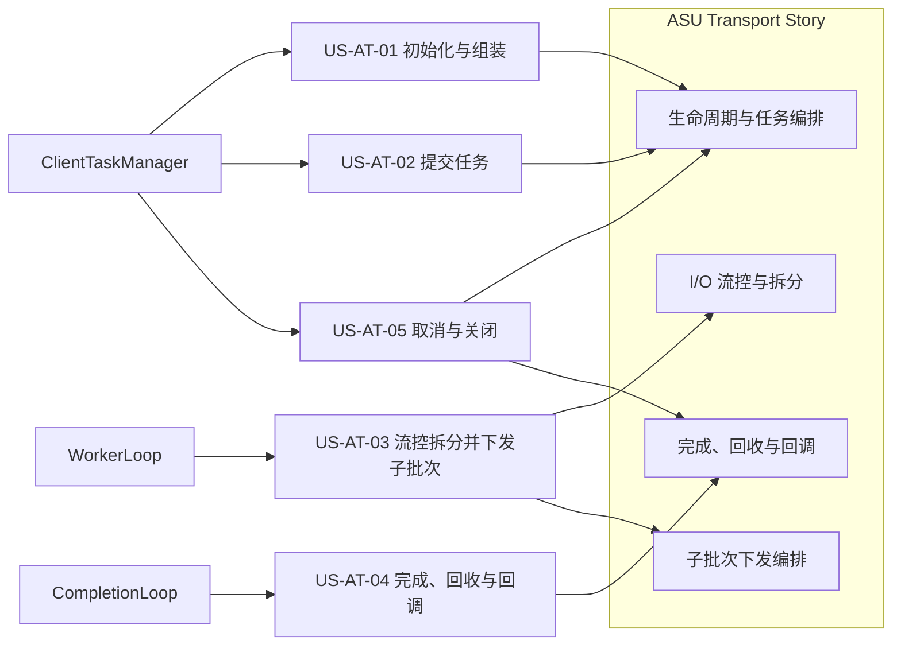

### 3.3 场景分析

| 场景 | 触发者与条件 | 前置条件 | 主成功结果 | 异常/替代结果 |
|---|---|---|---|---|
| US-AT-01 初始化 | Client 创建 Transport | 配置有效 | Scheduler、Provider、连接、buffer、executor 和线程按依赖顺序就绪 | 前置阶段失败则返回错误且不启动 worker |
| US-AT-02 提交任务 | Client 调用 `Submit` | Transport 正在运行 | task 分配 ID 与 deadline 后入执行队列 | 队列满时移除 task 并返回 `RESOURCE_BUSY` |
| US-AT-03 流控拆分并下发 | Worker 取到 `PENDING` task | Scheduler 与依赖已就绪 | 大请求按流控阈值整形为 sub-batch，随后打包、选路并批量 Send | 单个 sub-batch 可因资源/连接/发送失败进入终态，其余继续 |
| US-AT-04 完成与回调 | CompletionLoop 轮询 | task 为 `INFLIGHT` | CQE 解包、回收资源并在全部完成后回调一次 | 超时、取消或关闭使剩余子批次以相应终态收敛 |
| US-AT-05 关闭 | Client 调用 `Shutdown` | 可能存在在途 task | 停止线程、取消 task、释放依赖资源 | 重复关闭不重复释放 |

### 3.4 主场景与能力域映射

| 场景 | I/O 流控与拆分 | 生命周期与任务编排 | 子批次下发编排 | 完成、回收与回调 |
|---|---|---|---|---|
| US-AT-01 初始化 | 读取 batch 配置 | 主责 | 不参与 | 不参与 |
| US-AT-02 提交任务 | 不参与 | 主责 | 等待 worker 消费 | 不参与 |
| US-AT-03 流控拆分并下发 | 主责 | 提供 task/队列 | 主责 | 为后续完成保留 context |
| US-AT-04 完成与回调 | 提供既定计划 | 管理 task 表与回调 | 提供 CID/buffer/channel | 主责 |
| US-AT-05 关闭 | 无运行期动作 | 停止 worker、取消 task | 释放尚未完成的下发资源 | 主责完成剩余资源收敛 |

## 4. Story 设计描述

### 4.1 Story 设计描述

ASU Transport 将 KVClient 提交的逻辑任务编排为可在 ASU 上执行的异步 I/O。它依据不同操作的单 SQE 流控阈值，将大请求确定性地整形为有序、受控的子批次；上层无需感知拆分过程，只接收一次最终的异步完成结果。

设计将逻辑计划与物理执行分离：`ScheduledIoBatch` 和 `ScheduledKeyBatch` 仅描述待执行的 I/O 范围，不持有传输资源；进入执行阶段后，Transport 为每个子批次创建 `TransportSubBatchContext`，记录其执行所需的标识、资源、连接和状态。Worker 串行完成准备与下发，Completion 串行轮询 CQE 并推进完成状态，通过 task mutex 保证两条路径对同一任务的安全交接。

子批次可独立成功或失败，准备、选路和下发失败只终结对应子批次；待全部子批次进入终态后，Transport 汇聚结果并完成任务。Transport 在 CQE、超时、取消、下发失败和关闭等终态路径统一回收子批次关联的传输资源。该设计不覆盖业务数据一致性、ASU ID 路由、Provider 硬件实现及连接池恢复策略。

### 4.2 逻辑模型

逻辑模型把 Transport 放回 ASU Client、Provider 和 ASU Store 组成的整体结构中。下文按能力域组织设计内容，但能力域不等同于图中的模块；其中 `IoScheduler` 是 Task Execution 使用的调度模块，而不是独立执行线程。

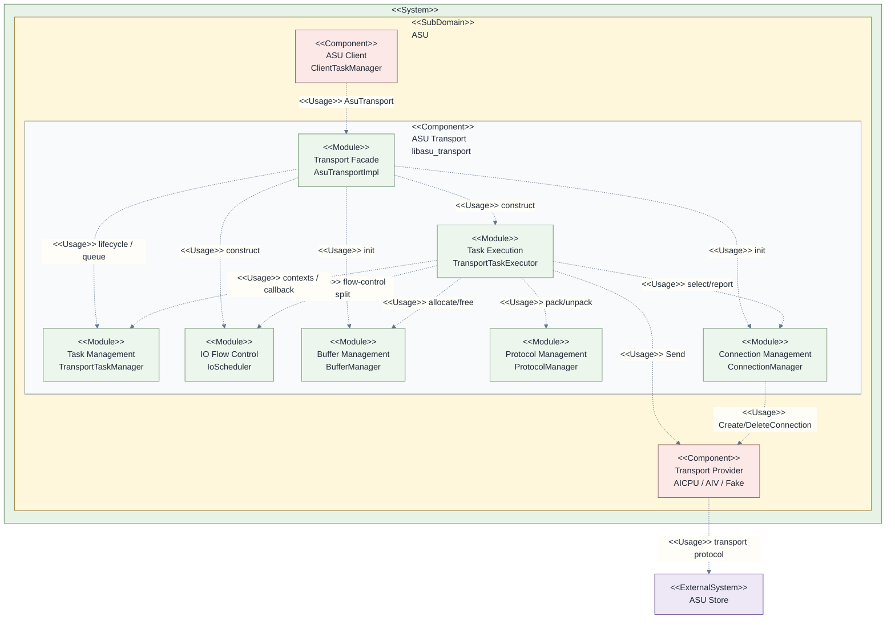

| 层级 | 逻辑元素 | 当前代码映射 | 在本 Story 中的作用 |
|---|---|---|---|
| Component | ASU Client | `client/`、`ClientTaskManager` | 提交任务并接收回调 |
| Component | ASU Transport | `trans/` | 本 Story 所属组件 |
| Module | IO Scheduling | `io_scheduler.*` | 依据配置生成有序 batch view |
| Module | Task Execution | `transport_task_executor.*` | 让计划成为真实 I/O 并处理完成 |
| Module | Task Management | `transport_task_manager.*` | task 表、状态、结果聚合和回调 |
| Module | Buffer / Protocol / Connection | `buffer_manager.*`、`protocol_manager.*`、`connection_manager.*` | 分别提供资源、编解码和连接协作 |
| Component | Transport Provider | `trans_provider.h` 及实现 | 向硬件发送 I/O |

### 4.3 实现结构模型

下图是 ASU Transport 的**核心 UML 类图**。为保持可读性，仅列出本 Story 的关键属性和操作；省略构造/析构、内存注册等生命周期细节，以及不影响对象关系的私有辅助函数。属性和操作均标注了类型、可见性及主要参数。

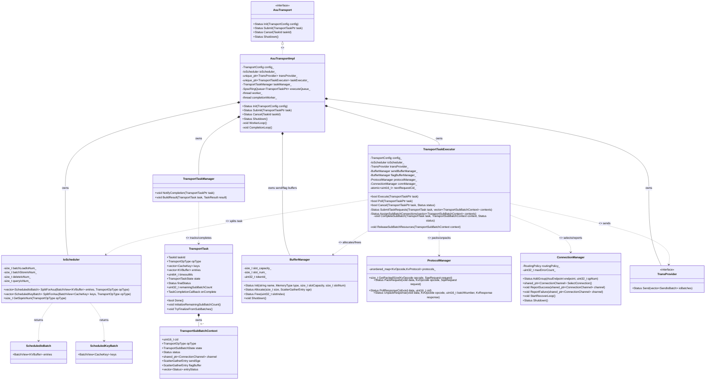

一个 `TransportTask` 在进入 Worker 前只保存逻辑输入；`IoScheduler` 产生的 batch view 由 `TransportTaskExecutor` 转成多个 `TransportSubBatchContext`。context 持有资源与 channel，直到终态回收，因此它是 Worker 与 Completion 两条流水线之间的唯一执行交接对象。

### 4.4 ASU Transport 上下文模型

上下文模型只保留与本 Story 直接交互的协作者和真实 API。它展示“谁使用 Transport 提供的能力、Transport 又依赖谁”，而非内部实现顺序。

```mermaid
%%{init: {"theme":"base","themeVariables":{"background":"#F8FAFC","primaryTextColor":"#1F2937","lineColor":"#64748B","edgeLabelBackground":"#FFFDF7","fontFamily":"Arial, sans-serif"}}}%%
flowchart TB
  subgraph L1["协作者"]
    Client["&lt;&lt;Component&gt;&gt;<br/>ClientTaskManager"]
    CM["&lt;&lt;Module&gt;&gt;<br/>ConnectionManager"]
    Provider["&lt;&lt;Component&gt;&gt;<br/>TransProvider"]
  end
  subgraph L2["Provided Interface"]
    Lifecycle["&lt;&lt;Provided&gt;&gt;<br/>Init() / Shutdown()"]
    TaskApi["&lt;&lt;Provided&gt;&gt;<br/>Submit() / Cancel()"]
    Callback["&lt;&lt;Provided&gt;&gt;<br/>onComplete(result)"]
  end
  subgraph Boundary["&lt;&lt;Boundary&gt;&gt;<br/>ASU Transport Story"]
    Transport["&lt;&lt;Module&gt;&gt;<br/>AsuTransportImpl + TaskExecutor"]
    Scheduler["&lt;&lt;Internal Module&gt;&gt;<br/>IoScheduler"]
    Transport --- Scheduler
  end
  subgraph L3["Required Interface"]
    ConnApi["&lt;&lt;Required&gt;&gt;<br/>SelectConnection()<br/>ReportSuccess()/ReportFailure()"]
    ProviderApi["&lt;&lt;Required&gt;&gt;<br/>Send()<br/>CreateConnection()/RegisterMemory()"]
  end
  Client -. "&lt;&lt;Usage&gt;&gt;" .-> Lifecycle
  Client -. "&lt;&lt;Usage&gt;&gt;" .-> TaskApi
  Transport -. "&lt;&lt;Realization&gt;&gt;" .-> Lifecycle
  Transport -. "&lt;&lt;Realization&gt;&gt;" .-> TaskApi
  Transport -. "&lt;&lt;Call&gt;&gt;" .-> Callback
  Transport -. "&lt;&lt;Usage&gt;&gt;" .-> ConnApi
  Transport -. "&lt;&lt;Usage&gt;&gt;" .-> ProviderApi
  CM -. "&lt;&lt;Realization&gt;&gt;" .-> ConnApi
  Provider -. "&lt;&lt;Realization&gt;&gt;" .-> ProviderApi
  classDef collaborator fill:#FCE8E6,stroke:#8B5E57,color:#1F2937
  classDef interface fill:#EDE7F6,stroke:#6A4C93,color:#1F2937
  classDef system fill:#EDF6ED,stroke:#668568,color:#1F2937
  class Client,CM,Provider collaborator
  class Lifecycle,TaskApi,Callback,ConnApi,ProviderApi interface
  class Transport,Scheduler system
  style Boundary fill:#FFF7DC,stroke:#9A7B35,color:#1F2937
```

### 4.5 Story 运行时序

#### 4.5.1 Story 总体运行时序

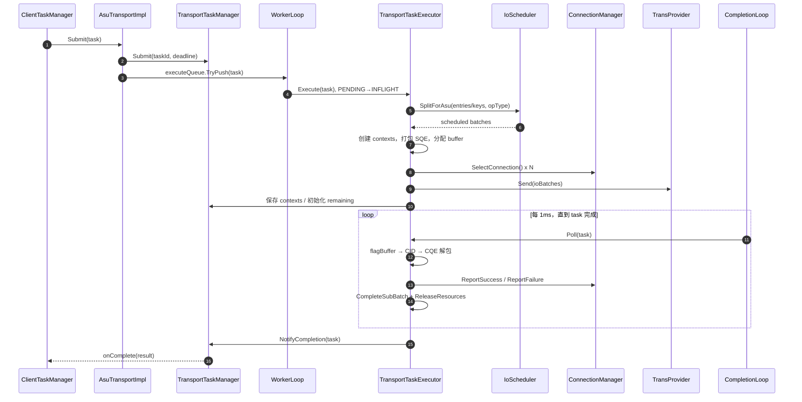

时序步骤：

1. `ClientTaskManager` 调用 `Submit(task)`；Transport 为任务登记 `taskId`、截止时间，并压入执行队列。
2. `WorkerLoop` 取出任务，`TransportTaskExecutor` 将状态从 `PENDING` 原子切换为 `INFLIGHT`。
3. Executor 调用 `IoScheduler` 按操作类型拆分逻辑输入，并为每个子批次创建 context、打包 SQE、申请 buffer。
4. Executor 为可下发的子批次选择 channel，并经 `TransProvider::Send()` 批量下发；随后保存 contexts 并初始化剩余子批次数。
5. `CompletionLoop` 每 1 ms 轮询任务：从 flag buffer 获取 CID、解析 CQE，向 `ConnectionManager` 反馈连接结果，并完成及回收已终态的子批次。
6. 所有子批次终态后，Executor 通知 `TransportTaskManager`；后者汇聚结果并仅调用一次 `onComplete(result)`。

#### 4.5.2 I/O 流控与拆分时序

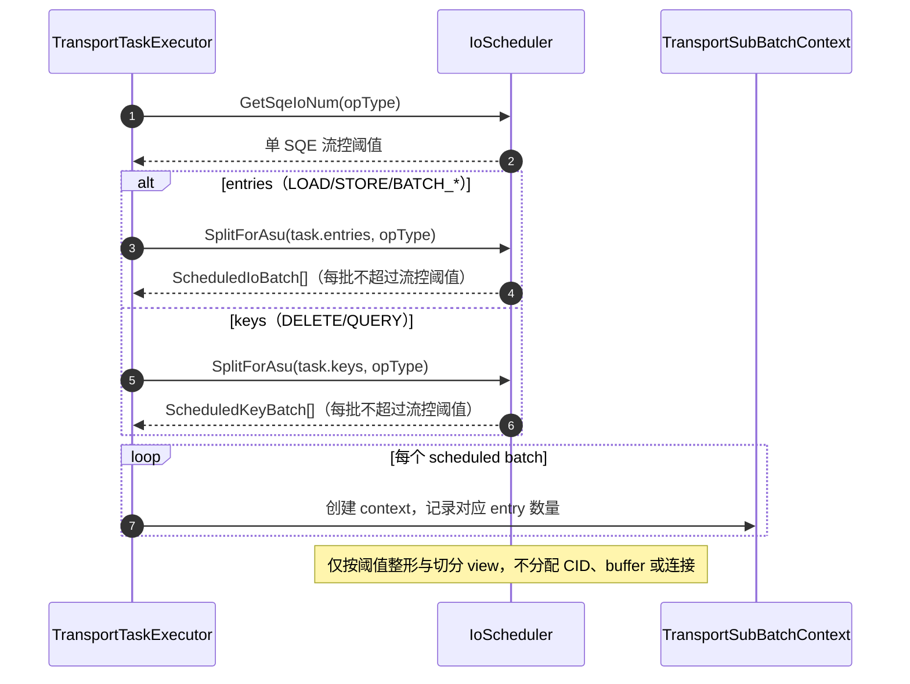

时序步骤：

1. Executor 根据 `opType` 向 `IoScheduler` 查询单个 SQE 可承载的 I/O 阈值。
2. 对 `LOAD`、`STORE`、`BATCH_LOAD`、`BATCH_STORE`，Scheduler 将 `task.entries` 切分为连续的 `ScheduledIoBatch` 列表。
3. 对 `DELETE`、`QUERY`，Scheduler 将 `task.keys` 切分为连续的 `ScheduledKeyBatch` 列表。
4. 每个输出 batch 都不超过该操作的阈值，合并后仍与原输入顺序和内容一致。
5. Executor 依据每个 batch 创建一个 `TransportSubBatchContext`；此阶段只形成逻辑执行单元，不申请 CID、buffer 或连接。

#### 4.5.3 生命周期与任务编排时序

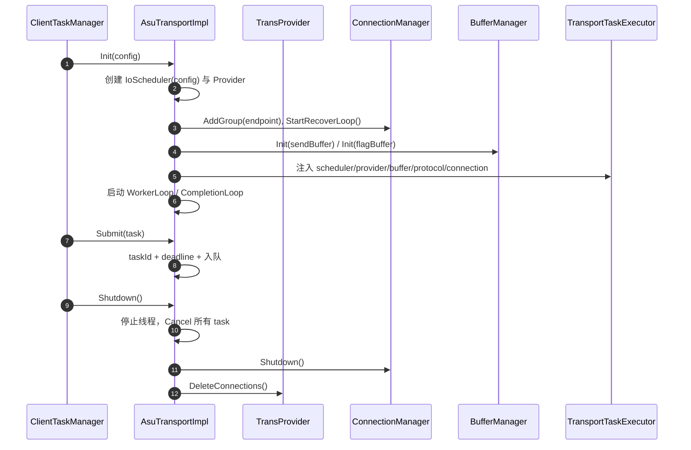

时序步骤：

1. Client 调用 `Init(config)`，Transport 创建并配置 `IoScheduler` 与 `TransProvider`。
2. Transport 创建连接组并启动连接恢复循环，然后初始化 send buffer 与 flag buffer。
3. Transport 将 scheduler、provider、buffer、protocol 和 connection 等协作者注入 `TransportTaskExecutor`。
4. 依赖就绪后，Transport 启动 `WorkerLoop` 和 `CompletionLoop`，开始接受异步任务。
5. Client 调用 `Submit(task)` 时，Transport 设置 `taskId` 和 deadline 后将任务入队；下发不在调用线程执行。
6. Client 调用 `Shutdown()` 时，Transport 停止工作线程、取消未完成任务、关闭连接管理器，并删除 Provider 侧连接。

#### 4.5.4 子批次下发编排时序

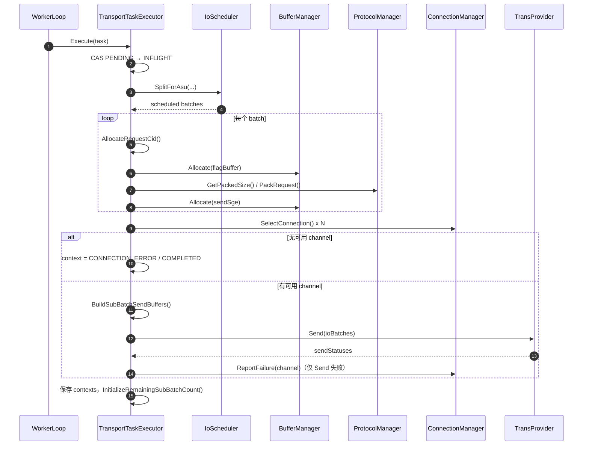

时序步骤：

1. `WorkerLoop` 调用 `Execute(task)`；Executor 仅在成功将任务从 `PENDING` 切换到 `INFLIGHT` 后继续执行。
2. Executor 调用 Scheduler 生成受流控阈值限制的 scheduled batches。
3. 对每个 batch，Executor 分配唯一 CID 和 flag buffer，计算并打包请求，再申请用于下发的 send SGE。
4. Executor 为各子批次选择可用 channel。
5. 若没有可用 channel，对应 context 以 `CONNECTION_ERROR` 进入完成态；其余子批次不受影响。
6. 若存在可用 channel，Executor 构建待发送 I/O 批次并调用 `Send()`；仅发送失败的 channel 会被报告为失败。
7. Executor 将全部 contexts 挂到 task 上，初始化 `remainingSubBatchCount`，由 CompletionLoop 继续推进终态。

#### 4.5.5 完成、回收与回调时序

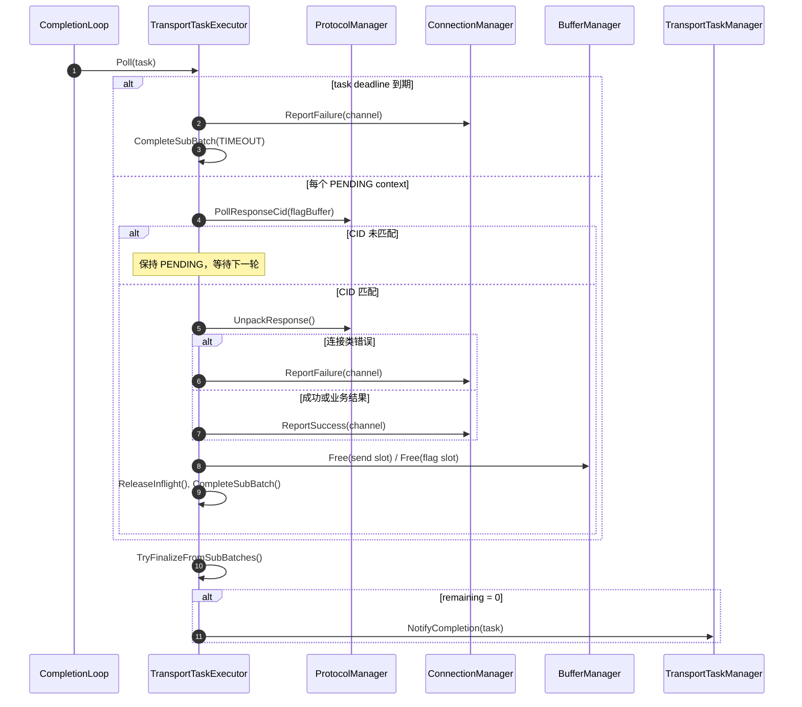

时序步骤：

1. `CompletionLoop` 调用 `Poll(task)`，检查任务 deadline 和所有仍为 `PENDING` 的子批次 context。
2. 若任务已超时，Executor 将关联 channel 报告为失败，并以 `TIMEOUT` 完成对应子批次。
3. 对未超时的 context，Executor 从 flag buffer 读取响应 CID；CID 未匹配时保持 `PENDING`，等待下一轮轮询。
4. CID 匹配后，Executor 调用 `UnpackResponse()` 解析 CQE；连接类错误报告失败，其余成功或业务结果报告成功。
5. Executor 释放 send/flag buffer slot、归还 channel inflight，并调用 `CompleteSubBatch()` 写入该子批次终态。
6. Executor 汇总子批次结果；仅当 `remainingSubBatchCount` 变为 0 时，才通知 `TransportTaskManager` 完成任务和触发回调。

### 4.6 任务与子批次状态模型

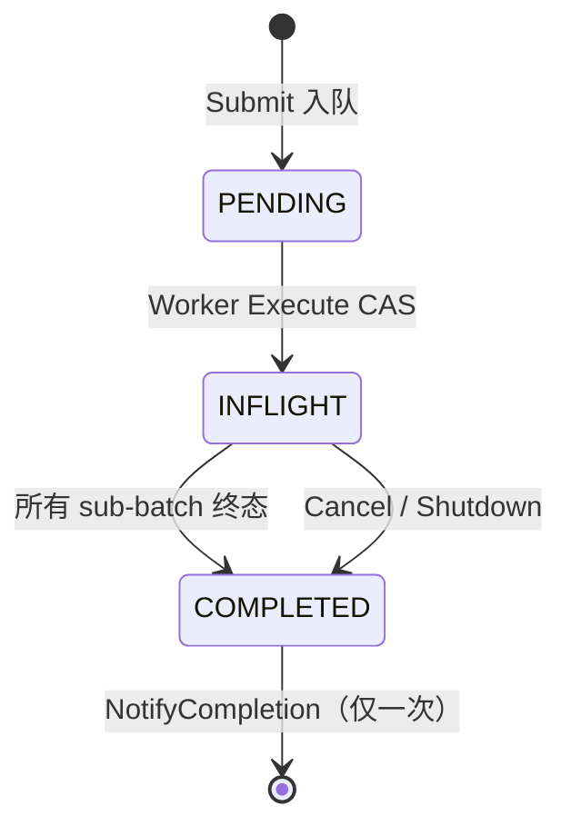

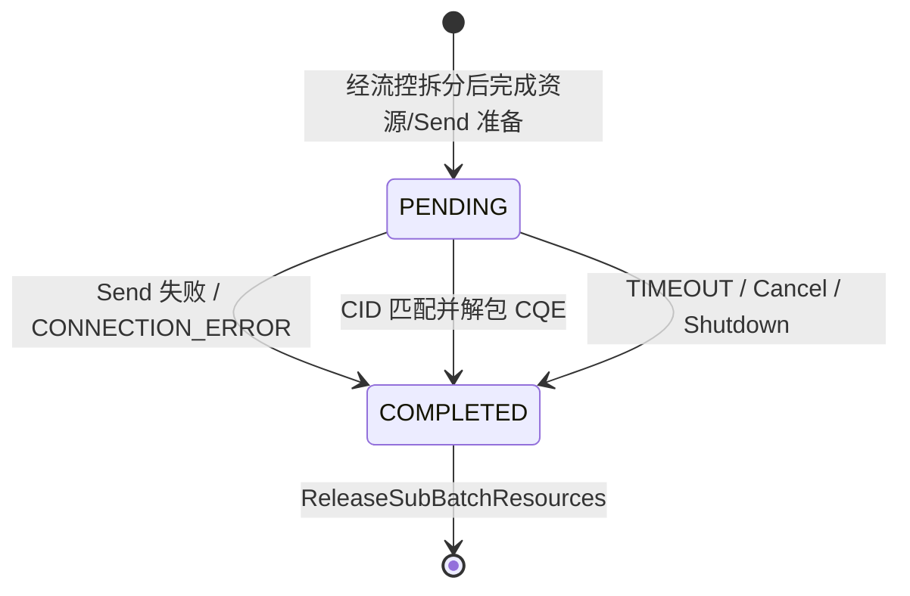

## 5. I/O 流控与拆分

### 5.1 设计描述

本能力是 Transport 的**入口流控**：它将上层可能很大的连续业务输入整形为 ASU 可以接受的 SQE I/O 流。`LOAD`/`STORE` 固定为每个 SQE 一条 I/O；`BATCH_LOAD`、`BATCH_STORE`、`DELETE`、`QUERY` 分别采用 `asuBatchLoadIoNum`、`asuBatchStoreIoNum`、`asuDeleteIoNum`、`asuQueryIoNum` 作为单 SQE 的最大 I/O 数。

例如，一个包含 230 个 entry 的 `BATCH_STORE` 请求、阈值为 110 时，会被整形为 110、110、10 三个子批次；任何一个子批次都不会超过 ASU 配置允许的单 SQE 负载。该组件不复制数据，也不分配任何 Transport 运行资源。

当前实现的流控范围是**单请求、单 SQE 的静态容量限制**：它不维护令牌、不依据运行时吞吐限速，也不直接限制全局并发。全局任务队列深度、buffer 可用 slot 和 channel inflight 则由 Transport、BufferManager 与 ConnectionManager 在后续编排阶段共同形成运行期背压。

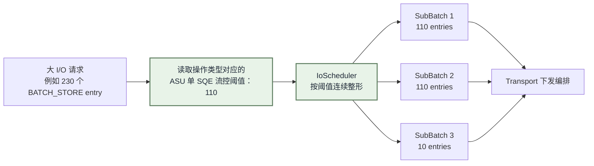

这里的“流控”约束的是**单个 ASU SQE 允许承载的 I/O 数量**，其结果是把一个过大的请求拆成符合 ASU 接收能力的一组请求；真正的发送时机、可同时发送多少子批次以及连接负载，仍由后续的 Transport 编排和 ConnectionManager 共同决定。

### 5.2 重点实现接口

```cpp
std::vector<IoScheduler::ScheduledIoBatch> SplitForAsu(
    const BatchView<KVBuffer>& entries, TransportOpType opType) const;
std::vector<IoScheduler::ScheduledKeyBatch> SplitForAsu(
    const BatchView<CacheKey>& keys, TransportOpType opType) const;
std::size_t GetSqeIoNum(TransportOpType opType) const;
```

### 5.3 关键约束与验收

| 约束 | 验收 |
|---|---|
| 每个 view 不超过 opType 流控阈值 | 230 个、阈值 110 的 batch 产生 110/110/10 |
| 输出覆盖输入且保持顺序 | 合并所有 view 后与原输入逐项相同 |
| Scheduler 无资源副作用 | 流控拆分前后不产生 CID、buffer slot 或 channel inflight |

## 6. Transport 生命周期与任务编排

### 6.1 设计描述

本能力负责以依赖顺序创建组件，并把调用线程的 `Submit` 转换为 Worker 的待执行任务。它不在 Submit 路径执行调度或 Send，避免调用线程与 Worker 并发修改子批次状态。

### 6.2 重点实现接口

```cpp
Status AsuTransportImpl::Init(const TransportConfig& config);
Status AsuTransportImpl::Submit(const TransportTaskPtr& task);
bool TransportTaskExecutor::Cancel(const TransportTaskPtr& task, const Status& status);
Status AsuTransportImpl::Shutdown();
```

### 6.3 关键约束与验收

Buffer 必须先于 Executor 初始化；线程只能在全部依赖成功后启动；队列压入失败需从 TaskManager 移除 task；Shutdown 必须先阻止新执行，再取消任务和回收依赖。

## 7. 子批次下发编排

### 7.1 设计描述

Worker 从任务中取得 `IoScheduler` 已按流控阈值整形好的子批次，并逐个准备下发。每个子批次都会分配 16 bit CID、flag buffer 和 send buffer，解析所需 MR 信息，再由 `ProtocolManager` 打包为 SQE；随后通过 `ConnectionManager` 选择并占用 channel，最终组成 `SendIoBatch` 调用 Provider。某个子批次发送失败只会终结该子批次，不影响其余可发送子批次。

### 7.2 重点依赖接口

```cpp
std::shared_ptr<ConnectionChannel> ConnectionManager::SelectConnection();
Status BufferManager::Allocate(std::size_t size, ScatterGatherEntry& sge);
Status ProtocolManager::PackRequest(void* data, KvOpcode opcode, const KvRequest& request);
std::vector<Status> TransProvider::Send(const std::vector<SendIoBatch>& ioBatches,
                                        std::uint32_t kernelCount, std::uint32_t quietCount);
```

### 7.3 关键约束与验收

每个可发送 context 必须在 Send 前绑定独立 CID、send/flag slot 和 channel；无可用 channel 的 context 标记 `CONNECTION_ERROR`；任何 Send 失败都要反馈连接健康并在终态释放资源。

## 8. 完成、回收与回调

### 8.1 设计描述

本能力按 task deadline 和 CQE CID 驱动终态。只有 CID 与 context 的 CID 匹配时才读取完整 flag buffer 并解包；未匹配表示该 sub-batch 尚未完成。完成时更新逐 entry status，通知连接健康，释放 context 的全部资源，并用 remaining count 判断是否回调。

### 8.2 重点实现接口

```cpp
bool TransportTaskExecutor::Poll(const TransportTaskPtr& task);
Status ProtocolManager::PollResponseCid(const void* data, std::uint16_t& cid);
Status ProtocolManager::UnpackResponse(const void* data, KvOpcode opcode,
                                       std::uint16_t batchNum, KvResponse& response);
void TransportTaskExecutor::ReleaseSubBatchResources(TransportSubBatchContext& context);
void TransportTaskManager::NotifyCompletion(const TransportTaskPtr& task);
```

### 8.3 关键约束与验收

`CompleteSubBatch` 对非 `PENDING` context 无副作用，防止重复完成；每条终态路径都回收 send slot、flag slot 和 channel inflight；`completionNotified` CAS 保证同一 task 只回调一次。

## 9. 能力域协作关系

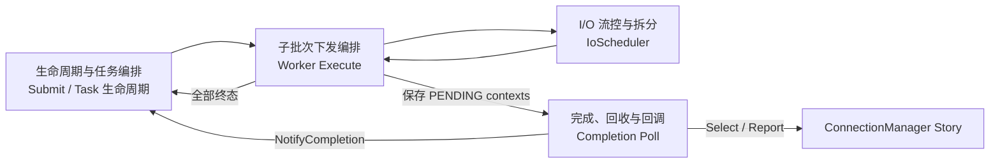

## 10. Story 级关键约束

| 约束 | 说明 |
|---|---|
| 静态流控确定性 | 同一配置、opType 和输入得到相同的受控 sub-batch 边界 |
| 资源闭环 | 每个已分配的 send/flag slot 与 inflight 必须恰好释放一次 |
| 任务单次完成 | 不论同步失败、CQE、超时、取消或关闭，最终最多一次回调 |
| 局部失败 | 一个 sub-batch 失败不阻止其它可发送子批次完成 |
| 连接职责隔离 | Transport 只选择/反馈/释放 channel；恢复和路由策略属于 ConnectionManager |

## 11. SFMEA 分析

本节以可执行的故障注入用例记录 Transport 的主要单点故障模式。故障注入方法应通过测试桩、Mock、Hook、受控状态篡改或并发栅栏实现，不依赖生产环境制造故障。

| 用例编号 | 故障模式 | 是否涉及 | 故障影响 | 容错措施 | 故障注入方法 | 备注 |
|---|---|---|---|---|---|---|
| AT-SFMEA-01 | Provider 未构建、类型不支持或初始化失败 | 是 | Transport 初始化失败，任务不会被受理 | `Init()` 返回明确错误，并清理已创建资源 | 打桩 Provider 工厂或 `Init()` 依赖，使指定 Provider 创建失败或返回不支持类型 | 验证失败后线程、buffer 和连接结构均未遗留 |
| AT-SFMEA-02 | 空任务、执行队列已满或关闭期间提交 | 是 | 当前任务无法进入执行队列 | 参数校验；队列压入失败时从 TaskManager 移除任务 | 传入空 `TransportTask`；将测试队列填满；使用线程栅栏并发触发 `Submit()` 与 `Shutdown()` | 验证立即返回失败，且 TaskManager 中无悬挂任务 |
| AT-SFMEA-03 | 批处理操作的单 SQE I/O 阈值为 0 | 是 | 拆分计算异常，无法保证任务处理 | 默认配置提供非零阈值；当前尚无显式非零校验 | 构造 `TransportConfig`，将 `asuBatchLoadIoNum`、`asuBatchStoreIoNum`、`asuDeleteIoNum` 或 `asuQueryIoNum` 设为 0 后执行批处理任务 | 已识别的配置校验缺口；建议补充 Init 阶段校验 |
| AT-SFMEA-04 | buffer 申请、MR 解析或协议打包失败 | 是 | 对应子批次无法构造为可发送 I/O，任务可能部分失败 | 子批次局部终结；终态统一回收已申请资源 | 打桩 `BufferManager::Allocate()`、MR 查询或 `ProtocolManager::PackRequest()` 返回错误 | 验证其余可发送子批次仍继续执行 |
| AT-SFMEA-05 | 无可用连接或 Provider 下发失败 | 是 | 对应子批次无法进入正常完成轮询 | 按子批次记录失败、反馈连接结果并回收资源 | 打桩 `ConnectionManager::SelectConnection()` 返回空；或打桩 `TransProvider::Send()` 返回失败状态 | 验证其他子批次不被阻塞，最终结果正确聚合 |
| AT-SFMEA-06 | CQE 缺失、CID 不匹配或响应解析失败 | 是 | 子批次超时或失败，任务可能部分失败 | 仅匹配 CID 后解析；按 deadline 终结并回收资源 | Hook flag buffer 内容，写入错误 CID 或畸形响应；或令 Fake Provider 不写入 CQE | 验证超时受 `timeoutMs` 约束，轮询周期约为 1 ms |
| AT-SFMEA-07 | CQE、超时、取消或关闭并发导致重复完成 | 是 | 可能破坏上层一次完成语义 | 非 `PENDING` 子批次不重复完成；`completionNotified` CAS 保证任务至多回调一次 | 用线程栅栏并发触发 `Poll()`、`Cancel()` 和 `Shutdown()`，并统计回调次数 | 验证回调恰好一次，且资源只回收一次 |
| AT-SFMEA-08 | 关闭时存在在途任务 | 是 | 在途任务可能遗留资源或不返回结果 | 停止新执行；等待配置超时；取消未完成任务并统一回收 | 通过 Fake Provider 延迟 CQE，在任务处于 `INFLIGHT` 时调用 `Shutdown()` | 验证任务以取消结果结束；关闭等待最多一个 `timeoutMs` 后进入取消收敛 |

## 12. 一句话总结

`IoScheduler` 依据 ASU 流控配置决定“大 I/O 请求应被整形为哪些受控 SQE 工作单元”，而 ASU Transport 决定“这些工作单元如何安全地变成一次可发送、可完成、可回收并最终只回调一次的异步 I/O”。
