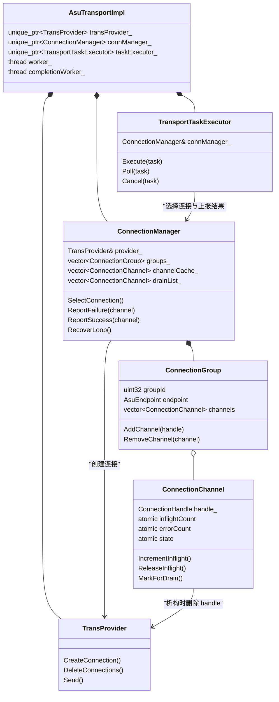
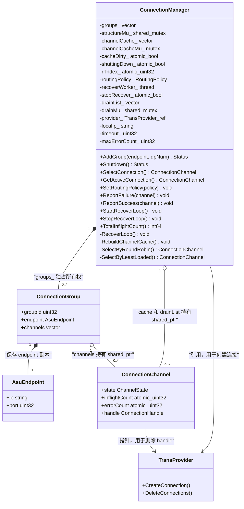
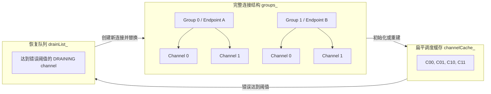
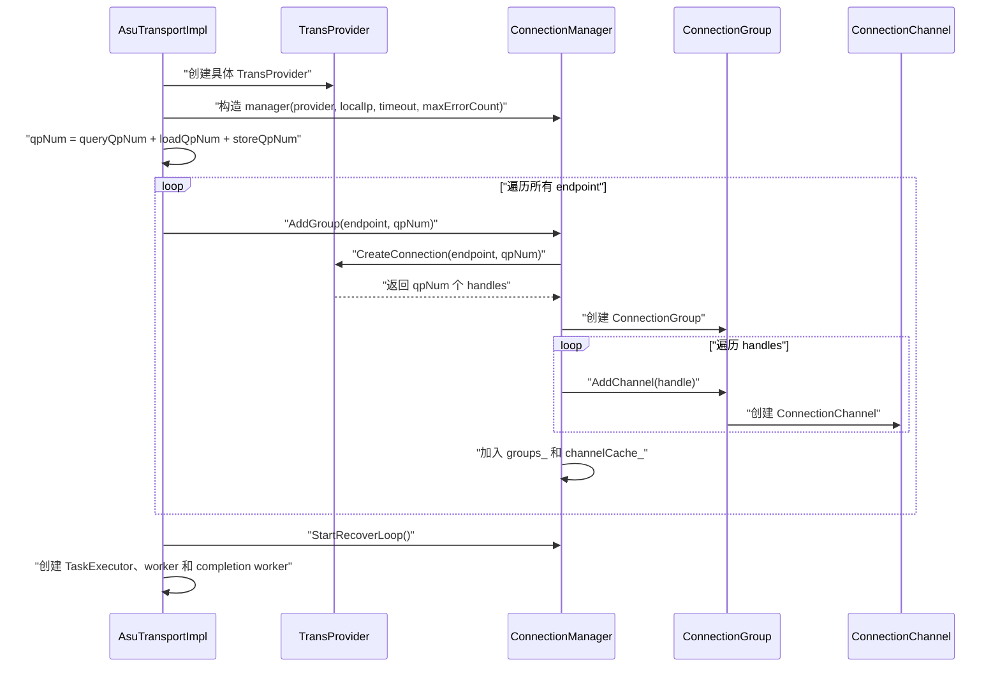
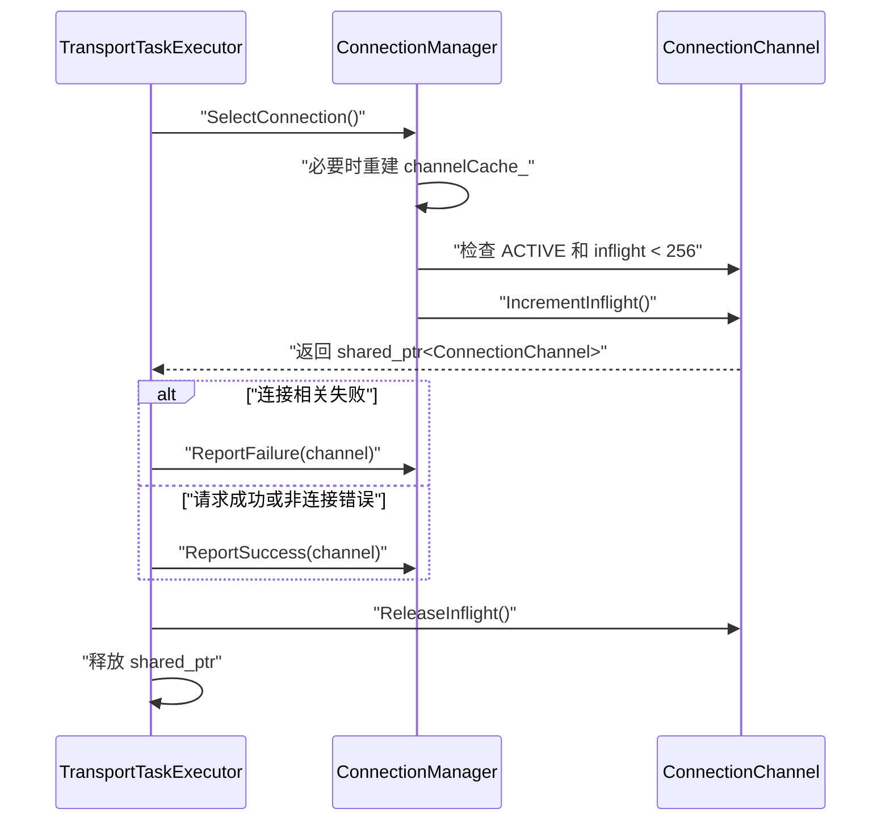
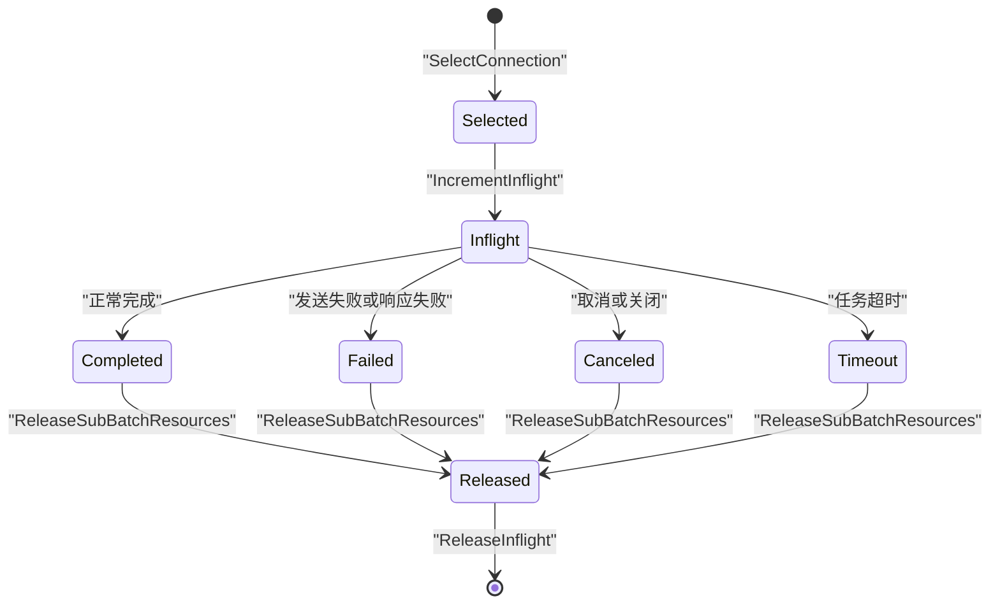
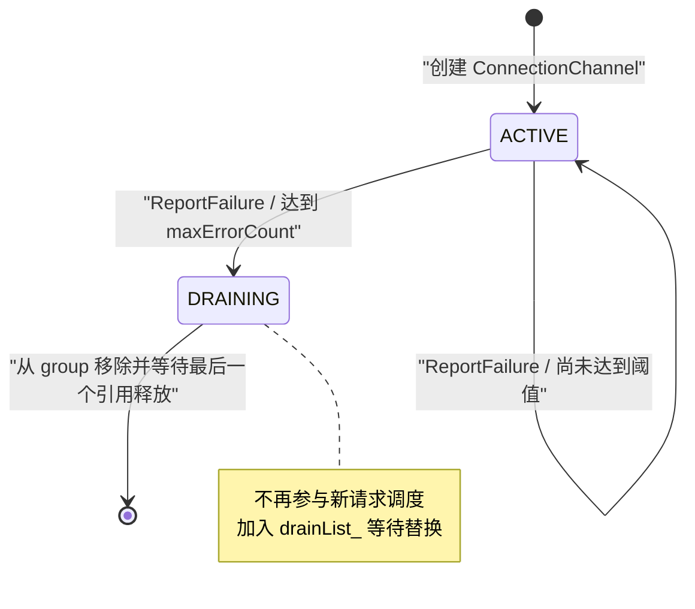
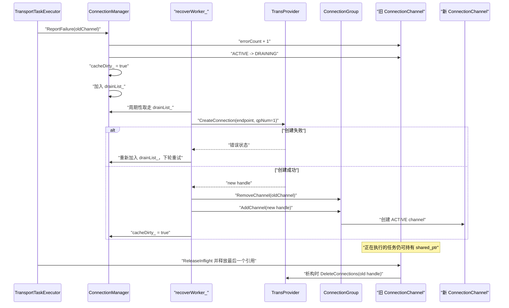
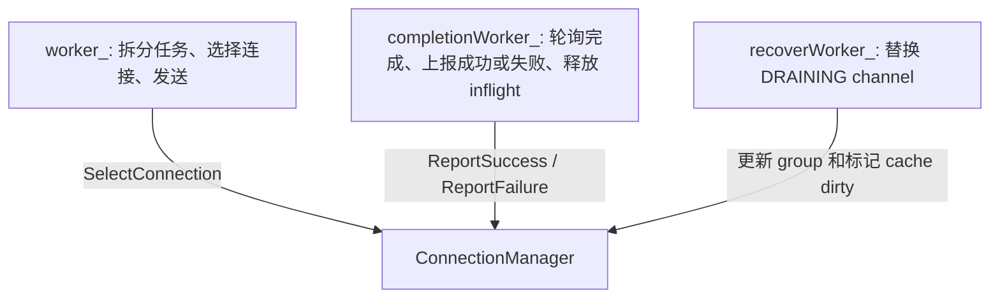
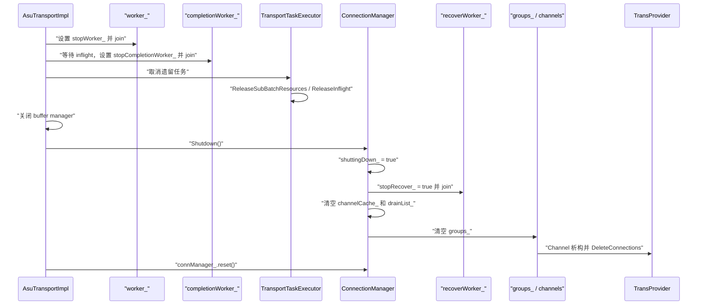

# ConnectionManager 设计与调用流程

## 1. 概述

`ConnectionManager` 是 ASU Transport 中的连接管理组件，负责：

- 按远端 `AsuEndpoint` 创建并组织多个连接；
- 为每个 sub-batch 选择可用连接；
- 维护连接的 inflight 数量和连续错误次数；
- 将达到错误阈值的连接移出调度；
- 在后台创建新连接替换异常连接；
- 在 Transport 关闭时停止恢复线程并释放连接资源。

相关实现：

- [`connection_manager.h`](../trans/src/connection_manager.h)
- [`connection_manager.cpp`](../trans/src/connection_manager.cpp)
- [`connection_internal.h`](../trans/src/connection_internal.h)
- [`connection_internal.cpp`](../trans/src/connection_internal.cpp)
- [`transport_task_executor.cpp`](../trans/src/transport_task_executor.cpp)
- [`asu_transport_impl.cpp`](../trans/src/asu_transport_impl.cpp)

## 2. 组件关系



### 2.1 ConnectionManager

`ConnectionManager` 保存所有 group，并对调用侧提供统一的连接选择和故障上报接口。

下面的类图只展开 `ConnectionManager` 自身及其直接关联对象：



它通过引用持有 `TransProvider`：

```cpp
TransProvider& provider_;
```

因此 `TransProvider` 的生命周期必须长于 `ConnectionManager`。当前 `AsuTransportImpl` 先创建 provider，再创建 manager；关闭时先销毁 manager，满足该要求。

### 2.2 ConnectionGroup

当前初始化流程中，一个配置的远端 endpoint 对应一个 `ConnectionGroup`。`ConnectionGroup` 是代码中的逻辑容器，不是 Provider 创建出来的底层网络对象。

三者关系是：

```text
AsuEndpoint 配置（IP + Port）
        │ AddGroup(endpoint, qpNum)
        ▼
ConnectionGroup（保存 endpoint 副本）
        │
        ├── ConnectionChannel 0 ── connection handle / QP 0
        ├── ConnectionChannel 1 ── connection handle / QP 1
        └── ...
```

对应关系为：

| 对象 | 对应的实际含义 | 当前关系 |
| --- | --- | --- |
| `AsuEndpoint` | 一个远端 ASU 服务地址，即 IP 和 Port | 每个配置 endpoint 调用一次 `AddGroup()` |
| `ConnectionGroup` | 某个 endpoint 下全部连接的逻辑分组 | 当前与 endpoint 一对一 |
| `ConnectionChannel` | `TransProvider::CreateConnection()` 返回的一个 handle，通常对应一个 QP | 一个 group 下有 `qpNum` 个 channel |

Group 主要解决两个问题：

1. 保存 channel 属于哪个 endpoint，恢复连接时可以从旧 channel 找回 IP 和 Port；
2. 恢复成功后，将新 channel 放回原 endpoint 对应的 group。

Group 不表示 Query、Load 或 Store 类型。当前调用侧先计算：

```cpp
qpNum = queryQpNum + loadQpNum + storeQpNum;
```

然后为每个 endpoint 创建同样数量的 channel；这些 channel 在 `channelCache_` 中统一参与调度，没有按操作类型进一步分组。

`groupId` 标识 group；`channelId` 在每个 group 内从 0 独立递增，因此 `(groupId, channelId)` 才能唯一标识一个 channel。

### 2.3 ConnectionChannel

一个 `ConnectionChannel` 对应一个实际的 provider connection handle，维护：

| 字段 | 含义 |
| --- | --- |
| `handle_` | Provider 返回的底层连接句柄 |
| `inflightCount` | 当前使用该 channel 的 sub-batch 数量 |
| `errorCount` | 连续连接错误次数 |
| `state` | `ACTIVE`、`DRAINING` 或 `FAILED` |
| `group` | 所属 `ConnectionGroup` |

Channel 使用 `shared_ptr` 管理。恢复线程将旧 channel 从 group 移除后，正在运行的任务仍可以继续持有它；最后一个引用释放时，channel 析构并调用 `DeleteConnections()` 删除旧 handle。

## 3. 内部数据结构



### 3.1 `groups_`

`groups_` 是完整连接结构，保存 endpoint、group 和 channel 的归属关系，也是恢复连接时使用的结构源。

### 3.2 `channelCache_`

`channelCache_` 将全部 group 中的 channel 扁平化，避免每次选择连接时进行两层遍历。

当 channel 进入 `DRAINING` 或恢复线程替换 channel 后，代码设置：

```cpp
cacheDirty_.store(true, std::memory_order_release);
```

下一次选择连接时，通过 `RebuildChannelCache()` 从 `groups_` 重建只包含 `ACTIVE` channel 的缓存。

### 3.3 `drainList_`

`drainList_` 保存等待恢复的 channel。恢复线程周期性取走整个列表，为每个异常 channel 创建一个替代连接；创建失败的 channel 会重新放回列表，等待下一轮重试。

## 4. 初始化流程

初始化入口是 `AsuTransportImpl::Init()`。



当前调用顺序保证所有 `AddGroup()` 都在恢复线程和业务 worker 启动前完成：

```text
创建 ConnectionManager
    ↓
AddGroup(endpoint 0)
    ↓
AddGroup(endpoint 1)
    ↓
...
    ↓
StartRecoverLoop()
    ↓
启动业务 worker
```

## 5. 调用侧交互边界

完整的 Submit、任务排队、sub-batch 拆分、Send、CQE 轮询和完成回调不属于 `ConnectionManager` 的职责，统一记录在 [`asu_client_transport_flow.md`](asu_client_transport_flow.md) 中。

`ConnectionManager` 只参与三个环节：选择连接、接收连接结果反馈，以及由调用侧释放 channel 的 inflight 占用。



如果没有可用 channel，`SelectConnection()` 返回 `nullptr`，调用侧将对应 sub-batch 标记为 `CONNECTION_ERROR`。

## 6. 连接选择

代码实现了两种选择策略：

| 策略 | 行为 | 当前生产状态 |
| --- | --- | --- |
| `ROUND_ROBIN` | 从递增的 `rrIndex_` 起点循环选择可用 channel | 默认且实际使用 |
| `LEAST_LOADED` | 选择 inflight 最少的可用 channel | 仅测试通过 `SetRoutingPolicy()` 使用 |

当前生产代码没有调用 `SetRoutingPolicy()`，因此实际始终使用 Round Robin。

Round Robin 的选择条件为：

```cpp
channel->GetState() == ChannelState::ACTIVE &&
channel->GetInflightCount() < kMaxInflightPerChannel
```

选中后立即调用 `IncrementInflight()`，从而为该 sub-batch 占用一个 channel 配额。每个 channel 的上限当前固定为 256。

## 7. inflight 生命周期



`SelectConnection()` 增加 inflight；以下路径最终都通过 `ReleaseSubBatchResources()` 减少 inflight：

- 正常完成；
- 发送失败；
- CQE 或协议处理失败；
- 任务超时；
- 用户取消；
- Transport 关闭时取消遗留任务。

资源释放完成后，调用侧同时将 `subBatchContext.channel` 置空，释放对 channel 的 `shared_ptr`。

## 8. 错误统计与状态流转



当前 `FAILED` 状态已声明，但实际状态流转中未使用。

### 8.1 失败上报

当前生产调用侧在以下场景调用 `ReportFailure()`：

- `TransProvider::Send()` 返回 sub-batch 发送失败；
- 任务执行超时；
- CQE 返回 `ASU_CQE_INTERNAL_ERROR`；
- CQE 返回 `ASU_CQE_IO_TIMEOUT`。

处理步骤如下：

```text
errorCount + 1
    ├── 小于 maxErrorCount：保持 ACTIVE
    └── 达到 maxErrorCount：
            ACTIVE → DRAINING
            cacheDirty_ = true
            加入 drainList_
```

`MarkForDrain()` 使用 CAS，将状态从 `ACTIVE` 修改为 `DRAINING`，避免同一个 channel 被重复加入恢复队列。

### 8.2 成功上报

正常完成或不属于连接故障的响应调用 `ReportSuccess()`：

```cpp
channel->ResetErrorCount();
```

因此 `errorCount` 表示连续连接错误次数，而不是历史累计错误次数。

## 9. 故障恢复流程



恢复线程每隔 `kRecoverIntervalMs`（当前为 100ms）处理一次恢复列表。

恢复成功后，不会修复原 `ConnectionChannel`，而是在同一个 group 中添加新的 channel。新 channel 使用新的 `channelId`，状态和计数器从初始值开始。

## 10. 并发与锁

| 同步对象 | 保护内容 | 主要调用方 |
| --- | --- | --- |
| `structureMu_` | `groups_` 以及 group 内 channel 结构修改 | 初始化线程、恢复线程、cache 重建 |
| `channelCacheMu_` | `channelCache_` 和连接选择过程 | 业务 worker |
| `drainMu_` | `drainList_` | completion worker、恢复线程 |
| `cacheDirty_` | cache 是否需要重建 | completion worker、恢复线程、业务 worker |
| `rrIndex_` | Round Robin 起始位置 | 连接选择调用方 |
| Channel 原子字段 | 状态、inflight、错误次数 | worker、completion worker、恢复线程 |

当前生产线程关系主要是：



## 11. 关闭流程



上层先停止业务 worker 和 completion worker，并释放任务持有的 channel，再关闭 `ConnectionManager`。因此当前调用侧不会在 manager 清理连接结构时继续选择连接或上报结果。

`ConnectionManager` 析构函数也会调用 `Shutdown()`，当前清理逻辑可以重复执行。

## 12. 生产接口与测试接口

当前生产代码实际调用：

| 接口 | 调用位置 | 用途 |
| --- | --- | --- |
| `AddGroup()` | `AsuTransportImpl::Init()` | 为每个 endpoint 创建连接组 |
| `StartRecoverLoop()` | `AsuTransportImpl::Init()` | 启动异常连接恢复线程 |
| `SelectConnection()` | `TransportTaskExecutor::AssignSubBatchConnections()` | 为 sub-batch 选择连接 |
| `ReportFailure()` | 发送失败、超时和指定 CQE 错误路径 | 累计连续错误并触发恢复 |
| `ReportSuccess()` | 正常完成路径 | 清零连续错误计数 |
| `Shutdown()` | `AsuTransportImpl::Shutdown()` | 停止恢复并释放连接 |

以下接口当前只在测试中使用：

- `SetRoutingPolicy()`；
- `GetActiveConnection()`；
- `TotalInflightCount()`；
- `LEAST_LOADED` 路由策略。

因此当前生产设计可以概括为：

```text
按 endpoint 创建多 QP 连接
        ↓
Round Robin 分配 sub-batch
        ↓
维护 inflight 和连续错误计数
        ↓
异常连接停止调度
        ↓
后台创建新连接进行替换
        ↓
Transport 关闭时统一释放
```
