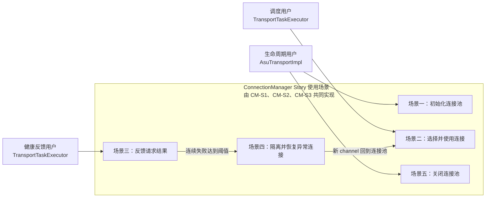
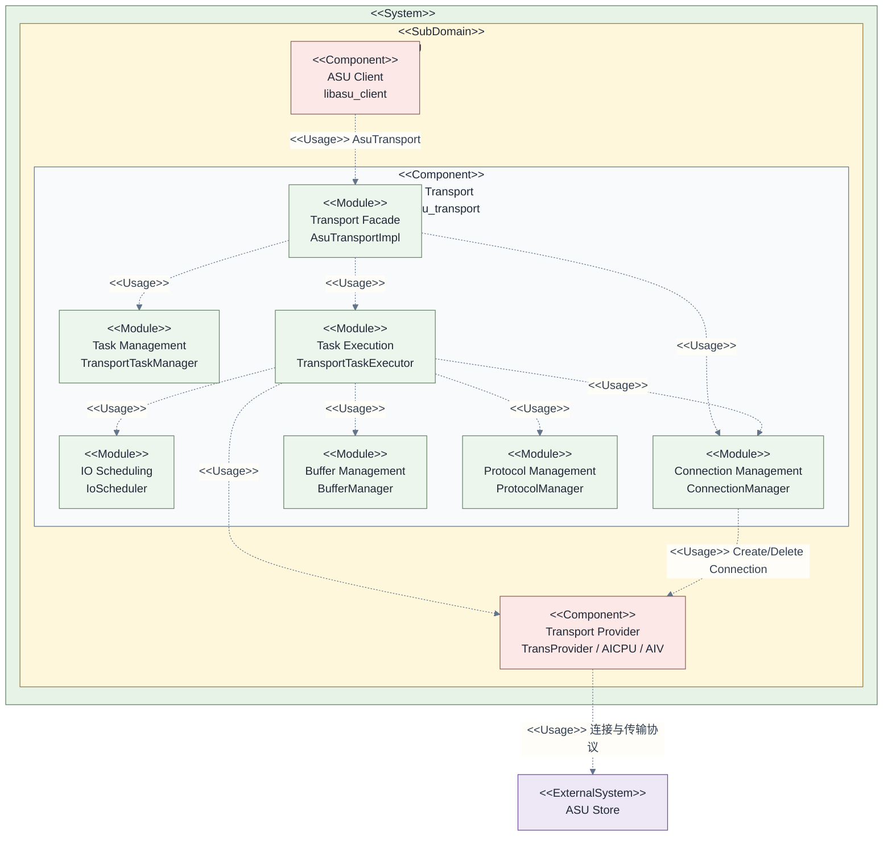
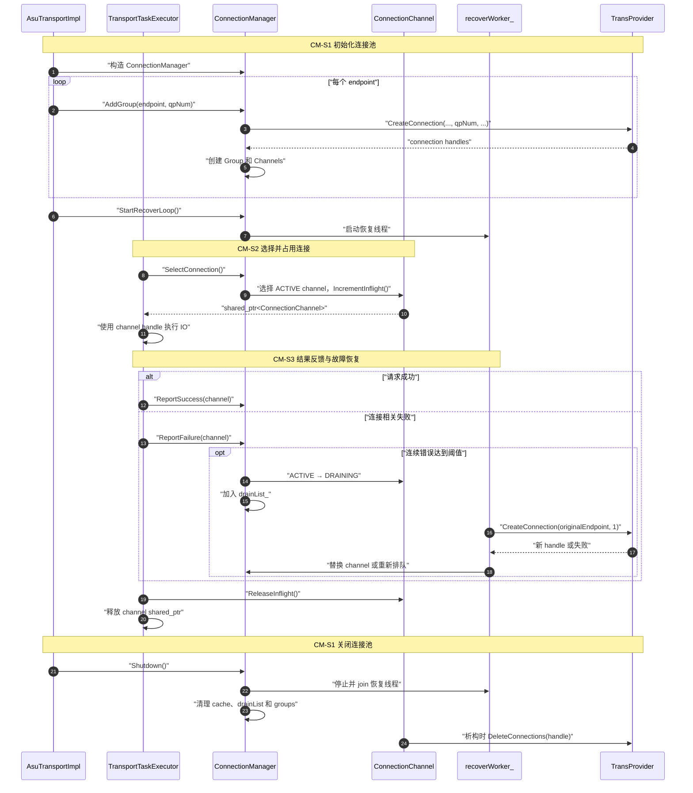
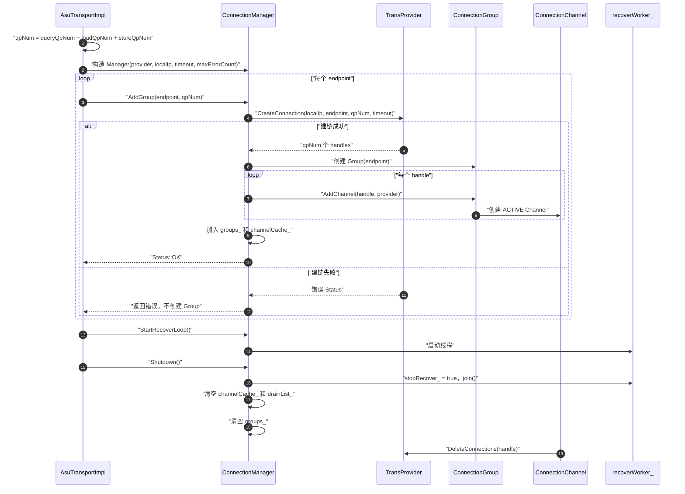
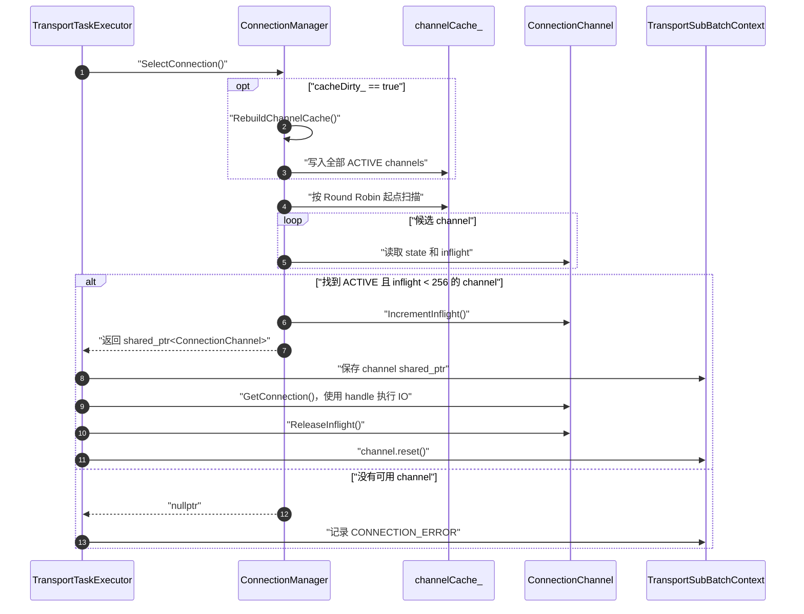
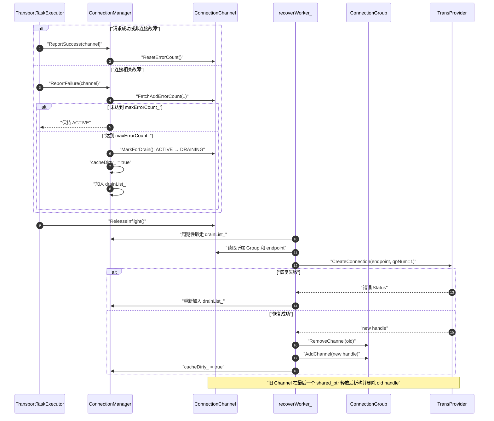
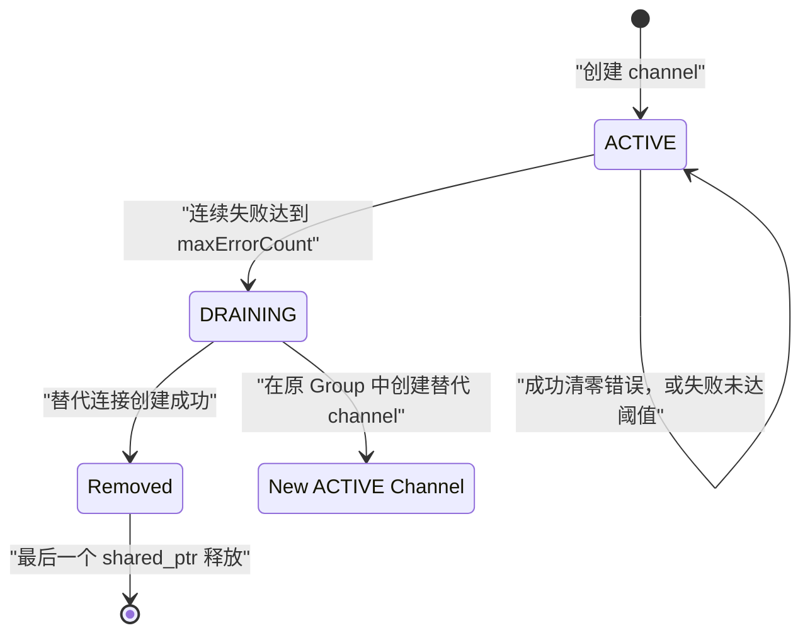
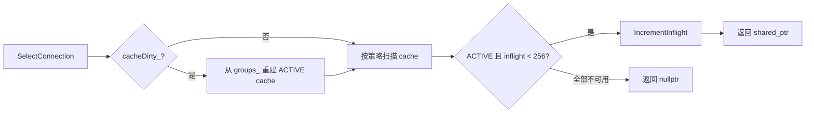
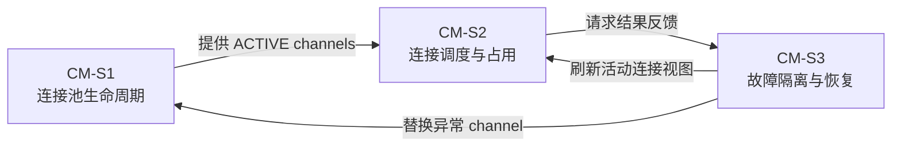

# ConnectionManager Story 设计

## 1. Story 需求描述

`ConnectionManager` 需要为 ASU Transport 提供统一的连接池管理能力：按配置的 endpoint 创建并组织 Group 和 Channel，从全部活动连接中选择未达到并发上限的 channel 并维护 inflight 占用，根据调用侧反馈的连续成功或失败更新连接健康状态，将达到错误阈值的 channel 停止调度并异步替换，在恢复失败时保留重试机会，同时通过 `shared_ptr` 保证执行中任务持有的旧 channel 不会提前析构，并在 Transport 关闭时停止恢复线程、释放连接结构和底层 Provider handle；该 Story 不负责 ASU ID 路由、任务拆分聚合、Send/Poll、协议编解码以及 KV 数据一致性。

## 2. Story 背景描述

ASU Client 将 Query、Load、Store、Delete 等 KV 请求路由到对应的 ASU Transport，Transport 再通过 `TransProvider` 与远端 ASU Store 通信；一个 Transport 可能面向多个 endpoint，并为每个 endpoint 建立多个连接，同时由任务执行线程、完成处理线程和恢复线程并发使用这些连接。如果将建链、连接选择、负载计量、错误判断、故障替换和资源释放分散在各条任务路径中，连接状态和生命周期很难保持一致，因此在 `TransportTaskExecutor` 与 `TransProvider` 之间引入 `ConnectionManager`，集中承担连接资源组织、调度、健康判断、后台恢复和关闭清理职责。

## 3. Story 用户使用场景分析

### 3.1 Story 用户与协作者

本 Story 没有直接面向最终用户的人机接口，其“用户”是调用 ConnectionManager 能力的上游组件。

| 角色                             | 类型          | 目标                            | 使用的主要能力                                                    |
| ------------------------------ | ----------- | ----------------------------- | ---------------------------------------------------------- |
| `AsuTransportImpl`             | 生命周期用户      | 按配置建立连接池，并在 Transport 关闭时释放资源 | `AddGroup()`、`StartRecoverLoop()`、`Shutdown()`             |
| `TransportTaskExecutor` 请求执行路径 | 调度用户        | 为待发送 sub-batch 取得可用连接         | `SelectConnection()`、`GetConnection()`、`ReleaseInflight()` |
| `TransportTaskExecutor` 完成处理路径 | 健康反馈用户      | 将成功、失败或超时结果反馈给连接管理器           | `ReportSuccess()`、`ReportFailure()`                        |
| `TransProvider`                | 外部依赖        | 提供实际建链和销链能力                   | `CreateConnection()`、`DeleteConnections()`                 |
| `recoverWorker_`               | Story 内部执行者 | 消费异常连接并完成后台替换                 | `RecoverLoop()` 内部流程                                       |

### 3.2 使用场景总览

以下五个节点表示 Story 在不同触发条件下的使用场景，不表示五个 Shard。一个 Shard 可以参与多个场景，一个场景也可能由多个 Shard 协作完成。



场景描述“谁在什么条件下使用能力”，Shard 描述“系统内部由哪个功能模块实现能力”，两者不是一一等同关系。具体对应关系见 3.4 节。

### 3.3 场景分析

| 场景                 | 触发者与触发条件                                | 前置条件                              | 主成功结果                                          | 异常或替代结果                                   |
| ------------------ | --------------------------------------- | --------------------------------- | ---------------------------------------------- | ----------------------------------------- |
| US-CM-01 初始化连接池    | `AsuTransportImpl::Init()` 获得有效配置       | Provider 已创建；endpoint 和 qpNum 已确定 | 每个 endpoint 建立 Group 和 Channels，随后启动恢复线程       | 任一建链失败时初始化返回对应错误，不建立不完整 Group             |
| US-CM-02 选择并使用连接   | Executor 准备下发一个 sub-batch               | Manager 未关闭；至少存在可用 channel        | 返回 `ACTIVE` channel，同时 inflight 增加 1           | 无可用连接时返回 `nullptr`，调用侧将 sub-batch 处理为连接错误 |
| US-CM-03 反馈请求结果    | Send、Poll 或超时路径得到连接相关结果                 | 调用侧仍持有所用 channel                  | 成功清零连续错误；连接错误累加错误计数；所有结束路径释放 inflight          | 非连接类业务错误不触发恢复；取消路径只完成资源清理                 |
| US-CM-04 隔离并恢复异常连接 | 连续失败达到 `maxErrorCount_`                 | channel 当前为 `ACTIVE`              | channel 转为 `DRAINING`，后台在原 Group 中创建替代 channel | 重建失败则重新排队；旧 channel 由执行中任务继续保活            |
| US-CM-05 关闭连接池     | `AsuTransportImpl::Shutdown()` 进入连接清理阶段 | 业务 worker 已停止或正在按关闭顺序退出           | 停止恢复线程，清理连接结构，最后释放 Provider handles            | 重复关闭不重复释放同一资源                             |

### 3.4 主场景与 Shard 映射

| 使用场景               | CM-S1  | CM-S2       | CM-S3   |
| ------------------ | ------ | ----------- | ------- |
| US-CM-01 初始化连接池    | 主责     | 读取初始化后的活动视图 | 启动恢复能力  |
| US-CM-02 选择并使用连接   | 提供连接资源 | 主责          | 不参与正常选择 |
| US-CM-03 反馈请求结果    | 不直接参与  | 释放 inflight | 主责      |
| US-CM-04 隔离并恢复异常连接 | 接收替代连接 | 刷新活动视图      | 主责      |
| US-CM-05 关闭连接池     | 主责     | 停止选择        | 停止恢复    |

## 4. Story 设计描述

### 4.1 Story 定义

`ConnectionManager` 整体作为一个 Story：

> 作为 ASU Transport，我希望通过统一的连接管理组件建立和维护连接池，为传输任务提供可用连接，并根据任务结果隔离和替换持续异常的连接，使请求调度、故障恢复和资源释放具有一致的行为。

本 Story 关注的是 Transport 内部的连接生命周期，不负责 ClientTask 拆分、协议编解码、SQE/CQE 处理或 ASU ID 之间的业务路由。

### 4.2 总体设计思路

本 Story 采用“结构化管理、扁平化调度、结果驱动健康判断、后台单连接替换”的设计：

1. **结构化管理**：每个 endpoint 对应一个 `ConnectionGroup`，Group 保存 endpoint 和所属 channels，形成完整连接资源结构；
2. **扁平化调度**：所有 Group 的 `ACTIVE` channel 汇入 `channelCache_`，请求无需先选择 Group，可直接进行 Round Robin 调度；
3. **占用与生命周期分离**：`inflightCount` 表示负载，`shared_ptr` 保证 Channel 和 handle 在任务释放前继续存活；
4. **结果驱动健康判断**：调用侧通过 `ReportSuccess()` 和 `ReportFailure()` 维护连续错误，而不是由 Manager 解析协议结果；
5. **后台单连接替换**：达到阈值的 channel 转为 `DRAINING`，恢复线程在原 Group 内创建新 channel，不阻塞正常连接的请求调度；
6. **Provider 能力抽象**：Manager 依赖 `TransProvider` 建链，Channel 通过 Provider 销链，连接管理逻辑不绑定具体传输后端。

本文将 Story 收敛为三个功能 Shard：

| Shard         | 设计范围                                 | 主流程位置     |
| ------------- | ------------------------------------ | --------- |
| CM-S1 连接池生命周期 | 按 endpoint 建立连接组、启动恢复能力、关闭并释放资源      | 初始化与关闭    |
| CM-S2 连接调度与占用 | 从活动连接中选择 channel，维护 inflight 和任务持有关系 | 请求下发      |
| CM-S3 故障隔离与恢复 | 统计连续错误、隔离异常 channel、创建替代连接           | 请求完成与后台恢复 |

这里的 Shard 是 Story 下的功能设计单元，不是 KV 数据分片，也不是代码中的 `ConnectionGroup`。

详细类成员、锁和完整代码调用点参见 [`connection_manager_design.md`](connection_manager_design.md)；完整 Transport IO 流程参见 [`asu_client_transport_flow.md`](asu_client_transport_flow.md)。

### 4.3 逻辑模型

本节参考华为云 CodeArts Modeling 的[逻辑模型建模规范](https://support.huaweicloud.com/usermanual-codeartsmodeling/modeling_ug_0002_3_2.html)，描述系统由哪些逻辑组件和模块构成，以及这些软件对象之间的静态使用关系。

逻辑模型不按 CM-S1、CM-S2、CM-S3 功能过程分解。三个 Shard 是本 Story 的特性设计单元；逻辑模型则把 `ConnectionManager` 放回 ASU Client、ASU Transport、Transport Provider 和 ASU Store 构成的整体软件结构中。



逻辑层级与代码映射如下：

| 层级             | 逻辑元素                     | 代码或交付映射                                        | 与 ConnectionManager 的关系      |
| -------------- | ------------------------ | ---------------------------------------------- | ---------------------------- |
| System         | Unified Cache Management | 当前代码仓                                          | 顶层产品边界                       |
| SubDomain      | ASU                      | `ucm/transport/kv/asu`                         | ASU Client 与 Transport 所在能力域 |
| Component      | ASU Client               | `libasu_client`、`client/`                      | 通过 `AsuTransport` 间接使用连接能力   |
| Component      | ASU Transport            | `libasu_transport`、`trans/`                    | `ConnectionManager` 所属组件     |
| Module         | Connection Management    | `connection_manager.*`、`connection_internal.*` | 本 Story 的核心实现模块              |
| Component      | Transport Provider       | `TransProvider` 及 AICPU/AIV 实现                 | 为 Manager 提供建链和销链能力          |
| ExternalSystem | ASU Store                | 远端 ASU 服务                                      | Provider 实际连接的远端系统           |

图中的纵向主关系是：ASU Client 使用 ASU Transport，ASU Transport 通过 Provider 与 ASU Store 通信。`ConnectionManager` 位于 ASU Transport 内部，与 Task Execution 同级；Task Execution 使用它选择连接并反馈结果，它再依赖 Transport Provider 管理底层连接。

### 4.4 实现结构模型

本节参考华为云 CodeArts Modeling 的[类图规范](https://support.huaweicloud.com/usermanual-codeartsmodeling/modeling_ug_0003_2.html)，描述上述逻辑功能在当前代码中的主要承载类和对象关系。

  ```mermaid
  %%{init: {"flowchart": {"curve": "stepBefore"}}}%%
  classDiagram
      direction TB

    class AsuTransportImpl {
        -transProvider_ : unique_ptr~TransProvider~
        -connManager_ : unique_ptr~ConnectionManager~
        -taskExecutor_ : unique_ptr~TransportTaskExecutor~
    }

    class TransportTaskExecutor {
        -connManager_ : ConnectionManager*
        +Execute() : Status
        +Poll() : Status
        +Cancel() : Status
    }

    class ConnectionManager {
        +AddGroup() : Status
        +SelectConnection() : shared_ptr~ConnectionChannel~
        +ReportSuccess() : void
        +ReportFailure() : void
        +StartRecoverLoop() : void
        +Shutdown() : Status
        -groups_ : vector~ConnectionGroup~
        -channelCache_ : vector~shared_ptr~ConnectionChannel~~
        -drainList_ : vector~shared_ptr~ConnectionChannel~~
        -provider_ : TransProvider*
        -RecoverLoop() : void
    }

    class ConnectionGroup {
        -groupId : uint32_t
        -endpoint : AsuEndpoint
        -channels : vector~shared_ptr~ConnectionChannel~~
        +AddChannel() : shared_ptr~ConnectionChannel~
        +RemoveChannel() : void
    }

    class ConnectionChannel {
        -handle_ : ConnectionHandle
        -provider_ : TransProvider*
        -state : ChannelState
        -inflightCount : atomic~uint32_t~
        -errorCount : atomic~uint32_t~
        +GetConnection() : ConnectionHandle
        +ReleaseInflight() : void
        +MarkForDrain() : bool
    }

    class TransProvider {
        <<interface>>
        +CreateConnection() : Status
        +DeleteConnections() : vector~Status~
    }

    class AICPUTransProvider
    class AIVTransProviderAdapter
    class FakeTransProvider

    AsuTransportImpl "1" *-- "1" ConnectionManager
    ConnectionManager "1" *-- "0..*" ConnectionGroup
    ConnectionGroup "1" o-- "0..*" ConnectionChannel
    ConnectionChannel ..> TransProvider : uses
    AsuTransportImpl "1" *-- "1" TransportTaskExecutor
    AsuTransportImpl "1" *-- "1" TransProvider
    TransportTaskExecutor ..> ConnectionManager : uses
    ConnectionManager "1" o-- "0..*" ConnectionChannel
    ConnectionManager ..> TransProvider : uses
    AICPUTransProvider ..|> TransProvider
    AIVTransProviderAdapter ..|> TransProvider
    FakeTransProvider ..|> TransProvider
```

连线关系说明：

- **组合（Composition, `*--`）**：`AsuTransportImpl` 通过 `unique_ptr` 独占拥有 `ConnectionManager`、`TransportTaskExecutor` 和 `TransProvider`；`ConnectionManager` 独占拥有 `ConnectionGroup`。部分不能离开整体单独存在。
- **聚合（Aggregation, `o--`）**：`ConnectionManager` 和 `ConnectionGroup` 通过 `shared_ptr` 共享引用 `ConnectionChannel`。部分可以离开整体单独存在（执行中任务持有 `shared_ptr` 保活）。
- **使用（Usage, `..>`）**：`TransportTaskExecutor` 运行时使用 `ConnectionManager` 选择连接并反馈结果；`ConnectionManager` 和 `ConnectionChannel` 运行时使用 `TransProvider` 建链和销链。

核心对象关系如下：

```text
一个 AsuTransportImpl
└── 一个 ConnectionManager
    ├── N 个 ConnectionGroup（每个配置 endpoint 对应一个 group）
    │   └── M 个 ConnectionChannel（每个 Provider handle 对应一个 channel）
    ├── channelCache_：全部 ACTIVE channel 的扁平调度视图
    └── drainList_：等待后台替换的 DRAINING channel
```

`ConnectionGroup` 保留 endpoint 归属，便于故障恢复时按原地址重新建链；实际连接选择直接遍历扁平的 `channelCache_`，不会先选 group 再选 channel。

### 4.5 ConnectionManager 上下文模型

本节参考华为云 CodeArts Modeling 的[上下文模型规范](https://support.huaweicloud.com/usermanual-codeartsmodeling/modeling_ug_0002_7_2.html)。模型只保留与本 Story 直接交互的模块，并使用当前代码中的真实 API 名称表示 Interface；ASU Client 和 ASU Store 属于间接上下游，已在 4.3 逻辑模型中表达，不在本图重复展开。

```mermaid
%%{init: {"theme":"base","themeVariables":{"background":"#F8FAFC","primaryTextColor":"#1F2937","lineColor":"#64748B","edgeLabelBackground":"#FFFDF7","fontFamily":"Arial, sans-serif"}}}%%
flowchart TB
    subgraph L1["协作者"]
        direction LR
        Lifecycle["&lt;&lt;Module&gt;&gt;<br/>AsuTransportImpl"]
        Executor["&lt;&lt;Module&gt;&gt;<br/>TransportTaskExecutor"]
    end

    subgraph L2["Provided Interface"]
        direction LR
        LifecycleApi["&lt;&lt;Provided Interface&gt;&gt;<br/>AddGroup()<br/>StartRecoverLoop()<br/>Shutdown()"]
        DispatchApi["&lt;&lt;Provided Interface&gt;&gt;<br/>SelectConnection()"]
        FeedbackApi["&lt;&lt;Provided Interface&gt;&gt;<br/>ReportSuccess()<br/>ReportFailure()"]
        ChannelApi["&lt;&lt;Provided Interface&gt;&gt;<br/>ConnectionChannel::GetConnection()<br/>ConnectionChannel::ReleaseInflight()"]
    end

    subgraph Boundary["&lt;&lt;Boundary&gt;&gt;<br/>ConnectionManager Story"]
        direction LR
        Manager["&lt;&lt;Module&gt;&gt;<br/>ConnectionManager"]
        Channel["&lt;&lt;Internal Entity&gt;&gt;<br/>ConnectionChannel"]
        Manager ---|"返回 shared_ptr"| Channel
    end

    subgraph L3["Required Interface"]
        direction LR
        CreateApi["&lt;&lt;Required Interface&gt;&gt;<br/>TransProvider::CreateConnection()"]
        DeleteApi["&lt;&lt;Required Interface&gt;&gt;<br/>TransProvider::DeleteConnections()"]
    end

    subgraph L4["外部依赖"]
        Provider["&lt;&lt;Component&gt;&gt;<br/>TransProvider"]
    end

    Lifecycle -. "&lt;&lt;Usage&gt;&gt;" .-> LifecycleApi
    Manager -. "&lt;&lt;Realization&gt;&gt;" .-> LifecycleApi

    Executor -. "&lt;&lt;Usage&gt;&gt;" .-> DispatchApi
    Executor -. "&lt;&lt;Usage&gt;&gt;" .-> FeedbackApi
    Manager -. "&lt;&lt;Realization&gt;&gt;" .-> DispatchApi
    Manager -. "&lt;&lt;Realization&gt;&gt;" .-> FeedbackApi

    Executor -. "&lt;&lt;Usage&gt;&gt;" .-> ChannelApi
    Channel -. "&lt;&lt;Realization&gt;&gt;" .-> ChannelApi

    Manager -. "&lt;&lt;Usage&gt;&gt;" .-> CreateApi
    Channel -. "&lt;&lt;Usage&gt;&gt;" .-> DeleteApi
    Provider -. "&lt;&lt;Realization&gt;&gt;" .-> CreateApi
    Provider -. "&lt;&lt;Realization&gt;&gt;" .-> DeleteApi

    classDef collaborator fill:#FCE8E6,stroke:#8B5E57,color:#1F2937,stroke-width:1px
    classDef interface fill:#EDE7F6,stroke:#6A4C93,color:#1F2937,stroke-width:1px
    classDef system fill:#EDF6ED,stroke:#668568,color:#1F2937,stroke-width:1px
    class Lifecycle,Executor,Provider collaborator
    class LifecycleApi,DispatchApi,FeedbackApi,ChannelApi,CreateApi,DeleteApi interface
    class Manager,Channel system
    style Boundary fill:#FFF7DC,stroke:#9A7B35,color:#1F2937,stroke-width:1px
    style L1 fill:#FCE8E6,stroke:#8B5E57,color:#1F2937,stroke-width:1px
    style L2 fill:#EDE7F6,stroke:#6A4C93,color:#1F2937,stroke-width:1px
    style L3 fill:#EDE7F6,stroke:#6A4C93,color:#1F2937,stroke-width:1px
    style L4 fill:#FCE8E6,stroke:#8B5E57,color:#1F2937,stroke-width:1px
    linkStyle default stroke:#64748B,color:#334155
```



上下文关系说明：

- `AsuTransportImpl` 直接使用 `AddGroup()`、`StartRecoverLoop()` 和 `Shutdown()` 管理连接池生命周期；
- `TransportTaskExecutor` 直接使用 `SelectConnection()` 获取 channel，并通过 `ReportSuccess()`、`ReportFailure()` 反馈结果；
- `SelectConnection()` 返回 `shared_ptr<ConnectionChannel>` 后，Executor 使用 `GetConnection()` 取得 handle，并在结束路径调用 `ReleaseInflight()`；
- `ConnectionManager` 使用 `TransProvider::CreateConnection()` 建立初始或替代连接；
- `ConnectionChannel` 在析构时使用 `TransProvider::DeleteConnections()` 删除底层 handle；
- `SetRoutingPolicy()`、`GetActiveConnection()` 和 `TotalInflightCount()` 当前仅测试使用，不进入生产上下文主图。

### 4.6 Story 运行时序

#### 4.6.1 Story 总体运行时序

下图保留本 Story 从初始化、连接使用、结果反馈、故障恢复到关闭的主干过程，各 Shard 的内部细节在后续时序图中展开。



时序步骤：

1. `AsuTransportImpl` 构造 `ConnectionManager`，并按 endpoint 调用 `AddGroup()` 建立初始连接池。
2. Manager 通过 `TransProvider` 创建 handles，将其组织为 Group 和 Channels，然后启动恢复线程。
3. `TransportTaskExecutor` 调用 `SelectConnection()` 获取 channel；成功返回前，Manager 已增加该 channel 的 inflight。
4. Executor 使用 channel 的底层 handle 执行 IO，并根据结果调用 `ReportSuccess()` 或 `ReportFailure()`。
5. 连续失败达到阈值时，channel 转为 `DRAINING`，恢复线程尝试创建替代连接；请求结束后调用侧释放 inflight 和 `shared_ptr`。
6. Transport 关闭时，Manager 先停止恢复线程，再清理连接结构；Channel 析构时通过 Provider 删除底层 handle。

#### 4.6.2 CM-S1 连接池生命周期时序



时序步骤：

1. `AsuTransportImpl` 汇总 Query、Load、Store 的 QP 数量，并使用 Provider、local IP、超时和错误阈值构造 Manager。
2. Transport 对每个 endpoint 调用一次 `AddGroup()`，Manager 请求 Provider 批量创建 `qpNum` 个连接。
3. 建链成功后，Manager 创建一个保存 endpoint 的 Group，并将每个 handle 封装成初始状态为 `ACTIVE` 的 Channel。
4. Group 加入 `groups_`，新 Channels 同时进入初始调度缓存；建链失败则直接返回错误，不留下不完整 Group。
5. 全部 endpoint 初始化完成后，Transport 调用 `StartRecoverLoop()` 启动后台恢复线程。
6. 关闭时，Manager 先通知恢复线程退出并等待 `join()`，再清空 cache、drainList 和 groups。
7. Channel 的最后一个引用释放并析构时，调用 Provider 删除对应的底层 handle。

#### 4.6.3 CM-S2 连接调度与占用时序



时序步骤：

1. Executor 为待发送 sub-batch 调用 `SelectConnection()`。
2. 如果活动连接缓存被标记为 dirty，Manager 先从全部 Group 重建只包含 `ACTIVE` channel 的缓存。
3. Manager 按当前生产使用的 Round Robin 策略扫描候选 channel，并读取其状态和 inflight。
4. 找到 `ACTIVE` 且 inflight 小于 256 的 channel 后，Manager 先增加 inflight，再把 `shared_ptr` 返回给 Executor。
5. Executor 将 channel 保存到 `TransportSubBatchContext`，通过 `GetConnection()` 取得 handle 并执行 IO。
6. sub-batch 正常完成、失败、超时、取消或关闭清理时，Executor 调用 `ReleaseInflight()` 并释放 `shared_ptr`。
7. 如果没有可用 channel，Manager 返回 `nullptr`，调用侧将该 sub-batch 记录为连接错误。

#### 4.6.4 CM-S3 故障隔离与恢复时序



时序步骤：

1. 请求成功或被调用侧判断为非连接故障时，Executor 调用 `ReportSuccess()`，Manager 清零该 channel 的连续错误计数。
2. 连接相关故障调用 `ReportFailure()`，Channel 的连续错误计数增加 1；未达到阈值时仍保持 `ACTIVE`。
3. 达到阈值时，`MarkForDrain()` 只允许一次 `ACTIVE → DRAINING` 转换，Manager 标记活动缓存失效并把 channel 加入恢复列表。
4. 请求完成路径独立释放该 channel 的 inflight，占用释放不等待后台恢复完成。
5. 恢复线程周期性取走 `drainList_`，根据旧 channel 所属 Group 保存的 endpoint 请求 Provider 创建一个新连接。
6. 建链失败时，旧 channel 重新进入 `drainList_`，等待下一轮重试。
7. 建链成功时，恢复线程从原 Group 删除旧 channel，使用新 handle 创建一个新的 `ACTIVE` channel，并再次标记调度缓存需要重建。
8. 旧 channel 即使已从 Group 删除，只要执行中的任务仍持有 `shared_ptr` 就继续存活；最后一个引用释放后才析构并删除旧 handle。

### 4.7 Channel 状态模型



`DRAINING` 表示不再接收新请求，不表示 C++ 对象已失效。正在执行的 sub-batch 仍可持有旧 channel，直到完成资源释放。代码声明了 `FAILED`，但当前运行流程没有使用该状态。

## 5. CM-S1：连接池生命周期

### 5.1 设计描述

该 Shard 负责把配置中的 endpoint 转换为可调度连接池，并定义连接池的启停边界。

初始化时，`AsuTransportImpl` 计算：

```cpp
qpNum = queryQpNum + loadQpNum + storeQpNum;
```

随后对每个 endpoint 调用一次 `AddGroup(endpoint, qpNum)`。因此当前模型为：

```text
group 数量 = endpoints 数量
每个 group 的初始 channel 数量 = Provider 返回的 handle 数量
通常总 channel 数量 = endpoints 数量 × qpNum
```

这些 channel 不再按 Query、Load、Store 分类，而是共同进入扁平调度缓存。

关闭时先停止恢复线程，再清理缓存、恢复列表和 group。Channel 的最后一个 `shared_ptr` 释放后，其析构函数调用 Provider 删除底层 handle。

### 5.2 重点实现接口

| 接口                                                    | 契约                                                           |
| ----------------------------------------------------- | ------------------------------------------------------------ |
| `Status AddGroup(const AsuEndpoint&, uint32_t qpNum)` | 为一个 endpoint 创建一个 group，并将 Provider 返回的 handles 封装为 channels |
| `void StartRecoverLoop()`                             | 在全部 group 初始化完成后启动后台恢复线程                                     |
| `Status Shutdown()`                                   | 禁止新选择，停止恢复线程并释放 Manager 持有的连接结构                              |

### 5.3 重点依赖接口

| 依赖接口                                    | 用途                                    |
| --------------------------------------- | ------------------------------------- |
| `TransProvider::CreateConnection(...)`  | 按 endpoint 和数量创建底层 connection handles |
| `TransProvider::DeleteConnections(...)` | 由 `ConnectionChannel` 析构路径删除底层 handle |

### 5.4 关键约束与验收

- Provider 必须先于 Manager 创建，并晚于全部 Channel 销毁；
- 当前调用顺序必须先完成全部 `AddGroup()`，再启动恢复线程和业务 worker；
- Provider 建链失败时，`AddGroup()` 返回失败，不创建不完整的 group；
- `Shutdown()` 后 `SelectConnection()` 返回 `nullptr`；
- 重复调用 `Shutdown()` 不应重复删除同一 handle。

## 6. CM-S2：连接调度与占用

### 6.1 设计描述

该 Shard 为每个待发送 sub-batch 选择一个 `ACTIVE` 且 inflight 未达到上限的 channel。当前生产策略固定使用 Round Robin；Least Loaded 已实现，但仅测试通过 `SetRoutingPolicy()` 使用。

`channelCache_` 是全部 group 中活动 channel 的扁平视图。连接进入 `DRAINING` 或被替换后，Manager 将缓存标记为 dirty；下一次选择时从 `groups_` 重建缓存。

成功选择的同时执行 `IncrementInflight()`，因此返回的 channel 已占用一个并发配额。调用侧必须在正常完成、失败、超时、取消和关闭清理路径中执行一次 `ReleaseInflight()`。



### 6.2 重点实现接口

| 接口                                                 | 契约                                    |
| -------------------------------------------------- | ------------------------------------- |
| `shared_ptr<ConnectionChannel> SelectConnection()` | 选择连接并原地增加 inflight；无可用连接时返回 `nullptr` |
| `void ConnectionChannel::ReleaseInflight()`        | 请求结束时归还由选择操作占用的并发配额                   |

### 6.3 重点依赖接口

| 依赖接口                                    | 用途                                        |
| --------------------------------------- | ----------------------------------------- |
| `ConnectionChannel::GetState()`         | 只允许 `ACTIVE` channel 参与新请求调度              |
| `ConnectionChannel::GetInflightCount()` | 判断是否达到单 channel 上限，并为 Least Loaded 提供负载信息 |
| `ConnectionChannel::GetConnection()`    | 调用侧取得 Provider handle 执行实际 IO             |

### 6.4 生命周期约束

`inflightCount` 和 `shared_ptr` 引用计数解决不同问题：

| 机制                | 含义                                      |
| ----------------- | --------------------------------------- |
| `inflightCount`   | 当前正在使用 channel 的 sub-batch 数量，用于负载和容量判断 |
| `shared_ptr` 引用计数 | 决定 `ConnectionChannel` 及底层 handle 何时析构  |

Group、cache、drainList 和执行中的 sub-batch 可能同时引用同一个 channel，因此 Channel 使用 `shared_ptr`。恢复线程从 Group 删除旧 channel 后，只要任务仍持有它，旧对象和 handle 就不会提前析构。

### 6.5 关键约束与验收

- 只返回 `ACTIVE` 且 inflight 小于 256 的 channel；
- 成功选择与 `IncrementInflight()` 是同一选择流程的一部分；
- 每次成功选择必须在所有结束路径中对应一次 `ReleaseInflight()`；
- 没有可用 channel 时明确返回 `nullptr`，由调用侧转为连接错误；
- 当前生产行为以 Round Robin 为准，Least Loaded 不作为生产配置能力描述。

## 7. CM-S3：故障隔离与恢复

### 7.1 设计描述

该 Shard 使用“连续错误阈值”判断 channel 是否需要隔离。`ReportFailure()` 累加错误计数，`ReportSuccess()` 将其清零；只有连续失败达到 `maxErrorCount_`，状态才从 `ACTIVE` 切换为 `DRAINING`。

`DRAINING` channel 不再参与新请求调度，并被加入 `drainList_`。恢复线程周期性取走待恢复 channel，使用其所属 Group 保存的原 endpoint 创建一个新连接：

- 建链成功：从原 Group 删除旧 channel，并加入新的 `ACTIVE` channel；
- 建链失败：旧 channel 重新进入 `drainList_`，等待下一轮重试。

恢复是“替换 channel”，不是把旧对象改回 `ACTIVE`。旧对象由仍在执行的任务通过 `shared_ptr` 保活。

### 7.2 重点实现接口

| 接口                                                         | 契约                        |
| ---------------------------------------------------------- | ------------------------- |
| `void ReportFailure(const shared_ptr<ConnectionChannel>&)` | 累加连续错误；达到阈值时只触发一次 drain   |
| `void ReportSuccess(const shared_ptr<ConnectionChannel>&)` | 清零连续错误计数                  |
| `void StartRecoverLoop()`                                  | 启动消费 `drainList_` 的后台恢复循环 |

`RecoverLoop()`、`MarkForDrain()` 和 `RebuildChannelCache()` 是 Shard 内部实现点，不作为调用侧接口展开。

### 7.3 重点依赖接口

| 依赖接口                                                | 用途                          |
| --------------------------------------------------- | --------------------------- |
| `TransProvider::CreateConnection(..., 1, ...)`      | 为单个 DRAINING channel 创建替代连接 |
| `ConnectionGroup::RemoveChannel()` / `AddChannel()` | 在原 endpoint 对应的 Group 内完成替换 |

### 7.4 调用侧反馈规则

当前生产代码在以下连接相关场景调用 `ReportFailure()`：Provider 发送失败、任务超时、`ASU_CQE_INTERNAL_ERROR` 和 `ASU_CQE_IO_TIMEOUT`。正常完成或非连接故障路径调用 `ReportSuccess()`。

ConnectionManager 只接收调用侧已经分类的结果，不负责解析 CQE 或业务状态码。

### 7.5 关键约束与验收

- 未达到阈值的失败不隔离 channel；
- `MarkForDrain()` 只允许一次 `ACTIVE → DRAINING` 转换，同一 channel 不重复进入恢复队列；
- `DRAINING` channel 不再被新请求选择；
- 恢复失败保留后续重试机会；
- 恢复成功后，新 channel 回到旧 channel 所属的 Group；
- 旧 channel 的底层 handle 在最后一个 `shared_ptr` 释放时删除。

## 8. Shard 协作关系



三个 Shard 共同完成一个闭环：S1 建立连接池，S2 消费连接，S3 根据消费结果修复连接池。它们不是三个独立 Story。

## 9. 附属能力与非主流程接口

以下能力不再单独划分 Shard：

| 能力                                  | 当前状态                | 归属             |
| ----------------------------------- | ------------------- | -------------- |
| `SetRoutingPolicy()` / Least Loaded | 生产代码未调用，仅测试覆盖       | CM-S2 的预留调度策略  |
| `GetActiveConnection()`             | 当前仅测试使用             | CM-S2 的诊断辅助接口  |
| `TotalInflightCount()`              | 当前仅测试使用             | CM-S2 的统计辅助接口  |
| `StopRecoverLoop()`                 | 主要由 `Shutdown()` 使用 | CM-S1 生命周期内部控制 |

这些接口可以在详细设计或测试设计中说明，但不应提升为与主流程同级的 Story Shard。

## 10. Story 级关键约束

- `ConnectionManager` 通过引用使用 `TransProvider`，Provider 生命周期必须长于 Manager 和 Channel；
- 一个配置 endpoint 对应一个 `ConnectionGroup`，一个 Provider handle 对应一个 `ConnectionChannel`；
- Group 表示 endpoint 归属，不表示 Query、Load、Store，也不是 KV shard；
- `SelectConnection()` 已经增加 inflight，调用侧负责对称释放；
- `shared_ptr` 只保证对象和 handle 的生命周期，不保证故障连接仍能成功通信；
- 当前运行顺序是先完成连接池初始化，再启动恢复线程和业务 worker；关闭时先停止业务任务，再关闭 Manager。

## 11. SFMEA 分析

本节以可执行的故障注入用例记录连接管理的主要单点故障模式。故障注入方法应通过测试桩、Mock、Hook、受控状态篡改或并发栅栏实现，不依赖生产环境制造故障。

| 用例编号 | 故障模式 | 是否涉及 | 故障影响 | 容错措施 | 故障注入方法 | 备注 |
|---|---|---|---|---|---|---|
| CM-SFMEA-01 | 初始建链失败 | 是 | 对应 endpoint 无法提供 channel；初始化可能失败 | `AddGroup()` 返回错误，上层初始化失败路径清理已创建资源 | 打桩 `TransProvider::CreateConnection()`，使初始建链调用返回连接错误 | 验证无残留 Group、channel 或 Provider handle |
| CM-SFMEA-02 | 无可用 channel | 是 | 当前 I/O 无法下发，任务可能部分失败 | 仅选择 `ACTIVE` 且未达到 inflight 上限的 channel；无可用连接时返回空 | 通过测试访问接口将全部 `ConnectionChannel` 置为 `DRAINING`；或将 inflight 计数置为上限 | 验证不向失效或超限连接发送 I/O |
| CM-SFMEA-03 | inflight 未归还 | 是 | 可用并发容量持续下降，严重时全部 channel 不可选 | `ReleaseInflight()` 以原子 CAS 防止计数为负；Transport 终态路径对称释放 | 在 Transport 子批次终态路径设置 Hook，跳过一次 `ReleaseInflight()` 调用 | 调用侧契约风险；验证异常路径后 inflight 计数最终归零 |
| CM-SFMEA-04 | 连续连接失败未达阈值 | 是 | 短时错误不会立即隔离连接，可能出现后续下发失败 | `ReportFailure()` 累计错误，达到阈值前保留连接 | 使用测试桩连续调用 `ConnectionManager::ReportFailure(channel)`，次数设为 `maxErrorCount - 1` | 验证 channel 保持 `ACTIVE`，错误计数递增 |
| CM-SFMEA-05 | 连续连接失败达到阈值 | 是 | 故障 channel 停止参与新请求调度 | `MarkForDrain()` CAS 将 channel 置为 `DRAINING` 并加入恢复队列 | 连续调用 `ReportFailure(channel)` 至 `maxErrorCount`；Mock `MarkForDrain()` 观察其只成功一次 | 验证后续 `SelectConnection()` 不返回该 channel |
| CM-SFMEA-06 | 恢复建链失败 | 是 | 可用连接数下降；全部替换失败时后续 I/O 无法下发 | 失败 channel 保留在 `drainList`，恢复线程后续周期重试 | 先触发 channel drain，再打桩恢复阶段的 `CreateConnection()` 持续返回失败 | 当前重试周期为 100 ms；验证 channel 未错误恢复为 `ACTIVE` |
| CM-SFMEA-07 | 恢复建链成功 | 是 | 故障 channel 被可用新 channel 替代 | 在原 Group 中移除旧 channel、加入新的 `ACTIVE` channel 并刷新缓存 | 先触发 channel drain，再令打桩的 `CreateConnection()` 在下一恢复周期返回有效 handle | 验证新 channel 可被选择；旧 channel 由在途 `shared_ptr` 保活 |
| CM-SFMEA-08 | 关闭期间仍请求调度或恢复 | 是 | 可能访问已释放连接，或导致关闭无法收敛 | `shuttingDown_` 阻止新选择/建组；停止并 join 恢复线程后清理连接结构 | 使用线程栅栏控制 `Shutdown()` 与 `SelectConnection()` / `ReportFailure()` 并发执行；Hook 恢复线程停在建链前后 | 验证关闭后不返回 channel，恢复线程已退出 |

## 12. 一句话总结

> `ConnectionManager` 是一个完整的连接池生命周期 Story：它按 endpoint 建立多 channel 连接池，为 Transport 请求分配和计量连接，并通过连续错误隔离与后台单 channel 替换维持连接池可用性。
