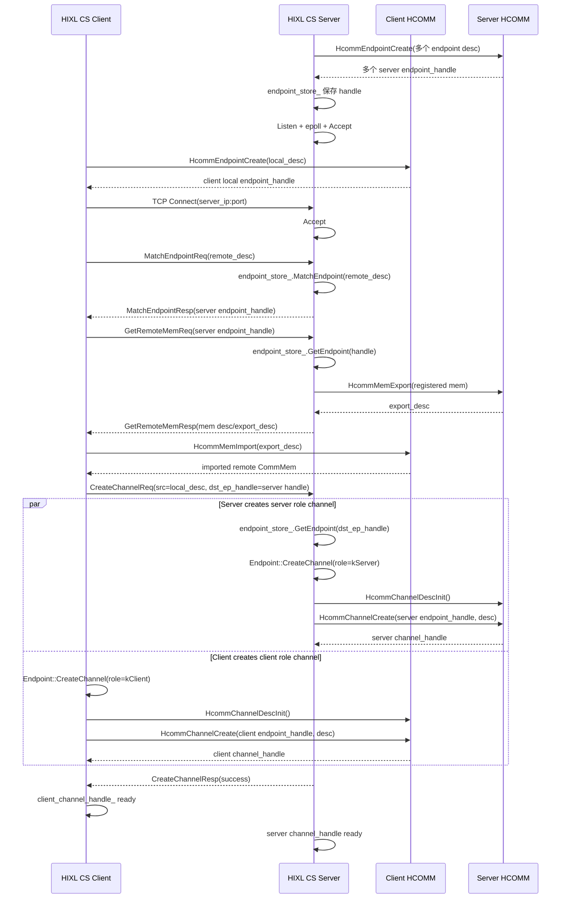

# HIXL CS Client/Server HCOMM 建链流程

本文整理 HIXL CS client/server 从创建 endpoint 到调用 HCOMM 创建 channel 的主流程。这里的“建链”特指 HIXL CS 控制面完成 endpoint 匹配、远端内存描述交换，并在两端分别调用 `HcommChannelCreate` 建立可用于后续单边读写的 channel。

## 结论

整体流程如下：

```text
两端先 HcommEndpointCreate；
client TCP 连接 server；
client MatchEndpoint 拿到 server endpoint_handle；
client GetRemoteMem，server HcommMemExport，client HcommMemImport；
client 发送 CreateChannelReq；
server 和 client 分别 HcommChannelCreate；
client 收到 CreateChannelResp 后认为 channel ready。
```

需要注意的是，client 发送 `CreateChannelReq` 后会立即在本地创建 client role channel，同时 server 收到请求后创建 server role channel。因此两端 `HcommChannelCreate` 不是严格的“server 先、client 后”串行关系，而是由 client 发起请求后两端分别完成。

## 简化时序图



## 对照版流程

```text
HIXL CS Client                                           HIXL CS Server
------------------------------------------------------   ------------------------------------------------------
                                                         ① HixlCSServerCreate()
                                                           -> HixlCSServer::Initialize()
                                                           -> EndpointStore::CreateEndpoint(desc list)
                                                           -> Endpoint::Initialize()
                                                           -> HcommProxy::EndpointCreate()
                                                           -> HcommEndpointCreate()
                                                              保存 server endpoint_handle 到 endpoint_store_

① HixlCSClientCreate()
  -> HixlCSClient::Create()
  -> HixlCSClient::InitBaseClient()
  -> Endpoint::Initialize()
  -> HcommProxy::EndpointCreate()
  -> HcommEndpointCreate()
     得到 client local endpoint_handle_

                                                         ② HixlCSServerListen()
                                                           -> HixlCSServer::Listen()
                                                           -> CtrlMsgPlugin::Listen()
                                                              socket / bind / listen / epoll

② HixlCSClientConnect()
  -> HixlCSClient::Connect()
  -> CtrlMsgPlugin::Connect(server_ip:port) -----------> ③ HixlCSServer::DoWait()
     TCP 控制面连接                                       -> CtrlMsgPlugin::Accept()

③ ExchangeEndpointAndCreateChannelLocked()
  -> ConnMsgHandler::SendMatchEndpointRequest() -------> ④ HixlCSServer::MatchEndpointMsg()
     MatchEndpointReq(remote_desc)                        -> endpoint_store_.MatchEndpoint(desc)
  <- RecvMatchEndpointResponse() -----------------------    -> SendMatchEndpointResp(server endpoint_handle)
     得到 server endpoint_handle

④ HixlCSClient::GetRemoteMemLocked()
  -> MemMsgHandler::SendGetRemoteMemRequest(handle) ---> ⑤ HixlCSServer::ExportMem()
     GetRemoteMemReq(server endpoint_handle)              -> endpoint_store_.GetEndpoint(handle)
                                                           -> Endpoint::ExportMem()
                                                           -> HcommProxy::MemExport()
                                                           -> HcommMemExport()
  <- MemMsgHandler::RecvGetRemoteMemResponse() ---------    -> SendRemoteMemResp(mem_desc/export_desc)
  -> HixlCSClient::ImportRemoteMem()
  -> Endpoint::MemImport()
  -> HcommProxy::MemImport()
  -> HcommMemImport()
     得到 client 可用的 remote CommMem

⑤ ConnMsgHandler::SendCreateChannelRequest() ---------> ⑥ HixlCSServer::CreateChannel()
   CreateChannelReq {                                    -> endpoint_store_.GetEndpoint(dst_ep_handle)
     src = client local_desc,                            -> Endpoint::CreateChannel()
     dst_ep_handle = server endpoint_handle,                -> HcommChannelDescInit()
     channel_index, tc, sl                                  -> role = kServer
   }                                                        -> remoteEndpoint = req.src
                                                          -> Channel::Create()
                                                          -> HcommProxy::ChannelCreate()
                                                          -> HcommChannelCreate()
                                                             得到 server channel_handle

⑥ client 本地 CreateChannel()
  -> Endpoint::CreateChannel()
     -> HcommChannelDescInit()
     -> role = kClient
     -> remoteEndpoint = remote_endpoint_
  -> Channel::Create()
  -> HcommProxy::ChannelCreate()
  -> HcommChannelCreate()
     得到 client channel_handle

  <- ConnMsgHandler::RecvCreateChannelResponse() ------- ⑦ SendCreateChannelResp(success)

✓ client_channel_handle_ ready                          ✓ server channel_handle ready
✓ 后续 BatchGet/BatchPut 走这个 channel                 ✓ 等待 client 发起单边读写
```

## HIXL 函数到 HCOMM 函数映射

| 阶段 | HIXL 调用链 | HCOMM 调用 |
| --- | --- | --- |
| server 创建 endpoint | `HixlCSServerCreate -> HixlCSServer::Initialize -> EndpointStore::CreateEndpoint -> Endpoint::Initialize` | `HcommEndpointCreate` |
| client 创建 endpoint | `HixlCSClientCreate -> HixlCSClient::Create -> HixlCSClient::InitBaseClient -> Endpoint::Initialize` | `HcommEndpointCreate` |
| server 导出已注册内存描述 | `HixlCSServer::ExportMem -> Endpoint::ExportMem` | `HcommMemExport` |
| client 导入远端内存描述 | `HixlCSClient::ImportRemoteMem -> Endpoint::MemImport` | `HcommMemImport` |
| 创建 channel 描述 | `Endpoint::CreateChannel` | `HcommChannelDescInit` |
| client/server 创建 channel | `Endpoint::CreateChannel -> Channel::Create` | `HcommChannelCreate` |
| 销毁 channel | `Endpoint::DestroyChannel -> Channel::Destroy` | `HcommChannelDestroy` |
| 销毁 endpoint | `Endpoint::Finalize` | `HcommEndpointDestroy` |

## 关键代码位置

- CS API 入口：`src/hixl/cs/hixl_cs.cc`
- client 建链主流程：`src/hixl/cs/hixl_cs_client.cc`
  - `HixlCSClient::Create`
  - `HixlCSClient::Connect`
  - `HixlCSClient::ExchangeEndpointAndCreateChannelLocked`
  - `HixlCSClient::GetRemoteMemLocked`
  - `HixlCSClient::ImportRemoteMem`
- server 建链消息处理：`src/hixl/cs/hixl_cs_server.cc`
  - `HixlCSServer::Initialize`
  - `HixlCSServer::Listen`
  - `HixlCSServer::DoWait`
  - `HixlCSServer::MatchEndpointMsg`
  - `HixlCSServer::ExportMem`
  - `HixlCSServer::CreateChannel`
- endpoint/channel 到 HCOMM 的落点：
  - `src/hixl/cs/endpoint.cc`
  - `src/hixl/cs/channel.cc`
  - `src/hixl/proxy/hcomm_proxy.cc`
