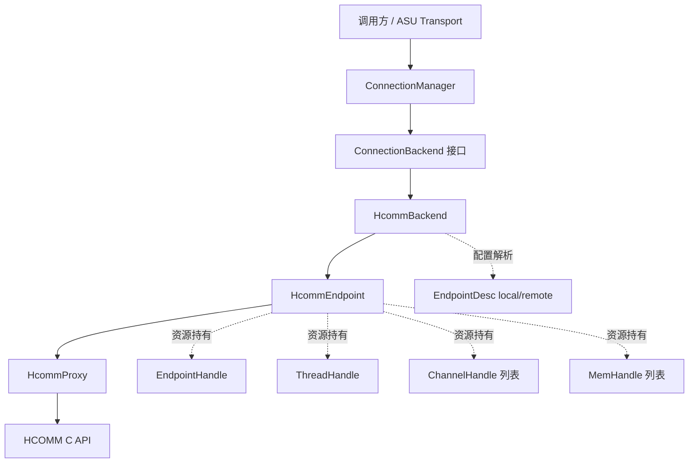
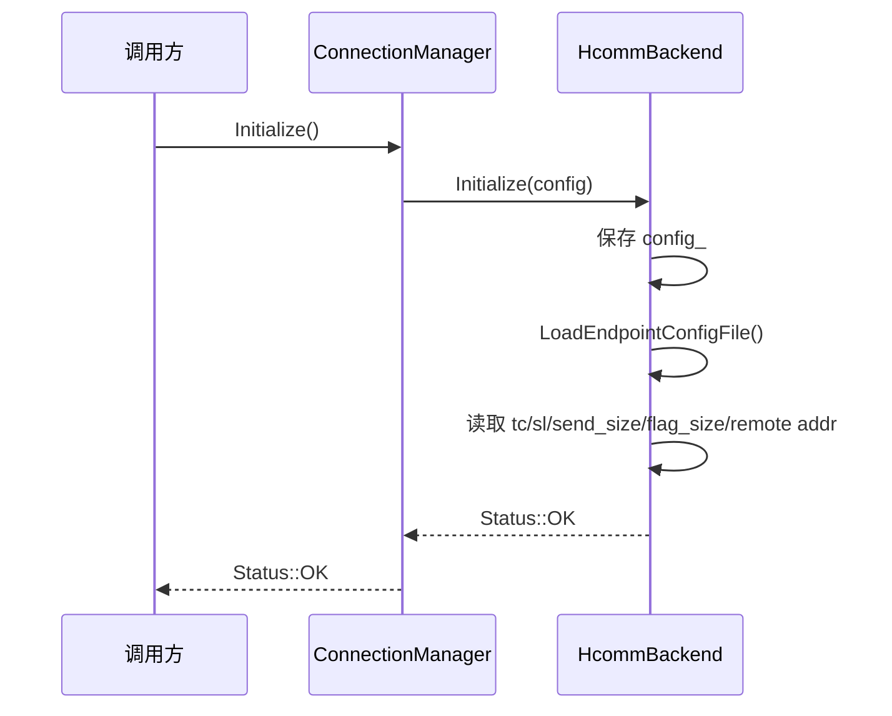
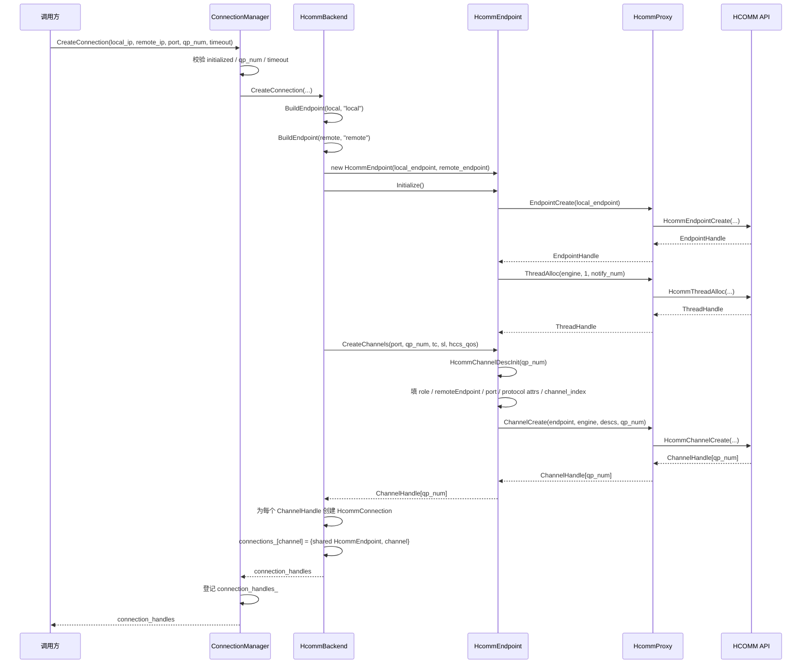
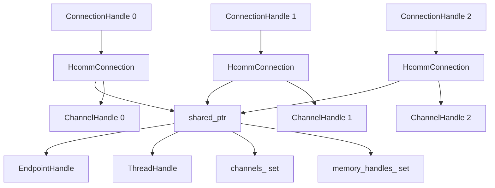
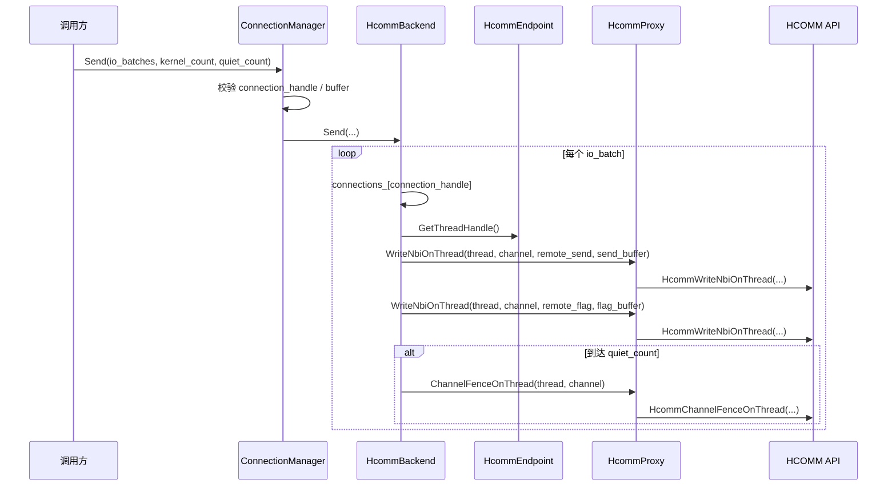
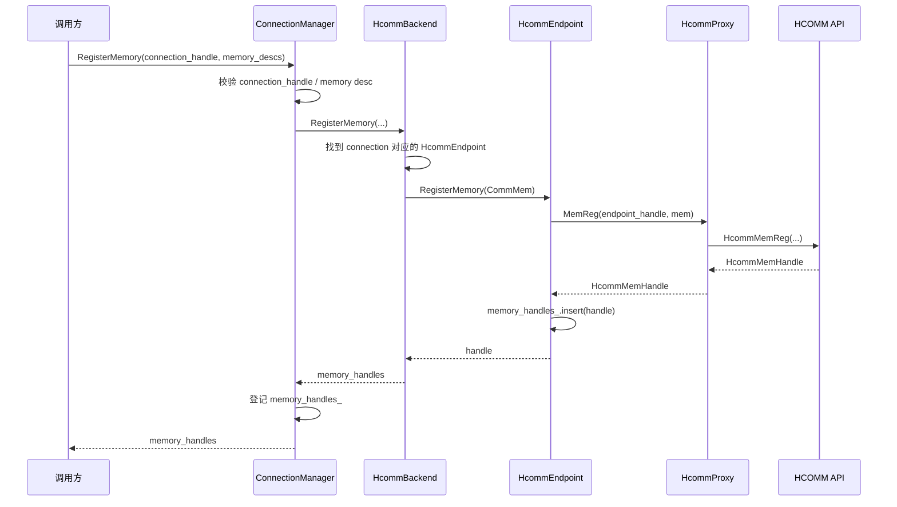
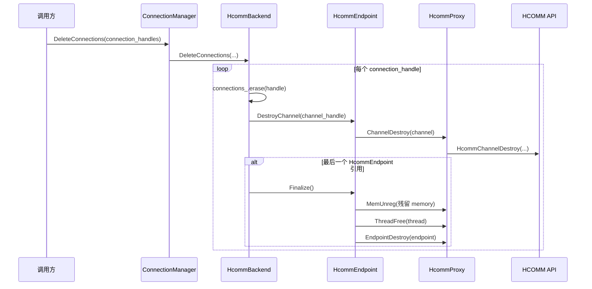

# HCOMM 建链调用关系

本文记录当前 UCM ASU transport 中 HCOMM backend 的建链流程。当前实现采用配置驱动的 endpoint 描述，并在一个 HCOMM Endpoint 上批量创建多个 Channel。

## 代码分层



| 层级 | 职责 |
| --- | --- |
| `ConnectionManager` | 对外统一连接管理接口，维护 manager 级别的 connection/memory handle 集合。 |
| `ConnectionBackend` | 内部 backend 抽象，屏蔽 HCOMM/AIV 等实现差异。 |
| `HcommBackend` | 解析 endpoint 配置，适配 `ConnectionBackend` 接口，维护 `ConnectionHandle -> HcommEndpoint + ChannelHandle` 映射。 |
| `HcommEndpoint` | 封装 HCOMM endpoint/channel/memory 原语，持有 `EndpointHandle`、`ThreadHandle`、channel 和 memory 集合。 |
| `HcommProxy` | weak symbol 方式调用 HCOMM C API。 |

## 初始化流程



配置文件通过 `attrs["endpoint_config_file"]` 指定。文件内支持 `key=value` 或 `key: value`，支持 `#` / `;` 注释。配置 key 会归一化：

- `local.protocol` -> `local_protocol`
- `local-comm-id` -> `local_comm_id`

显式传入的 `config.attrs` 优先级高于配置文件中的同名字段。

## 建链流程



## EndpointDesc 构造

`HcommBackend::BuildEndpoint()` 会按 `local_` / `remote_` 前缀从 attrs 中读取 endpoint 信息；如果未配置，则 RoCE/UBOE 地址仍可使用 `CreateConnection()` 入参中的 `local_ip` / `remote_ip` 作为默认值。

```mermaid
flowchart LR
    Build[BuildEndpoint(prefix)] --> Protocol[FillEndpointProtocol]
    Build --> Address[FillEndpointAddress]
    Build --> Location[FillEndpointLocation]

    Protocol --> RoCE[roce]
    Protocol --> UBOE[uboe]
    Protocol --> HCCS[hccs]
    Protocol --> UB[ub_ctp / ub_tp]

    Address --> IP[RoCE/UBOE: IPv4 或 IPv6]
    Address --> ID[HCCS: COMM_ADDR_TYPE_ID]
    Address --> EID[UB: COMM_ADDR_TYPE_EID]

    Location --> Host[host: loc.host.id]
    Location --> Device[device: devPhyId/superDevId/superPodIdx/serverIdx]
```

常用配置示例：

```ini
protocol = uboe
placement = device
port = 6000

local.comm_id = 192.168.1.10
remote.comm_id = 192.168.1.11

local.phy_device_id = 0
remote.phy_device_id = 1

tc = 0
sl = 0
send_size = 4096
flag_size = 8
remote_send_addr = 0x100000000
remote_flag_addr = 0x200000000
```

## 资源归属



当前模型是：

- 一次 `CreateConnection(..., qp_num, ...)` 创建一个 `HcommEndpoint`。
- 该 endpoint 内部持有一个 `EndpointHandle` 和一个 `ThreadHandle`。
- 一次 `ChannelCreate(..., qp_num, ...)` 在同一 endpoint 上创建 `qp_num` 个 channel。
- 返回给调用方的 `ConnectionHandle` 实际上等于对应的 `ChannelHandle`。
- 每个 `HcommConnection` 共享同一个 `HcommEndpoint`，但绑定不同的 `ChannelHandle`。

## 发送流程



## 内存注册流程



## 删除流程



## 与 HIXL 的对应关系

| UCM 当前文件 | HIXL 近似对应 | 说明 |
| --- | --- | --- |
| `hcomm_endpoint.{h,cpp}` | `cs/endpoint.{h,cc}` + `cs/channel.{h,cc}` | 封装 endpoint、channel、mem 的 HCOMM 原语。 |
| `hcomm_backend.{h,cpp}` | `cs/hixl_cs_client.cc` 中 client 侧资源编排的一部分 | UCM 暂无 TCP 协商，因此这里只做配置驱动的 endpoint 构造和本地建链。 |
| 暂无 | `cs/endpoint_store.{h,cc}` | 等需要 server 侧 endpoint match / 多 endpoint 管理时再补。 |
| 暂无 | `conn_msg_handler` / `mem_msg_handler` | 当前没有 HIXL 的 TCP 控制面和 MemExport/MemImport 协商。 |

