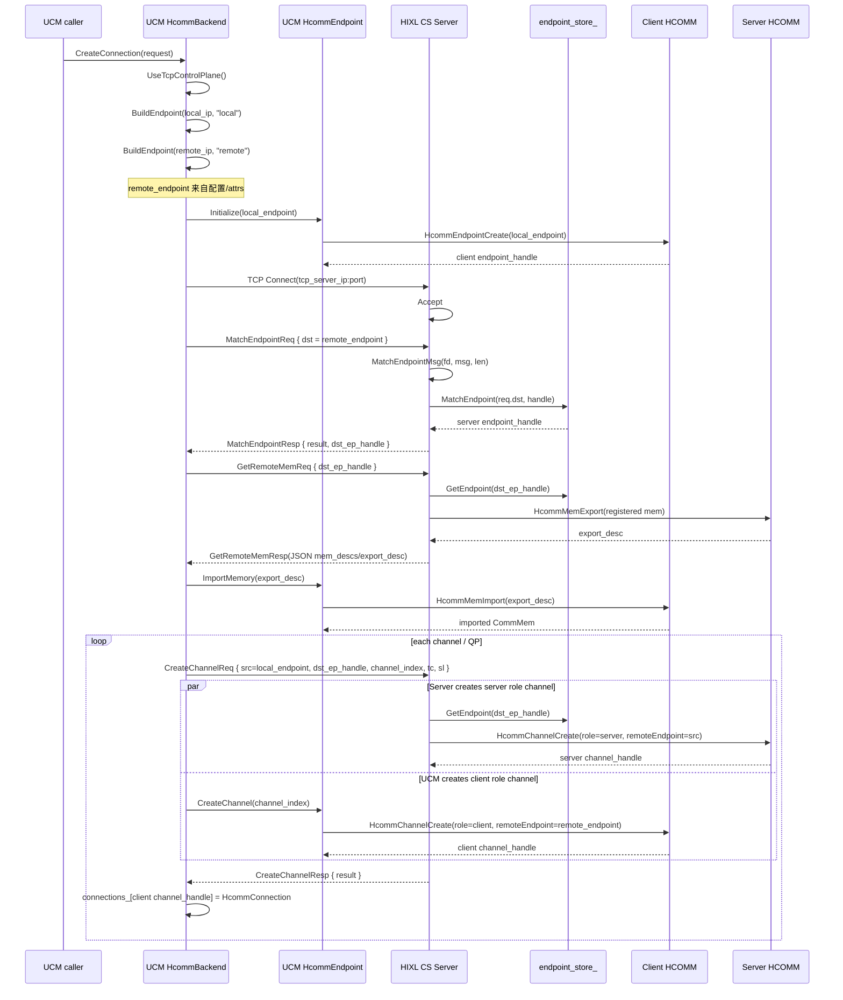
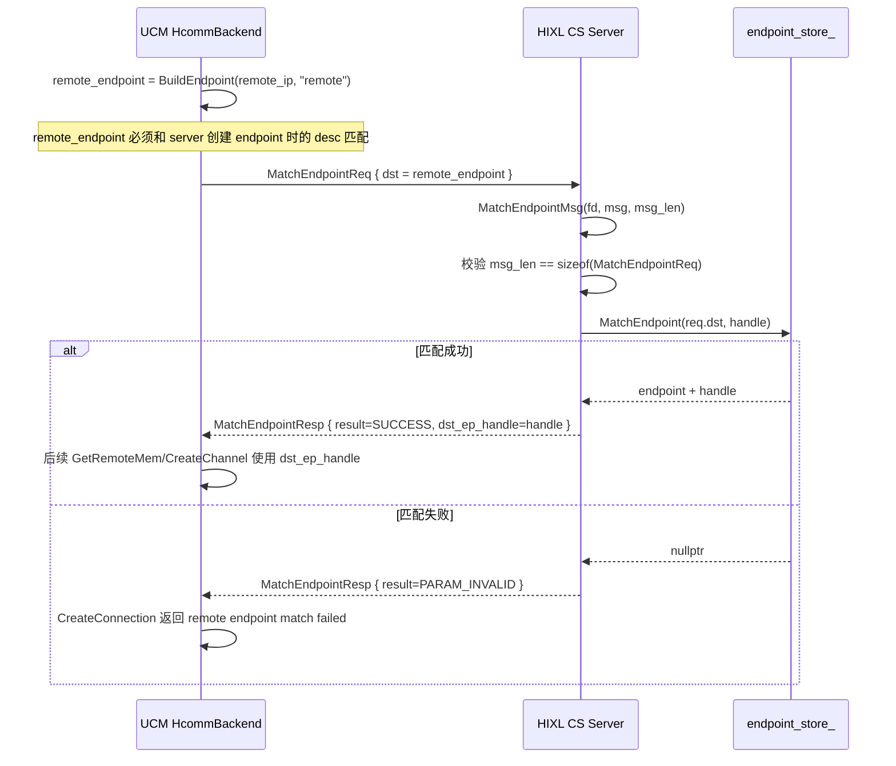

# UCM HcommBackend TCP 控制面建链流程

本文整理 `unified-cache-management` 当前 `HcommBackend` 在启用 TCP 控制面时的建链流程。这里的 client 侧是 UCM `HcommBackend`，server 侧复用 HIXL CS Server 的控制消息处理逻辑。

## 结论

当前实现不是先从 server 获取 endpoint desc。UCM client 侧仍然从配置文件或 attrs 构造 `local_endpoint` 和 `remote_endpoint`，然后把 `remote_endpoint` 发送给 HIXL CS Server 做 `MatchEndpointReq`。Server 只负责把这个 desc 匹配成 server 进程内真实的 `EndpointHandle`。

整体流程如下：

```text
UCM 从配置/attrs 构造 local_endpoint 和 remote_endpoint
UCM 本地 HcommEndpointCreate(local_endpoint)
UCM TCP Connect 到 HIXL CS Server
UCM 发送 MatchEndpointReq(remote_endpoint)
Server MatchEndpointMsg 根据 remote_endpoint 在 endpoint_store_ 中匹配 server endpoint_handle
UCM 发送 GetRemoteMemReq(server endpoint_handle)
Server HcommMemExport，UCM HcommMemImport
UCM 为每个 channel 发送 CreateChannelReq
Server 和 UCM 分别调用 HcommChannelCreate
UCM 收到 CreateChannelResp 后保存 connection_handle
```

## 简化时序图



## 对照版流程

```text
UCM HcommBackend                                      HIXL CS Server
--------------------------------------------------   --------------------------------------------------
CreateConnection(request)
  -> active_attrs_ = &request.attrs
  -> UseTcpControlPlane()
  -> CreateClientServerConnection()

BuildEndpoint(local_ip, "local")
  从 attrs/config 读取 local_protocol/local_comm_id/local_placement 等配置
  没有配置时 RoCE/UBOE 默认使用 request.local_ip

BuildEndpoint(remote_ip, "remote")
  从 attrs/config 读取 remote_protocol/remote_comm_id/remote_placement 等配置
  没有配置时 RoCE/UBOE 默认使用 request.remote_ip
  注意：这里不会向 server 请求 endpoint desc

HcommEndpoint(local_endpoint, remote_endpoint)
  -> Initialize()
  -> HcommEndpointCreate(local_endpoint)

CtrlMsgPlugin::Connect(tcp_server_ip, port) --------> Listen/Accept

SendControlMessage(kMatchEndpointReq, match_req) ---> MsgReceiver::IRecv()
  match_req.dst = remote_endpoint                    -> MsgHandler::SubmitMsg()
                                                       -> HixlCSServer::MatchEndpointMsg()
                                                          msg_len == sizeof(MatchEndpointReq)
                                                          req = reinterpret_cast<MatchEndpointReq>(msg)
                                                          endpoint_store_.MatchEndpoint(req.dst, handle)

RecvFixedControlMessage(kMatchEndpointResp) <------- SendMatchEndpointResp()
  成功时得到 match_resp.dst_ep_handle                  resp.dst_ep_handle = server endpoint handle

ImportRemoteMemories(socket_fd, dst_ep_handle)
  SendControlMessage(kGetRemoteMemReq) -------------> HixlCSServer::ExportMem()
                                                       -> endpoint_store_.GetEndpoint(handle)
                                                       -> Endpoint::ExportMem()
                                                       -> HcommMemExport()
  RecvControlBody(kGetRemoteMemResp) <-------------- SendRemoteMemResp(JSON)
  ParseRemoteMemDescs(JSON)
  endpoint->ImportMemory(export_desc)
  根据 remote_send_tag/remote_flag_tag 选择 remote addr

for i in [0, qp_num)
  i == 0:
    复用第一个 TCP control fd
  i > 0:
    新建 TCP control fd
    重新发送 MatchEndpointReq
    重新接收 MatchEndpointResp

  channel_index = g_next_channel_index++
  SendControlMessage(kCreateChannelReq) ------------> HixlCSServer::CreateChannel()
    src = local_endpoint                                -> endpoint_store_.GetEndpoint(dst_ep_handle)
    dst_ep_handle = server endpoint handle              -> Endpoint::CreateChannel()
    tc/sl/channel_index                                 -> HcommChannelCreate(role=server)

  endpoint->CreateChannel(channel_index)
    -> HcommChannelCreate(role=client)

  RecvFixedControlMessage(kCreateChannelResp) <------ SendCreateChannelResp()

  connections_[channel_handle] = {
    endpoint,
    channel_handle,
    remote_send_addr,
    remote_flag_addr,
    control_fd
  }

保存 endpoint 级资源：
  endpoints_[endpoint_handle] = endpoint
  endpoint_sockets_[endpoint_handle] = control_fds
  remote_endpoint_handles_[endpoint_handle] = dst_ep_handle
  imported_remote_mems_[endpoint_handle] = imported
```

## MatchEndpointMsg 交互关系

`MatchEndpointMsg` 的作用不是下发 endpoint 配置，而是把 UCM 发来的 `remote_endpoint` 映射成 server 侧的 endpoint handle。



因此，UCM 配置中的 `remote_*` 字段要和 HIXL CS Server 初始化 endpoint 时的字段保持一致，尤其是：

| 字段类别 | UCM 构造来源 | 匹配影响 |
| --- | --- | --- |
| protocol | `remote_protocol`，默认 `protocol` | 必须和 server endpoint protocol 一致 |
| commAddr | `remote_comm_id` / `remote_ip` / `remote_ip` 入参 | RoCE/UBOE 是 IP，HCCS 是 ID，UB 是 EID |
| placement | `remote_placement`，默认 `placement` | host/device 不一致会导致 desc 不匹配 |
| host/device location | `remote_host_id`、`remote_device_id` 等 | server 匹配 endpoint 时会参与 desc 判断 |

## 和 HIXL 原生 CS Client 的主要差异

| 项目 | HIXL CS Client | UCM HcommBackend 当前实现 |
| --- | --- | --- |
| remote endpoint desc 来源 | client desc 或 HIXL 自身配置 | UCM 配置文件/attrs，通过 `BuildEndpoint(remote_ip, "remote")` 构造 |
| server endpoint info 获取 | HIXL engine 路径可支持 `GetEndpointInfoReq` | 当前不走这个流程 |
| MatchEndpoint | 发送目标 endpoint desc，server 返回 endpoint handle | 相同 |
| GetRemoteMem | server JSON 返回 mem desc/export desc | 相同协议，UCM 手写解析 JSON |
| channel 创建 | client 发 req 后两端分别 `HcommChannelCreate` | 相同模式 |
| 多 QP | HIXL client 通常一个 client 对象一个 socket/channel | UCM `qp_num` 个 channel，后续 channel 会新建 TCP fd 并重复 MatchEndpoint |
| 连接句柄 | HIXL 保存 client channel handle | UCM 直接把 client `ChannelHandle` 作为 `ConnectionHandle` |

## 关键代码位置

- UCM client 主流程：`ucm/transport/kv/asu/trans/src/hcomm_backend.cpp`
  - `HcommBackend::CreateConnection`
  - `HcommBackend::CreateClientServerConnection`
  - `HcommBackend::ImportRemoteMemories`
  - `HcommBackend::DestroyOneConnection`
- UCM endpoint/HCOMM 落点：`ucm/transport/kv/asu/trans/src/hcomm_endpoint.cpp`
  - `HcommEndpoint::Initialize`
  - `HcommEndpoint::CreateChannel`
  - `HcommEndpoint::ImportMemory`
- HIXL server 消息处理：`D:/Study/pod/hixl/src/hixl/cs/hixl_cs_server.cc`
  - `HixlCSServer::MatchEndpointMsg`
  - `HixlCSServer::ExportMem`
  - `HixlCSServer::CreateChannel`
- HIXL 控制消息定义：`D:/Study/pod/hixl/src/hixl/common/ctrl_msg.h`

